# Step 10: Risk Dashboard

This directory contains the **production-ready risk assessment dashboard** and deployment artifacts for the PGx analysis pipeline.

**Risk calculator dashboard (hosted):**  
- **Live:** [https://jerome-dixon.io/vcu/pgx-risk-calculator/index.html](https://jerome-dixon.io/vcu/pgx-risk-calculator/index.html)
- **S3:** `s3://jerome-dixon.io/vcu/pgx-risk-calculator/` — frontend and static assets for the PGx risk calculator.

## Quick Overview

The dashboard provides multiple capabilities:

1. **Risk Assessment Dashboard** - Predict risk for **Opioid ED** or **Polypharmacy** (select cohort via tabs); both cohorts use the full set of age bands (0-12 through 85-114)
2. **Causal Analysis** - Explore FFA causal factors and SHAP importance
3. **DTW Trajectories** - View patient trajectory patterns
4. **FP-Growth Patterns** - Explore frequent itemsets and association rules
5. **BupaR Process Mining** - View process flows and activity sequences
6. **PGx Patient Card Generator** - Generate pharmacogenomic cards from genetic variants

## Actionable Intelligence Loop

The dashboard closes a full intelligence loop from historic insurance claims to patient-level pharmacogenomic action guidance, structured as an **OODA loop** (Observe → Orient → Decide → Act). Every step is scoped to the **event density bin the patient belongs to** (low / medium / high / extreme), matching how the models were trained.

> **OODA loop** (John Boyd): a decision-making cycle in which faster, tighter loops produce decisive advantage.
> Applied here: claims data drives continuous tightening of the clinical decision — from population risk signal down to a specific gene to test and a CPIC-guided dose adjustment.

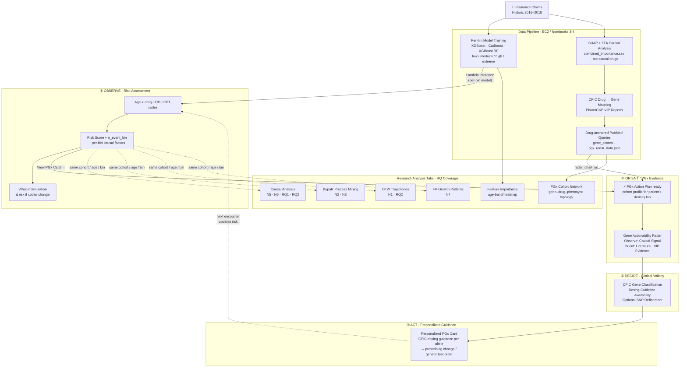

### Research Question Coverage

**Canonical mapping (artifacts + per-visual commentary):** [docs/RESEARCH_QUESTIONS_ARTIFACTS.md](docs/RESEARCH_QUESTIONS_ARTIFACTS.md) — includes the master RQ → tab → artifact table and **[Visuals, research questions, and clinical OODA loop](docs/RESEARCH_QUESTIONS_ARTIFACTS.md#visuals-research-questions-and-clinical-ooda-loop)** with comments on how each saved visual supports N1–N6 / RQ1–RQ2 and the clinical **Observe → Orient → Decide → Act** cycle illustrated above.

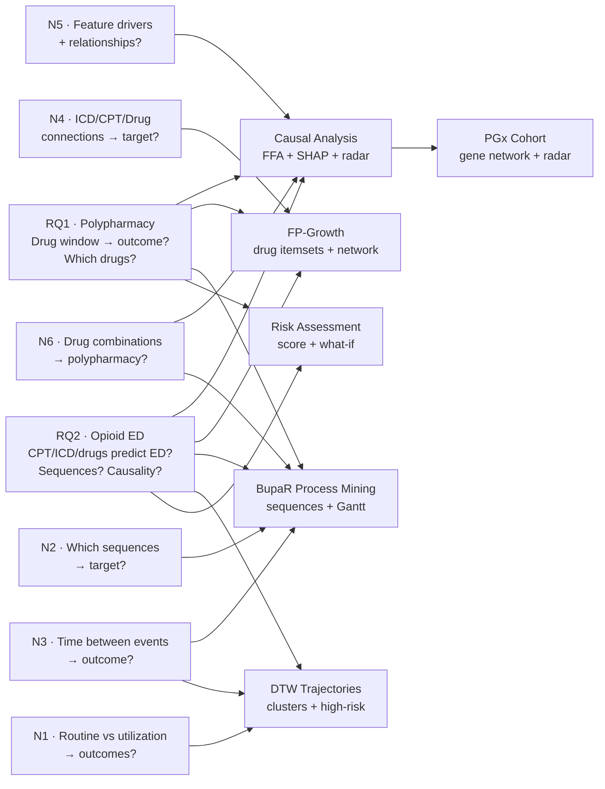

## Directory Structure

```text
10_risk_dashboard/
├── frontend/                          # Frontend dashboard (user-facing)
│   ├── index.html                     # Shell: head, global CSS/JS, tab bar, empty tab wrappers
│   ├── tabs/                          # Per-tab HTML (loaded on demand; one file per tab)
│   └── README.md                      # Frontend documentation
│
├── backend/                           # Backend API (Lambda function)
│   ├── lambda_function.py             # AWS Lambda handler (API endpoints)
│   ├── lambda_api_template.py         # API Gateway integration template
│   ├── requirements.txt               # Python dependencies
│   ├── Dockerfile                     # Docker container for Lambda (ECR)
│   └── README.md                      # Backend API documentation
│
├── deployment/                        # Deployment scripts and configs
│   ├── docker_build.sh                # Build and push Docker image to ECR
│   ├── prepare_lambda_dir.py          # Prepare Lambda deployment package (optional)
│   ├── scripts/                       # Additional deployment helper scripts
│   └── README.md                      # Deployment documentation
│
├── data_preparation/                  # Scripts to prepare data for dashboard
│   ├── prepare_models.py              # Package models for Lambda deployment
│   ├── generate_metadata.py           # Generate metadata JSON files
│   ├── prepare_cpic_data.py           # Prepare CPIC data for PGx cards
│   ├── combine_shap_ffa_results.py    # Combine SHAP and FFA results
│   └── README.md                      # Data preparation documentation
│
├── visualizations/                    # Visualization generation scripts (also orchestrated from repo root)
│   ├── dtw/                           # DTW trajectory visualizations
│   │   ├── create_dtw_features.py
│   │   ├── create_dtw_visuals.py
│   │   ├── create_predictive_time_features.py
│   │   ├── dtw_cohort_runner.ipynb
│   │   ├── DTW_FEATURE_ANALYSIS.md
│   │   └── outputs/                   # DTW visualization outputs
│   ├── fpgrowth/                      # FP-Growth pattern visualizations
│   │   ├── create_fpgrowth_visuals.py
│   │   ├── create_plots.py
│   │   ├── create_fpgrowth_features.py
│   │   ├── cohort_fpgrowth.py
│   │   ├── global_fpgrowth.py
│   │   └── outputs/                   # FP-Growth visualization outputs
│   ├── bupar/                         # BupaR process mining visualizations
│   │   ├── create_bupar_visuals.py
│   │   ├── create_bupar_outputs_opioid_ed.R
│   │   ├── create_bupar_outputs_non_opioid_ed.R
│   │   ├── create_plots.R
│   │   ├── build_bupar_eventlogs.R
│   │   └── outputs/                   # BupaR visualization outputs
│   └── README.md                      # Visualization overview
│
├── outputs/                           # Generated outputs for dashboard
│   ├── models/                        # Prepared models for Lambda
│   │   └── {cohort}/{age_band}/
│   │       ├── catboost.joblib
│   │       ├── xgboost.joblib
│   │       ├── xgboost_rf.joblib
│   │       └── feature_schema.json
│   ├── metadata/                      # Metadata JSON files
│   │   ├── metadata_opioid_ed.json
│   │   └── metadata_non_opioid_ed.json
│   ├── cpic/                          # CPIC data files
│   │   └── cpic_gene-drug_pairs.xlsx
│   └── visualizations/                # Visualization images/data
│       ├── dtw/
│       ├── fpgrowth/
│       └── bupar/
│
└── docs/                              # Additional documentation
    ├── API.md                         # API endpoint documentation
    ├── DEPLOYMENT.md                  # Deployment guide
    ├── VISUALIZATIONS.md              # Visualization guide
    ├── README_visualization_plan.md   # Research questions → tabs and visuals
    ├── RESEARCH_QUESTIONS_ARTIFACTS.md # Canonical: RQ → tab → artifacts we keep (only these saved/used)
    ├── ARCHIVED_ARTIFACTS_NO_LONGER_USED.md  # Artifacts no longer used; archived for docs/cleanup
    ├── README_dashboard_visual_artifact_paths.md  # Map: dashboard visual → data artifact → EC2 path → S3 path (path-style)
    └── README_implementation_plan_tab_visualizations.md  # Per-tab implementation plan for data visuals
```

### Organizational Rationale

This structure follows a **separation of concerns** approach:

- **Frontend**: All user-facing HTML/CSS/JavaScript
- **Backend**: Lambda function and API logic
- **Deployment**: Scripts and configs for deploying to AWS
- **Data Preparation**: Scripts to prepare models and metadata
- **Visualizations**: Scripts to generate visualization files
- **Outputs**: Centralized location for all generated outputs

**Workflow**: `Data Preparation → Visualizations → Frontend/Backend → Deployment`

## Core Components

### Frontend (`frontend/`)

**Purpose**: User-facing dashboard interface

**Key Files**:
- `index.html` - Main dashboard with all tabs:
  - **Risk Assessment** - Calculate risk scores for **Opioid ED** or **Polypharmacy** (select cohort via tabs); both use full age bands (0-12 through 85-114)
  - **Causal Analysis** - FFA causal factors and SHAP importance with interactive charts
  - **DTW Trajectories** - Patient trajectory patterns, temporal metrics, and sample trajectories
  - **FP-Growth Patterns** - Frequent itemsets, support distributions, and co-occurrence networks
  - **BupaR Process Mining** - Process flows, activity frequencies, and sequence patterns
  - **PGx Patient Card** - Generate pharmacogenomic cards from genetic variants

**Features**:
- Interactive forms with searchable dropdowns
- Real-time risk calculation
- Visual charts (Plotly.js)
- Responsive design

### Backend (`backend/`)

**Purpose**: Serverless API backend

**Key Files**:
- `lambda_function.py` - Main Lambda handler with all API endpoints
- `Dockerfile` - Container image configuration (ECR)
- `requirements.txt` - Python dependencies

**Features**:
- Model inference: weights loaded from `feature_schema.json` (set by `prepare_models.py` based on Step 6 model selection — winner-take-all for single-model winner, proportional composite-score weights when Ensemble is selected)
- Metadata retrieval
- Visualization data serving
- PGx card generation

### Data Preparation (`data_preparation/`)

**Purpose**: Prepare data for dashboard deployment

**Scripts**:
- `prepare_models.py` - Package models from `6_final_model/outputs/{cohort}/{age_band_fname}/models/` for Lambda deployment
  - Output directory: `10_risk_dashboard/outputs/models` (used by `prepare_lambda_dir.py` and Docker)
  - Configured for PGx cohorts (`opioid_ed`, `non_opioid_ed`) with correct age bands
- `generate_metadata.py` - Extract valid codes from Step 3b `cohort_feature_importance` files
  - Prioritizes Step 3b refined features from `3b_feature_importance_eda/outputs/{cohort}/{age_band}/`
  - Falls back to Step 3 aggregated features if Step 3b files not available
  - Output directory: `10_risk_dashboard/outputs/metadata`
- `prepare_cpic_data.py` - Prepare CPIC data for PGx cards
- `combine_shap_ffa_results.py` - Combine SHAP and FFA analysis for consensus features

**Outputs**: All saved to `outputs/` directory

### Visualizations (`visualizations/`)

**Purpose**: Generate visualization files (images, HTML) for dashboard tabs

**Subdirectories**:
- `dtw/` - Dynamic Time Warping trajectory visualizations
- `fpgrowth/` - Frequent pattern mining visualizations
- `bupar/` - Process mining visualizations

**Outputs**: Saved to `outputs/visualizations/` and uploaded to S3

### Deployment (`deployment/`)

**Purpose**: Deployment automation

**Scripts**:
- `docker_build.sh` - Build and push Docker image to ECR
- `prepare_lambda_dir.py` - Prepare Lambda deployment package (optional, for manual preparation)

## Dashboard Features

### Visualization Tabs

The dashboard includes the following visualization tabs:

- **Causal Analysis Tab**: Displays FFA causal factors and SHAP importance with interactive charts
- **DTW Trajectories Tab**: Shows patient trajectory patterns, temporal metrics, and sample trajectories
- **FP-Growth Patterns Tab**: Displays frequent itemsets, support distributions, and co-occurrence networks
- **BupaR Process Mining Tab**: Shows process flows, activity frequencies, Gantt charts, and sequence patterns

### Data Preparation

**Model Preparation (`prepare_models.py`)**:
- Output directory: `10_risk_dashboard/outputs/models`
- Configured for PGx cohorts (`opioid_ed`, `non_opioid_ed`) with correct age bands
- Loads models from `6_final_model/outputs/{cohort}/{age_band_fname}/models/` (Step 6 outputs)

**Metadata Generation (`generate_metadata.py`)**:
- Prioritizes Step 3b `cohort_feature_importance` files (refined features)
- Falls back to Step 3 `aggregated_feature_importance` files if Step 3b files not available
- Output directory: `10_risk_dashboard/outputs/metadata`
- Uses directory structure: `3b_feature_importance_eda/outputs/{cohort}/{age_band}/`

## PGx Calculator Workflow (full deployment)

For the **full risk calculator dashboard deployment workflow** (from cohorts with aggregated feature importances through Lambda/Docker), use:

- **Workflow:** [3_model_train_shap_ffa.ipynb](../3_model_train_shap_ffa.ipynb) (train + SHAP/FFA) → [4_dashboard_visuals.ipynb](../4_dashboard_visuals.ipynb) or [pgx_dashboard_visuals.py](../pgx_dashboard_visuals.py) (BupaR, DTW, FP-Growth) → [5_build_and_deploy.ipynb](../5_build_and_deploy.ipynb) (Lambda, ECR, S3).
- **Docs:** [README_calculator_workflow.md](README_calculator_workflow.md) – Cohort/model mapping and workflow overview.

## Quick Start

### 1. Prepare Data for Dashboard

```bash
cd data_preparation
python generate_metadata.py --all
python prepare_models.py --all
python prepare_cpic_data.py
```

### 2. Generate Visualizations (if not already done)

```bash
cd ../visualizations
# See individual READMEs for each visualization type:
# - visualizations/dtw/README.md
# - visualizations/fpgrowth/README.md
# - visualizations/bupar/README.md
```

### 3. Deploy Dashboard

```bash
cd ../deployment
./docker_build.sh
```

### Individual Component Documentation

- **Frontend**: `frontend/README.md`
- **Backend**: `backend/README.md`
- **Deployment**: `deployment/README.md`
- **Data Preparation**: `data_preparation/README.md`
- **Visualizations**: `visualizations/README.md`
- **Tab visualizations implementation plan**: `docs/README_implementation_plan_tab_visualizations.md` – per-tab data sources, API, visuals, and checklists

## Architecture

```text
User Browser → S3 Static Site → API Gateway → Lambda (ECR) → Models/Data
```

**Components**:

- **Frontend**: S3-hosted static website (`frontend/index.html`)
- **API Gateway**: RESTful API endpoints
- **Lambda Function**: Serverless backend (ECR container, up to 10GB)
- **Model Storage**: Models packaged in Lambda container (`/var/task/models/`)
- **Data Storage**: S3 for visualization images and large datasets

## Execution Workflow

### Request Lifecycle

End-to-end sequence from user interaction through Lambda inference to rendered result.

```mermaid
sequenceDiagram
    actor User
    participant JS as Dashboard JS<br/>(index.html)
    participant APIGW as API Gateway
    participant Lambda as Lambda (ECR)
    participant S3 as S3 Bucket

    Note over User,S3: ── Page Load ──────────────────────────────────────────────
    User->>JS: Select cohort tab<br/>(opioid_ed / non_opioid_ed)
    JS->>APIGW: GET /metadata?cohort=…
    APIGW->>Lambda: forward
    Lambda-->>JS: code lists per age band<br/>{ drugs[], icds[], cpts[] } per age_band
    JS->>JS: updateCodeLists()<br/>populate #drugs / #icds / #cpts selects

    Note over User,S3: ── Code Selection ─────────────────────────────────────────
    User->>JS: Type age (e.g. 60)
    JS->>JS: determineAgeBand(60) → "55-64"<br/>updateCodeLists() → refresh selects for band

    User->>JS: Drugs tab → search box → select codes
    JS->>JS: filterOptions() on input event<br/>change event → updateDrugDisplay() chips

    User->>JS: ICD Codes tab → search → select<br/>(opioid_ed only; hidden for non_opioid_ed)
    User->>JS: CPT Codes tab → search → select<br/>(opioid_ed only; hidden for non_opioid_ed)

    Note over User,S3: ── Risk Calculation ───────────────────────────────────────
    User->>JS: Click "Calculate Risk Score"
    JS->>JS: calculateRisk()<br/>① validate age (13–114) + cohort<br/>② updateCodeLists() — preserves selections<br/>③ getMultiSelectValues() → drugs/icds/cpts arrays
    JS->>APIGW: POST /risk<br/>{ cohort, age_band, drugs[], icds[], cpts[] }
    APIGW->>Lambda: forward
    Lambda->>Lambda: compute n_event_bin from len(drugs+icds+cpts)<br/>load bin_models/{bin}/{model}.joblib<br/>load calibration_{model}.joblib (if present)<br/>build feature vector from feature_schema.json<br/>ensemble inference → weighted average<br/>calibrate probability → risk_score
    Lambda-->>JS: { risk_score, risk_band, n_event_bin,<br/>  causal_factors, model_breakdown,<br/>  codes_used, codes_unknown, … }
    JS->>User: Render score + band chip + density-bin badge<br/>what-if comparison enabled

    Note over User,S3: ── Visualization Tabs (on demand) ─────────────────────────
    opt User clicks a visualization tab + Load button
        JS->>APIGW: GET /visualizations/{causal|feature_importance|bupar|dtw|fpgrowth|cohort_pgx}<br/>?cohort=…&age_band=…[&n_event_bin=…]
        APIGW->>Lambda: forward
        Lambda->>S3: resolve pre-computed asset paths<br/>s3://pgxdatalake/gold/{analysis}/{cohort}/{age_band}/
        S3-->>Lambda: presigned / public asset URLs
        Lambda-->>JS: { chart_urls[], data_urls[], … }
        JS->>S3: fetch PNG / interactive HTML assets
        S3-->>JS: static visualization content
        JS->>User: render charts (Plotly / iframe / img)
    end

    Note over User,S3: ── PGx Card (optional) ────────────────────────────────────
    opt User submits gene variants on PGx Card tab
        JS->>APIGW: POST /pgx/card<br/>{ cohort, age_band, variants[] }
        APIGW->>Lambda: forward
        Lambda->>Lambda: CPIC lookup → gene actionability<br/>drug interactions → card JSON
        Lambda-->>JS: { genes[], drugs[], actionability[] }
        JS->>User: render pharmacogenomic card
    end
```

### `calculateRisk()` Client-Side Logic

State machine for the risk calculation path inside the browser, including the `updateCodeLists()` selection-preservation step.

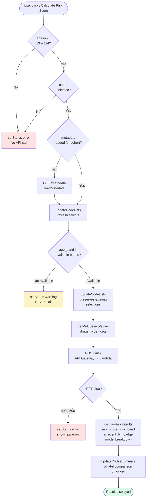

### Test Coverage

The execution workflow above is covered by three complementary Puppeteer suites in `11_testing/puppeteer/tests/`:

| Suite | Approach | What it validates |
|---|---|---|
| `combinatorial.test.js` | fetch interceptor (bypasses UI selects) | POST /risk JSON schema, risk_score range, n_event_bin routing, code echo-back, UI display — all cohort × age_band × density scenarios |
| `viz.test.js` | real DOM tab + button clicks | All 6 viz endpoints return valid JSON (200/400/404/500), no JS crashes — all cohort × age_band combos |
| `user-simulation.test.js` | full real user workflow | Cohort tab click → keyboard age entry → search box → DOM code selection → Calculate → asserts POST body contains user-selected codes → response + UI |
| `full-coverage.test.js` | metadata-driven importance + real UI | Fetches top-importance codes per band from `/metadata` API; runs baseline (no codes) vs high-risk (top features) for every cohort × age_band; asserts risk responds to feature selection; records absolute delta, relative lift, and density bin to CSV |

> **Note**: `user-simulation.test.js` specifically validates the `populateSelect()` selection-preservation fix — that codes selected through the UI actually survive the `updateCodeLists()` call inside `calculateRisk()` and appear in the outgoing POST body.

### E2E Validation: Risk-Response Results

Run: `npx jest tests/full-coverage --forceExit --verbose` from `11_testing/puppeteer/`  
Results CSV: `11_testing/results/full_coverage_results.csv`

For each cohort × age-band the test:
1. Fetches top-importance drugs (and ICDs/CPTs for `opioid_ed`) from the live `/metadata` endpoint
2. Runs a **baseline** call (no codes, `n_events=5`) and a **high-risk** call (top features, `n_events=50`)
3. Asserts `high_risk_score > baseline_score` for `opioid_ed`; asserts `|Δ| > 0.001` for `non_opioid_ed`

| Cohort | Band | Baseline | High-risk | Abs Δ | Rel Lift | Direction | Bin |
|---|---|---|---|---|---|---|---|
| opioid_ed | 13-24 | 0.058 | 0.503 | +0.444 | +764% | INCREASED | high |
| opioid_ed | 25-44 | 0.077 | 0.847 | +0.770 | +998% | INCREASED | high |
| opioid_ed | 45-54 | 0.080 | 0.993 | +0.914 | +1144% | INCREASED | medium |
| opioid_ed | 55-64 | 0.083 | 0.933 | +0.850 | +1029% | INCREASED | medium |
| opioid_ed | 65-74 | 0.079 | 0.981 | +0.901 | +1134% | INCREASED | low |
| opioid_ed | 75-84 | 0.077 | 0.965 | +0.888 | +1146% | INCREASED | low |
| opioid_ed | 85-114 | 0.081 | 0.779 | +0.698 | +860% | INCREASED | low |
| non_opioid_ed | 13-24 | 0.029 | 0.056 | +0.027 | +92% | INCREASED | high |
| non_opioid_ed | 25-44 | 0.027 | 0.002 | −0.025 | −93% | DECREASED | high |
| non_opioid_ed | 45-54 | 0.025 | 0.001 | −0.025 | −98% | DECREASED | medium |
| non_opioid_ed | 55-64 | 0.024 | 0.001 | −0.024 | −98% | DECREASED | medium |
| non_opioid_ed | 65-74 | 0.028 | 0.000 | −0.028 | −100% | DECREASED | low |
| non_opioid_ed | 75-84 | 0.026 | 0.012 | −0.014 | −54% | DECREASED | low |
| non_opioid_ed | 85-114 | 0.023 | 0.040 | +0.017 | +74% | INCREASED | low |

**Normalization note:** Risk scores (`0–1`) and feature importances are already on interpretable scales — no normalization is needed. The absolute delta (`score_delta`) is intentionally on different scales between cohorts (`opioid_ed` Δ 0.44–0.91 vs `non_opioid_ed` Δ ±0.03) because the effect sizes are genuinely different. The `relative_lift_pct` column (`score_delta / baseline_score × 100`) makes cohorts directly comparable for visualization.

**Interpretation:**
- **`opioid_ed`** — top-importance drugs (buprenorphine, oxycodone, hydrocodone) drive **+764% to +1146% relative risk lift** across all bands, confirming strong discriminative power of the opioid-related feature set.
- **`non_opioid_ed` (polypharmacy, 25–84)** — top-importance features are **protective** (bowel-prep agents, gabapentin, losartan, pravastatin). These reflect monitored, appropriately prescribed regimens; their presence *lowers* the composite polypharmacy risk score. This is clinically expected and validates the model's signal direction.
- **`non_opioid_ed` 13–24 and 85–114** — protective-drug pattern does not hold at the age extremes; top features are risk-increasing (+74–92%), consistent with a different prescribing landscape for paediatric-adjacent and oldest-old populations.
- **Density-bin routing**: `n_events=50` maps to `high` bin for younger bands and `low/medium` for older bands, exercising the per-bin model routing path end-to-end.

**Visualization column guide** (from `full_coverage_results.csv`):

| Column(s) | Recommended chart | Notes |
|---|---|---|
| `baseline_score` + `highrisk_score` per `age_band` | Grouped bar chart | One pair of bars per band; shows absolute risk range |
| `relative_lift_pct` across `cohort × age_band` | Heatmap | Immediately shows opioid (strong positive) vs polypharmacy (protective) split |
| `highrisk_bin` | Color / group axis | Groups bands by density bin (low / medium / high) |
| `top_drugs_importance` (pipe-delimited) | Feature importance overlay | Split on `\|` to get per-drug importance values for annotation |
| `score_delta` | Waterfall or diverging bar | Use for within-cohort comparison; do **not** compare raw delta across cohorts |

> **Fixed during validation**: CatBoost was receiving `float` values (`1.0/0.0`) for `item_*` binary features it expects as `int`/`str`. Fixed in `_catboost_predict_proba()` by adding `df[cat_cols] = df[cat_cols].astype(int)` before building the `Pool`.  
> Affected: `non_opioid_ed/65-74` and `non_opioid_ed/75-84` returned HTTP 500 for any drug-containing request prior to fix.

---

### Per-Tab Execution Workflows

#### Tab: Risk Assessment

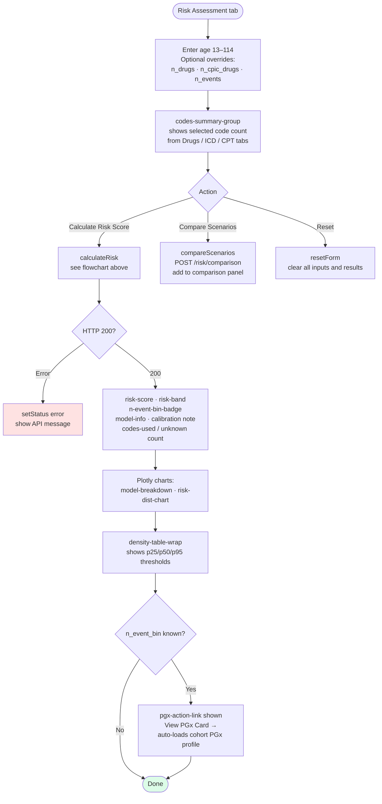

---

#### Tab: Drugs / ICD Codes / CPT Codes

Same workflow for all three code-selection tabs. ICD and CPT tabs are **hidden for `non_opioid_ed`** (Polypharmacy — drugs only).

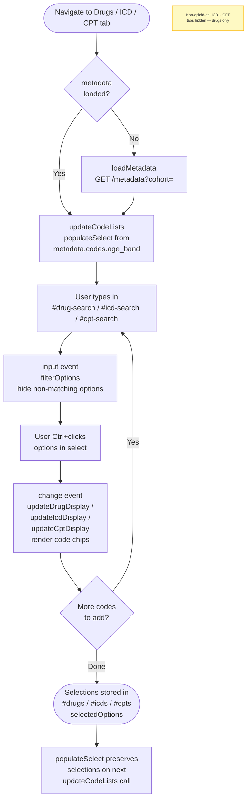

---

#### Tab: PGx Card

Two-phase: load cohort-level profile first, then optionally refine with patient genetic variants.

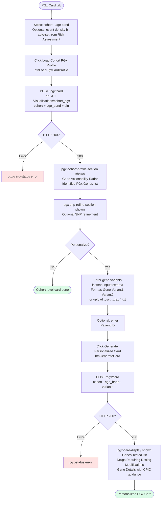

---

#### Tab: Feature Importance

Standalone — does not depend on Risk Assessment cohort/age context. Loads an aggregated feature importance heatmap (features × age bands) from Step 3a.

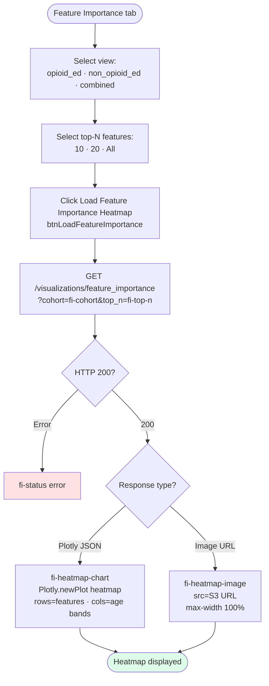

---

#### Tab: Causal Analysis

Uses **Risk Assessment context** (cohort + age_band + selected codes). Optional what-if comparison and density-bin filter.

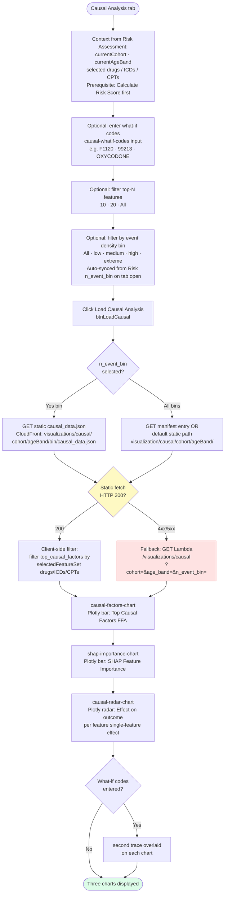

---

#### Tab: BupaR Process Mining

Drug-specific visuals (cohort + age band controlled) and event-to-target visuals (all activity types, not filtered).

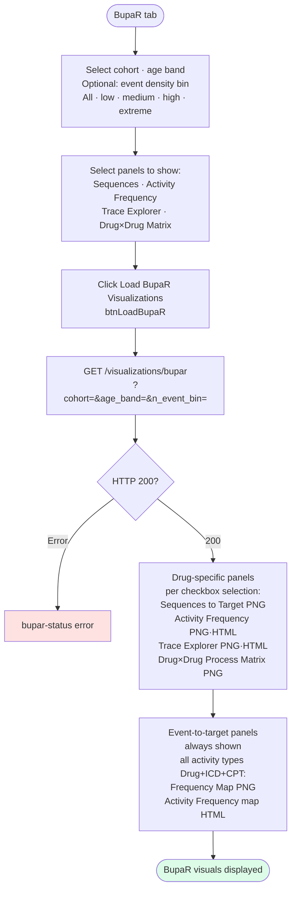

---

#### Tab: DTW Trajectories

Drug / ICD / CPT trajectory clusters. Two sub-tabs: Overview & Trajectories and Routine vs Utilization.

```mermaid
flowchart TD
    A([DTW tab]) --> B[Select cohort · age band\nOptional: event density bin]
    B --> C[Select panels to show\nvia checkboxes]
    C --> D[Click Load DTW Visualizations\nbtnLoadDTW]
    D --> E[GET /visualizations/dtw\n?cohort=&age_band=&n_event_bin=]
    E --> F{HTTP 200?}
    F -->|Error| G[dtw-status error]
    F -->|200| H{Sub-tab}
    H -->|Overview and Trajectories| I[Trajectory Analysis PNG\ndtw_trajectory_analysis_{cohort}_{age_band}.png\nfrom S3 gold/feature_importance/]
    H -->|Routine vs Utilization| J[Outcome rate + event counts\nby routine vs utilization activity]
    I --> K([DTW visuals displayed])
    J --> K

    style G fill:#fee2e2
    style K fill:#dcfce7
```

---

#### Tab: FP-Growth Patterns

Drug names only — itemset support distribution and interactive drug association network.

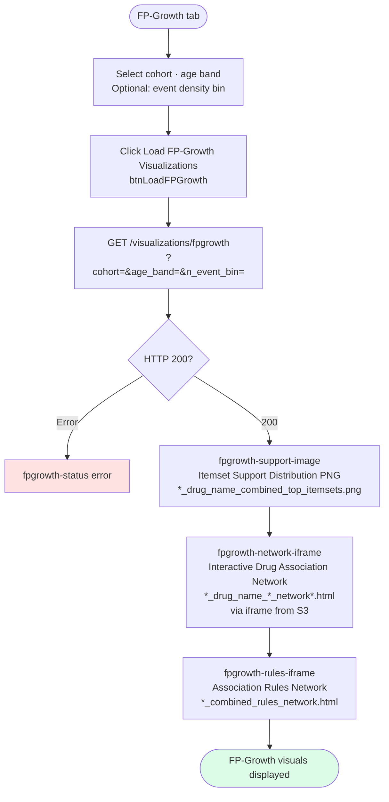

---

#### Tab: PGx Cohort Network

Gene–drug–phenotype topology network from SHAP/FFA top genes + PharmGKB VIP reports. Includes radar chart and PubMed citations.

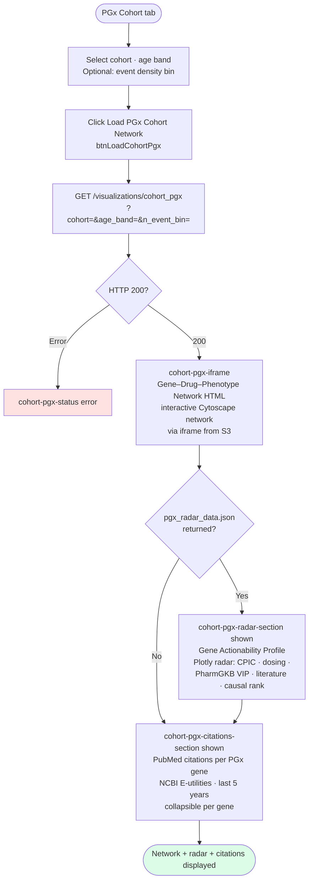

## Key Features

- **Ensemble Models**: CatBoost + XGBoost + XGBoost RF — Lambda loads `model_weights` from `feature_schema.json`:
  - **Single model selected** (XGBoost, XGBoost RF, or CatBoost): winner-take-all weights (`1.0` / `0.0`)
  - **Ensemble selected**: proportional weights from composite score (`0.5 × PR-AUC + 0.5 × 1/(1+logloss)`) across all three component models
  - Re-run `prepare_models.py` after any Step 6 training run that changes the selected model
- **Age-Based Selection**: Automatically selects appropriate model based on age
- **Feature-Driven Inputs**: Dropdowns populated from Step 3b refined feature importances
- **Privacy-First PGx Cards**: Anonymous, generic cards with optional patient ID
- **SHAP + FFA Combination**: Comprehensive patient-level explanations combining quantitative (SHAP) and logical (FFA) methods
- **Consensus Features**: High-confidence features identified by both SHAP and FFA analysis
- **Visualization Tabs**:
  - **Causal Analysis**: FFA causal factors and SHAP importance
  - **DTW Trajectories**: Patient trajectory patterns and temporal metrics
  - **FP-Growth Patterns**: Frequent itemsets, association rules, and co-occurrence networks
  - **BupaR Process Mining**: Process flows, activity sequences, activity frequency, trace explorer

## API Endpoints

### Core Endpoints

- **`GET /metadata`** - Get valid age bands and valid codes for dropdowns
  - Returns, per cohort, the supported age bands and code lists for the **Drugs / CPT / ICD** tabs
  - The dashboard uses these to populate the cohort/age-band grid (full set: 0-12, 13-24, 25-44, 45-54, 55-64, 65-74, 75-84, 85-114) and the tab-specific grids

- **`POST /risk`** - Calculate risk score for a given `(cohort, age_band)` and selected codes
  - Dashboard sends a JSON body:
    ```json
    {
      "cohort": "opioid_ed",
      "age_band": "25-44",
      "drugs": ["DRUG_NAME_1", "DRUG_NAME_2"],
      "icds": ["F1120", "R51"],
      "cpts": ["80305", "99213"]
    }
    ```
  - Lambda builds a feature vector using `feature_schema.json` (prepared by `prepare_models.py`) and returns ensemble risk plus per-model breakdown for visualization

- **`POST /risk/comparison`** - Compare risk scenarios

- **`POST /pgx/card`** - Generate PGx patient card from genetic variants

### Visualization Endpoints

- **`GET /visualizations/causal`** - Get causal analysis visualizations (FFA + SHAP)
  - Query params: `cohort`, `age_band`
  - Returns: Causal factors and SHAP importance data

- **`GET /visualizations/dtw`** - Get DTW trajectory visualizations
  - Query params: `cohort`, `age_band`
  - Returns: S3 paths to DTW visualization images

- **`GET /visualizations/fpgrowth`** - Get FP-Growth pattern visualizations (drug names only)
  - Query params: `cohort`, `age_band` (item_type is fixed to `drug_name`)
  - Returns: S3 paths to FP-Growth itemsets and drug association network

- **`GET /visualizations/bupar`** - Get BupaR process mining visualizations
  - Query params: `cohort`, `age_band`
  - Returns: S3 paths to BupaR visualization images

See [README_results_dashboard.md](../docs/Step10_Results/README_results_dashboard.md) for complete API documentation.

## Data Sources

### Model Outputs
- **Location**: `6_final_model/outputs/{cohort}/{age_band}/`
- **Files**: Model JSONs, joblib files, feature schemas, MC-CV results

### SHAP Outputs
- **S3 Location**: `s3://pgxdatalake/gold/shap_analysis/{cohort}/{age_band}/`
- **Files**: `*_shap_global_importance_xgboost.csv`, `*_shap_sample_values_xgboost.parquet`

### FFA Outputs
- **S3 Location**: `s3://pgxdatalake/gold/ffa_analysis/{cohort}/{age_band}/xgboost/`
- **Files**: `causal_importance.parquet`, `feature_importance_axp.parquet`, `interaction_analysis.parquet`

### Visualization Outputs

**DTW Visualizations**:
- **S3 Location**: `s3://pgxdatalake/gold/feature_importance/{cohort}/{age_band}/plots/`
- **Files**: `dtw_trajectory_analysis_{cohort}_{age_band}.png` (Sample Trajectories removed)

**FP-Growth Visualizations** (drug names only):
- **S3 Location**: `{S3_DASHBOARD_BUCKET}/{S3_DASHBOARD_PREFIX}/fpgrowth/{cohort}/{age_band}/plots/`
- **Files used by dashboard**: `*_drug_name_combined_top_itemsets.png`, `*_drug_name_*_network*.html`, `*_combined_rules_network.html`; itemsets JSON under `.../data/drug_name_itemsets.json`

**BupaR Visualizations**:
- **S3 Location**: `{S3_DASHBOARD_BUCKET}/{S3_DASHBOARD_PREFIX}/bupar/{cohort}/{age_band}/plots/`
- **Files used by dashboard**: `*_activity_frequency*.png|.html`, `*_trace_explorer*.png|.html`, `*_process_matrix_drug_drug.png` (Drug × Drug only), `*_frequency_map.png`

**Note**: The Lambda function loads data from S3, so visualization files must be uploaded to S3 before deployment.

---

## FP-Growth Network Visualization Integration

**⚠️ Important**: We do not use FP-Growth for feature engineering (target leakage). We do use FP-Growth **with feature importance** for **analysis, answering research questions, and causal visualization** in the risk dashboard.

### Overview

FP-Growth network visualizations show (**drug names only**; research focus on drug sequences/combinations):
- **Co-occurrence patterns**: Which drugs frequently appear together
- **Association rules**: Directed relationships between drug items (antecedent → consequent)
- **Pattern strength**: Support, confidence, and lift metrics for drug patterns

### Integration with Causal Analysis

FP-Growth networks complement FFA/SHAP causal analysis by:
1. **Visualizing Feature Relationships**: Show how causal features (from FFA/SHAP) relate to each other
2. **Pattern Discovery**: Identify drug combinations or diagnostic patterns that align with high-importance features
3. **Patient Context**: Show which patterns a patient matches, providing clinical context for risk predictions

### Network Visualization Files

**Location**:
- Local: `10_risk_dashboard/visualizations/fpgrowth/outputs/{cohort}/{age_band}/plots/`
- S3: `s3://pgxdatalake/gold/fpgrowth/{cohort}/{age_band}/plots/`

**Files** (dashboard uses **drug_name** only):
- `{cohort}_{age_band}_drug_name_network.html` (or `*_combined_rules_network.html`): Interactive drug association network
- `{cohort}_{age_band}_drug_name_*_rules_network.html`: Association rules network

### Dashboard Integration

#### Option 1: Embed HTML Network Files

```html
<!-- In dashboard HTML -->
<iframe 
  src="https://s3.amazonaws.com/pgxdatalake/gold/fpgrowth/{cohort}/{age_band}/plots/{cohort}_{age_band}_drug_name_network.html"
  width="100%" 
  height="600px"
  frameborder="0">
</iframe>
```

#### Option 2: Load via API Endpoint

The dashboard calls `GET /visualizations/fpgrowth?cohort=&age_band=`; the API returns S3 URLs for **drug_name** itemsets and network only (no item_type selector).

#### Option 3: Combine with Causal Analysis

Show FP-Growth drug network alongside FFA/SHAP results for drug-focused pattern context.

### Network Features

**Interactive Controls**:
- **Node Centrality Filter**: Filter nodes by degree centrality (≥ 0, 0.01, 0.05, 0.1, 0.2, 0.3, 0.5)
- **Edge Support Filter**: Filter edges by support threshold
- **Edge Confidence Filter**: Filter edges by confidence (rules networks only)
- **Max Nodes Limit**: Limit display to top N nodes (20, 50, 100, 200, or All)
- **Reset Filters**: Clear all filters

**Visual Encoding**:
- **Node Size**: Represents degree centrality (how connected the node is)
- **Edge Width**: Represents support/confidence (strength of relationship)
- **Node Color**: Can be customized to highlight patient-matched items

### Use Cases

1. **Causal Analysis Visualization**
   - Show FP-Growth network alongside FFA/SHAP feature importance
   - Highlight features that appear in both analyses
   - Visualize relationships between high-importance features

2. **Patient-Specific Context**
   - Show which FP-Growth patterns a patient matches
   - Visualize patient's position in the network
   - Compare patient patterns to target cohort patterns

3. **Clinical Hypothesis Generation**
   - Explore drug combinations of interest
   - Discover diagnostic code patterns
   - Understand treatment sequences

### Related Documentation

- `visualizations/fpgrowth/README_visualization_only.md`: Why FP-Growth is visualization-only
- `visualizations/fpgrowth/README.md`: FP-Growth analysis documentation
- `8_ffa_analysis/README.md`: FFA analysis documentation (includes causal importance that reflects SHAP consensus)

## E2E Test Results

Puppeteer end-to-end tests run against the live dashboard (`https://jerome-dixon.io/vcu/pgx-risk-calculator/index.html`).

**Last passing run: 2026-04-18 — 42/42 tests, 8 suites (WSL native)**

| Suite | Tests | Key assertions |
|---|---|---|
| `tab-risk` | 4 ✅ | Risk score + band visible · n_event_bin badge · invalid age guard |
| `tab-causal` | 5 ✅ | `causal-n-event-bin` auto-synced from `window._patientNEventBin` · causal factors non-empty · code filter regression · error guard |
| `tab-feature-importance` | 4 ✅ | opioid / non-opioid / combined views · heatmap or image populated |
| `tab-bupar` | 5 ✅ | opioid + non-opioid happy path · density bin · Activity Rate bin chart renders Plotly ✓ · error guard |
| `tab-dtw` | 5 ✅ | 3 cohort/age combos · density re-render · error guard |
| `tab-fpgrowth` | 7 ✅ | 3 combos · support image via Plotly JSON or PNG · network iframe · Itemset Support bin chart (soft) · error guard |
| `tab-pgx-card` | 7 ✅ | CYP2D6 · SLCO1B1 + TPMT + DPYD · empty-variant guard · gene list populated · card display |
| `tab-pgx-cohort` | 5 ✅ | Network iframe · status · citations · radar SVG · non-opioid cross-cohort |

**Run commands (WSL / Windsurf native — no PS7 wrapper needed):**
```bash
# Full tab suite (all 8 suites)
cd /mnt/c/Projects/pgx-analysis/11_testing/puppeteer
npx jest --testPathPattern=tests/tabs/ --forceExit --verbose

# Single suite (npm script shortcuts)
npm run test:risk
npm run test:causal
npm run test:bupar
npm run test:fpgrowth
# etc. — see package.json scripts
```

Test files: `11_testing/puppeteer/tests/tabs/`

---

## Documentation

For detailed documentation, see [`docs/Step10_Results/`](../docs/Step10_Results/):

**Main Documentation**:
- **[README_results_dashboard.md](../docs/Step10_Results/README_results_dashboard.md)** - Complete dashboard system overview
- **[README_results_value_proposition.md](../docs/Step10_Results/README_results_value_proposition.md)** - Business value and use cases
- **[README_results_deployment.md](../docs/Step10_Results/README_results_deployment.md)** - Complete deployment guide (architecture, steps, security)
- **[README_results_prediction.md](../docs/Step10_Results/README_results_prediction.md)** - Prediction workflow and technical details
- **[README_results_quickstart.md](../docs/Step10_Results/README_results_quickstart.md)** - Quick start guide for predictions

**Feature Documentation**:
- **[README_results_pgx_card.md](../docs/Step10_Results/README_results_pgx_card.md)** - PGx Patient Card feature
- **[README_results_ensemble.md](../docs/Step10_Results/README_results_ensemble.md)** - Ensemble model approach
- **[README_results_model_weights.md](../docs/Step10_Results/README_results_model_weights.md)** - Performance-based model weighting

**Deployment Guides**:
- **[README_results_deployment_ecr.md](../docs/Step10_Results/README_results_deployment_ecr.md)** - Lambda ECR container deployment
- **[README_results_deployment_cpic.md](../docs/Step10_Results/README_results_deployment_cpic.md)** - CPIC data deployment

**Reference**:
- **[README_results_storage.md](../docs/Step10_Results/README_results_storage.md)** - Storage analysis and container sizing
- **[README_results_age_bands.md](../docs/Step10_Results/README_results_age_bands.md)** - Supported age bands and mappings

See [`docs/Step10_Results/README.md`](../docs/Step10_Results/README.md) for complete documentation index.
