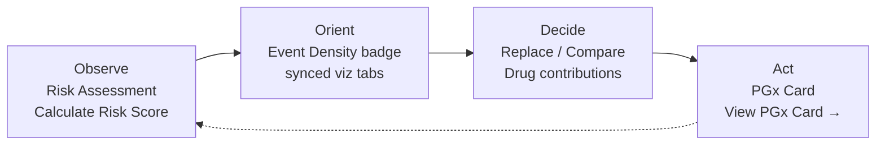

# Dashboard use cases and workflows

**Purpose:** Canonical **persona → tab → numbered workflow** map so dashboard visuals stay aligned with **live product behavior** on [https://pgx.jerome-dixon.io/](https://pgx.jerome-dixon.io/).

Labels below match the live tab bar and buttons in `frontend/index.html` and `frontend/tabs/*.html`. This is not the older Step 9 four-tab plan.

**Related (do not duplicate here):**

- Research-question → artifact table: [RESEARCH_QUESTIONS_ARTIFACTS.md](RESEARCH_QUESTIONS_ARTIFACTS.md)
- How visuals are produced: [README_visualization_plan.md](README_visualization_plan.md)
- Static-first JSON (S3/CloudFront, Lambda fallback): [STATIC_FIRST_JSON.md](STATIC_FIRST_JSON.md)
- Training screenshots + README pack: [TRAINING.md](TRAINING.md) (Google Drive folder layout; NotebookLM only if generated)

---

## Live tab map

| Row | Live names |
|-----|------------|
| Cohort | **Opioid ED** · **Polypharmacy** |
| Primary | **Documentation** · **Risk Assessment** · **Drugs** · **ICD Codes** · **CPT Codes** · **PGx Card** |
| Visualizations | **Feature Importance** · **Scenario Analysis (FFA/SHAP)** · **BupaR Process Mining** · **DTW Trajectories** · **FP-Growth Patterns** · **Drug Networks** · **PGx Cohort** |

ICD Codes and CPT Codes are used for **Opioid ED** risk only. On **Polypharmacy** those tabs are hidden; risk uses drugs only.

Age on Risk Assessment selects the age band. Scoring requires **age 13–114** (band 0–12 is excluded). After **Calculate Risk Score**, an **Event Density** badge appears: **low / medium / high / extreme**. That bin is auto-synced onto visualization tabs that have an Event density control, and onto **PGx Card** → Event Density.

---

## Personas

**Clinician / pharmacist.** Score a claims-style profile (age + selected codes), replace one code at a time, compare two or more saved sets (or empty baseline vs current), and read leave-one-out drug contributions (Δp̂). After a score, open **View PGx Card →** for the cohort/claims radar, then optionally attach gene/allele data and use **Clinician / pharmacist** view. Exports include **Pharmacy handoff**. **Send to pharmacy (coming soon)** is disabled — there is no live e-prescribe.

**Researcher.** Use **Feature Importance**, **Scenario Analysis (FFA/SHAP)**, **BupaR Process Mining**, **DTW Trajectories**, **FP-Growth Patterns**, **Drug Networks**, and **PGx Cohort** to inspect population drivers, sequences, and gene–drug topology. These tabs answer RQ1/RQ2 and N1–N6. The artifact table lives in [RESEARCH_QUESTIONS_ARTIFACTS.md](RESEARCH_QUESTIONS_ARTIFACTS.md) — this document only names the path.

**Patient / self-assessment.** Enter **Age**, add codes on **Drugs** (and ICD/CPT if Opioid ED), click **Calculate Risk Score**, then optionally upload AncestryDNA / 23andMe / Excel / VCF or type `Gene,Allele` lines on **PGx Card**. Parsing stays in the browser. Switch **View** to **Patient** for plainer language. There is no account, no haplotype caller, and no pharmacy transmission.

---

## Clinical OODA path

Clinical use is a short loop: score → inspect the same density bin → act on the card.

1. **Observe** — **Risk Assessment**: Age + codes → **Calculate Risk Score** → ensemble p̂, band, **Event Density** badge.
2. **Orient** — Open the density-synced research tabs (BupaR, DTW, FP-Growth, PGx Cohort) and/or the **PGx Card** radar for that cohort / age band / bin.
3. **Decide** — **Replace / swap a code**, **Save current selection** + **Compare Scenarios**, and **Drug contributions** (LOO Δp̂). **Scenario Analysis (FFA/SHAP)** explains drivers; it does **not** recompute ensemble risk.
4. **Act** — **PGx Card**: claims profile via **Load Cohort PGx Profile**, or a personalized card from gene data. Actions are **categories** plus guideline URLs — not invented CPIC prose.

Researcher work sits beside this loop (same cohort / age / bin) and is mapped in [RESEARCH_QUESTIONS_ARTIFACTS.md](RESEARCH_QUESTIONS_ARTIFACTS.md).

---

## Researcher RQ path

Do not treat Scenario Analysis as a second risk calculator.

| Intent | Live tabs | Notes |
|--------|-----------|--------|
| Population drivers | **Feature Importance** | Heatmap by age band. Standalone — does not need a prior score. |
| Feature / interaction signals | **Scenario Analysis (FFA/SHAP)** | Same cohort, age, and selected codes as Risk Assessment. Optional what-if codes. **Does not recalculate ensemble p̂.** |
| Sequences and time | **BupaR Process Mining**, **DTW Trajectories** | Cohort × age × Event density (auto-synced after a score). Not filtered by selected codes. |
| Co-occurrence | **FP-Growth Patterns**, **Drug Networks** | FP-Growth has Event density. Drug Networks is cohort × age (FI-filtered rules, combined train window). Neither is filtered by selected codes. |
| Population PGx topology | **PGx Cohort** | Network + figure pack + radar. Distinct from the patient **PGx Card**. |

Full RQ → artifact mapping: [RESEARCH_QUESTIONS_ARTIFACTS.md](RESEARCH_QUESTIONS_ARTIFACTS.md). How those files are built: [README_visualization_plan.md](README_visualization_plan.md). How the browser loads them: [STATIC_FIRST_JSON.md](STATIC_FIRST_JSON.md).

---

## Use cases

### 1. Cohort risk assessment with replace-and-compare

Modeled ensemble risk (p̂) for a claims-style profile.

1. Choose **Opioid ED** or **Polypharmacy**.
2. On **Risk Assessment**, set **Age** (13–114).
3. Open **Drugs**, search, and select medications (Ctrl+click / Cmd+click). Use **Edit codes** to jump there from Risk Assessment.
4. For **Opioid ED** only, add codes on **ICD Codes** and **CPT Codes**.
5. Optional overrides: **# drugs**, **# CPIC drugs**, **# total events** (blank defaults to the low-density bin).
6. Click **Calculate Risk Score**. Read the score, band, model name, and **Event Density** badge (low / medium / high / extreme).
7. To swap one selected drug, ICD, or CPT: use **⇄** on a chip, or **Replace / swap a code** → **Replace**, then **Calculate Risk Score** again.
8. To compare modeled probabilities: name the set → **Save current selection**. Save **two or more** sets, then **Compare Scenarios**. With no saved sets, Compare is empty baseline vs current. Leave **Include empty baseline** checked to also show the 2019 population baseline.
9. Click **Drug contributions** for leave-one-out Δp̂ per selected drug (ICD/CPT stay in the vector). Positive Δp̂ means removing that drug lowers predicted risk.

**Compare Scenarios** scores every saved set you kept (two or more), not a single scenario. Deltas are versus the reference (empty baseline or the first saved set).

---

### 2. Scenario Analysis (FFA/SHAP) — explain drivers

This tab shows FFA interaction factors and SHAP importance. It does **not** recalculate the ensemble risk score.

1. Set cohort and **Age** on **Risk Assessment**, and select the codes you care about. A prior **Calculate Risk Score** is the intended context (Event density auto-syncs).
2. Open **Scenario Analysis (FFA/SHAP)**.
3. Optional: **What-if scenario** (comma-separated codes), **Show features** (Top 10 / Top 20 / All), **Event density**.
4. Click **Load Scenario Analysis**. Charts: **Top Interaction Factors (FFA)**, **SHAP Feature Importance**, **Effect on outcome (by feature)**.
5. **Clear filters** reloads with no code selection.

For modeled p̂, return to **Risk Assessment** and use **Calculate Risk Score**, **Replace**, or **Compare Scenarios**. This is the only visualization tab that filters charts by the codes you selected.

---

### 3. Post-score density-bin exploration

After **Calculate Risk Score**, the **Event Density** badge is the same stratum the models and most visuals were built on.

1. Note the badge (low / medium / high / extreme).
2. Open **BupaR Process Mining** → **Load BupaR Visualizations** (Event density already set).
3. Open **DTW Trajectories** → **Load DTW Visualizations**.
4. Open **FP-Growth Patterns** → **Load FP-Growth Visualizations**.
5. Open **PGx Cohort** → **Load PGx Cohort Network** (and optionally **Load Figure Pack Visual**).
6. Open **PGx Card**: Event Density is auto-set → **Load Cohort PGx Profile**.

These tabs load **cohort × age × bin** (or cohort × age) artifacts. They are **not** filtered by the individual codes you selected, except Scenario Analysis (use case 2).

---

### 4. Feature Importance (population drivers)

1. Open **Feature Importance**.
2. Set **View** to **Opioid ED**, **Polypharmacy**, or **Combined cohorts**.
3. Set **Show features** (Top 10 / Top 20 / All).
4. Click **Load Feature Importance Heatmap**.

Standalone population view (Step 3a Monte Carlo CV). It does not use the current patient’s selected codes.

---

### 5. Pattern and process tabs

| Tab | Load button | What you get |
|-----|-------------|--------------|
| **BupaR Process Mining** | **Load BupaR Visualizations** | Sequences, activity frequency, Gantt / trace explorer; Event density control. |
| **DTW Trajectories** | **Load DTW Visualizations** | Trajectory clusters, routine vs utilization, time-to-target; Event density control. |
| **FP-Growth Patterns** | **Load FP-Growth Visualizations** | Drug itemsets and association network; Event density control. |
| **Drug Networks** | **Load Drug Network** | Interactive Drug Networks (Cytoscape) graph of **FI-filtered** FP-Growth rules (not Plotly). Cohort × age only — no Event density dropdown. |

**Drug Networks** is a live third-row tab. It is the same FI-gated rule set as FP-Growth, rendered as Cytoscape HTML. It is not listed in older Step 9 four-tab docs.

None of these four tabs recompute ensemble p̂. None filter by the codes selected on Drugs / ICD / CPT.

---

### 6. Claims-only PGx Card

Population / claims evidence for the patient’s cohort, age band, and density bin — not a genotype call.

1. After a score, click **View PGx Card →**, or open **PGx Card** and set **Cohort**, **Age Band**, and **Event Density**.
2. Click **Load Cohort PGx Profile**.
3. Read **Gene Actionability Profile** (radar) and **Identified PGx Genes**. The radar is **cohort/claims association**, not a CPIC prescribing action.

When you later generate a personalized card (use case 7):

- **Drug scope:** **Active medications** (`ACTIVE`), **Selected drugs** (`SELECTED`), or **All matched drugs** (`ALL_MATCHED`).
- **Actionable only** hides standard / no-CPIC rows in the queue, matrix, and exports.
- **Polypharmacy triplet engine** enumerates **regimen-only** three-way matches (need **≥ 3** APCD generics). Triplets are never shown as CPIC recommendations. `ALL_MATCHED` does not explode every CPIC drug into triplets.

---

### 7. Personalized PGx Card from DNA

Optional refinement after (or instead of) the claims radar.

1. Under **1. Gene data**, leave **Session / patient pseudonym** blank for an anonymous session, or enter a label.
2. Enter **Gene / allele** lines (`CYP2D6,*1,*4`) **or** **Or upload file**: AncestryDNA or 23andMe (txt/csv/zip), Excel `.xlsx` (`Gene,Allele1,Allele2`), or VCF.
3. Files are parsed **in this browser**. They are not uploaded to S3. The browser keeps official CPIC defining rsids only, then `POST /pgx/card` runs the conservative unphased matcher against official allele-definition tables. This is **not** full haplotype calling.

   **What “unphased” means.** A VCF or 23andMe/Ancestry extract tells you which variants are present, not which copy of the gene each variant sits on. A star allele is an official haplotype (a defined SNP combination on *one* chromosome). Unphased data only give a genotype at each rsid (for example `A/G`). When an official allele is a single SNP, a conservative call is often possible (SLCO1B1 `rs4149056` `TC` → `*1/*5`). When a star uses several SNPs, or two official alleles share a site (CYP2C19 `*2` vs `*38` on `rs4244285`), the same row fits more than one haplotype pair. Guessing `*1/*2` would invent a phase the file does not contain, so the card lists **candidate alleles** and marks the gene **indeterminate**. A lab-style line such as `CYP2C19,*1,*2` skips rsid calling and uses the official diplotype→phenotype table.

4. Under **2. Virginia APCD medications**, search generics (two characters), set **Drug scope** and **Actionable only**, and choose **Patient** or **Clinician / pharmacist**.
5. Click **Generate PGx results**. The request is **POST `/pgx/card`** with **parsed variants** (plus selected APCD drugs and scope) — not the raw genome file.
6. Review **Medication-first action queue**, **Gene–drug actionability matrix**, **Polypharmacy triplet engine**, and **Genes tested**. Rows are **action categories** (Avoid / alternative needed, Dose adjustment needed, Reduced response possible, Monitoring recommended, No PGx action identified, No applicable CPIC action, Insufficient genetic resolution) plus guideline URLs. Unlisted allele pairs stay **indeterminate**, never “normal.” This is not a full CPIC translation service and does not invent guideline prose.
7. Export: **Print**, **Download JSON**, **Download CSV**, **Download PNG**, **Download PDF**, **Copy to clipboard**, **Technical appendix**, **Pharmacy handoff**.
8. **Send to pharmacy (coming soon)** stays disabled. There is no live e-prescribe.

---

### 8. PGx Cohort tab vs PGx Card

| | **PGx Cohort** | **PGx Card** |
|--|----------------|--------------|
| Role | Population topology | Patient / session card |
| Load | **Load PGx Cohort Network** | **Load Cohort PGx Profile** and/or **Generate PGx results** |
| Content | Gene–drug–phenotype network, figure pack, cohort radar | Claims radar (optional) + gene-data card, action queue, triplets, exports |
| Question | How do PGx genes, drugs, and phenotypes connect in this cohort × age band? | What should this session do given claims context and optional alleles? |

Use **PGx Cohort** for research topology. Use **PGx Card** when a person (or a claims proxy) needs an action list.

---

### 9. Documentation / model trust

1. Open **Documentation**.
2. Read **How to use**, research-question coverage, and the compact use-case summary (this file is the long form).
3. Review **Model performance and at-risk identification** (Monte Carlo 2016–2018 / 2019 holdout metrics by cohort and age band).
4. Review **Dashboard visual artifacts (from manifest)** (`visualizations/dashboard_visual_objects.json`).
5. Use **Feature importance sources for visuals** and **Event density bins** to interpret why BupaR/DTW vs FP-Growth can disagree, and why the badge matters for model routing.
6. Read **Unphased DNA files and star alleles** so VCF / 23andMe / AncestryDNA uploads are not mistaken for full haplotype calling.

In-app Documentation is the trust surface for users who never open the repo. This markdown is the workflow source of truth for implementers.

---

## What this dashboard does not do

- Full haplotype / phased star-allele calling from VCF or DTC files. Those files are unphased: they do not say which chromosome copy each variant sits on. Live calling is the conservative unphased official-table matcher only; multi-variant or overlapping stars stay indeterminate.
- Invented CPIC guideline prose (categories + URLs only; unlisted pairs stay indeterminate).
- Live e-prescribe or **Send to pharmacy**.
- Filtering BupaR, DTW, FP-Growth, Drug Networks, or PGx Cohort by the codes selected on Drugs / ICD / CPT. **Scenario Analysis (FFA/SHAP)** is the exception.
- Treating **Compare Scenarios** as a single-scenario button. Live behavior is **two or more saved sets**, or empty baseline vs current when nothing is saved.
