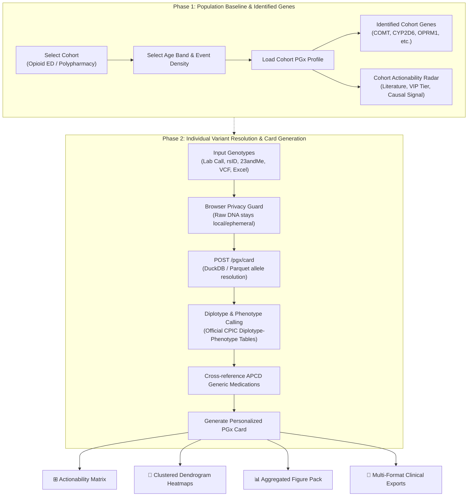

# PGx Card: Personalized Pharmacogenomic Clinical Decision Support

## Overview

The **PGx Card** tab transforms patient-specific genetic variant data and Virginia All-Payer Claims Database (APCD) medication regimens into point-of-care clinical prescribing actions aligned with official **Clinical Pharmacogenetics Implementation Consortium (CPIC®)** guidelines and **PharmGKB** evidence.

While the **PGx Cohort** tab serves epidemiological and population-scale network exploration, the **PGx Card** focuses squarely on the individual patient: cross-referencing prescribed or candidate medications against identified metabolizer phenotypes to alert clinicians to adverse drug reactions, therapeutic failures, and recommended dosing adjustments.

---

## Architecture & Two-Phase Workflow



### Phase 1: Population Baseline
1. **Cohort & Density Filter**: The clinician selects the target cohort (Opioid ED or Polypharmacy), patient age band, and claims event density bin.
2. **Identified Genes**: Sourced from claims feature importance (SHAP/FFA) and linked to PubMed citation frequency and PharmGKB Very Important Pharmacogene (VIP) tiers.
3. **Cohort Radar Baseline**: Pre-renders the multi-dimensional OODA evidence radar chart.

### Phase 2: Patient Genotype Translation
1. **Multi-Format Input**:
   - **Official Lab Genotypes**: Format `Gene,*allele1,*allele2` (e.g., `CYP2D6,*1,*2`, `CYP2C19,*1,*17`, `SLCO1B1,*5,*1`).
   - **Single Nucleotide Polymorphisms (rsIDs)**: Direct rsID entries (e.g., `rs1045642,TT`).
   - **Consumer Array Uploads**: AncestryDNA, 23andMe, MyHeritage text files, unphased VCFs, and Excel spreadsheets.
2. **Phenotype Translation**: Server-side CPIC reference tables translate diplotypes into standardized metabolizer categories (*Poor Metabolizer*, *Intermediate Metabolizer*, *Normal Metabolizer*, *Rapid Metabolizer*, *Ultrarapid Metabolizer*).
3. **APCD Formulary Cross-Reference**: Evaluates every approved APCD generic medication against the resolved diplotypes and assigns official CPIC recommendation levels (Level A, B, C, D).

---

## Prescribing Visualizations & Layouts

### 1. Options Matrix (`.pgx-options-matrix`)
The header controls are structured as a 3-panel matrix rather than an unorganized linear button row:

| Panel | Type | Description |
|---|---|---|
| **⚡ Run & Generate** | Primary Action | Gradient hero button (`#btnGenerateCard`) to execute analysis, plus session reset (`#btnResetCard`). |
| **🩺 Clinical Reports** | Structured Handoffs | Direct generation of **Doctor Summary**, **Pharmacy Handoff**, and **Technical Appendix**. |
| **📑 Export Matrix** | File & Data Exports | 2-column grid for **Print**, **PDF**, **PNG**, **CSV**, **JSON**, and **Copy to Clipboard**. |

### 2. Gene–Drug Actionability Matrix (`#pgx-action-matrix`)
The primary prescribing view cross-references approved generic medications against patient genes in a structured grid:
- **Format Switcher**: Segmented toggle allows instant switching between:
  - **⊞ Matrix Format**: High-density 2D cross-reference grid (default).
  - **☰ Row Format**: Card-by-card queue sorted by action priority.
- **CPIC Action Filter Pills**:
  - `All`: Total scoped medications.
  - `Avoid / Alt`: High-risk contraindicated medications requiring alternative therapy.
  - `Dose Adjust`: Dosage adjustments or titration requirements.
  - `Monitoring`: Enhanced therapeutic drug or toxicity monitoring.
  - `Standard`: Standard prescribing per clinical guidelines.
  - `Insufficient`: Genes with incomplete or unphased consumer array coverage.
- **On-Click Detail Inspection**: Clicking any cell (`.pgx-interactive-cell`) triggers the on-screen detail card (`#pgx-matrix-detail-card`) showing full Diplotype, Phenotype, clinical text, and CPIC reference links.

### 3. Clustered Dendrogram Heatmaps (`#pgx-dendrogram-plot`)
Agglomerative hierarchical clustering groups medications and genes based on functional prescribing similarity:
- **Distance Metrics**: *Euclidean* or *Manhattan*.
- **Linkage Criteria**: *Average (UPGMA)*, *Complete*, or *Single*.
- **Three Clustering Modes**:
  1. **Drug, Gene & Recommendation (Dual Dendrogram)**:
     - Rows = Drugs (with left-hand row dendrogram tree).
     - Columns = Genes (with top column dendrogram tree).
     - Heatmap Cells = CPIC action severity scale (Avoid=4, Dose Adjust=3, Monitor=2, Standard=1, Insufficient=0.5, None=0) with discrete color ramps.
  2. **Drug × Recommendation Profile**:
     - Clusters medications by their distribution across clinical recommendation categories, grouping drugs with identical clinical impact.
  3. **Gene × Recommendation Profile**:
     - Clusters PGx genes based on the number and distribution of affected medications in the patient's regimen.
- **Interactive Inspection**: Clicking heatmap cells updates the dedicated `#pgx-dendrogram-detail` card.

### 4. Aggregated Population Visuals & Figure Pack (`#pgx-aggregated-visuals-section`)
Provides clinical and population context directly within the individual patient report, grounded in the study's two target adverse event cohorts (**ED** and **Polypharmacy** across older adult strata `65–74` and `75–84`):
- **Publication Figure Pack Dropdown**:
  - *Intervention priority heatmap* (`pgx_intervention_priority_heatmap`) — Multi-evidence drug–gene prioritization scores across **ED 65–74**, **ED 75–84**, **Polypharmacy 65–74**, and **Polypharmacy 75–84**.
  - *Global intervention network* (`pgx_global_intervention_network`) — Top model-seeded drug–gene intervention network.
  - *Cohort small multiples* (`pgx_cohort_small_multiples`) — Side-by-side network topologies across **ED** and **Polypharmacy** age bands.
  - *Therapeutic cluster ego networks* (`pgx_cluster_ego_networks`) — Focused modules separating beta-blockers, statins, and diuretics.
  - *Pathway context panel* (`pgx_pathway_context_panel`) — Edge counts and distributions across dynamics, kinetics, allergic response, and underappreciated signaling.
  - *Medication lead-time panel* (`pgx_time_to_event_panel`) — Days before event for sentinel drugs (e.g. Furosemide) in **ED** and **Polypharmacy** cohorts.
- **Interactive Deep-Links**: Direct links to full interactive Plotly HTML and publication-ready PNGs.
- **Cohort Gene Actionability Radar**: Embedded radar plot displaying multi-dimensional OODA evidence (Literature citations, VIP Evidence tiers, Causal signals, CPIC Guideline presence).

---

## Comparison: PGx Card vs. PGx Cohort

To avoid cognitive overload and preserve clear clinical utility, visual artifacts are segregated between the two tabs:

| Visual / Feature | PGx Card Tab | PGx Cohort Tab | Rationale |
|---|:---:|:---:|---|
| **Gene–Drug Actionability Matrix** | ✅ **Primary** | ❌ | Point-of-care patient prescribing decision support. |
| **Clustered Dendrogram Heatmaps** | ✅ **Interactive** | ❌ | Clusters the individual patient's medications and genes by prescribing consequence. |
| **Action Queue & Format Switcher** | ✅ **Yes** | ❌ | Patient-specific dosing adjustments and alert cards. |
| **Clinical Handoffs (Doctor/Pharmacy)** | ✅ **Yes** | ❌ | Actionable exports for pharmacy and medical records. |
| **Gene Actionability Radar** | ✅ **Embedded** | ✅ **Full View** | Patient report includes baseline radar; cohort tab provides full deep-dive. |
| **Publication Figure Pack** | ✅ **Preview / Links** | ✅ **Full View** | Embedded compactly in card report for contextual reference without clutter. |
| **Gene–Drug–Phenotype Network Topology** | ❌ *Excluded* | ✅ **Primary** | 100+ node interactive graph is valuable for epidemiological research but overwhelms clinical patient care. |
| **PubMed Literature Explorer** | 🔗 *Badge Links* | ✅ *Full Text List* | Card displays citation counts/badges; full publication browser lives in cohort tab. |

---

## The Phase Problem & Consumer Genealogy Data: Biological Mechanism & Safety Architecture

A critical clinical safety vulnerability in direct-to-consumer (DTC) genetic interpretation is the **unphased genotype problem**. The PGx Card implements strict bioinformatic guardrails to prevent erroneous clinical claims from genealogy array data.

```
                    THE CIS vs. TRANS PHASING DILEMMA
                    
   Genotype Call: Locus A = Heterozygous (A/G), Locus B = Heterozygous (C/T)
   
        CIS CONFIGURATION                          TRANS CONFIGURATION
    (Both mutations on same chromosome)        (Mutations on opposite chromosomes)

   Maternal: ──[ G (Mut) ]──[ T (Mut) ]──     Maternal: ──[ G (Mut) ]──[ C (Ref) ]──
               Allele 1: Defective                        Allele 1: Defective
               
   Paternal: ──[ A (Ref) ]──[ C (Ref) ]──     Paternal: ──[ A (Ref) ]──[ T (Mut) ]──
               Allele 2: Fully Functional                 Allele 2: Defective
               
   Result: Intermediate Metabolizer (IM)      Result: Poor Metabolizer (PM)
           One functional enzyme copy                 Zero functional enzyme copies
```

### 1. The Biological Reality: Cis vs. Trans Ambiguity
- Consumer arrays (e.g., Illumina Global Screening Array used by 23andMe and AncestryDNA) measure hybridization intensity at isolated single nucleotide polymorphisms (SNPs).
- They report an unphased unordered genotype (e.g., `rs1065852 = AG`, `rs3892097 = CT`), indicating the presence of two variant alleles, but **cannot determine chromosomal phase**—whether the variants sit in *cis* (on the same chromosome inherited from one parent) or in *trans* (on opposite homologous chromosomes).
- **Clinical Consequence**: 
  - In *cis*, the patient carries one severely mutated allele and one completely normal wild-type (`*1`) allele, retaining ~50% functional enzyme capacity (**Intermediate Metabolizer**).
  - In *trans*, both copies of the gene carry an inactivating mutation, yielding 0% enzyme function (**Poor Metabolizer**).
  - Prescribing a prodrug like codeine or tamoxifen based on unphased data risks fatal toxicity or complete therapeutic failure.

### 2. The "Default to *1" Imputation Hazard
- Consumer array bead chips probe only ~500,000 to 700,000 markers across the entire human genome.
- Over **80% of rare or population-specific functional star-allele defining variants** (especially in high-risk loci like `DPYD`, `TPMT`, and `SLCO1B1`) are physically absent from DTC arrays.
- **The Dangerous Legacy Practice**: Older, naive genomic calculators assumed that if a specific variant probe was absent from an input file, the patient must carry the wild-type reference allele (`*1`).
  - *Example*: A patient with a lethal `DPYD*2A` splice variant whose array did not test `rs3918290` would be called `*1/*1` (Normal Metabolizer). Administering standard 5-fluorouracil chemotherapy to this patient causes life-threatening neutropenia, mucositis, and death.
- **The PGx Card Guardrail**: Any unprobed locus is explicitly designated **`Data Not Present in File`** (`NOT_TESTED`). The pipeline **never imputes reference `*1`** in the absence of active probe evidence.

### 3. Copy Number Variation (CNV) & Pseudogene Blindspots
- Key pharmacogenes such as `CYP2D6` exhibit extreme structural complexity, including whole-gene deletions (`CYP2D6*5`), duplications (`*1xN`, `*2xN`), and hybrid conversions with adjacent pseudogenes (`CYP2D7`, `CYP2D8`).
- Standard consumer arrays cannot measure gene copy number (which requires clinical MLPA, ddPCR, or quantitative depth analysis).
- An individual with a `CYP2D6*1/*1xN` duplication is an **Ultrarapid Metabolizer (URM)**, rapidly converting codeine into dangerous concentrations of morphine. A genealogy file would blind-call this patient as an ordinary normal metabolizer.

### 4. Software Safety Architecture & Clinical Governance
To address these biological limitations, the PGx Card enforces five hard guardrails:

1. **Strict Category Classification**:
   - Any consumer-derived call with unphased ambiguity is assigned the distinct CPIC category:  
     `INSUFFICIENT_GENOTYPE_RESOLUTION`.
   - In the Actionability Matrix, these cells are color-coded in purple with diagnostic cross-hatch patterning (`pgx-cell-indet`) to alert the clinician immediately.
2. **Hard Prescribing Lockout**:
   - For `INSUFFICIENT_GENOTYPE_RESOLUTION` results, the dashboard blocks automated dose adjustments. The guidance text explicitly states: *Clinical action cannot be determined from unphased consumer genetic data. Order clinical-grade confirmatory testing.*
3. **Mandatory Prominent Warning Banner**:
   - Every on-screen report, PDF, PNG, and printed handoff includes an unmissable clinical notice:
     > **Important medical and technical notice:**  
     > *This report is exploratory. A genealogy file cannot support a prescribing claim; it is unphased and does not measure copy number. It does not assign a metabolizer status or a dose. Do not start, stop, or change a medicine from these results.*
4. **Clinical Lab Referral Protocol**:
   - Identifies candidate genes that warrant formal CLIA-certified/CAP-accredited laboratory testing, translating consumer curiosity into legitimate clinical diagnostics.
5. **Lab-Grade Allele Separation**:
   - Definitive CPIC dosing recommendations are strictly reserved for official phased/lab-verified diplotypes (e.g., `CYP2C19,*1,*17`, `SLCO1B1,*5,*1`) passed via standardized laboratory notation.

### 5. Backend Resolution Engine & Unit Test Suite
The biological guardrails are hardcoded in the serverless backend resolution engine:

- **Source Code**: [`10_risk_dashboard/backend/cpic_allele_resolver.py`](file:///c:/Projects/pgx-analysis/10_risk_dashboard/backend/cpic_allele_resolver.py)
  - `CALLING_ALGORITHM = "cpic-unphased-exploratory-v2"`
  - **Zero Imputation**: Absent assay sites are flagged `MISSING_SITE_STATUS = "Data Not Present in File"`. Never defaulted to `*1`.
  - **Phase Collision Detection**: When $\ge 2$ variant sites or candidate alleles are detected for a gene:
    ```python
    if len(hits) >= 2 or len(candidate_names) >= 2:
        return f"Multiple {gene} variants found. Phasing required for diplotype call."
    ```
  - **Copy-Number Safeguards**: Every returned gene record explicitly appends:
    `"Copy-number variation was not measured by this array file."` (or for `CYP2D6`: `"CYP2D6 region evaluated for target SNPs. CNV/Duplication not measured."`) and sets `cnvMeasured: False`.
  - **Clinical Nudge Trigger**: Genes in `NUDGE_GENES = {"CYP2C19", "CYP2D6", "VKORC1", "SLCO1B1", "HLA-B"}` automatically route to clinical lab confirmatory testing rather than dosage modification.

- **Unit Test Suite**: [`11_testing/tests/test_cpic_allele_resolver.py`](file:///c:/Projects/pgx-analysis/11_testing/tests/test_cpic_allele_resolver.py)
  - `test_two_disjoint_hets_require_phasing()`: Validates that disjoint heterozygous mutations in `CYP2C19` (`rs4244285` AG + `rs12248560` CT) do not call a diplotype and output `"Phasing required"`.
  - `test_reference_at_defining_site_is_not_called_star1()`: Validates that homozygous reference genotypes at `SLCO1B1` `rs4149056` are reported as detected reference and never called `*1`.
  - `test_single_snp_hom_does_not_assign_diplotype()`: Verifies that homozygous variant calls (`CYP2D6` `rs3892097` AA) still leave `diplotype: None` and flag `"CNV/Duplication not measured"`.
  - `test_incomplete_multivariant_is_indeterminate()`: Verifies that partial defining variant haplotypes remain `EXPLORATORY` and indeterminate.

---

## Automated Testing & Validation

The PGx Card implementation is covered by automated end-to-end Puppeteer and Jest test suites in `11_testing/puppeteer/`:

- `tests/tabs/tab-pgx-card.test.js`:
  - Two-phase cohort profile loading and variant submission.
  - Action card counts, matrix rows, and triplet limits.
  - Scoped vs. full-formulary exports (JSON, CSV, PDF, Print, Technical Appendix).
  - Chip filtering, search autocomplete, and session reset.
  - Multi-variant and unphased consumer array uploads.
- Verification checks:
  - Options Matrix 3-panel layout and button accessibility.
  - Format toggle (Matrix vs. Row) DOM visibility.
  - CPIC action filter pills dynamic filtering.
  - Interactive cell click inspection cards.
  - Plotly dual-dendrogram and single-dendrogram rendering across all 3 clustering modes.
