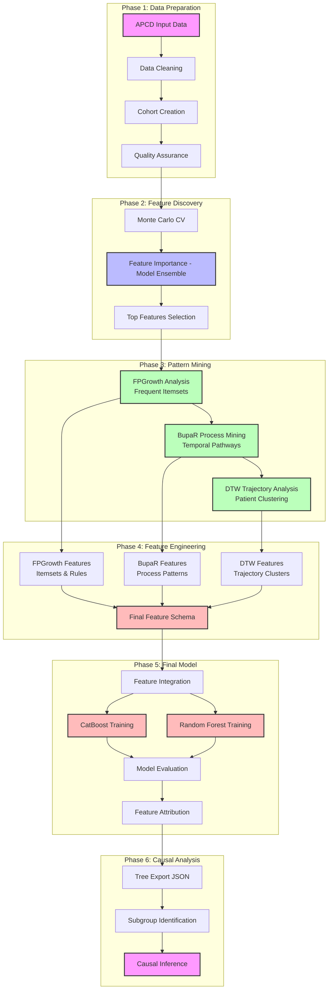

# Prescription Drug Analysis with FpGrowth, BupaR and CatBoost Integration

End-to-end workflow for feature discovery, noise reduction, and causal-oriented modeling using drug exposures, ICD/CPT codes, and classification outcomes.

## 📚 Documentation

This project is organized into four main sections:

1. **[Overview](README_overview.md)** - Project structure, components, and high-level workflow
2. **[Data Pipeline](README_data_pipeline.md)** - Data processing, cohort creation, and data flow
3. **[Analysis Workflow](README_analysis_workflow.md)** - Feature importance, pattern mining, and final model development
4. **[Data Visualizations](README_data_visualizations.md)** - Visualization approaches, interpretation, and network analysis

## Quick Start

```bash
# Install dependencies
pip install -r requirements.txt

# Configure AWS credentials for S3 access
aws configure
```

## Repository Structure

```
pgx-analysis/
├── 1_apcd_input_data/          # Data preprocessing and cleaning
├── 2_create_cohort/            # Cohort creation and QA
├── 3_feature_importance/       # MC-CV feature importance analysis
├── 4_fpgrowth_analysis/        # Frequent pattern mining
├── 5_bupaR_analysis/           # Process mining
├── 6_dtw_analysis/             # Trajectory analysis
├── 7_final_model/              # Final model development
├── 8_ffa_analysis/             # Feature attribution analysis
├── helpers_1997_13/            # Utility functions
└── docs/                       # Documentation
```

## High-Level Workflow



## Key Features

- **Feature Screening** with a focused model ensemble (CatBoost, XGBoost boosted trees, XGBoost RF mode) + Monte Carlo cross-validation
- **Structure Discovery** and noise reduction with FP-Growth, process mining (BupaR), and dynamic time warping (DTW)
- **Final Model Development** combining features from all analysis methods for prediction and causal inference

## Related Documentation

- [`docs/README_create_cohort.md`](docs/README_create_cohort.md) - Comprehensive cohort creation guide
- [`docs/README_feature_importance.md`](docs/README_feature_importance.md) - Feature importance analysis
- [`docs/README_fpgrowth.md`](docs/README_fpgrowth.md) - FP-Growth pattern mining
- [`docs/README_bupaR.md`](docs/README_bupaR.md) - Process mining with BupaR
- [`docs/README_dtw_feature_extraction.md`](docs/README_dtw_feature_extraction.md) - DTW trajectory analysis
