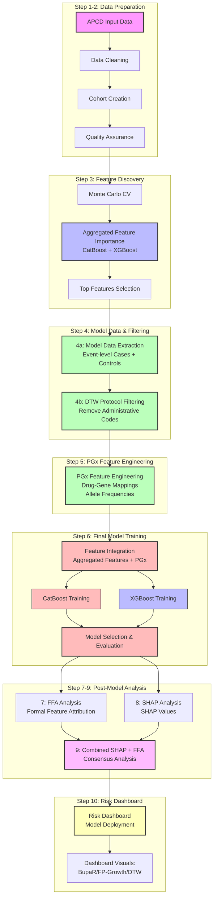

# Prescription Drug Analysis with FpGrowth, BupaR and CatBoost Integration

End-to-end workflow for feature discovery, noise reduction, and causal-oriented modeling using drug exposures, ICD/CPT codes, and classification outcomes.

## 📚 Documentation

This project is organized into four main sections:

1. **[Overview](docs/README_overview.md)** - Project structure, components, and high-level workflow
2. **[Data Pipeline](README_data_pipeline.md)** - Data processing, cohort creation, and data flow
3. **[Analysis Workflow](docs/README_analysis_workflow.md)** - Feature importance, pattern mining, and final model development
4. **[Data Visualizations](README_data_visualizations.md)** - Visualization approaches, interpretation, and network analysis

## Quick Start

```bash
# Install dependencies
pip install -r requirements.txt

# Configure AWS credentials for S3 access
aws configure
```

## Repository Structure

```
pgx-analysis/
├── 1_apcd_input_data/          # Step 1: APCD data preprocessing (bronze → silver → gold)
├── 2_create_cohort/            # Step 2: Cohort creation and QA
├── 3_feature_importance/       # Step 3: MC-CV feature importance (aggregated importances)
├── 4a_model_data/              # Step 4a: Model-ready event datasets (cases + controls)
├── 4b_dtw_filter/              # Step 4b: DTW protocol filtering (administrative codes)
├── 5_pgx_analysis/            # Step 5: PGx feature engineering
├── 6_final_model_selection/    # Step 6: Final model selection and evaluation
├── 7_ffa_analysis/             # Step 7: Formal Feature Attribution (FFA) analysis
├── 8_shap_analysis/            # Step 8: SHAP-based post-model analysis
├── 9_combined_shap_ffa/        # Step 9: Combined SHAP + FFA consensus analysis
├── 10_risk_dashboard/          # Step 10: Risk dashboard (includes BupaR/FP-Growth/DTW visuals)
├── utility_scripts/            # Workflow execution scripts (run_cohort_workflow.sh)
├── py_helpers/                 # Shared Python helper utilities
├── r_helpers/                  # Shared R helper utilities
└── docs/                       # Documentation
```

## High-Level Workflow


```mermaid
flowchart TD
    subgraph "Step 1-2: Data Preparation"
        A1[APCD Input Data] --> A2[Data Cleaning]
        A2 --> A3[Cohort Creation]
        A3 --> A4[Quality Assurance]
    end
    
    subgraph "Step 3: Feature Discovery"
        A4 --> B1[Monte Carlo CV]
        B1 --> B2[Aggregated Feature Importance<br/>CatBoost + XGBoost]
        B2 --> B3[Top Features Selection]
    end
    
    subgraph "Step 4: Model Data & Filtering"
        B3 --> C1[4a: Model Data Extraction<br/>Event-level Cases + Controls]
        C1 --> C2[4b: DTW Protocol Filtering<br/>Remove Administrative Codes]
    end
    
    subgraph "Step 5: PGx Feature Engineering"
        C2 --> D1[PGx Feature Engineering<br/>Drug-Gene Mappings<br/>Allele Frequencies]
    end
    
    subgraph "Step 6: Final Model Training"
        D1 --> E1[Feature Integration<br/>Aggregated Features + PGx]
        E1 --> E2[CatBoost Training]
        E1 --> E3[XGBoost Training]
        E2 --> E4[Model Selection & Evaluation]
        E3 --> E4
    end
    
    subgraph "Step 7-9: Post-Model Analysis"
        E4 --> F1[7: FFA Analysis<br/>Formal Feature Attribution]
        E4 --> F2[8: SHAP Analysis<br/>SHAP Values]
        F1 --> F3[9: Combined SHAP + FFA<br/>Consensus Analysis]
        F2 --> F3
    end
    
    subgraph "Step 10: Risk Dashboard"
        F3 --> G1[Risk Dashboard<br/>Model Deployment]
        G1 --> G2[Dashboard Visuals:<br/>BupaR/FP-Growth/DTW]
    end
    
    style A1 fill:#f9f,stroke:#333,stroke-width:2px
    style B2 fill:#bbf,stroke:#333,stroke-width:2px
    style C1 fill:#bfb,stroke:#333,stroke-width:2px
    style C2 fill:#bfb,stroke:#333,stroke-width:2px
    style D1 fill:#bfb,stroke:#333,stroke-width:2px
    style E1 fill:#fbb,stroke:#333,stroke-width:2px
    style E2 fill:#fbb,stroke:#333,stroke-width:2px    %% CatBoost
    style E3 fill:#bbf,stroke:#333,stroke-width:2px    %% XGBoost
    style E4 fill:#fbb,stroke:#333,stroke-width:2px
    style F3 fill:#fbf,stroke:#333,stroke-width:2px
    style G1 fill:#ffb,stroke:#333,stroke-width:2px
```

## Key Features

- **Feature Screening** with a focused model ensemble (CatBoost, XGBoost boosted trees, XGBoost RF mode) + Monte Carlo cross-validation
- **Structure Discovery** and noise reduction with FP-Growth, process mining (BupaR), and dynamic time warping (DTW)
- **Final Model Development** combining features from all analysis methods for prediction and causal inference

## Developer Conventions

- **Console output (cross‑platform)**: Avoid non‑ASCII characters (for example, unicode arrows like `→`) in Python/R scripts that may run on Windows consoles. Use plain ASCII (e.g. `->`) in `print()`/logging messages to prevent encoding errors under `cp1252` and similar code pages.

## Cohort Focus Strategy

Because full Monte Carlo CV + permutation importance is computationally intensive, the
project focuses the heaviest, publication-grade feature-importance analysis on two
clinically motivated cohort groups:

- **Cohort Group 1 – Opioid ED (`opioid_ed`)**  
  - Age bands: **\<65** (e.g., 0–12, 13–24, 25–44, 45–54, 55–64).  
  - Feature space: **drugs + ICD codes + CPT codes + event type**.  
  - Use case: detailed feature discovery for opioid-related ED visits and opioid use disorder.

- **Cohort Group 2 – Polypharmacy ED (`non_opioid_ed`)**  
  - Age bands: **≥65** (e.g., 65–74, 75–84, 85–94, 95–114).  
  - Feature space for MC‑CV feature importance: **drugs only** (polypharmacy focus), with
    downstream pattern mining and trajectory methods layering on additional structure.

Other cohort/age-band combinations can be explored with lighter configurations, but
publication-grade, health outcomes–oriented modeling is anchored on these two groups.

## Related Documentation

- `3_feature_importance/README.md` – Feature importance methodology and cohort configuration
- `4a_model_data/README_model_data.md` – Model-ready events and target vs control extraction (if present)
- DTW protocol filtering: `4b_dtw_filter/filter_protocol_events.py` and related scripts  
- `5_pgx_analysis/README.md` – Pharmacogenomics (PGx) feature engineering
- `status/WORKFLOW_STATUS.md` – Per-cohort workflow execution status and checkpoints
- `status/WORKFLOW_COMPLETE_SUMMARY.md` – High-level summary of workflow completion across cohorts and age bands