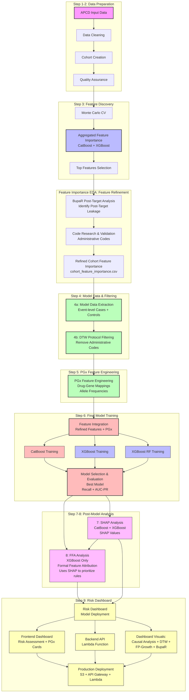

# Prescription Drug Analysis with FpGrowth, BupaR and CatBoost Integration

End-to-end workflow for feature discovery, noise reduction, and causal-oriented modeling using drug exposures, ICD/CPT codes, and classification outcomes.

## 📚 Documentation

This project is organized into four main sections:

1. **[Overview](docs/README_overview.md)** - Project structure, components, and high-level workflow
2. **[Data Pipeline](README_data_pipeline.md)** - Data processing, cohort creation, and data flow
3. **[Analysis Workflow](docs/README_analysis_workflow.md)** - Feature importance, pattern mining, and final model development
4. **[Data Visualizations](README_data_visualizations.md)** - Visualization approaches, interpretation, and network analysis

## Quick Start

```bash
# Install dependencies
pip install -r requirements.txt

# Configure AWS credentials for S3 access
aws configure
```

## Running the Workflow

The workflow can be run for individual cohorts or all cohorts at once. All scripts are idempotent and will automatically skip completed steps.

### Single Cohort/Age Band

Run the complete workflow for a single cohort and age band:

```bash
bash utility_scripts/run_cohort_workflow.sh <cohort_name> <age_band> [--skip-steps STEP1,STEP2]
```

**Examples:**
```bash
# Run opioid_ed 13-24
bash utility_scripts/run_cohort_workflow.sh opioid_ed 13-24

# Run non_opioid_ed 65-74
bash utility_scripts/run_cohort_workflow.sh non_opioid_ed 65-74

# Skip specific steps (e.g., skip step 5)
bash utility_scripts/run_cohort_workflow.sh opioid_ed 13-24 --skip-steps 5
```

### All Cohorts in a Group

**All Opioid ED cohorts:**
```bash
bash utility_scripts/run_opioid_ed_workflow.sh [--skip-steps STEP1,STEP2]
```
Runs: `13-24`, `25-44`, `45-54`, `55-64`

**All Non-Opioid ED cohorts:**
```bash
bash utility_scripts/run_non_opioid_ed_workflow.sh [--skip-steps STEP1,STEP2]
```
Runs: `65-74`, `75-84`, `85-94`

### All Cohorts (Both Groups)

```bash
bash utility_scripts/run_all_cohorts_workflow.sh [--skip-steps STEP1,STEP2]
```
Runs all cohorts and age bands sequentially.

### Available Cohorts and Age Bands

- **`opioid_ed`**: `13-24`, `25-44`, `45-54`, `55-64`
- **`non_opioid_ed`**: `65-74`, `75-84`, `85-94`

### Workflow Steps (Executed Automatically)

1. **Step 3**: Feature Importance (Monte Carlo CV) - Aggregated feature importances using CatBoost, XGBoost, and XGBoost RF
2. **Feature Importance EDA (3b)**: Feature refinement using BupaR post-target analysis to filter post-target leakage features from aggregated importances. Outputs refined `cohort_feature_importance.csv` files.
3. **Step 4a**: Model Data Creation (`model_events.parquet`) - Uses refined features from Feature Importance EDA (REQUIRED - no fallback to aggregated importances)
4. **Step 4b**: DTW Protocol Filtering - Removes administrative/protocol codes, creates `model_events_no_protocols.parquet`
5. **Step 5**: PGx Feature Engineering - Adds pharmacogenomics features
6. **Step 6**: Final Model Training - CatBoost, XGBoost, and XGBoost RF with model selection based on Recall (primary) and AUC-PR (secondary)
7. **Step 7**: SHAP Analysis - SHAP values for CatBoost and XGBoost
8. **Step 8**: FFA Analysis - Formal Feature Attribution for XGBoost only (uses SHAP from Step 7 to prioritize rules)
9. **Step 9**: Risk Dashboard - Production deployment with frontend dashboard, backend API (Lambda), and visualization tabs (Causal Analysis, DTW Trajectories, FP-Growth Patterns, BupaR Process Mining)

The scripts are idempotent and will skip completed steps automatically.

## Repository Structure

```
pgx-analysis/
├── 1_apcd_input_data/          # Step 1: APCD data preprocessing (bronze → silver → gold)
├── 2_create_cohort/            # Step 2: Cohort creation and QA
├── 3_feature_importance/       # Step 3: MC-CV feature importance (aggregated importances)
├── 3b_feature_importance_eda/  # Feature Importance EDA: Feature refinement (BupaR post-target analysis)
├── 4a_model_data/              # Step 4a: Model-ready event datasets (cases + controls)
├── 4b_dtw_filter/              # Step 4b: DTW protocol filtering (administrative codes)
├── 5_pgx_analysis/             # Step 5: PGx feature engineering
├── 6_final_model_selection/    # Step 6: Final model selection and evaluation
├── 7_shap_analysis/            # Step 7: SHAP-based post-model analysis (CatBoost + XGBoost)
├── 8_ffa_analysis/             # Step 8: Formal Feature Attribution (FFA) analysis (uses SHAP to prioritize rules)
├── 9_risk_dashboard/           # Step 9: Risk dashboard (includes BupaR/FP-Growth/DTW visuals)
├── utility_scripts/            # Workflow execution scripts (run_cohort_workflow.sh)
├── py_helpers/                 # Shared Python helper utilities
├── r_helpers/                  # Shared R helper utilities
└── docs/                       # Documentation
```

## High-Level Workflow


```mermaid
flowchart TD
    subgraph "Step 1-2: Data Preparation"
        A1[APCD Input Data] --> A2[Data Cleaning]
        A2 --> A3[Cohort Creation]
        A3 --> A4[Quality Assurance]
    end
    
    subgraph "Step 3: Feature Discovery"
        A4 --> B1[Monte Carlo CV]
        B1 --> B2[Aggregated Feature Importance<br/>CatBoost + XGBoost]
        B2 --> B3[Top Features Selection]
    end
    
    subgraph "Feature Importance EDA: Feature Refinement"
        B3 --> B4[BupaR Post-Target Analysis<br/>Identify Post-Target Leakage]
        B4 --> B5[Code Research & Validation<br/>Administrative Codes]
        B5 --> B6[Refined Cohort Feature Importance<br/>cohort_feature_importance.csv]
    end
    
    subgraph "Step 4: Model Data & Filtering"
        B6 --> C1[4a: Model Data Extraction<br/>Event-level Cases + Controls]
        C1 --> C2[4b: DTW Protocol Filtering<br/>Remove Administrative Codes]
    end
    
    subgraph "Step 5: PGx Feature Engineering"
        C2 --> D1[PGx Feature Engineering<br/>Drug-Gene Mappings<br/>Allele Frequencies]
    end
    
    subgraph "Step 6: Final Model Training"
        D1 --> E1[Feature Integration<br/>Refined Features + PGx]
        E1 --> E2[CatBoost Training]
        E1 --> E3[XGBoost Training]
        E1 --> E3a[XGBoost RF Training]
        E2 --> E4[Model Selection & Evaluation<br/>Best Model<br/>Recall + AUC-PR]
        E3 --> E4
        E3a --> E4
    end
    
    subgraph "Step 7-8: Post-Model Analysis"
        E4 --> F1[7: SHAP Analysis<br/>CatBoost + XGBoost<br/>SHAP Values]
        E4 --> F2[8: FFA Analysis<br/>XGBoost Only<br/>Formal Feature Attribution<br/>Uses SHAP to prioritize rules]
        F1 --> F2
    end
    
    subgraph "Step 9: Risk Dashboard"
        F2 --> G1[Risk Dashboard<br/>Model Deployment]
        F1 --> G1
        G1 --> G2[Frontend Dashboard<br/>Risk Assessment + PGx Cards]
        G1 --> G3[Backend API<br/>Lambda Function]
        G1 --> G4[Dashboard Visuals:<br/>Causal Analysis + DTW +<br/>FP-Growth + BupaR]
        G2 --> G5[Production Deployment<br/>S3 + API Gateway + Lambda]
        G3 --> G5
        G4 --> G5
    end
    
    style A1 fill:#f9f,stroke:#333,stroke-width:2px
    style B2 fill:#bbf,stroke:#333,stroke-width:2px
    style C1 fill:#bfb,stroke:#333,stroke-width:2px
    style C2 fill:#bfb,stroke:#333,stroke-width:2px
    style D1 fill:#bfb,stroke:#333,stroke-width:2px
    style E1 fill:#fbb,stroke:#333,stroke-width:2px
    style E2 fill:#fbb,stroke:#333,stroke-width:2px    %% CatBoost
    style E3 fill:#bbf,stroke:#333,stroke-width:2px    %% XGBoost
    style E3a fill:#bbf,stroke:#333,stroke-width:2px   %% XGBoost RF
    style E4 fill:#fbb,stroke:#333,stroke-width:2px
    style F1 fill:#fbf,stroke:#333,stroke-width:2px    %% SHAP Analysis
    style F2 fill:#fbf,stroke:#333,stroke-width:2px    %% FFA Analysis
    style G1 fill:#ffb,stroke:#333,stroke-width:2px    %% Risk Dashboard
    style G2 fill:#ffb,stroke:#333,stroke-width:2px    %% Frontend
    style G3 fill:#ffb,stroke:#333,stroke-width:2px    %% Backend
    style G4 fill:#ffb,stroke:#333,stroke-width:2px    %% Visualizations
    style G5 fill:#ffb,stroke:#333,stroke-width:2px    %% Deployment
```

## Key Features

- **Feature Screening** with a focused model ensemble (CatBoost, XGBoost boosted trees, XGBoost RF mode) + Monte Carlo cross-validation
- **Feature Refinement (Feature Importance EDA)** using BupaR post-target analysis to filter post-target leakage features from aggregated importances, producing refined `cohort_feature_importance.csv` files
- **Protocol Filtering** using DTW to identify and filter administrative/protocol codes (Step 4b), creating `model_events_no_protocols.parquet`
- **Structure Discovery** via FP-Growth, process mining (BupaR), and dynamic time warping (DTW) for dashboard visualizations only (Step 9 - not used as model features)
- **Final Model Development** combining refined feature importances (from Feature Importance EDA) with PGx features for prediction and causal inference
- **Model Selection** based on Recall (primary) and AUC-PR (secondary) metrics, selecting best model from CatBoost, XGBoost, or XGBoost RF

## Developer Conventions

- **Console output (cross‑platform)**: Avoid non‑ASCII characters (for example, unicode arrows like `→`) in Python/R scripts that may run on Windows consoles. Use plain ASCII (e.g. `->`) in `print()`/logging messages to prevent encoding errors under `cp1252` and similar code pages.

## Cohort Focus Strategy

Because full Monte Carlo CV + permutation importance is computationally intensive, the
project focuses the heaviest, publication-grade feature-importance analysis on two
clinically motivated cohort groups:

- **Cohort Group 1 – Opioid ED (`opioid_ed`)**  
  - Age bands: **\<65** (e.g., 0–12, 13–24, 25–44, 45–54, 55–64).  
  - Feature space: **drugs + ICD codes + CPT codes + event type**.  
  - Use case: detailed feature discovery for opioid-related ED visits and opioid use disorder.

- **Cohort Group 2 – Polypharmacy ED (`non_opioid_ed`)**  
  - Age bands: **≥65** (e.g., 65–74, 75–84, 85–94, 95–114).  
  - Feature space for MC‑CV feature importance: **drugs only** (polypharmacy focus), with
    downstream pattern mining and trajectory methods layering on additional structure.

Other cohort/age-band combinations can be explored with lighter configurations, but
publication-grade, health outcomes–oriented modeling is anchored on these two groups.

## Related Documentation

- `3_feature_importance/README.md` – Feature importance methodology and cohort configuration
- `4a_model_data/README_model_data.md` – Model-ready events and target vs control extraction (if present)
- DTW protocol filtering: `4b_dtw_filter/filter_protocol_events.py` and related scripts  
- `5_pgx_analysis/README.md` – Pharmacogenomics (PGx) feature engineering
- `status/WORKFLOW_STATUS.md` – Per-cohort workflow execution status and checkpoints
- `status/WORKFLOW_COMPLETE_SUMMARY.md` – High-level summary of workflow completion across cohorts and age bands