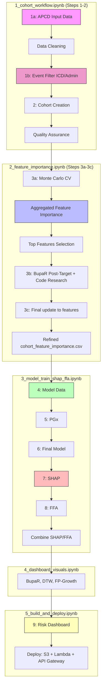

# Prescription Drug Analysis with FpGrowth, BupaR and CatBoost Integration

End-to-end workflow for feature discovery, noise reduction, and causal-oriented modeling using drug exposures, ICD/CPT codes, and classification outcomes.

## 📚 Documentation

This project is organized into four main sections:

1. **[Overview](docs/README_overview.md)** - Project structure, components, and high-level workflow
2. **[Data Pipeline](README_data_pipeline.md)** - Data processing, cohort creation, and data flow
3. **[Analysis Workflow](docs/README_analysis_workflow.md)** - Feature importance, pattern mining, and final model development
4. **[Data Visualizations](README_data_visualizations.md)** - Visualization approaches, interpretation, and network analysis

## Quick Start

```bash
# Install dependencies
pip install -r requirements.txt

# Configure AWS credentials for S3 access
aws configure
```

## Config and fresh start

**[0_config_and_pipeline.ipynb](0_config_and_pipeline.ipynb)** lets you clear EC2 NVMe and project pipeline output directories for a fresh run, and contains step-by-step **instructions for running the pipeline** (prerequisites, notebook order, cohorts). Use it to reset local/NVMe data and project outputs; S3 checkpoints are not cleared by default (see the notebook for an optional full reset).

## Running the Workflow

The **workflow notebooks** are the primary way to run the pipeline. They sync required inputs from S3 to local and use S3 checkpoints so steps are skipped when already completed. Run in order: **1_cohort_workflow.ipynb** → **2_feature_importance.ipynb** → **3_model_train_shap_ffa.ipynb** → **4_dashboard_visuals.ipynb** → **5_build_and_deploy.ipynb**.

Legacy shell scripts and the former combined notebooks (3, 4) are in **archived/**; use the five notebooks above.

### Available Cohorts and Age Bands

Both cohorts use the **full set of age bands**: `0-12`, `13-24`, `25-44`, `45-54`, `55-64`, `65-74`, `75-84`, `85-114` (last band 85-114 combines former 85-94 and 95-114).

- **`opioid_ed`**: Opioid ED cohort (F11.20 target) — all age bands above
- **`non_opioid_ed`**: Polypharmacy cohort (HCG ED target) — all age bands above

### Workflow Steps (Executed Automatically)

1. **Step 1a**: APCD input data (1a_apcd_input_data) – bronze → silver → gold.
2. **Step 1b**: Event filter (1b_apcd_event_filter) – Aggregated FI + ICD/administrative code filtering.
3. **Step 2**: Cohort creation (2_create_cohort) – 5:1 target:control cohorts.
4. **Step 3a**: Feature importance (3a_feature_importance) – MC-CV aggregated importances (CatBoost, XGBoost, XGBoost RF).
5. **Step 3b**: Feature Importance EDA (3b_feature_importance_eda) – BupaR post-target analysis, code research; outputs refined `cohort_feature_importance.csv`.
6. **Step 3c**: Final update to features (2_feature_importance.ipynb) – Strip remaining BupaR-identified leakage from `cohort_feature_importance.csv`; these CSVs are the only input to Step 4.
8. **Step 4**: Model data (4_model_data) – `model_events.parquet` from refined features; removes target leakage (events on/after target date) for case events.
9. **Step 5**: PGx feature engineering (5_pgx_analysis).
10. **Step 6**: Final model (6_final_model) – training and selection (Recall / AUC-PR).
11. **Step 7**: SHAP analysis (7_shap_analysis).
12. **Step 8**: FFA analysis (8_ffa_analysis) – XGBoost only, SHAP-prioritized rules.
13. **Step 9**: Risk dashboard (10_risk_dashboard) – deployment (Lambda, dashboard).

The scripts are idempotent and will skip completed steps automatically.

## Workflow Notebooks

The pipeline is split into five workflow notebooks. Run in order:

| Notebook | Purpose |
|----------|--------|
| **[1_cohort_workflow.ipynb](1_cohort_workflow.ipynb)** | Steps 1–2: Cohorts (APCD input, event filter, cohort creation). |
| **[2_feature_importance.ipynb](2_feature_importance.ipynb)** | Steps 3a–3c: Feature importance (3a MC-CV), EDA (3b BupaR), final feature update (3c). |
| **[3_model_train_shap_ffa.ipynb](3_model_train_shap_ffa.ipynb)** | Model data → PGx → final model → SHAP/FFA → combine. No deploy. |
| **[4_dashboard_visuals.ipynb](4_dashboard_visuals.ipynb)** | Dashboard visuals: BupaR, DTW, FP-Growth (SHAP/FFA-driven). |
| **[5_build_and_deploy.ipynb](5_build_and_deploy.ipynb)** | Build and deploy: Lambda dir → Docker → ECR → Lambda → S3 frontend. Run once. |

**ICD filtering moved earlier:** Administrative/ICD code filtering runs in **1b_apcd_event_filter** (before cohort creation). That reduces downstream data volume and ensures feature importance (Step 3a/3b) is computed on the same filtered event set, capturing true predictive features. After moving ICD filtering earlier, feature importances must be rerun once cohorts are rebuilt.

## Repository Structure

```
pgx-analysis/
├── 1a_apcd_input_data/         # Step 1a: APCD data preprocessing (bronze → silver → gold)
├── 1b_apcd_event_filter/       # Step 1b: Event filtering (ICD/administrative codes; runs before cohorts)
├── 2_create_cohort/            # Step 2: Cohort creation and QA (5:1 target:control)
├── 3a_feature_importance/     # Step 3a: MC-CV feature importance (aggregated importances)
├── 3b_feature_importance_eda/ # Step 3b: Feature refinement (BupaR post-target, code research)
├── 4_model_data/               # Step 4: Model-ready event datasets (cases + controls)
├── 5_pgx_analysis/            # Step 5: PGx feature engineering
├── 6_final_model/             # Step 6: Final model training and selection
├── 7_shap_analysis/            # Step 7: SHAP post-model analysis (CatBoost + XGBoost)
├── 8_ffa_analysis/             # Step 8: Formal Feature Attribution (uses SHAP to prioritize rules)
├── 10_risk_dashboard/           # Step 9: Risk dashboard deployment (Lambda, dashboard UI)
├── 0_config_and_pipeline.ipynb # Config: clear NVMe/project dirs, pipeline run instructions
├── 1_cohort_workflow.ipynb     # Workflow notebook: Steps 1–2 (cohorts)
├── 2_feature_importance.ipynb # Workflow notebook: Steps 3a–3c (feature importance + final feature update)
├── 3_model_train_shap_ffa.ipynb    # Workflow: model data, PGx, final model, SHAP/FFA
├── 4_dashboard_visuals.ipynb       # Workflow: BupaR, DTW, FP-Growth visuals
├── 5_build_and_deploy.ipynb       # Workflow: build and deploy (Lambda, S3)
├── archived/                   # Legacy notebooks (3, 4) and scripts (see archived/README.md if present)
│   ├── 3_pgx_calculator_workflow.ipynb
│   ├── 4_pgx_dashboard_visuals.ipynb
│   ├── utility_scripts/        # Old workflow shell scripts
│   ├── qa/                     # Check/validate/clear/diagnose scripts
│   └── testing/                # Test scripts
├── py_helpers/                 # Shared Python helper utilities
├── r_helpers/                  # Shared R helper utilities
└── docs/                       # Documentation
```

## High-Level Workflow

**Execution model:** Each workflow notebook syncs required inputs from **S3 to NVMe** (or local) via `aws s3 sync` (idempotent) and uses **S3 checkpoints** so steps are skipped when already completed. Run order: **1** → **2** → **3** → **4** → **5**.


```mermaid
flowchart TD
    subgraph W1["1_cohort_workflow.ipynb (Steps 1-2)"]
        A1[1a: APCD Input Data] --> A2[Data Cleaning]
        A2 --> A1b[1b: Event Filter ICD/Admin]
        A1b --> A3[2: Cohort Creation]
        A3 --> A4[Quality Assurance]
    end

    subgraph W2["2_feature_importance.ipynb (Steps 3a-3c)"]
        A4 --> B1[3a: Monte Carlo CV]
        B1 --> B2[Aggregated Feature Importance]
        B2 --> B3[Top Features Selection]
        B3 --> B4[3b: BupaR Post-Target + Code Research]
        B4 --> B5[3c: Final update to features]
        B5 --> B6[Refined cohort_feature_importance.csv]
    end

    subgraph W3["3_model_train_shap_ffa.ipynb"]
        B6 --> C1[4: Model Data]
        C1 --> D1[5: PGx]
        D1 --> E1[6: Final Model]
        E1 --> E4[7: SHAP]
        E4 --> F2[8: FFA]
        F2 --> F1[Combine SHAP/FFA]
    end

    subgraph W4["4_dashboard_visuals.ipynb"]
        F1 --> G0[BupaR, DTW, FP-Growth]
    end

    subgraph W5["5_build_and_deploy.ipynb"]
        G0 --> G1[9: Risk Dashboard]
        G1 --> G5[Deploy: S3 + Lambda + API Gateway]
    end

    style A1 fill:#f9f,stroke:#333
    style A1b fill:#e9c,stroke:#333
    style B2 fill:#bbf,stroke:#333
    style C1 fill:#bfb,stroke:#333
    style E4 fill:#fbb,stroke:#333
    style G1 fill:#ffb,stroke:#333
```

## Key Features

- **Feature Screening** with a focused model ensemble (CatBoost, XGBoost boosted trees, XGBoost RF mode) + Monte Carlo cross-validation
- **Feature Refinement (Feature Importance EDA)** using BupaR post-target analysis; Step 4 removes target leakage when building model data
- **Event filtering (Step 1b)** – Aggregated FI + ICD/administrative code filtering (1b_apcd_event_filter)
- **Structure Discovery** via FP-Growth, process mining (BupaR), and dynamic time warping (DTW) for dashboard visualizations only (Step 9 - not used as model features)
- **Final Model Development** combining refined feature importances (from Feature Importance EDA) with PGx features for prediction and causal inference
- **Model Selection** based on Recall (primary) and AUC-PR (secondary) metrics, selecting best model from CatBoost, XGBoost, or XGBoost RF

## Developer Conventions

- **Console output (cross‑platform)**: Avoid non‑ASCII characters (for example, unicode arrows like `→`) in Python/R scripts that may run on Windows consoles. Use plain ASCII (e.g. `->`) in `print()`/logging messages to prevent encoding errors under `cp1252` and similar code pages.

## Cohort Focus Strategy

Because full Monte Carlo CV + permutation importance is computationally intensive, the
project focuses the heaviest, publication-grade feature-importance analysis on two
clinically motivated cohort groups:

- **Cohort Group 1 – Opioid ED (`opioid_ed`)**  
  - Age bands: **\<65** (e.g., 0–12, 13–24, 25–44, 45–54, 55–64).  
  - Feature space: **drugs + ICD codes + CPT codes + event type**.  
  - Use case: detailed feature discovery for opioid-related ED visits and opioid use disorder.

- **Cohort Group 2 – Polypharmacy ED (`non_opioid_ed`)**  
  - Age bands: **≥65** (e.g., 65–74, 75–84, 85–94, 95–114).  
  - Feature space for MC‑CV feature importance: **drugs only** (polypharmacy focus), with
    downstream pattern mining and trajectory methods layering on additional structure.

Other cohort/age-band combinations can be explored with lighter configurations, but
publication-grade, health outcomes–oriented modeling is anchored on these two groups.

## Related Documentation

- `3a_feature_importance/README.md` – Feature importance methodology and cohort configuration
- `4_model_data/README_model_data.md` – Model-ready events and target vs control extraction
- Event filtering: `1b_apcd_event_filter/filter_protocol_events.py` – Aggregated FI + ICD/administrative codes
- `6_final_model/README.md` – Final model training and selection
- `5_pgx_analysis/README.md` – Pharmacogenomics (PGx) feature engineering
- `status/WORKFLOW_STATUS.md` – Per-cohort workflow execution status and checkpoints
- `status/WORKFLOW_COMPLETE_SUMMARY.md` – High-level summary of workflow completion across cohorts and age bands