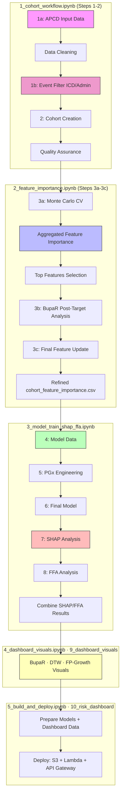

# Opioid and Polypharmacy ED Risk Prediction: XGBoost · CatBoost · DTW · FP-Growth · BupaR · Formal Feature Attribution

End-to-end machine learning pipeline predicting opioid-related and polypharmacy/geriatric ED events — from APCD cohort creation through ensemble model training, causal feature attribution, temporal trajectory analysis, and serverless clinical decision support.

**Combines XGBoost/CatBoost ensemble modeling, SHAP analysis, Formal Feature Attribution (FFA), Dynamic Time Warping (DTW) trajectory clustering, FP-Growth pattern mining, and BupaR process mining on large-scale healthcare claims data (Virginia APCD). Pharmacogenomic (PGx) features are incorporated as causal inputs to explain drug-drug interaction and gene-drug interaction contributions to ED event risk.**

---

## 📋 Quick Start

```bash
# Install dependencies
pip install -r requirements.txt

# Configure AWS credentials for S3 access
aws configure

# (Optional) Clear NVMe and project outputs for fresh run
# See 0_config_and_pipeline.ipynb for full instructions
```

## 🌐 Live Dashboard

**[https://jerome-dixon.io/vcu/pgx-risk-calculator/index.html](https://jerome-dixon.io/vcu/pgx-risk-calculator/index.html)**

Hosted on S3 + CloudFront. See [`10_risk_dashboard/`](10_risk_dashboard/) for deployment details.

---

## 📄 Manuscripts Under Review — CTS

All five dissertation chapters submitted to [*Clinical and Translational Science*](https://ascpt.onlinelibrary.wiley.com/journal/17528062) (Wiley/ASCPT). Submission portal: [cts.msubmit.net](https://cts.msubmit.net/cgi-bin/main.plex). CTS guidelines and revision tracking: [`manuscript/docs/cts/`](manuscript/docs/cts/).

| CH | CTS Manuscript ID | Title | Repo Steps | Status |
|---|---|---|---|---|
| **CH_1** | CTS-2026-0255-T | [Bridging Explainable AI and Pharmacogenomics for Opioid and Polypharmacy Risk Prediction: A Systematic Quantitative Literature Review](manuscript/CH_1/ch01_cts.qmd) | Background / Methodology Foundation | Under Review |
| **CH_2** | CTS-2026-0235-T | [Building the Clinical OODA Loop: A Partition-First Data Architecture for Model-Based Precision Analytics](manuscript/CH_2/ch02_psp.qmd) | Steps 1a → 1b → 2 | Under Review |
| **CH_3** | CTS-2026-0196 | [Causal Temporal Drivers of Opioid-Related ED Visits: An Ensemble Machine Learning Study with Consensus-Based Feature Attribution](manuscript/CH_3/ch03_cts.qmd) | Steps 3a → 3b → 6 → 7 → 8 | **Revision R1** — all items resolved May 18, 2026 |
| **CH_4** | CTS-2026-0197 | [Formal Feature Attribution as a Causal Calculator for Drug-Drug Interaction Risk in Polypharmacy](manuscript/CH_4/ch04_psp.qmd) | Steps 5 → 8 | Under Review |
| **CH_5** | CTS-2026-0230-T | [A Serverless Pharmacogenomic Risk Dashboard: Translating Ensemble Models and Causal Rules to Clinical Decision Support](manuscript/CH_5/ch05_cpt.qmd) | Steps 9 → 10 | Under Review |

> Code availability statement in each manuscript references this repository: `https://github.com/Jerome3590/pgx-analysis`

---

## 🚀 Running the Workflow

**Configuration and Execution:**
1. **[0_config_and_pipeline.ipynb](0_config_and_pipeline.ipynb)** - Configure EC2/local setup, clear project outputs, review prerequisites and notebook order

**Five workflow notebooks (run in order):**

| # | Notebook | Purpose | Steps |
|---|----------|---------|-------|
| 1 | **[1_cohort_workflow.ipynb](1_cohort_workflow.ipynb)** | Cohort creation (APCD input, event filtering, QA) | 1a → 1b → 2 |
| 2 | **[2_feature_importance.ipynb](2_feature_importance.ipynb)** | Feature importance screening and refinement | 3a → 3b → 3c |
| 3 | **[3_model_train_shap_ffa.ipynb](3_model_train_shap_ffa.ipynb)** | Model training, feature attribution, analysis | 4 → 5 → 6 → 7 → 8 |
| 4 | **[4_dashboard_visuals.ipynb](4_dashboard_visuals.ipynb)** | Dashboard visualizations (BupaR, DTW, FP-Growth) | 9 (visuals) |
| 5 | **[5_build_and_deploy.ipynb](5_build_and_deploy.ipynb)** | Build and deploy (Lambda, Docker, S3) | 10 (deploy) |

**Execution Model**: Each notebook syncs required inputs from **S3 to NVMe** via `aws s3 sync` and uses **S3 checkpoints** for idempotency, so completed steps are skipped automatically.

---

## 📊 Workflow Pipeline


```mermaid
flowchart TD
    subgraph W1["1_cohort_workflow.ipynb (Steps 1-2)"]
        A1[1a: APCD Input Data] --> A2[Data Cleaning]
        A2 --> A1b[1b: Event Filter ICD/Admin]
        A1b --> A3[2: Cohort Creation]
        A3 --> A4[Quality Assurance]
    end

    subgraph W2["2_feature_importance.ipynb (Steps 3a-3c)"]
        A4 --> B1[3a: Monte Carlo CV]
        B1 --> B2[Aggregated Feature Importance]
        B2 --> B3[Top Features Selection]
        B3 --> B4[3b: BupaR Post-Target Analysis]
        B4 --> B5[3c: Final Feature Update]
        B5 --> B6[Refined cohort_feature_importance.csv]
    end

    subgraph W3["3_model_train_shap_ffa.ipynb"]
        B6 --> C1[4: Model Data]
        C1 --> D1[5: PGx Engineering]
        D1 --> E1[6: Final Model]
        E1 --> E4[7: SHAP Analysis]
        E4 --> F2[8: FFA Analysis]
        F2 --> F1[Combine SHAP/FFA Results]
    end

    subgraph W4["4_dashboard_visuals.ipynb · 9_dashboard_visuals"]
        F1 --> G0[BupaR · DTW · FP-Growth Visuals]
    end

    subgraph W5["5_build_and_deploy.ipynb · 10_risk_dashboard"]
        G0 --> G1[Prepare Models + Dashboard Data]
        G1 --> G5[Deploy: S3 + Lambda + API Gateway]
    end

    style A1 fill:#f9f,stroke:#333
    style A1b fill:#e9c,stroke:#333
    style B2 fill:#bbf,stroke:#333
    style C1 fill:#bfb,stroke:#333
    style E4 fill:#fbb,stroke:#333
    style G0 fill:#ffb,stroke:#333
```

---

## 📂 Repository Structure

```
pgx-analysis/
├── 1a_apcd_input_data/           # Step 1a: APCD data preprocessing (bronze → silver → gold)
├── 1b_apcd_event_filter/         # Step 1b: Event filtering (ICD/admin codes; runs before cohorts)
├── 2_create_cohort/              # Step 2: Cohort creation and quality assurance (5:1 target:control)
├── 3a_feature_importance/        # Step 3a: MC-CV feature importance screening
├── 3b_feature_importance_eda/    # Step 3b: Feature refinement (BupaR post-target, code research)
├── 4_model_data/                 # Step 4: Model-ready event datasets (target vs control)
├── 5_pgx_analysis/               # Step 5: Pharmacogenomics (PGx) feature engineering
├── 6_final_model/                # Step 6: Final model training and evaluation
├── 7_shap_analysis/              # Step 7: SHAP-based post-model analysis
├── 8_ffa_analysis/               # Step 8: Formal Feature Attribution (FFA) analysis
├── 9_dashboard_visuals/          # Step 9 (visual prep): BupaR, DTW, FP-Growth visualization generation
├── 10_risk_dashboard/            # Step 10 (build/deploy): Risk calculator, Lambda, API Gateway
├── 11_testing/                   # Integration and smoke tests for pipeline steps and dashboard visuals
├── aws-pgx-setup/                # AWS infrastructure config (EC2, Lambda, ECR, IAM, CloudFront, S3)
├── pgx-patient-card/             # PGx patient card assets (drug cards, gene cards)
├── py_helpers/                   # Shared Python utilities (S3, DuckDB, logging)
├── r_helpers/                    # Shared R utilities
├── utility_scripts/              # Pipeline management: cleanup, status checks, S3 sync helpers
├── status/                       # Workflow status tracking (WORKFLOW_STATUS.md)
├── docs/                         # Comprehensive documentation
├── 0_config_and_pipeline.ipynb   # Configuration and pipeline run instructions
├── 1_cohort_workflow.ipynb       # Workflow: Steps 1–2
├── 2_feature_importance.ipynb    # Workflow: Steps 3a–3c
├── 3_model_train_shap_ffa.ipynb  # Workflow: Steps 4–8 + combine
├── 4_dashboard_visuals.ipynb     # Workflow: Dashboard visualizations
├── 5_build_and_deploy.ipynb      # Workflow: Build and deploy
├── README.md                     # This file
├── README_execution_workflow.md  # Detailed pipeline execution guide (phases, prerequisites)
├── README_dashboard_visuals.md   # Dashboard visual artifact path mapping
└── requirements.txt              # Python dependencies
```

---

## 🎯 Workflow Steps (10 Steps Total)

### Step 1a: APCD Input Data Processing
- **Location:** `1a_apcd_input_data/`
- Convert raw text data to Parquet format
- Clean and standardize medical and pharmacy data
- Apply drug name and ICD code mappings
- **Output:** Bronze/Silver/Gold tier data
- **Manuscript:** CH_2 — CTS-2026-0235-T · *Building the Clinical OODA Loop: A Partition-First Data Architecture for Model-Based Precision Analytics*

### Step 1b: Event Filtering (ICD/Administrative Codes)
- **Location:** `1b_apcd_event_filter/`
- Filter events using administrative codes and aggregated FI
- Removes post-event leakage and protocol violations
- **Runs before cohort creation** to reduce downstream data volume
- **Output:** Filtered event set used by Steps 2 and 3a
- **Manuscript:** CH_2 — CTS-2026-0235-T · *Building the Clinical OODA Loop*

### Step 2: Cohort Creation
- **Location:** `2_create_cohort/`
- Create target and control cohorts with 5:1 ratio
- Apply age band stratification
- Comprehensive quality assurance and validation
- **Output:** `cohort_{cohort_name}_ageband_{band}.parquet` for each cohort/age band
- **Manuscript:** CH_2 — CTS-2026-0235-T · *Building the Clinical OODA Loop*

### Step 3a: Feature Importance Screening
- **Location:** `3a_feature_importance/`
- Monte Carlo cross-validation with three models:
  - **CatBoost** - Gradient boosting with categorical features
  - **XGBoost** - Gradient boosting with trees
  - **XGBoost RF Mode** - Random forest-style boosting
- Aggregate importance scores across models and folds
- **Output:** `aggregated_feature_importance.csv`
- **Manuscript:** CH_3 — CTS-2026-0196 · *Causal Temporal Drivers of Opioid-Related ED Visits*

### Step 3b: Feature Importance EDA & Refinement
- **Location:** `3b_feature_importance_eda/`
- BupaR post-target analysis to identify target leakage
- Code research and clinical validation
- Refine feature set based on findings
- **Output:** `cohort_feature_importance.csv` (refined)
- **Manuscript:** CH_3 — CTS-2026-0196 · *Causal Temporal Drivers of Opioid-Related ED Visits*

### Step 3c: Final Feature Update
- **Part of:** `2_feature_importance.ipynb`
- Strip remaining leakage-identified features
- Final QA on refined feature set
- This CSV is the only input to Step 4
- **Output:** Final `cohort_feature_importance.csv`

### Step 4: Model Data Preparation
- **Location:** `4_model_data/`
- Extract model-ready event dataset
- Remove target leakage (events on/after target date for cases)
- Create balanced target/control sets
- **Output:** `model_events.parquet`

### Step 5: PGx Feature Engineering
- **Location:** `5_pgx_analysis/`
- Pharmacogenomics feature engineering
- Add PGx derivatives and interactions
- **Output:** `pgx_added_features.csv`
- **Manuscript:** CH_4 — CTS-2026-0197 · *Formal Feature Attribution as a Causal Calculator for Drug-Drug Interaction Risk in Polypharmacy*

### Step 6: Final Model Training
- **Location:** `6_final_model/`
- Train four candidates: XGBoost, XGBoost RF, CatBoost, and Ensemble (probability average of XGB + CatBoost)
- **Selection:** Primary: PR-AUC mean (imbalanced-class safe); Secondary: Recall mean — Ensemble eligible
- SHAP analysis always uses XGBoost + CatBoost binaries; FFA always uses best XGBoost variant (`xgb` or `xgb_rf`)
- Per-bin models (low / medium / high / extreme event density) trained separately via `train_per_bin()`
- **Output:** `{model}.joblib`, `model_metrics_summary.csv`, `model_selection_metadata.json`
- **Manuscript:** CH_3 — CTS-2026-0196 · *Causal Temporal Drivers of Opioid-Related ED Visits*

### Step 7: SHAP Analysis
- **Location:** `7_shap_analysis/`
- Compute global and local SHAP values using XGBoost and CatBoost native binaries (fixed regardless of selected model)
- Identify most important features and their directional impacts
- **Output:** `{cohort}_{ab}_shap_global_importance_{model}.csv`, `{cohort}_{ab}_shap_sample_values_{model}.parquet`
- **Manuscript:** CH_3 — CTS-2026-0196 · *Causal Temporal Drivers of Opioid-Related ED Visits*

### Step 8: Formal Feature Attribution (FFA) Analysis
- **Location:** `8_ffa_analysis/`
- Generate symbolic rule explanations using best XGBoost variant (`xgb` or `xgb_rf`, from `model_selection_metadata.json`)
- SHAP-based filtering and prioritization of rules; CatBoost run separately for cross-validation
- Compute feature attribution and causal importance scores
- **Output:** `causal_importance.parquet`, `feature_importance_axp.parquet`, `interaction_analysis.parquet`
- **Manuscripts:** CH_3 — CTS-2026-0196 · *Causal Temporal Drivers* · and CH_4 — CTS-2026-0197 · *Formal Feature Attribution as a Causal Calculator for Drug-Drug Interaction Risk in Polypharmacy*

### Steps 9–10: Risk Dashboard
- **Step 9 / Notebook 4 — Visual prep** (`9_dashboard_visuals/`): Generate BupaR process mining, DTW trajectory, and FP-Growth visualizations; combine SHAP + FFA results into `combined_importance.csv`
- **Step 10 / Notebook 5 — Build & deploy** (`10_risk_dashboard/`): Prepare models and metadata for Lambda; build Docker container; deploy S3 frontend + Lambda + API Gateway
- **Output:** Visualization artifacts in S3, Lambda ECR container, live API endpoints
- **Manuscript:** CH_5 — CTS-2026-0230-T · *A Serverless Pharmacogenomic Risk Dashboard: Translating Ensemble Models and Causal Rules to Clinical Decision Support*

---

## 👥 Cohorts and Age Bands

### Opioid ED Cohort (`opioid_ed`)
- **Target:** F11.20 (Opioid use disorder with intoxication)
- **Analysis Focus:** Feature discovery for opioid-related ED visits
- **Age Bands Modeled:** 0–12, 13–24, 25–44, 45–54, 55–64 (and full range available: 65–74, 75–84, 85–114)

### Polypharmacy/Non-Opioid ED Cohort (`non_opioid_ed`)
- **Target:** HCG condition ED visit (high-cost/geriatric ED)
- **Analysis Focus:** Polypharmacy patterns in elderly patients
- **Age Bands Modeled:** 65–74, 75–84, 85–114 (and available: 0–12, 13–24, 25–44, 45–54, 55–64)

**Full Age Band Range:** 0–12, 13–24, 25–44, 45–54, 55–64, 65–74, 75–84, 85–114

For each `(cohort, age_band)` combination, the pipeline runs:
- MC-CV feature importance (Step 3a)
- Feature refinement (Step 3b)
- Model-ready event extraction (Step 4)
- PGx feature engineering (Step 5)
- Final model training (Step 6) — trains **four per-bin models** (low / medium / high / extreme event density), each with Optuna tuning and Platt calibration
- SHAP analysis (Step 7) — run per bin for both XGBoost and CatBoost
- FFA analysis (Step 8) — run per bin for XGBoost
- **4 models produced per cohort/age-band** (one per event density bin: low, medium, high, extreme); Lambda inference is per-bin only with no full-cohort fallback

> **Why per-bin models?** Patients with very few events (low density) vs. highly active patients (extreme density) have fundamentally different clinical profiles and feature distributions. A single full-cohort model is pulled toward the dominant density group and underperforms on the tails. Stratifying by event density allows each model to tune its hyperparameters, calibration, and decision boundary to patients with similar activity levels — improving PR-AUC especially for the minority class in imbalanced bins.

---

## 🔧 Key Project Components

### Core Analysis Modules

**1a_apcd_input_data: APCD Data Processing**
- `0_txt_to_parquet.py` - Convert text to Parquet
- `3_apcd_clean.py` - Main cleaning pipeline
- `drug_mappings/` - Drug standardization (A-Z drugs + medical supplies)
- `claim_mappings/` - ICD code mappings and classifications

**2_create_cohort: Cohort Creation**
- `0_create_cohort.py` - Orchestration and execution
- `2_step2_data_quality_qa.py` - QA and validation
- `phases/` - Individual phase implementations
- `table_mappings/` - Mapping configurations

**3a_feature_importance: Feature Screening**
- Three core models: **CatBoost, XGBoost, XGBoost RF**
- MC-CV aggregation for robust importance ranking
- Ensemble consensus approach for final feature selection

**3b_feature_importance_eda: Feature Refinement**
- BupaR post-target analysis for target leakage detection
- Code research and clinical validation
- Produces refined CSV for Steps 4+

**5_pgx_analysis: Pharmacogenomics**
- Feature engineering with PGx derivatives
- Genetic-drug interaction modeling
- Produces PGx feature additions

**6_final_model: Model Development**
- Four candidates: XGBoost, XGBoost RF, CatBoost, Ensemble (probability average)
- Model selection: Primary PR-AUC mean, Secondary Recall mean — Ensemble eligible
- Per-bin models (low / medium / high / extreme) trained separately for Lambda inference
- **One selected model per cohort/age-band; all component models deployed for weighted Lambda ensemble**

**7_shap_analysis: SHAP Post-Model**
- Global and local SHAP values
- Feature importance and impact quantification
- Used to prioritize rules in Step 8

**8_ffa_analysis: Formal Feature Attribution**
- Rule-based explanations using final model
- SHAP-filtered rule selection
- Produces interpretable explanation rules

**10_risk_dashboard: Dashboard & Deployment**
- Frontend: Interactive HTML dashboard
- Backend: Lambda function for risk calculation
- Visualizations: BupaR, DTW, FP-Growth
- Deployment: Docker, ECR, API Gateway

### Shared Utilities
- `py_helpers/` - S3, DuckDB, logging, constants
- `r_helpers/` - R-based utilities

---

## 💾 Data and Variables

- **Unit of Analysis:** Patient-episode or encounter
- **Outcome (Y):** Binary classification (e.g., opioid disorder, ED visit)
- **Treatments (A):** Drug exposure indicators
- **Covariates (X):**
  - ICD diagnosis codes (grouped/rolled up)
  - CPT procedure codes
  - Demographics and baseline attributes
- **Temporal Info:** Timestamps for diagnoses, procedures, drug administrations

**Data Separation:**
- Pre-treatment covariates (confounding control)
- Treatment variables (drugs)
- Post-treatment variables (mediators/outcomes)

---

## 🎨 Key Design Decisions

### Partition-First Architecture
- All heavy processing partitioned by `(age_band, event_year)`
- S3-backed checkpoints enable resumable, parallelizable jobs
- DuckDB for efficient SQL-based transformations
- **Details:** See [docs/CrossStep_Development/README_data_pipeline_architecture.md](docs/CrossStep_Development/README_data_pipeline_architecture.md)

### Feature Engineering Simplification
- **Primary:** Aggregated MC-CV feature importances
- **Secondary:** PGx feature engineering
- **Visualization-Only:** BupaR, FP-Growth, DTW (valuable for exploration, not model features)
- **Rationale:** Simplifies pipeline while maintaining predictive power; prevents feature leakage

### Model Selection and Ensemble Approach
- **Four candidates** trained per cohort/age-band: XGBoost, XGBoost RF, CatBoost, and a probability-average Ensemble
- Selection: **PR-AUC mean first** (imbalanced-data safe), Recall mean as tiebreaker — Ensemble is eligible
- When Ensemble is selected, Lambda uses **proportional weights** (composite score) across all three component models
- When a single model wins, Lambda uses **winner-take-all** weights (1.0 for winner, 0.0 for others)
- SHAP and FFA always use fixed models regardless of selection (XGBoost + CatBoost for SHAP; best XGBoost variant for FFA rules)
- **Result:** Best predictive model serves inference; structurally interpretable models serve explainability

### Event Filter Placement
- **Step 1b runs before cohort creation** (Step 2)
- Reduces downstream data volume
- Ensures feature importance computed on filtered event set
- True predictive features captured in Step 3a

### Temporal Validation
- **Train:** 2016–2018
- **Test:** 2019 holdout
- **Excluded:** 2020 (COVID-19 healthcare disruption)
- Prevents data leakage; ensures generalization

---

## 📚 Documentation

**Core Documentation:**
- [README_data_pipeline_architecture.md](docs/CrossStep_Development/README_data_pipeline_architecture.md) - Full pipeline architecture, DuckDB config, optimization
- [README_data_pipeline_workflow.md](docs/CrossStep_Development/README_data_pipeline_workflow.md) - Step-by-step data transformations and workflow
- [README_lessons_learned.md](docs/CrossStep_Development/README_lessons_learned.md) - Key insights from project development
- [FFA Analysis Documentation](docs/Step8_FFA/) - Feature attribution methodology and implementation

**Step-Specific Documentation:**
- `1a_apcd_input_data/README.md` - APCD data processing
- `1b_apcd_event_filter/README.md` - Event filtering details
- `2_create_cohort/README.md` - Cohort creation pipeline
- `3a_feature_importance/README.md` - Feature importance methodology and configuration
- `4_model_data/README_model_data.md` - Model-ready data extraction
- `6_final_model/README.md` - Final model training and selection
- `5_pgx_analysis/README.md` - PGx feature engineering
- `10_risk_dashboard/docs/` - Dashboard and deployment documentation

---

## 🖥️ System Requirements

- **Python 3.8+** with dependencies in `requirements.txt`
- **AWS Account** with S3 access for data storage and checkpoints
- **EC2 Instance** (recommended: 32-core CPU, 1TB NVMe, sufficient EBS) or local machine with similar specs
- **R** (for feature importance EDA and visualizations)
- **Docker** (for Lambda deployment)

---

## 💡 Developer Conventions

- **Console output (cross-platform):** Avoid non-ASCII characters (e.g., unicode arrows) in Python/R scripts; use plain ASCII to prevent encoding issues on Windows consoles

---

## ⚠️ Important Notes

- **Scripts are idempotent:** Completed steps are skipped automatically via S3 checkpoints
- **Run notebooks in order:** Don't skip notebooks; dependencies exist between steps
- **S3 sync is idempotent:** Only changed files are synced, minimizing bandwidth
- **Fresh run:** Use `0_config_and_pipeline.ipynb` to clear local/NVMe outputs; S3 checkpoints preserved by default
