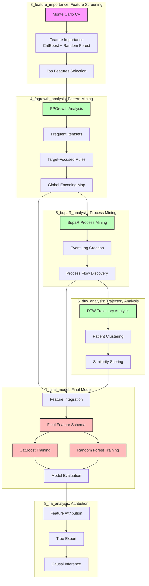

# Analysis Workflow

Feature importance, pattern mining, and final model development for the Prescription Drug Analysis pipeline.

## Overview

The analysis workflow implements a multi-stage approach to feature discovery, noise reduction, and model development:

1. **Feature Screening** with three core models (CatBoost, XGBoost boosted trees, XGBoost RF mode) + Monte Carlo cross-validation
2. **Structure Discovery** and noise reduction with FP-Growth, process mining (BupaR), and dynamic time warping (DTW)
3. **Final Model Development** combining features from all analysis methods for prediction and causal inference

## Phase 1: Monte Carlo CV + Feature Importance

**Goal**: Robust, model-agnostic feature ranking on noisy, high-dimensional data.

**Process**:
1. **Monte Carlo Cross-Validation**: Random splits (70/30, stratified by outcome) across multiple iterations
2. **Model Training**: Fit CatBoost and Random Forest classifiers on each split
3. **Feature Importance**: Compute normalized importance scores per model
4. **Aggregation**: Combine importance across models and iterations, weighted by validation performance
5. **Feature Screening**: Select top features based on combined importance and stability

**Output**: Ranked feature list with combined importance and stability statistics

**Location**: `3_feature_importance/`

### Cohort Focus Strategy

Because full MC‑CV + permutation importance is computationally intensive but critical for
health‑grade robustness, we focus the heaviest analysis on two cohort groups:

- **Cohort Group 1 – Opioid ED (`opioid_ed`)**
  - “Cohorts 1–5”: the younger and mid‑age bands in `AGE_BANDS` (e.g., 0–12 through 55–64).
  - These runs use the full 3‑model ensemble (CatBoost, XGBoost, XGBoost RF) with 50 splits
    and permutation importance on the full 2019 holdout.

- **Cohort Group 2 – Polypharmacy ED visits (non‑opioid ED focus)**
  - “Cohorts 6–8”: the older age bands in `AGE_BANDS` (e.g., 65–74 through 85–94).
  - These runs also use the full 3‑model ensemble, targeting polypharmacy‑related ED patterns.

Other cohort/age-band combinations may be explored with lighter settings (fewer splits or
reduced model sets), but **interpretation for publication and downstream causal analysis
is anchored on these two cohort groups**.

### Model Data Extraction (Target vs Control)

After feature importance is computed for each `(cohort, age_band)` pair, we create a compact
**model-ready event dataset** that downstream methods (FP-Growth, BupaR, DTW) consume:

- **Target cohort (opioid_ed)**:
  - Read `*_aggregated_feature_importance.csv` to get the top important `item_*` features.
  - Strip the `item_` prefix to recover raw drug / ICD / procedure codes.
  - For each age band and event year, filter GOLD cohort events to **only those rows where at least one important item appears** in:
    - `drug_name`
    - `primary_icd_diagnosis_code` through `nine_icd_diagnosis_code`
    - `procedure_code`
  - Write filtered events to:
    - `model_data/cohort_name=opioid_ed/age_band={band}/model_events.parquet`

- **Control cohort (non_opioid_ed)**:
  - Load full, unfiltered control cohort events for the same age band and years.
  - Sample control patients to maintain an approximate **5:1 control:target person-level ratio**.
  - Keep **all events** for sampled control patients (no feature filtering).
  - Write to:
    - `model_data/cohort_name=non_opioid_ed/age_band={band}/model_events.parquet`

These paired `model_events.parquet` files provide a consistent, size-controlled input for FP-Growth,
process mining (BupaR), and DTW trajectory analyses in Phase 2.

## Phase 2: Pattern & Process Mining + DTW

**Goal**: Exploit structure in selected features and further reduce noise, then
derive per-patient sequence/trajectory features for the final model.

### Components

1. **FPGrowth Analysis** (`4_fpgrowth_analysis/`)
   - Frequent pattern mining on drug/ICD/CPT codes
   - Target-focused association rules (predicting opioid dependence, ED visits)
   - Itemset metrics and feature encoding
   - **Step 2 output**: cohort-level itemsets/rules under `4_fpgrowth_analysis/outputs/...`

2. **BupaR Process Mining** (`5_bupaR_analysis/`)
   - Event log creation from filtered `model_data` (DRUG / ICD / CPT activities)
   - Target-only process mining on **high-signal codes** (from FP-Growth target-only itemsets)
   - Pre-/Post-F1120 analysis:
     - `pre_F1120_eventlog` – sequences up to and including first ICD F1120
     - `post_F1120_eventlog` – sequences after first ICD F1120
   - Combined TARGET + CONTROL event log for Sankey-style process maps
   - **Step 3 output**: per-patient sequence features (pre/post-F1120 counts and
     complexity) written to `5_bupaR_analysis/outputs/{cohort}/{age_band_fname}/features/`

3. **DTW Trajectory Analysis** (`6_dtw_analysis/`)
   - Patient trajectory clustering
   - Similarity scoring and archetype matching
   - Multi-modal trajectory features
   - **Step 4 output**: per-patient DTW trajectory features (e.g. distances to
     prototype trajectories) written to
     `6_dtw_analysis/outputs/{cohort}/{age_band_fname}/features/`

**Output**: Refined feature set that participates in frequent patterns, stable pathways, and respects process timing

## Phase 3: Final Model Development

**Goal**: Integrate features from all analysis methods into final prediction model.

**Process**:
1. **Feature Integration**: Combine feature-importance–filtered `model_data`,
   FP-Growth pattern information, BupaR sequence features, and DTW trajectory
   features into a single patient-level table (e.g. via
   `7_final_model/build_final_features_opioid_ed_0_12.py`).
2. **Feature Schema**: Unified patient-level feature matrix (~185-750 features)
3. **Model Training**: CatBoost and Random Forest on integrated features
4. **Model Evaluation**: Performance metrics and feature importance analysis

**Output**: Trained models with interpretable feature sets

**Location**: `7_final_model/`

## Enhanced Analysis Workflow Architecture

### Core Components

**1. FP-Growth Pattern Mining Layer**
- Implements market basket analysis on medication sequences to identify initial feature importances
- Identifies co-occurring prescriptions using minimum support thresholds (default: 0.05 for initial pattern discovery)
- Discovers significant event patterns that feed into both:
  - BupaR process mining for temporal analysis
  - CatBoost models for predictive modeling
- Filters patterns based on:
  - Minimum support threshold
  - Pattern frequency in positive vs negative samples
  - Clinical relevance of co-occurring events

**2. BupaR Process Mining Engine**
- Uses FP-Growth identified patterns to construct event logs using `mi_person_key` as case identifier
- Performs temporal analysis through process maps and trace alignment
- Identifies hospitalization precursor patterns
- Calculates throughput times between drug administrations
- Validates patterns through:
  - Process conformance checking
  - Trace alignment analysis
  - Performance metrics evaluation

**3. CatBoost Predictive Modeling**
- Incorporates FP-Growth discovered patterns as network features
- Uses Formal Feature Attribution (FFA) for feature importance analysis
- Implements temporal cross-validation for cohort-based forecasting
- Validates feature importance through:
  - Cross-validation stability
  - Statistical significance testing
  - Clinical relevance assessment

**4. FFA-based Importance Ranking**
- Uses FFA to rank features by their importance in predicting hospitalization risk
- Identifies top K important features based on:
  - Support and coverage thresholds
  - Statistical significance testing
  - Class-specific importance rankings
  - Cross-validation stability

## DTW and BupaR Integration

**DTW (Dynamic Time Warping)** and **BupaR (Process Mining)** serve different but complementary purposes:

| Aspect | DTW | BupaR |
|--------|-----|-------|
| **Scope** | Pairwise sequence comparison | Process discovery across many cases |
| **Output** | Distance metric | Process maps, flow diagrams |
| **Abstraction** | Low-level (raw sequences) | High-level (process patterns) |
| **Scalability** | O(n²) for each pair | Handles thousands of cases |
| **Interpretability** | "These sequences are X% similar" | "80% of patients follow path A→B→C" |

### DTW: Sequence Similarity Analysis

**Purpose:** Measure similarity between individual patient drug sequences that may vary in timing and length.

**Use Cases:**
1. **Patient Clustering**: Group patients with similar drug exposure histories
2. **Outlier Detection**: Identify patients with unusual drug sequences
3. **Similarity-Based Features**: Calculate distance to known high-risk patterns
4. **Sequence Validation**: Compare drug sequences across different time periods

### BupaR: Process Discovery and Pathway Analysis

**Purpose:** Discover common process flows and temporal patterns across patient populations.

**Use Cases:**
1. **Process Flow Discovery**: Identify common pathways from drug exposure to outcomes
2. **Temporal Pattern Analysis**: Understand timing relationships between events
3. **Pathway Comparison**: Compare process flows between target and control groups
4. **Performance Analysis**: Measure throughput times and bottlenecks

### Integrated Workflow: DTW + BupaR

1. **Cluster patients by drug sequence similarity** (DTW)
2. **Add cluster labels to patient data**
3. **Analyze process patterns within each DTW cluster** (BupaR)
4. **Compare process flows across clusters**
5. **Identify high-risk trajectory patterns**

## Analysis Pipeline Overview



## Key Insights

| Question | Analysis Method | Insights |
|----------|----------------|-----------|
| What itemsets are most common? | FpGrowth | Frequent co-occurrence patterns |
| How do itemsets play out temporally? | BupaR | Process flows and sequences |
| Which itemsets drive model predictions? | CatBoost + FFA | Risk-influential patterns |
| Are process-dominant paths aligned with risk? | BupaR vs. FFA | Pattern alignment analysis |

## Model Artifacts and Storage Structure

The pipeline generates and stores various model artifacts for each cohort and age band:

### Model Artifacts Structure
All model artifacts are stored in S3 with the following partition structure:
```
s3://{S3_BUCKET}/{artifact_type}/cohort_name={cohort}/age_band={band}/event_year={year}/
```

### Artifact Types and Contents

1. **Model Metrics and Info**
   - `model_metrics.json`: Performance metrics (AUC, accuracy, F1, precision, recall, Brier score, log loss)
   - `model_info.json`: Model metadata, feature names, and native feature importances

2. **SHAP Analysis**
   - `shap_values.parquet`: Raw SHAP values for feature importance analysis
   - `shap_plots/`: Directory containing SHAP value visualization plots for each class

3. **Cattail Analysis**
   - `cattail_plots/`: Directory containing Cattail distribution plots showing feature value distributions

4. **Causal Analysis**
   - `causal_summary.json`: Causal analysis results including feature effects and summary statistics

5. **Calibration Analysis**
   - `calibration_plots/`: Directory containing model calibration curves for each class

6. **Mirror Plots**
   - `mirror_plots/`: Directory containing feature importance mirror plots comparing classes

## Related Documentation

- [`README_overview.md`](README_overview.md) - Project structure and components
- [`README_data_pipeline.md`](README_data_pipeline.md) - Data processing and cohort creation
- [`README_data_visualizations.md`](README_data_visualizations.md) - Visualization approaches
- [`docs/README_feature_importance.md`](docs/README_feature_importance.md) - Feature importance analysis
- [`docs/README_fpgrowth.md`](docs/README_fpgrowth.md) - FP-Growth pattern mining
- [`docs/README_bupaR.md`](docs/README_bupaR.md) - Process mining with BupaR
- [`docs/README_dtw_feature_extraction.md`](docs/README_dtw_feature_extraction.md) - DTW trajectory analysis
- [`docs/README_final_model.md`](docs/README_final_model.md) - Final model development

