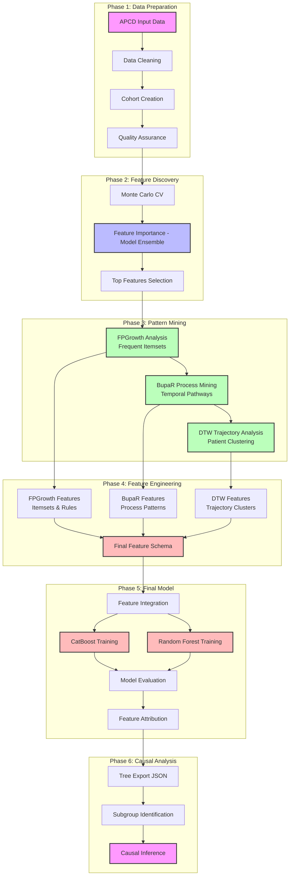

# Overview

Project structure, components, and high-level workflow for the Prescription Drug Analysis pipeline.

## Project Structure

```mermaid
graph TD
    A[pgx_analysis] --> B[1_apcd_input_data]
    A --> C[2_create_cohort]
    A --> D[3_feature_importance]
    A --> E[4_fpgrowth_analysis]
    A --> F[5_bupaR_analysis]
    A --> G[6_dtw_analysis]
    A --> H[7_final_model]
    A --> I[8_ffa_analysis]
    A --> J[helpers_1997_13]
    
    B --> B1[medical]
    B --> B2[pharmacy]
    B --> B3[0_txt_to_parquet.py]
    B --> B4[3_apcd_clean.py]
    B --> B5[drug_mappings]
    B --> B6[claim_mappings]
    
    C --> C1[0_create_cohort.py]
    C --> C2[2_step2_data_quality_qa.py]
    C --> C3[phases]
    C --> C4[table_mappings]
    
    D --> D1[feature_importance_mc_cv.ipynb]
    D --> D2[feature_importance_mc_cv.R]
    D --> D3[create_visualizations.R]
    
    E --> E1[global_fpgrowth.py]
    E --> E2[cohort_fpgrowth.py]
    E --> E3[global_fpgrowth_feature_importance.ipynb]
    E --> E4[cohort_fpgrowth_feature_importance.ipynb]
    
    F --> F1[bupaR_pipeline.ipynb]
    F --> F2[sankey_plot.html]
    
    G --> G1[dtw_cohort_analysis.py]
    G --> G2[dtw_trajectory_analysis.py]
    G --> G3[README.md]
    
    H --> H1[catboost_r.ipynb]
    H --> H2[run_catboost_opioid_ed.py]
    H --> H3[run_catboost_ade_ed.py]
    H --> H4[final_feature_schema.json]
    H --> H5[catboost_models]
    
    I --> I1[catboost_axp_explainer.py]
    I --> I2[ffa_analysis.py]
    
    J --> J1[common_imports.py]
    J --> J2[duckdb_utils.py]
    J --> J3[s3_utils.py]
    J --> J4[constants.py]
    
    style A fill:#f9f,stroke:#333,stroke-width:2px
    style B fill:#bbf,stroke:#333,stroke-width:2px
    style C fill:#bbf,stroke:#333,stroke-width:2px
    style D fill:#bbf,stroke:#333,stroke-width:2px
    style E fill:#bbf,stroke:#333,stroke-width:2px
    style F fill:#bbf,stroke:#333,stroke-width:2px
    style G fill:#bbf,stroke:#333,stroke-width:2px
    style H fill:#bbf,stroke:#333,stroke-width:2px
    style I fill:#bbf,stroke:#333,stroke-width:2px
    style J fill:#bfb,stroke:#333,stroke-width:2px
```



## High-Level Workflow

End-to-end workflow for feature discovery, noise reduction, and causal-oriented modeling using drug exposures, ICD/CPT codes, and classification outcomes.

### Overview

This project builds a classification model on a large, noisy healthcare dataset, then uses model-based feature importance plus pattern- and process-mining to derive a stable covariate set and interpretable tree ensembles for causal analyses.

**High-level phases:**

1. **Feature Screening** with a focused model ensemble (CatBoost, XGBoost boosted trees, XGBoost RF mode) + Monte Carlo cross-validation
2. **Structure Discovery** and noise reduction with FP-Growth, process mining (BupaR), and dynamic time warping (DTW)
3. **Final Model Development** combining features from all analysis methods for prediction and causal inference

### Workflow Pipeline



## Repository Structure

```
pgx-analysis/
├── 1_apcd_input_data/          # Data preprocessing and cleaning
├── 2_create_cohort/            # Cohort creation and QA
├── 3_feature_importance/       # MC-CV feature importance analysis
├── 4_fpgrowth_analysis/        # Frequent pattern mining
├── 5_bupaR_analysis/           # Process mining
├── 6_dtw_analysis/            # Trajectory analysis
├── 7_final_model/              # Final model development
├── 8_ffa_analysis/             # Feature attribution analysis
├── helpers_1997_13/           # Utility functions
└── docs/                       # Documentation
```

## Project Components

### Core Analysis Modules

**📊 1_apcd_input_data: APCD Data Processing**
- `0_txt_to_parquet.py` - Convert text files to Parquet format
- `3_apcd_clean.py` - Main data cleaning script
- `3a_clean_pharmacy.py` - Pharmacy data cleaning
- `3b_clean_medical.py` - Medical data cleaning
- `drug_mappings/` - Drug name standardization mappings (A-Z + medical supplies)
- `claim_mappings/` - ICD code mappings and classifications

**👥 2_create_cohort: Cohort Creation**
- `0_create_cohort.py` - Main cohort creation pipeline (orchestrator)
- `2_step2_data_quality_qa.py` - Cohort quality assurance and validation
- `phases/` - Individual pipeline phase implementations
- `table_mappings/` - Table mapping configurations

**📈 3_feature_importance: Feature Screening**
- `feature_importance_mc_cv.ipynb` - Monte Carlo CV feature importance analysis
- `feature_importance_mc_cv.R` - R script for MC-CV analysis
- `create_visualizations.R` - Visualization utilities
- Uses three core models for robust feature ranking: **CatBoost**, **XGBoost (boosted trees)**, and **XGBoost RF mode**

**🔍 4_fpgrowth_analysis: Frequent Pattern Mining**
- `global_fpgrowth.py` - Global pattern mining across all patients
- `cohort_fpgrowth.py` - Cohort-specific pattern mining
- `global_fpgrowth_feature_importance.ipynb` - Global analysis notebook
- `cohort_fpgrowth_feature_importance.ipynb` - Cohort analysis notebook
- Target-focused rule mining (TARGET_ICD, TARGET_ED, CONTROL)

**🔄 5_bupaR_analysis: Process Mining**
- `bupaR_pipeline.ipynb` - Process mining pipeline using BupaR
- `sankey_plot.html` - Interactive Sankey diagram visualizations
- Event log creation and process flow discovery

**📊 6_dtw_analysis: Trajectory Analysis**
- `dtw_cohort_analysis.py` - DTW analysis for drug sequence similarity
- `dtw_trajectory_analysis.py` - Enhanced trajectory development
- Patient clustering and similarity scoring

**🤖 7_final_model: Final Model Development**
- `catboost_r.ipynb` - R-based CatBoost model training
- `run_catboost_opioid_ed.py` - Opioid ED event prediction
- `run_catboost_ade_ed.py` - Combined ADE and ED analysis
- `final_feature_schema.json` - Comprehensive feature schema
- `catboost_models/` - Trained model artifacts and metadata

**🎯 8_ffa_analysis: Feature Attribution**
- `catboost_axp_explainer.py` - CatBoost AXP (Approximate Explanations) analysis
- `ffa_analysis.py` - Feature Filtering and Analysis pipeline
- Tree export and causal inference

### Pipeline Architecture

The cohort analysis pipeline follows a clean **orchestrator/executor** architecture pattern:

**🎯 Core Design Principles:**
- **Modular Implementation**: Individual step files in `pipeline_steps/` folder for better organization
- **Clean Separation**: `create_cohort.py` orchestrates, individual step files execute
- **No Code Duplication**: Each step implemented once in its own module
- **Maintainable**: Changes to step logic isolated to individual files

**📁 File Responsibilities:**
- **`create_cohort.py`**: 
  - Main orchestration and context setup
  - Step execution dispatcher
  - Error handling and logging
  - Checkpoint management
- **`pipeline_steps/pipeline_step*.py`** (15 individual files):
  - Individual step implementations (run_step1 through run_step15)
  - Step dependencies and validation
  - Data processing logic
  - S3 operations and persistence
- **`sql/step*.txt`** (14 SQL files):
  - SQL query implementations for each step
  - Reusable SQL logic
  - Database operations

**🔄 Execution Flow:**
```python
# Orchestrator calls dispatcher
step_execution_dispatcher(next_step, context)

# Dispatcher calls individual step functions from pipeline_steps/
from pipeline_steps.pipeline_step1 import run_step1_lock_acquisition
from pipeline_steps.pipeline_step2 import run_step2_database_setup
# ... through step 15

run_step1_lock_acquisition(context)
run_step2_database_setup(context)
# ... individual step execution
```

## Defaults: Partitioned (imputed) Silver Inputs

The pipeline now prefers partitioned, imputed silver inputs by default for Phase 2 (pharmacy) and Phase 2b (medical). Global imputation (Phase 1) writes partitioned outputs under `s3://<bucket>/silver/imputed/{medical|pharmacy}_partitioned/` which improves DuckDB performance and enables partition-first parallelism.

- **Why**: DuckDB runs and worker parallelism are more efficient when processing partitioned data (one DuckDB instance per partition, fewer memory spikes).
- **Where**: outputs from `1_apcd_input_data/2_global_imputation.py` are written to `s3://pgxdatalake/silver/imputed/...` and include partition keys (e.g. `age_band` and `event_year`).
- **Operator note**: The orchestrator defaults now point to the imputed partitioned paths. For compatibility the orchestrator still accepts legacy "raw" silver paths and will attempt to convert/locate the imputed partitioned path if the raw path contains no parquet files.

Helper: The preflight discovery logic now lives in the Python helper `helpers_1997_13.s3_utils.select_silver_inputs`.
You can call it from a short Python one-liner to preview preferred input paths, for example:

```bash
python -c "from helpers_1997_13.s3_utils import select_silver_inputs; import json; print(json.dumps(select_silver_inputs('pgxdatalake','silver','medical')))"
```

This replaces the older `scripts/validate_silver_inputs.py` script which was removed in cleanup.

This architecture ensures maintainability, reduces bugs, and provides a clean separation of concerns with modular step implementations.

**🛠️ helpers_1997_13: Utility Functions**
- `common_imports.py` - Common import statements and configurations
- `constants.py` - Global constants and configuration values
- `duckdb_utils.py` - DuckDB database utilities
- `s3_utils.py` - S3 storage utilities
- `logging_utils.py` - Logging configuration and utilities
- Additional utility modules for data processing, model training, and visualization

## Data and Variables

- **Unit of analysis**: Patient-episode or encounter
- **Outcome (Y)**: Binary classification target (e.g., opioid dependence, ED visit)
- **Treatments (A)**: Drug exposure indicators
- **Covariates (X)**:
  - ICD diagnosis codes (grouped/rolled up)
  - CPT procedure codes
  - Demographics and baseline attributes
- **Temporal info**: Timestamps for diagnoses, procedures, and drug administrations

**Separation:**
- Pre-treatment covariates (for confounding control)
- Treatment variables (drugs)
- Post-treatment variables (mediators/outcomes)

## Recent Enhancements

### Drug Event Explosion Strategy
- **Patient-Level → Drug-Level Transformation**: Each drug prescription becomes a separate row
- **Context Duplication**: Patient demographics and clinical data duplicated per drug event
- **Sequence Modeling Ready**: Enables FpGrowth, bupaR, DTW, and symbolic reasoning analysis
- **Temporal Tracking**: Maintains `days_to_ade` and `days_to_opioid_ed` relationships

### Cohort Exclusivity Enforcement
- **OPIOID_ED Priority**: Processes opioid_ed cohort first
- **Mutual Exclusivity**: Ensures no patient appears in both cohorts
- **Quality Assurance**: Validates cohort separation and logs metrics
- **Data Integrity**: Prevents data leakage between cohorts

### DTW and BupaR Integration

**DTW (Dynamic Time Warping)** and **BupaR (Process Mining)** serve different but complementary purposes in temporal sequence analysis:

| Aspect | DTW | BupaR |
|--------|-----|-------|
| **Scope** | Pairwise sequence comparison | Process discovery across many cases |
| **Output** | Distance metric | Process maps, flow diagrams |
| **Abstraction** | Low-level (raw sequences) | High-level (process patterns) |
| **Scalability** | O(n²) for each pair | Handles thousands of cases |
| **Interpretability** | "These sequences are X% similar" | "80% of patients follow path A→B→C" |

## Related Documentation

- [`README_data_pipeline.md`](README_data_pipeline.md) - Data processing and cohort creation
- [`README_analysis_workflow.md`](README_analysis_workflow.md) - Feature importance and pattern mining
- [`README_data_visualizations.md`](README_data_visualizations.md) - Visualization approaches
- [`docs/README_create_cohort.md`](docs/README_create_cohort.md) - Comprehensive cohort creation guide

