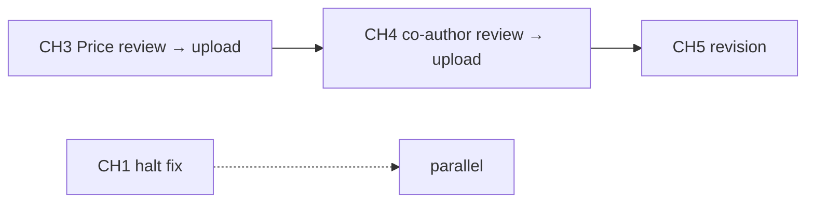

# Project TODO

_Last updated: 2026-06-01 — completion tracked here; action plans = spec; [`manuscript/docs/cts/cts_peer_review/README.md`](manuscript/docs/cts/cts_peer_review/README.md) = index._

Track cross-repo work here. Manuscript build detail: `manuscript/NEXT_STEPS.md`, `manuscript/docs/cts/README_CTS.md`.

---

## Priority summary

| ID | Manuscript | Chapter | Action plan | Status |
|:---|:-----------|:--------|:------------|:-------|
| **CH3** | CTS-2026-0196 | CH_3 | [cts_2026_0196_revision_action_plan.md](manuscript/docs/cts/cts_peer_review/cts_2026_0196_revision_action_plan.md) | 🟡 **Ready** — awaiting **Dr. Price** review → Wiley upload |
| **CH4** | CTS-2026-0235-T | CH_4 | [cts_0235_t_revision_action_plan.md](manuscript/docs/cts/cts_peer_review/cts_0235_t_revision_action_plan.md) | 🟡 **Ready** — package built (`36e28bf`); **co-author review** → upload |
| **CH5** | CTS-2026-0255-T | CH_5 | [cts_2026_0255_t_revision_action_plan.md](manuscript/docs/cts/cts_peer_review/cts_2026_0255_t_revision_action_plan.md) | 🔴 **Not started** — revision due ~June 2026 |
| T4 | `nbstripout` git filter (Windows) | pgx-analysis | — | ⬜ Open |
| T5 | Parent repo local changes (puppeteer) | pgx-analysis | — | ⬜ Open — notebooks committed; `11_testing/puppeteer/*` untracked |
| T6 | CH1 initial submission (CTS-2026-0197) | CH_1 | `manuscript_status.txt` | 🟡 Halted — title page + supp files |
| T7 | `f31_proposal` folder | pgx-analysis | — | ⬜ Open |

---

## CH3 — CTS-2026-0196 (pending upload)

**Spec:** [action plan](manuscript/docs/cts/cts_peer_review/cts_2026_0196_revision_action_plan.md) · **Checklist:** [README_CTS.md § CH_3](manuscript/docs/cts/README_CTS.md) · **Response:** `ch03_cts_revision_response.qmd`

**Status:** Revision package in repo; **not uploaded to Wiley**. Awaiting **Dr. Price** review.

### Before upload (after Price sign-off)

- [ ] Dr. Price review — revised MS, marked MS, point-by-point response
- [ ] Final proofread: marked vs clean DOCX; page refs in response letter match PDF export
- [ ] Confirm supplemental figures S1–S3 uploaded as **separate files** (not embedded in main MS) per `manuscript_status.txt`
- [ ] Wiley: Remove & Replace Files — response + marked + clean DOCX + figure TIFFs
- [ ] Deadline: ~4 weeks from May 11, 2026 decision letter (request extension if needed)

**Do not** re-run `sync_docs_cts.py --chapter 3` without `.\build.ps1 -Submit -Chapter 3` first.

**Paths:** `manuscript/docs/cts/cts_peer_review/CTS-2026-0196_*` · `docs/cts/submission/ch03/`

---

## CH4 — CTS-2026-0235-T (pending upload)

**Spec:** [action plan](manuscript/docs/cts/cts_peer_review/cts_0235_t_revision_action_plan.md) · **Checklist:** [README_CTS.md § CH_4](manuscript/docs/cts/README_CTS.md) · **Response:** [ch04_cts_revision_response.qmd](manuscript/docs/cts/ch04_cts_revision_response.qmd)

**Status:** QMD + refs + `-Submit` build + response with page/line cites + tables after references (`manuscript` `36e28bf`). **Not uploaded to Wiley**. Awaiting **co-author review**.

### Phase 1 — Claims & framing ✅

- [x] Title/claims: observational framing; removed “Formal Feature Attribution” / “causal calculator” branding
- [x] Model target: Interpretive Scope + Limitations (DDI vs utilization vs confounding)
- [x] “Causal” language qualified; [@Hernan2010] and related cites
- [x] Polypharmacy vs Table 1 — 30-day pre-index window explained
- [x] Associate editor: unstructured abstract; narrative Discussion/Conclusions

### Phase 2 — Science audit ✅

- [x] `n_events` / Figure 1 — density stratification; holdout audit narrative
- [x] Table 2 — 2019 holdout; leakage controls; Limitations on transportability
- [x] Triplets — Results § Triplet Interactions; Table 3 + Supplementary Table S1
- [x] PK/exposure — Methods + Discussion + Limitations

### Phase 3 — CTS formatting ✅

- [x] Tables after references — `move_tables_after_references.py`
- [x] Supp captions in supp files — `submission/ch04/supp/`
- [x] ORCID, line/page numbers, COI, references, AI disclosure, Author Contributions
- [x] `.\build.ps1 -Submit -Chapter 4 -Journal cts` → `docs/cts/submission/ch04/`
- [x] Response DOCX + marked manuscript → `docs/cts/cts_peer_review/`

### Before upload (after co-author sign-off)

- [ ] Co-author review — `CTS-2026-0235-T_revised_manuscript.docx`, `_marked.docx`, `_revision_response.docx`
- [ ] Open revised DOCX in Word once (refresh footer page fields); spot-check Tables 1–3 on Pages 18–19
- [ ] Final proofread: response page/line cites vs printed layout
- [ ] Wiley: Remove & Replace Files — response + marked + clean DOCX + figure TIFFs + supp
- [ ] Deadline: ~4 weeks from June 1, 2026 decision letter (request extension if needed)

**Do not** re-run `sync_docs_cts.py --chapter 4` without `.\build.ps1 -Submit -Chapter 4` first.

**Paths:** `manuscript/docs/cts/cts_peer_review/CTS-2026-0235-T_*` · `docs/cts/submission/ch04/`

---

## CH5 — CTS-2026-0255-T

**Spec:** [action plan](manuscript/docs/cts/cts_peer_review/cts_2026_0255_t_revision_action_plan.md) · **Draft response:** [Revision Response for Serverless…](manuscript/docs/cts/cts_peer_review/Revision%20Response%20for%20Serverless%20Pharmacogenomic%20Dashboard%20Manuscript.md)

### Phase 1 — Framing

- [ ] Position as **technical feasibility** unless clinical-outcome evidence is added (Reviewer 2)
- [ ] Soften *causal* / *What-If* → predictions / scenario analysis
- [ ] Privacy/regulatory wording — deployment-context dependent

### Phase 2 — Methods (Reviewer 1)

- [ ] 573 CPIC concordance cases: simulated vs real; cohort description
- [ ] Justify 84-model ensemble; note simpler baselines (single XGBoost, rule-based CPIC)
- [ ] CPIC concordance scoring definition; ambiguous pairs
- [ ] Imputation method for partial inputs
- [ ] Running title — remove “draft”
- [ ] Table S1/S2 legends: age bands, density bins; add 1–2 gene-drug examples

### Phase 3 — Structure & formatting

- [ ] Fix section numbering (jump 4 → 6)
- [ ] Shorten §2.5 storage / §3.7 CI/CD / §3.8 bench → supplement where possible
- [ ] Table 2 readability; compare to existing clinical PGx platforms
- [ ] Editorial package (same CTS checklist as CH3/CH4)
- [ ] Build, response letter, marked MS, upload

---

## Shared CTS revision kit (CH3–CH5)

| Item | CH_3 | CH_4 | CH_5 |
|:-----|:-----|:-----|:-----|
| `fix_docx.py` (line/page numbers) | ✅ | ✅ | Apply on submit |
| `move_titlepage.py` | ✅ | ✅ | Apply |
| `move_tables_after_references.py` | ⬜ audit on next CH3 rebuild | ✅ | Apply |
| `mark_revisions.py` | ✅ | ✅ | Apply |
| `sync_docs_cts.py` | ✅ | ✅ | Apply |
| Response QMD + page/line cites | ✅ | ✅ | TODO |

---

## T4 — `nbstripout` git filter on Windows

`git status` fails when filter points to `/usr/bin/python3`. Fix local config or document bypass (`git -c filter.nbstripout.clean=cat …`).

---

## T5 — Parent repo local changes

- [x] `4_dashboard_visuals.ipynb`, `5_build_and_deploy.ipynb` — committed (`8cf1ea8`)
- [ ] `11_testing/puppeteer/*` — untracked (not needed in git)

---

## T6 — CH1 — CTS-2026-0197 (initial, not revision)

From `manuscript/manuscript_status.txt` (April 2026 halted submission):

- [ ] Title page: author names and affiliations below title
- [ ] Upload supplemental Files S1–S5 (separate files; captions inside each)

---

## T7 — `f31_proposal`

Recreate folder + README when F31 drafting starts.

---

## Execution order

1. **CH3** — Dr. Price review → proofread → Wiley upload  
2. **CH4** — co-author review → proofread → Wiley upload  
3. **CH5** — framing → methods → structure → build → upload  
4. **CH1** — editorial halt when ready  
5. **T4–T7** — as needed  

---

## Completed (2026-06-01)

- [x] Peer review markdown action plans + [README workflow](manuscript/docs/cts/cts_peer_review/README.md)
- [x] CH3 revision package in git — **upload pending** ([README_CTS § CH_3](manuscript/docs/cts/README_CTS.md))
- [x] CH4 revision package: QMD, refs, submit build, tables after refs, response cites (`36e28bf`) — **upload pending** ([README_CTS § CH_4](manuscript/docs/cts/README_CTS.md))
- [x] `move_tables_after_references.py` in CTS submit pipeline
- [x] Root `TODO.md` ↔ action plans ↔ `README_CTS` checklists linked
