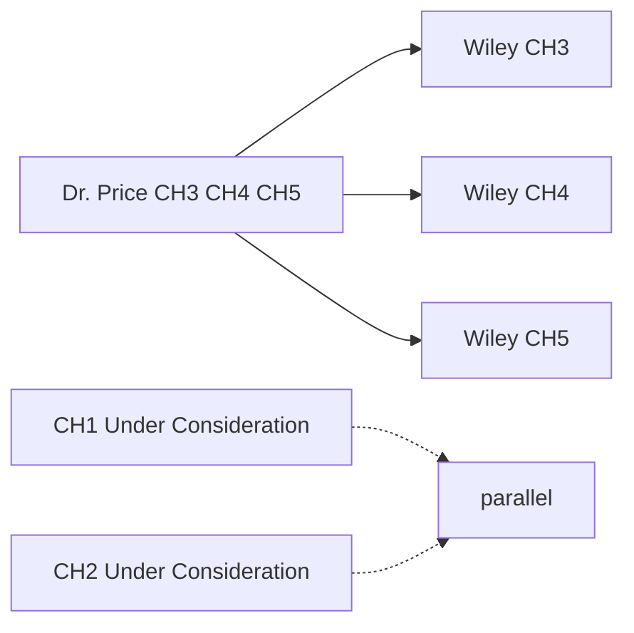

# Project TODO

_Last updated: 2026-06-04 — Authors: **R. Jerome Dixon** (corresponding; first review) and **Elvin T. Price, Pharm.D., Ph.D.** (sole co-author). No other authors on CH3–CH5._

Track cross-repo work here. Manuscript build detail: `manuscript/NEXT_STEPS.md`, `manuscript/docs/cts/README_CTS.md`.

**Review workflow (all resubmissions):** Jerome proofreads package → sends to Dr. Price → Jerome uploads to Wiley after Price sign-off.

---

## Priority summary

| ID | Manuscript | Chapter | Action plan | Status |
|:---|:-----------|:--------|:------------|:-------|
| **T0** | **Complete pipeline rerun** | All | See T0 below | ✅ **Complete — EC2 dashboard/deployment rerun done** |
| **CH3** | CTS-2026-0196 | CH_3 | [action plan](manuscript/docs/cts/due_date/2026-06-08_CTS-2026-0196/response/cts_2026_0196_revision_action_plan.md) | ✅ **Revision submitted to CTS** — await editorial response |
| **CH4** | CTS-2026-0235-T | CH_4 | [action plan](manuscript/docs/cts/due_date/2026-06-29_CTS-2026-0235-T/response/cts_0235_t_revision_action_plan.md) | 🟣 **Dr. Price reviewing** → Wiley (due **2026-06-29**) |
| **CH5** | CTS-2026-0255-T | CH_5 | [action plan](manuscript/docs/cts/due_date/2026-06-29_CTS-2026-0255-T/response/cts_2026_0255_t_revision_action_plan.md) | 🟣 **Dr. Price reviewing** → Wiley (due **~2026-06-30**) |
| T4 | `nbstripout` git filter (Windows) | pgx-analysis | — | ⬜ Open |
| T5 | Parent repo local changes (puppeteer) | pgx-analysis | — | ⬜ Open — notebooks committed; `11_testing/puppeteer/*` untracked |
| T6 | CH1 systematic review (CTS-2026-0197) | CH_1 | [action plan](manuscript/cts/due_date/2026-07-10_CTS-2026-0197/response/cts_2026_0197_revision_action_plan.md) | 🟣 **Dr. Price PROSPERO approval needed** — approve/publication gate for CRD420261354089; CTS revision due **2026-07-10** |
| T8 | CH2 OODA / partition-first (CTS-2026-0230-T) | CH_2 | Wiley portal | 🟢 **Under Consideration** (rev 0) — await editorial decision |
| T7 | `f31_proposal` folder | pgx-analysis | — | ⬜ Open |

---

## T0 — Complete pipeline rerun (temporal holdout fix + scenario rename)

**Trigger:** Holdout integrity fix (2016-2018 train / 2019 holdout) + `causal` → `scenario` rename requires fresh model artifacts and regenerated dashboard data.  
**Status:** ✅ EC2 dashboard/deployment rerun completed; dual-SHAP/FFA audit found no full regeneration required for current outputs.  
**Steps 1–5:** ✅ Keep as-is — `model_events.parquet` intact with `event_year`.

### Phase 3 — Model (Step 6)
- [x] `run_final_model.py --cohort opioid_ed --age_band 25-44 --train-mode per_bin --force-retrain` (priority band for CH3)
- [x] Repeat for all `opioid_ed` age bands (0-12, 13-24, 45-54, 55-64, 65-74, 75-84, 85-114)
- [x] Repeat for all `non_opioid_ed` age bands
- [x] Verify `holdout_2019_metrics.json` written per cohort/age_band — update Table 2 in `ch03_cts.qmd`

### Phase 3 — SHAP + FFA (Steps 7–8)
- [x] Models are current — do **not** rerun Step 3 MCCV or Step 6 final models for the dual-SHAP consensus fix unless model artifacts change
- [x] `run_shap_analysis.py` per cohort/age_band (new model → new SHAP parquets)
- [x] `run_ffa.py` per cohort/age_band (new model → new FFA rules)
- [x] `combine_shap_ffa_results.py` — outputs `dashboard_data.json` with `top_interaction_factors` (no more `top_causal_factors`)
- [x] Verify dual-model SHAP consensus inputs are present for each rerun: `*_shap_global_importance_xgboost.csv` and `*_shap_global_importance_catboost.csv`
- [x] Audit existing Step 8 FFA outputs before rerun: existing artifacts already evaluate substantial CatBoost/XGBoost SHAP-supported rule coverage, so full forced regeneration is not required for the current outputs
- [x] Confirm FFA rule evaluation uses the original consensus design: `XGBoost SHAP ∩ CatBoost SHAP ∩ XGBoost FFA` for feature/rule prioritization
- [x] Persist a consensus-stable feature audit report per cohort/age_band/bin with source flags/coverage: `audit_shap_ffa_existing_coverage.csv`, `audit_per_bin_ffa_vs_shap_coverage.csv`, and `audit_axp_explanations_existing_counts.csv`
- [x] Defer full MCCV/Optuna stability-threshold implementation; treat as optional methods extension, not a current rerun blocker

### Phase 4 — Dashboard visuals (Step 9) — DTW queue
- [x] Run `create_dtw_trajectories` → `create_dtw_features` → `create_dtw_visuals` per cohort/age_band  
  (column fix already in place: `candidates = ["first_f1120_date", "first_opioid_ed_date"]`)
- [x] Inspect `metrics.charts_not_built` / `9_dtw_log/` for any remaining N3 "not built" partitions
- [x] Verify `times_between_sequences` and `time_to_target_sequences` present in `chart_data.json`
- [x] Regenerate `fig_trajectories.pdf`, `fig_trajectories_heatmap.pdf`, `fig_dtw_pathways.pdf` (CH_3 supp)
- [x] Run BupaR + FP-Growth for all cohorts/age_bands
- [x] Upload all visuals to S3 (`visualizations/scenario/`, `visualizations/dtw/`, etc.)

### Phase 5 — Build and deploy
- [x] `prepare_models.py` + `prepare_lambda_dir.py` with retrained per-bin models
- [x] Rebuild Docker image → push to ECR → update Lambda function
- [x] `sync_frontend_to_s3.py` — deploy `frontend/index.html` (scenario rename + N3 messaging)
- [x] Sync `pgx_dashboard.html` outputs build → S3
- [x] CloudFront invalidation (`/vcu/pgx-risk-calculator/*`)
- [x] Smoke-test: Scenario Analysis tab, DTW N3 panels, risk inference per bin

### Post-rerun manuscript updates
- [ ] Update Table 2 (CH_3) with `holdout_2019_metrics.json` AUROC/PR-AUC values
- [ ] Rebuild CH_3 PDF/DOCX after figure regeneration → send to Dr. Price

---

## CH3 — CTS-2026-0196 (revision submitted)

**Spec:** [action plan](manuscript/docs/cts/due_date/2026-06-08_CTS-2026-0196/response/cts_2026_0196_revision_action_plan.md) · **Checklist:** [README_CTS.md § CH_3](manuscript/docs/cts/README_CTS.md) · **Submit:** [due_date submit README](manuscript/docs/cts/due_date/2026-06-08_CTS-2026-0196/submit/README.md)

**Status:** Peer review revision package **submitted to CTS**. Await editorial response.

### Done — Jerome (first review)

- [x] **Jerome:** Proofread `edits/CTS-2026-0196_revised_manuscript.docx` (clean) vs QMD intent
- [x] **Jerome:** Proofread `response/CTS-2026-0196_revision_response.docx`; spot-check page refs vs PDF export
- [x] **Jerome:** Confirm marked MS reflects latest Methods cites (regenerate if needed — see build note below)
- [x] **Jerome:** Upload **`submission/outputs/`** to Google Drive for **Dr. Price** (clean + marked MS + response + figures/supp)

### Submitted — CTS response pending

- [x] Dr. Price review — revised MS, marked MS, point-by-point response
- [x] Final proofread: marked vs clean DOCX; yellow highlights match edits
- [x] Confirm supplemental figures S1–S3 as **separate Wiley files** (not embedded in main MS)
- [x] Wiley: Remove & Replace Files — response + marked + clean DOCX + figure TIFFs
- [ ] Await CTS response
- [ ] Deadline: ~4 weeks from May 11, 2026 decision letter (**request extension if needed**)

**Marked MS note:** After QMD edits, run `mark_revisions.py` on latest `ch03_cts_draft.docx` before sending to Price if marked DOCX predates cite/supplementary pass.

**Do not** re-run `sync_docs_cts.py --chapter 3` without `.\build.ps1 -Submit -Chapter 3` first.

**Paths:** `docs/cts/due_date/2026-06-08_CTS-2026-0196/response/` · `docs/cts/due_date/2026-06-08_CTS-2026-0196/edits/` · `docs/cts/due_date/2026-06-08_CTS-2026-0196/submission/outputs/`

---

## CH4 — CTS-2026-0235-T (pending upload)

**Spec:** [action plan](manuscript/docs/cts/due_date/2026-06-29_CTS-2026-0235-T/response/cts_0235_t_revision_action_plan.md) · **Checklist:** [README_CTS.md § CH_4](manuscript/docs/cts/README_CTS.md) · **Submit:** [due_date submit README](manuscript/docs/cts/due_date/2026-06-29_CTS-2026-0235-T/submit/README.md)

**Status:** Rebuilt 2026-06-03 (claims-event terminology; workflow **19/19**). **`submission/outputs/` sent to Dr. Price** (with CH3/CH5). Not on Wiley until sign-off.

### Phase 1 — Claims & framing ✅

- [x] Title/claims: observational framing; removed “Formal Feature Attribution” / “causal calculator” branding
- [x] Model target: Interpretive Scope + Limitations (DDI vs utilization vs confounding)
- [x] “Causal” language qualified; [@Hernan2010] and related cites
- [x] Polypharmacy vs Table 1 — 30-day pre-index window explained
- [x] Associate editor: unstructured abstract; narrative Discussion/Conclusions

### Phase 2 — Science audit ✅

- [x] `n_events` / Figure 1 — partitioned GBT training (`n_event_bin_ordinal`, density strata); structural control, not a separate sensitivity model
- [x] Table 2 — 2019 holdout; leakage controls; Limitations on transportability
- [x] Triplets — Results § Triplet Interactions; Table 3 + Supplementary Table S1
- [x] PK/exposure — Methods + Discussion + Limitations

### Phase 3 — CTS formatting ✅

- [x] Tables after references — `move_tables_after_references.py`
- [x] Supp captions in supp files — `submission/ch04/supp/`
- [x] ORCID, line/page numbers, COI, references, AI disclosure, Author Contributions
- [x] `.\build.ps1 -Submit -Chapter 4 -Journal cts` → `docs/cts/submission/ch04/`
- [x] Response DOCX + marked manuscript → `docs/cts/due_date/2026-06-29_CTS-2026-0235-T/response/` + `edits/`

### Done — Jerome (first review)

- [x] **Jerome:** Proofread clean + marked MS + revision response (post-rebuild)
- [x] **Jerome:** Send `submission/outputs/` to **Dr. Price** (with CH3/CH5)

### In progress — Dr. Price sign-off

- [ ] Dr. Price review — revised MS, marked MS, point-by-point response
- [ ] Open revised DOCX in Word once (refresh footer page fields); spot-check Tables 1–3 placement
- [ ] Wiley: Remove & Replace Files — response + marked + clean DOCX + figure TIFFs + supp
- [ ] Deadline: **2026-06-29** (request extension if CH3 slips)

**Do not** re-run `sync_docs_cts.py --chapter 4` without `.\build.ps1 -Submit -Chapter 4` first.

**Paths:** `docs/cts/due_date/2026-06-29_CTS-2026-0235-T/response/` · `docs/cts/due_date/2026-06-29_CTS-2026-0235-T/edits/` · `docs/cts/due_date/2026-06-29_CTS-2026-0235-T/submission/outputs/`

---

## CH5 — CTS-2026-0255-T

**Spec:** [action plan](manuscript/docs/cts/due_date/2026-06-29_CTS-2026-0255-T/response/cts_2026_0255_t_revision_action_plan.md) · **Draft response:** [Revision Response for Serverless…](manuscript/docs/cts/due_date/2026-06-29_CTS-2026-0255-T/response/Revision%20Response%20for%20Serverless%20Pharmacogenomic%20Dashboard%20Manuscript.md)

**Status:** Rebuilt 2026-06-03 (Model development and validation; workflow **19/19**). **`submission/outputs/` sent to Dr. Price** (with CH3/CH4). Not on Wiley until sign-off.

**Paths:** `due_date/2026-06-29_CTS-2026-0255-T/edits/` · `submission/outputs/` (DOCX + Figure TIFFs) · `submission/inputs/ch05_cts.qmd`

### Phase 1 — Framing

- [x] Position as **technical feasibility** (abstract, conclusions, Reviewer 2 response text)
- [x] Soften *causal* / *What-If* → model-based scenario analysis; shared guardrail sentence (CH3–CH5)
- [x] **Figure 3** — two-panel Scenario Analysis screenshot (`scenario_analysis0/1` → `fig_scenario.png`)
- [x] Privacy/regulatory wording — deployment-context dependent (Methods, Discussion, Limitations)

### Phase 2 — Methods (Reviewer 1)

- [x] 573 CPIC concordance cases: logic-verification set from CPIC snapshot (not patient cohort)
- [x] Justify 84-model ensemble; partition rationale (cohort best practice + DuckDB pipeline alignment)
- [x] R1 #2: state pooled XGBoost / CPIC-only baselines not re-run in this feasibility paper
- [x] R2: **Model development and validation** subsection + response item (SHAP/FFA holdout; imputation robustness; no generic feature-drop ablation)
- [x] CPIC concordance scoring definition; ambiguous pairs → “review required”
- [x] Imputation method: Imputation of Normality (age-band medians; vs MICE)
- [x] Running title — no “draft”
- [x] Table S1/S2 legends: age bands, density bins; gene–drug examples (e.g., CYP2D6/codeine)

### Phase 3 — Structure & formatting

- [x] Fix section numbering (Section 5 Limitations)
- [x] CI/CD compressed → Supplementary File S6; container sizing in Table S1
- [x] Table 2 (PGx coverage) note + Discussion platform comparison (PREDICT)
- [x] `.\build.ps1 -Submit -Chapter 5` → `docs/cts/submission/ch05/` + `due_date/.../submission/outputs/`
- [x] Marked revised MS → `edits/CTS-2026-0255-T_revised_manuscript_marked.docx`
- [x] Formal `ch05_cts_revision_response.qmd` + DOCX (`CTS-2026-0255-T_revision_response.docx`)
### Done — Jerome (first review)

- [x] **Jerome:** Proofread clean + marked MS + revision response
- [x] **Jerome:** Send `submission/outputs/` to **Dr. Price** (with CH3/CH4)

### In progress — Dr. Price sign-off

- [ ] Dr. Price review — revised MS, marked MS, point-by-point response
- [ ] Final proofread: response page/line cites vs Word layout (esp. new Model development subsection)
- [ ] Wiley: Remove & Replace Files — response + marked + clean DOCX + figure TIFFs + supp
- [ ] Deadline: **~2026-06-30** (request extension if needed)

---

## Shared CTS revision kit (CH3–CH5)

| Item | CH_3 | CH_4 | CH_5 |
|:-----|:-----|:-----|:-----|
| `fix_docx.py` (line/page numbers) | ✅ | ✅ | Apply on submit |
| `move_titlepage.py` | ✅ | ✅ | Apply |
| `move_tables_after_references.py` | ⬜ audit on next CH3 rebuild | ✅ | Apply |
| `mark_revisions.py` | ⬜ refresh after latest QMD cites | ⬜ refresh after latest QMD cites | ✅ (2026-06-03; 22 paragraphs) |
| Supplementary CSV + lineage (`data/supplementary/`) | ✅ | ✅ (shared counts file) | — |
| Cohort/age-binning cites in MS + responses | ✅ | ✅ | — (CH5 uses partition framing in MS) |
| `sync_docs_cts.py` | ✅ | ✅ | ✅ (ch. 5 MS only) |
| Response QMD + page/line cites | ✅ | ✅ | ✅ QMD + DOCX (page/line cites; 2026-06-03) |
| Causality guardrail (CH3–CH5) | ✅ | ✅ | ✅ — `LESSONS_LEARNED_CTS_TERMINOLOGY.md` |

---

## T4 — `nbstripout` git filter on Windows

`git status` fails when filter points to `/usr/bin/python3`. Fix local config or document bypass (`git -c filter.nbstripout.clean=cat …`).

---

## T5 — Parent repo local changes

- [x] `4_dashboard_visuals.ipynb`, `5_build_and_deploy.ipynb` — committed (`8cf1ea8`)
- [ ] `11_testing/puppeteer/*` — untracked (not needed in git)

---

## T6 — CH1 — CTS-2026-0197 (systematic review)

**Wiley portal (2026-06-02):** [CTS-2026-0197](https://cts.msubmit.net/cgi-bin/main.plex?form_type=view_ms&j_id=505&ms_id=5308&ms_rev_no=0&ms_id_key=ftdZ64I0otmhiTacLfYp53x9A) — **Under Consideration**, revision **0**, manuscript type *Systematic Review*.

**Title:** *Bridging Explainable Artificial Intelligence and Pharmacogenomics for Opioid and Polydrug Risk Prediction: A Systematic Quantitative Literature Review*

The April 2026 **halted submission** (title page + missing S1–S5) in `manuscript/manuscript_status.txt` was addressed; the record is no longer halted.

### While Under Consideration (no action required)

- [ ] Monitor Wiley for status change (desk reject, send to review, or revision request)
- [ ] If **revision requested:** stage response in `docs/cts/due_date/TBD_CTS-2026-0197/` (rename folder to dated due-date when letter arrives)

### If revision is requested (future)

- [ ] Build `.\build.ps1 -Submit -Chapter 1 -Journal cts`
- [ ] Jerome review → Dr. Price → Wiley upload (same workflow as CH3–CH5)

## CH2 — CTS-2026-0230-T (Under Consideration)

**Title:** *Building the Clinical OODA Loop: A Partition-First Data Architecture for Model-Based Precision Analytics*  
**Running title:** Building the Clinical OODA Loop for PGx · **Type:** Article · **Rev:** 0 · **Stage:** Under Consideration  
**Source QMD:** `manuscript/CH_2/ch02_cts.qmd` · **Latest draft:** `output/edits/cts/ch02_cts_draft.docx` (rebuilt 2026-06-02)

### While Under Consideration (no action required)

- [ ] Monitor Wiley for status change (desk reject, send to review, or revision request)
- [ ] If **revision requested:** stage in `docs/cts/due_date/TBD_CTS-2026-0230-T/` (rename to `YYYY-MM-DD_CTS-2026-0230-T/` when due date known)

### If revision is requested (future)

- [ ] `.\build.ps1 -Submit -Chapter 2 -Journal cts` → sync → Jerome review → Dr. Price → Wiley

**Portal note:** Wiley lists corresponding author as “Mr. Richard Dixon”; manuscript uses **R. Jerome Dixon** (ORCID 0000-0001-8622-0597). Confirm name format only if editorial contacts you.

---

## T7 — `f31_proposal`

Recreate folder + README when F31 drafting starts.

---

## Execution order

1. **CH3–CH5** — **Dr. Price co-author review** (packages sent 2026-06-03) → Jerome Wiley upload per manuscript  
2. **CH3** deadline — ~4 weeks from May 11, 2026 letter (extension if needed)  
3. **CH4** deadline — **2026-06-29**  
4. **CH5** deadline — **~2026-06-30**  
4. **CH1** — monitor portal; respond only if Wiley requests revision  
5. **T4–T7** — as needed  

---

## Completed (2026-06-03)

- [x] CH3/4/5 full `-Submit` rebuild + `mark_revisions.py` + revision response render; workflow **19/19** each
- [x] CH3–CH5 packages sent to **Dr. Price** for co-author review
- [x] CH4 claims-event terminology; CH5 Model development and validation subsection + R1/R2 response items

## Completed (2026-06-02)

- [x] CH3–CH5 causality/scenario terminology alignment (`LESSONS_LEARNED_CTS_TERMINOLOGY.md`; CH5 = standard)
- [x] CH3/4/5 `-Submit` rebuild; CH5 Figure 3 scenario composite (`fig_scenario.png`)
- [x] Marked revised manuscripts (CH3/4/5) + CH3/4 revision response DOCX re-rendered
- [x] CH5 `submission/outputs/` staged under `due_date/2026-06-29_CTS-2026-0255-T/`
- [x] Revision response QMD resource paths fixed for `due_date/*/response/` renders
- [x] CH3/4 revision responses: cohort/APCD + age-binning cites; supplementary CSV refs + `SUPPLEMENTARY_LINEAGE.md`
- [x] CH3/4 manuscripts: `[@Ghosh2019]`, `[@Lo-Ciganic2019]`, `[@Collins2015; @Steyerberg2013]`, `[@Tamargo2022]` in Methods/Limitations
- [x] Supplementary exports: `consensus_causal_feature_counts_by_cohort_age_band.csv`, CPIC summary/inventory, `export_manuscript_supplementary_csv.py`
- [x] CH3/4 `-Submit` rebuild after manuscript cite pass → `due_date/*/edits/*_revised_manuscript.docx`

## Completed (2026-06-01)

- [x] Peer review markdown action plans + [README workflow](manuscript/docs/cts/cts_peer_review/README_CTS_PEER_REVIEW_INDEX.md)
- [x] CH3 revision package in git — **upload pending** ([README_CTS § CH_3](manuscript/docs/cts/journal_info/README_CTS.md))
- [x] CH4 revision package: QMD, refs, submit build, tables after refs, response cites (`36e28bf`) — **upload pending** ([README_CTS § CH_4](manuscript/docs/cts/journal_info/README_CTS.md))
- [x] `move_tables_after_references.py` in CTS submit pipeline
- [x] Root `TODO.md` ↔ action plans ↔ `README_CTS` checklists linked
