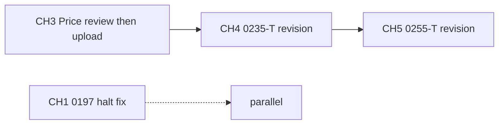

# Project TODO

_Last updated: 2026-06-01 — peer-review work tracked via markdown action plans (no PDF extraction)._

Track cross-repo work here. Manuscript detail: `manuscript/NEXT_STEPS.md`, `manuscript/docs/cts/README_CTS.md`.

**Peer review hub:** `manuscript/docs/cts/cts_peer_review/README.md`

---

## Priority summary

| ID | Manuscript | Chapter | Action plan | Status |
|:---|:-----------|:--------|:------------|:-------|
| **CH3** | CTS-2026-0196 | CH_3 | [cts_2026_0196_revision_action_plan.md](manuscript/docs/cts/cts_peer_review/cts_2026_0196_revision_action_plan.md) | 🟡 **Pending** — package built; **awaiting Dr. Price review** before Wiley upload |
| **CH4** | CTS-2026-0235-T | CH_4 | [cts_0235_t_revision_action_plan.md](manuscript/docs/cts/cts_peer_review/cts_0235_t_revision_action_plan.md) | 🟡 **QMD + response + refs reconciled** — run `-Submit -Chapter 4`, then co-author review |
| **CH5** | CTS-2026-0255-T | CH_5 | [cts_2026_0255_t_revision_action_plan.md](manuscript/docs/cts/cts_peer_review/cts_2026_0255_t_revision_action_plan.md) | 🔴 **Active** — revision due ~June 2026 |
| T4 | `nbstripout` git filter (Windows) | pgx-analysis | — | ⬜ Open |
| T5 | Parent repo local changes (notebooks, puppeteer) | pgx-analysis | — | ⬜ Open |
| T6 | CH1 initial submission (CTS-2026-0197) | CH_1 | `manuscript_status.txt` | 🟡 Halted — title page + supp files |
| T7 | `f31_proposal` folder | pgx-analysis | — | ⬜ Open |

---

## CH3 — CTS-2026-0196 (pending upload)

**Status:** Revision package prepared in repo; **not uploaded to Wiley yet**. Awaiting **Dr. Price** review before portal submission.

Formatting and reviewer comments were addressed in the May 2026 CTS build (see action plan § Likely already addressed). Same CTS fixes are templates for CH4/CH5.

### Before upload (after Price sign-off)

- [ ] Dr. Price review — revised MS, marked MS, point-by-point response
- [ ] Final proofread: marked vs clean DOCX; page refs in response letter match PDF export
- [ ] Confirm supplemental figures S1–S3 uploaded as **separate files** (not embedded in main MS) per editorial halt notes in `manuscript_status.txt`
- [ ] Wiley: Remove & Replace Files — response + marked + clean DOCX + figure TIFFs
- [ ] Deadline: ~4 weeks from May 11, 2026 decision letter (request extension if needed)

**Do not** re-run `sync_docs_cts.py --chapter 3` without `.\build.ps1 -Submit -Chapter 3` first (stale `output/` can regress tracked DOCX).

**Upload paths:** `manuscript/docs/cts/cts_peer_review/` + `docs/cts/submission/ch03/`

---

## CH4 — CTS-2026-0235-T (next)

**Source:** [cts_0235_t_revision_action_plan.md](manuscript/docs/cts/cts_peer_review/cts_0235_t_revision_action_plan.md)  
**QMD:** `manuscript/CH_4/ch04_cts.qmd`  
**Draft response:** [Revision Response for the Causal Calculator Framework Manuscript.md](manuscript/docs/cts/cts_peer_review/Revision%20Response%20for%20the%20Causal%20Calculator%20Framework%20Manuscript.md)

### Phase 1 — Claims & framing (do first)

- [ ] Decide title/claims: *causal*, *DDI*, *polypharmacy*, *Formal Feature Attribution* — align with observational APCD evidence
- [ ] Clarify model target: DDI-specific risk vs utilization / disease confounding (Reviewer 1)
- [ ] Reframe “causal” language for observational design (Reviewer 2)
- [ ] Resolve polypharmacy (≥5 drugs) vs Table 1 median drug counts
- [ ] Associate editor: unstructured abstract; remove “first, second, third” discussion prose

### Phase 2 — Science audit

- [ ] `n_events` dominance in Figure 1 — sensitivity analysis or reframed interpretation
- [ ] Table 2 extreme AUROC/PR-AUC — leakage / trivial predictor audit
- [ ] Surface triplet interactions in main text or new table (Table 3 is pairwise only)
- [ ] PK/exposure limitations in methods + discussion

### Phase 3 — CTS formatting (overlap with CH3 fixes)

Apply same pipeline as CH_3 where not already in `ch04_cts.qmd`:

- [ ] Editorial: tables after references, supp captions in supp files, ORCID, line/page numbers, COI, references, AI disclosure
- [ ] Author Contributions → CTS role list
- [ ] `.\build.ps1 -Submit -Chapter 4 -Journal cts` → `docs/cts/submission/ch04/`
- [ ] Point-by-point response DOCX + marked manuscript → `docs/cts/cts_peer_review/`
- [ ] Wiley upload (Remove & Replace Files); deadline per June 1, 2026 letter (+ extension if requested)

---

## CH5 — CTS-2026-0255-T

**Source:** [cts_2026_0255_t_revision_action_plan.md](manuscript/docs/cts/cts_peer_review/cts_2026_0255_t_revision_action_plan.md)  
**QMD:** `manuscript/CH_5/ch05_cts.qmd`  
**Draft response:** [Revision Response for Serverless Pharmacogenomic Dashboard Manuscript.md](manuscript/docs/cts/cts_peer_review/Revision%20Response%20for%20Serverless%20Pharmacogenomic%20Dashboard%20Manuscript.md)

### Phase 1 — Framing

- [ ] Position as **technical feasibility** unless clinical-outcome evidence is added (Reviewer 2)
- [ ] Soften *causal* / *What-If* → predictions / scenario analysis
- [ ] Privacy/regulatory wording — deployment-context dependent

### Phase 2 — Methods (Reviewer 1)

- [ ] 573 CPIC concordance cases: simulated vs real; cohort description
- [ ] Justify 84-model ensemble; note simpler baselines (single XGBoost, rule-based CPIC)
- [ ] CPIC concordance scoring definition; ambiguous pairs
- [ ] Imputation method for partial inputs
- [ ] Running title — remove “draft”
- [ ] Table S1/S2 legends: age bands, density bins; add 1–2 gene-drug examples

### Phase 3 — Structure & formatting

- [ ] Fix section numbering (jump 4 → 6)
- [ ] Shorten §2.5 storage / §3.7 CI/CD / §3.8 bench → supplement where possible
- [ ] Table 2 readability; compare to existing clinical PGx platforms
- [ ] Editorial package (same CTS checklist as CH3/CH4)
- [ ] Build, response letter, marked MS, upload

---

## Shared CTS revision kit (CH4–CH5)

Reusable from CH_3 work (`build.ps1`, `fix_docx.py`, `mark_revisions.py`, `sync_docs_cts.py`):

| Item | CH_3 (done) | CH_4 / CH_5 |
|:-----|:------------|:--------------|
| Background → Introduction | ✅ | Apply if needed |
| Unstructured abstract | ✅ | Apply |
| Study Highlights after Conclusions | ✅ | Apply |
| Table footnotes vs long captions | ✅ (Table 2) | Audit all tables |
| AI + software in Acknowledgements | ✅ | Apply |
| Discussion: no numbered subsections | ✅ | Apply |
| Line/page numbers in DOCX | ✅ | Regenerate on submit |

---

## T4 — `nbstripout` git filter on Windows

`git status` fails when filter points to `/usr/bin/python3`. Fix local config or document bypass (`git -c filter.nbstripout.clean=cat …`).

---

## T5 — Parent repo local changes

- `4_dashboard_visuals.ipynb`, `5_build_and_deploy.ipynb` (modified)
- `11_testing/puppeteer/*` (untracked)

---

## T6 — CH1 — CTS-2026-0197 (initial, not revision)

From `manuscript/manuscript_status.txt` (April 2026 halted submission):

- [ ] Title page: author names and affiliations below title
- [ ] Upload supplemental Files S1–S5 (separate files; captions inside each)

---

## T7 — `f31_proposal`

Recreate folder + README when F31 drafting starts.

---

## Execution order

1. **CH3** — Dr. Price review → final proofread → Wiley upload  
2. **CH4** — claims pass → science audit → CTS build → upload  
3. **CH5** — framing → methods → structure → upload  
4. **CH1** — editorial halt items when ready for initial resubmit  
5. **T4–T7** — as needed

---

## Completed (2026-06-01)

- [x] Peer review markdown action plans in `docs/cts/cts_peer_review/`
- [x] CH3 revision package in git (manuscript `d2323ef`; parent submodule `258c9b2`) — **upload pending**
- [x] `cts_peer_review/README.md` index (PDFs = archive; plans = source of truth)
