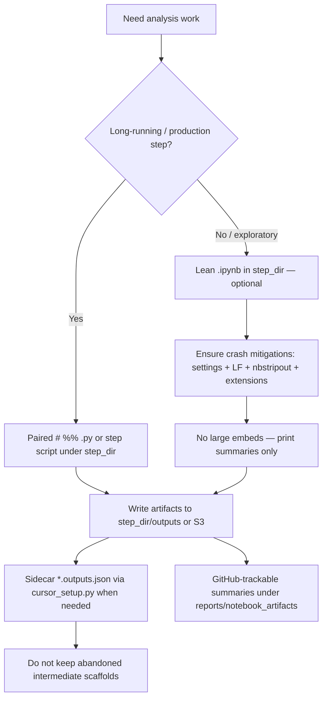

# Notebook Development Workflow

**Final production workflow** for editing/running analysis notebooks in this repo. Intermediate approaches (including a mandatory `notebooks/dev/` vs `notebooks/published/` split) are retired — see [Lessons learned](CrossStep_Development/README_lessons_learned.md#cursor-notebook-stability--final-production-workflow-july-2026).

Goal: keep Cursor stable, keep expensive results on disk/S3, and prefer scripts over ballooning `.ipynb` JSON as the source of truth for production steps.

## Confirmed Cursor notebook crash causes

Blank / frozen / reload-loop notebook tabs are fixed by IDE + git hygiene, not by folder layout. Canonical write-up:

**[`C:\Projects\project_utility_scripts\CURSOR_DEV_RULES.md`](../../project_utility_scripts/CURSOR_DEV_RULES.md)** → **Confirmed Cursor notebook crash causes**

| Cause | Mitigation in this repo |
|:------|:------------------------|
| Jupyter / notebook `settings.json` (Cursor Tab/CPP / format-on-save) | `.vscode/settings.json` → `[jupyter]` block |
| CRLF + `.gitattributes` / broken `nbstripout` filter corrupting JSON | `.gitattributes` → `*.ipynb text eol=lf filter=nbstripout`; install filter with **Windows** Python |
| Conflicting Python / Jupyter extensions | Prefer MS Python + Jupyter + Pylance; `python-envs.defaultEnvManager: venv` |

Short entrypoint: `project_utility_scripts/DEV_RULES.md` → Notebook Defaults.

## Final production workflow



### Rules (production)

1. **Source of truth:** Prefer `# %%` Python scripts or existing step runners (`run_*.py`) for anything that must be re-run on EC2 or cited in manuscripts.
2. **Artifacts out of the notebook:** Parquet / CSV / JSON / plots → `step_dir/outputs/`, `reports/notebook_artifacts/`, or S3 (`py_helpers.notebook_artifacts` / pipeline conventions). Never treat embedded cell output as the durable cache.
3. **Lean `.ipynb` only when useful:** Clear or strip heavy outputs before commit; validate with `nbformat.validate` after structural edits.
4. **Crash mitigations always on:** `[jupyter]` settings, LF notebooks + working Windows `nbstripout`, no conflicting env-manager extensions.
5. **No intermediate scaffolding in the permanent docs or tree:** When a protocol ships, document the **final** path only in lessons learned / READMEs; delete or clearly mark abandoned alternate scripts and unrun scaffolds.

### What we do *not* require

- A mandatory `notebooks/dev/` vs `notebooks/published/` (or `production/`) tree for Cursor stability.
- Rerunning completed analyses just to reorganize folders.
- Mass-moving historical numbered workflow notebooks.

Legacy ignore rules for `**/notebooks/published/**` and `**/notebooks/production/**` in `.cursorignore` remain harmless if those folders still exist; they are not the primary hang fix.

## Artifact helpers (when using a notebook or `# %%` driver)

Near the top of an executed notebook / percent script:

```python
from pathlib import Path
import sys

PROJECT_ROOT = Path.cwd().resolve()
while PROJECT_ROOT != PROJECT_ROOT.parent and not (PROJECT_ROOT / "py_helpers").exists():
    PROJECT_ROOT = PROJECT_ROOT.parent
if str(PROJECT_ROOT) not in sys.path:
    sys.path.insert(0, str(PROJECT_ROOT))

from py_helpers.notebook_artifacts import (
    github_artifact_path,
    local_artifact_path,
    s3_artifact_uri,
    setup_notebook_artifacts,
)

NB_CONTEXT = setup_notebook_artifacts(
    notebook_file=__file__ if "__file__" in globals() else "notebook.ipynb",
    step_name=None,  # e.g. "6_final_model" when known
    run_label="manual",
)

print("GitHub artifact dir:", NB_CONTEXT.github_dir)
print("Local output dir:", NB_CONTEXT.local_output_dir)
print("S3 artifact prefix:", f"s3://{NB_CONTEXT.datalake_bucket}/{NB_CONTEXT.s3_artifact_prefix}")
```

```python
summary_path = github_artifact_path(NB_CONTEXT, "summary.json")
data_path = local_artifact_path(NB_CONTEXT, "intermediate.parquet")
s3_uri = s3_artifact_uri(NB_CONTEXT, "intermediate.parquet")
```

## Useful commands

```bash
python cursor_setup.py status
python cursor_setup.py push-outputs <notebook_path>
python cursor_setup.py fetch-outputs <notebook_path>
jupyter nbconvert --clear-output --inplace <notebook_path>
```

## Cursor recovery pattern

1. Confirm `.vscode/settings.json` has the `[jupyter]` block (Tab/CPP/format-on-save off for notebooks).
2. Validate the `.ipynb` (`nbformat.validate`); check for CRLF and a Windows-safe `nbstripout` filter (`git config --get filter.nbstripout.clean`).
3. Check **Output → Jupyter** / **Python Environments** for extension conflicts; prove the kernel with `jupyter kernelspec list` / `nbclient` outside Cursor.
4. Clear heavy outputs if needed, reopen, or continue in the paired `# %%` / step script.
