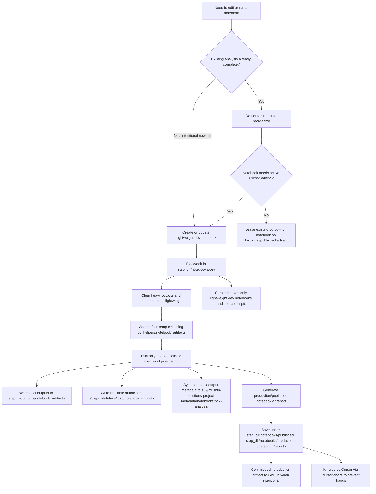

# Notebook Development Workflow

This project uses lightweight development notebooks to keep Cursor stable while preserving reproducible production notebooks and analysis artifacts. The goal is to avoid rerunning expensive analyses solely to reorganize notebooks.

The intended split is:

- `notebooks/dev/`: lightweight notebooks used in Cursor for active development.
- `notebooks/published/` or `notebooks/production/`: output-rich notebooks produced after runs, pushed to GitHub when they are intentional artifacts, and ignored by Cursor indexing.
- S3 notebook metadata bucket: synced notebook cell outputs and sidecar pointers.
- S3 datalake bucket: reusable analysis artifacts created by notebook runs.

## Workflow diagram



## Current migration rule

Do not rerun completed analyses just to create lighter notebooks. Existing output-rich notebooks can remain as historical or published artifacts. When a notebook needs active editing again, create or move a lightweight development copy and keep the output-heavy version as an artifact.

## Recommended layout

For new notebook work inside a pipeline step directory, use:

```text
<step_dir>/notebooks/dev/
<step_dir>/notebooks/published/
<step_dir>/reports/
```

Use `notebooks/dev/` for notebooks actively edited in Cursor. Use `notebooks/published/`, `notebooks/production/`, or `reports/` for output-rich notebooks, HTML exports, and shareable renderings. Published/production notebooks should be eligible for GitHub commits after successful runs but ignored by Cursor via `.cursorignore`.

Examples:

```text
6_final_model/notebooks/dev/
6_final_model/notebooks/published/
6_final_model/reports/

10_risk_dashboard/notebooks/dev/
10_risk_dashboard/notebooks/published/
10_risk_dashboard/reports/
```

## Existing notebooks

Existing numbered workflow notebooks do not need a mass move. Apply this rule opportunistically:

1. If the notebook is not being edited, leave it where it is.
2. If it needs active Cursor editing, create a lightweight copy under `<step_dir>/notebooks/dev/`.
3. Clear outputs in the development copy.
4. Keep the original output-rich notebook, rendered HTML, or published notebook as the reproducibility artifact.
5. Store expensive intermediate outputs as deterministic files or S3 artifacts rather than embedded notebook outputs.

## Development notebook rules

Development notebooks should:

- stay small enough to open reliably in Cursor;
- avoid large embedded tables, plots, JSON payloads, and full dataframe prints;
- write large outputs to deterministic local paths or S3;
- use `*.outputs.json` sidecars when notebook outputs are synced with `cursor_setup.py`;
- be validated structurally after scripted edits with `nbformat.validate(nb)`;
- be cleared before commit when output size causes instability or unnecessary diffs.

## Published artifact rules

Published/production notebooks and reports may contain outputs. They should be treated as generated artifacts, but they can be intentionally tracked and pushed to GitHub after a successful run when they support a manuscript, supplement, dashboard audit, or reproducibility record. They should remain ignored by Cursor indexing so normal development happens from lightweight `notebooks/dev/` copies.

Prefer these artifact locations:

```text
<step_dir>/notebooks/published/
<step_dir>/reports/
<step_dir>/outputs/
```

Do not open output-heavy published notebooks in Cursor during normal development.

## Required setup cell for active dev notebooks

Add this near the top of any notebook that will be actively run or edited in `notebooks/dev/`. This does not rerun analysis by itself; it only sets canonical output locations so artifacts land in the expected GitHub-trackable and S3 paths when cells are executed later.

```python
from pathlib import Path
import sys

PROJECT_ROOT = Path.cwd().resolve()
while PROJECT_ROOT != PROJECT_ROOT.parent and not (PROJECT_ROOT / "py_helpers").exists():
    PROJECT_ROOT = PROJECT_ROOT.parent
if str(PROJECT_ROOT) not in sys.path:
    sys.path.insert(0, str(PROJECT_ROOT))

from py_helpers.notebook_artifacts import (
    github_artifact_path,
    local_artifact_path,
    s3_artifact_uri,
    setup_notebook_artifacts,
)

NB_CONTEXT = setup_notebook_artifacts(
    notebook_file=__file__ if "__file__" in globals() else "notebook.ipynb",
    step_name=None,
    run_label="manual",
)

print("GitHub artifact dir:", NB_CONTEXT.github_dir)
print("Local output dir:", NB_CONTEXT.local_output_dir)
print("S3 artifact prefix:", f"s3://{NB_CONTEXT.datalake_bucket}/{NB_CONTEXT.s3_artifact_prefix}")
```

Use these helpers inside later cells:

```python
# GitHub-trackable summary artifact
summary_path = github_artifact_path(NB_CONTEXT, "summary.json")

# Local reproducibility/output artifact under the step outputs folder
data_path = local_artifact_path(NB_CONTEXT, "intermediate.parquet")

# S3 artifact URI for expensive/reusable outputs
s3_uri = s3_artifact_uri(NB_CONTEXT, "intermediate.parquet")
```

If a notebook has a stable step directory, set `step_name` explicitly, for example:

```python
NB_CONTEXT = setup_notebook_artifacts(
    notebook_file="final_model_dev.ipynb",
    step_name="6_final_model",
    run_label="manual",
)
```

## Useful commands

Inspect notebook/output pointer status:

```bash
python cursor_setup.py status
```

Push notebook outputs to S3 and write a sidecar pointer:

```bash
python cursor_setup.py push-outputs <notebook_path>
```

Fetch synced notebook outputs:

```bash
python cursor_setup.py fetch-outputs <notebook_path>
```

Clear notebook outputs without running analysis:

```bash
jupyter nbconvert --clear-output --inplace <notebook_path>
```

## Cursor recovery pattern

If Cursor starts hanging, showing blank notebook tabs, or repeatedly reloading:

1. Close output-heavy notebooks.
2. Work from a lightweight `notebooks/dev/` copy.
3. Clear outputs in the development copy without rerunning analysis.
4. Restart the kernel only if needed.
5. Use paired Python scripts or `# %%` files for long-running production-style workflow edits.
