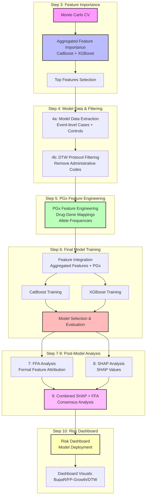

# Analysis Workflow

Feature importance, pattern mining, and final model development for the Prescription Drug Analysis pipeline.

## Overview

The analysis workflow implements a multi-stage approach to feature discovery, noise reduction, model development, and interpretation:

1. **Feature Screening** with three core models (CatBoost, XGBoost boosted trees, XGBoost RF mode) + Monte Carlo cross-validation  
2. **Model Data Extraction** into `4a_model_data/` (target vs control event datasets)  
3. **DTW-Based Protocol Filtering (Step 4b)** in `4b_dtw_filter` to create `model_events_no_protocols.parquet` that is then used as the **preferred input for all downstream feature engineering steps (BupaR, FP-Growth, DTW trajectory features, PGx)**.  
4. **Extreme-Density Transaction Handling (Step 4b extension)** for all cohorts  
   - Run `5b_fpgrowth_analysis/extract_extreme_density_cohort.py` once per `(cohort, age_band)` to split out an `{cohort}_extreme_density` cohort and **rewrite the base `4a_model_data` `model_events.parquet` without extreme-density patients**.  
   - This guarantees that all downstream **feature engineering (`5a`–`5c`) and final model training (`6_final_model`) operate on the non‑extreme base cohorts in `4a_model_data`**, while `_extreme_density` cohorts are reserved for exploratory FP‑Growth / BupaR / DTW analysis.  
5. **Feature Engineering** via FP-Growth, process mining (BupaR), optional DTW trajectory features, and PGx (`5a`–`5c` steps)  
6. **Final Model Development** in `6_final_model/`, split into:
   - **6a_feature_encoding** – cohort- and age-band-specific feature lookup tables and numeric drug codebooks (saved under `feature_encoding_outputs/`).  
   - **6b_final_model_selection** – final feature assembly, Monte Carlo CV, model training/export, and FFA-friendly JSON export.  
7. **Post‑Model Structural Analysis** via FFA (`7_ffa_analysis`).  
8. **SHAP-Based Distributional Analysis** via `8_shap_analysis` (global + local SHAP, aligned with the final model feature set).  
9. **Combined SHAP + FFA Consensus** via `9_combined_shap_ffa` (agreement/disagreement analysis and joint rankings).  
10. **Risk Calculator + Dashboard Deployment** via `10_risk_dashboard` (Lambda-ready model packages and S3-hosted UI).

## Phase 1: Monte Carlo CV + Feature Importance

**Goal**: Robust, model-agnostic feature ranking on noisy, high-dimensional data, using
strict temporal validation and a small, focused model ensemble.

**Process (implemented in `3_feature_importance/` and `4a_model_data/`):**
1. **Monte Carlo Cross-Validation (MC‑CV)**  
   - Train on **2016–2018** and evaluate on a strict **2019 holdout** (no leakage).  
   - Default **10 splits** for feature-importance screening; many more (≈1000) for the final model.
2. **Model Training (per split)**  
   - Fit three core tree models:
     - **CatBoost** (categorical boosting)  
     - **XGBoost** (boosted trees)  
     - **XGBoost RF mode** (random-forest style XGBoost)
3. **Feature Importance (per model)**  
   - Compute **gain/Gini** importance for all tree-based features (XGBoost / XGBoost RF) and flag
     features with `gain_importance > 0`.  
   - Compute **permutation importance on the full feature set** for all models, optionally capping
     rows via `PGX_PERM_MAX_ROWS`.
4. **Aggregation Across Splits and Models**  
   - Aggregate permutation scores per feature across MC‑CV splits.  
   - Normalize within each model, scale by model performance (recall or inverse logloss), then
     aggregate across models (including a rare-variant XGBoost pass when available).
5. **Model Data Extraction (`4a_model_data/`)**  
   - Use the final aggregated importance to drive `4a_model_data` extraction and downstream pattern
     mining / trajectory analysis.

**Cohort Focus Strategy (Phase 1):**

Because full MC‑CV + permutation importance is computationally intensive but critical for
health‑grade robustness, we focus the heaviest analysis on two cohort groups:

- **Cohort Group 1 – Opioid ED (`opioid_ed`)**  
  - Age bands: **\<65** (e.g., 0–12 through 55–64).  
  - Feature space for MC‑CV: **drugs + ICD codes + CPT codes + event type**.

- **Cohort Group 2 – Polypharmacy ED visits (`non_opioid_ed`)**  
  - Age bands: **≥65** (e.g., 65–74 through 95–114).  
  - Feature space for MC‑CV feature importance: **drugs only** (polypharmacy focus).

Other cohort/age-band combinations may be explored with lighter settings (fewer splits or
reduced model sets), but **interpretation for publication and downstream causal analysis
is anchored on these two cohort groups**.

### Current Modeling Plan (Cohort / Age-Band Grid)

For the current analysis run, we fit a **separate end‑to‑end model (Steps 3–8)** for each of the following
`(cohort, age_band)` combinations:

- **Cohort 1 – Opioid ED (`opioid_ed`)**
  - **0–12** – smoke test / pipeline verification cohort
  - **13–24**
  - **25–44**
  - **45–54**
  - **55–64**

- **Cohort 2 – Polypharmacy ED (`non_opioid_ed`)**
  - **65–74**
  - **75–84**
  - **85–94**

Each of these nine cells in the grid will have its own:
- `3_feature_importance` run (MC‑CV + aggregation)
- `4a_model_data` extraction (`model_events.parquet` for target and control)
- `5_*` feature‑engineering passes (FP‑Growth, BupaR, DTW, PGx as applicable)
- `6_final_model` training + evaluation (one final model per `(cohort, age_band)`).

### Model Data Extraction (Target vs Control)

After feature importance is computed for each `(cohort, age_band)` pair, we create a compact
**model-ready event dataset** that downstream methods (FP-Growth, BupaR, DTW) consume:

- **Target cohort (opioid_ed)**:
  - Read `*_aggregated_feature_importance.csv` to get the top important `item_*` features.
  - Strip the `item_` prefix to recover raw drug / ICD / procedure codes.
  - For each age band and event year, filter GOLD cohort events to **only those rows where at least one important item appears** in:
    - `drug_name`
    - `primary_icd_diagnosis_code` through `nine_icd_diagnosis_code`
    - `procedure_code`
  - Write filtered events to:
    - `4a_model_data/cohort_name=opioid_ed/age_band={band}/model_events.parquet`

- **Control cohort (non_opioid_ed)**:
  - Load full, unfiltered control cohort events for the same age band and years.
  - Sample control patients to maintain an approximate **5:1 control:target person-level ratio**.
  - Keep **all events** for sampled control patients (no feature filtering).
  - Write to:
    - `4a_model_data/cohort_name=non_opioid_ed/age_band={band}/model_events.parquet`

These paired `model_events.parquet` files provide a consistent, size-controlled input for FP-Growth,
process mining (BupaR), and DTW trajectory analyses in Phase 2.

## Phase 2: Pattern & Process Mining + DTW + PGx (Feature Engineering in `5_*`)

**Goal**: Exploit structure in selected features and further reduce noise, then
derive per-patient sequence/trajectory features for the final model.

### Components

1. **Step 5a – BupaR Process Mining** (`5a_bupaR_analysis/`)
   - Process mining on drug/ICD/CPT codes for target vs control patients, **using the DTW-filtered `model_events_no_protocols.parquet` when available (else the base `model_events.parquet`) from `4a_model_data`**.  
   - Pre- and post-F1120 sequence analysis (for `opioid_ed`) and general process maps.  
   - Per-patient sequence features and Gantt-style visualizations mirrored to `feature_engineering_outputs/5_bupar/...`.

2. **Step 5b – FPGrowth Analysis** (`5b_fpgrowth_analysis/`)
   - Frequent pattern mining on drug/ICD/CPT codes
   - Target-focused association rules (predicting opioid dependence, ED visits)
   - Itemset metrics and feature encoding
   - **Step 5b output**: cohort-level itemsets/rules under `5b_fpgrowth_analysis/outputs/...`

3. **Step 5c – PGx Feature Engineering** (`5c_pgx_analysis/`)
   - Pharmacogenomics (PGx) analysis on important drugs
   - Drug–gene mapping and allele-frequency-based risk features
   - Patient-level PGx feature tables joined by `mi_person_key`

**Output**: Refined feature set that participates in frequent patterns, stable pathways, and respects process timing

### Extreme-Density Transaction Handling (all cohorts)

> **Why**: A small subset of patients can have extremely dense event histories (thousands of ICD/CPT items per TRAIN window).  
> These patients are clinically interesting but computationally expensive for FP-Growth and BupaR, and they can dominate process-mining plots.  
> We therefore (a) move them into a dedicated "extreme density" cohort for exploratory analysis, and (b) remove them from the main `model_events` used for final models.

For each `(cohort, age_band)` we optionally run the following standardized sub-pipeline:

1. **Identify and extract extreme-density patients**  
   - Script: `5b_fpgrowth_analysis/extract_extreme_density_cohort.py`  
   - Input: `4a_model_data/cohort_name={cohort}/age_band={band}/model_events.parquet`.  
   - Method:
     - Recreates medical_code transactions (all 10 ICD diagnosis positions plus CPT) over TRAIN years (2016–2018).  
     - Uses the same `assign_transaction_density` logic as `cohort_fpgrowth.py` to compute `transaction_size` per patient and bin into  
       `low`, `medium`, `high`, and `extreme` based on percentile cut-points (P25/P50/P75/P95).  
     - Flags all patients in the `extreme` bin.  
   - Outputs:
     - CSV of extreme patients:  
       `4a_model_data/cohort_name={cohort}/age_band={band}/extreme_density_patients_{band_fname}.csv`.  
     - New cohort with only extreme patients:  
       `4a_model_data/cohort_name={cohort}_extreme_density/age_band={band}/model_events.parquet`.  
     - Updated base `model_events.parquet` with extreme patients removed, plus a backup:  
       `model_events_with_extreme.parquet` in the same folder.

2. **Summarize and visualize the extreme-density cohort**  
   - Script: `5b_fpgrowth_analysis/summarize_extreme_density_cohort.py`.  
   - Input: `4a_model_data/cohort_name={cohort}_extreme_density/age_band={band}/model_events_no_protocols.parquet` when present, otherwise the base `model_events.parquet`.  
   - Outputs (per `(cohort, age_band)` extreme cohort):
     - Patient-level summary:
       - `extreme_density_patient_summary_{band_fname}.csv` with per-patient counts  
         (`n_events_total`, `n_events_pharmacy`, `n_events_medical`, `transaction_size_medical`, `target`).  
     - Frequency tables and PNG plots:
       - `extreme_density_drug_frequency_{band_fname}.{csv,png}`.  
       - `extreme_density_icd_frequency_{band_fname}.{csv,png}` (all ICD positions collapsed).  
       - `extreme_density_cpt_frequency_{band_fname}.{csv,png}`.  
     - Histogram:
       - `extreme_density_transaction_size_hist_{band_fname}.png` (distribution of `transaction_size_medical`).  
     - Aggregate JSON summary:
       - `extreme_density_summary_{band_fname}.json` with counts, event_type breakdown, target prevalence, and transaction-size stats.

3. **BupaR process-mining for the extreme cohort**  
   - For `opioid_ed`, we run: `5a_bupaR_analysis/create_bupar_outputs_opioid_ed_extreme.R {age_band}`.  
   - This script:
     - Reads `4a_model_data/cohort_name=opioid_ed_extreme_density/age_band={band}/model_events.parquet`.  
     - Reuses the FP-Growth TARGET-only itemsets from the base `opioid_ed` cohort to define the activity alphabet (ICD/DRUG/CPT).  
     - Builds a target-only eventlog for the extreme patients and computes:
       - Target-only trace tables and process matrices.  
       - Post-F1120 sequence features and patient-level post-F1120 summaries.  
       - Overall activity-frequency and Gantt-style process plots for the extreme subset.  
   - Outputs:
     - Features under  
       `5a_bupaR_analysis/outputs/opioid_ed_extreme_density/{band_fname}/features/*.csv` (also mirrored to S3).  
     - Plots under  
       `feature_engineering_outputs/5_bupar/opioid_ed_extreme_density/{age_band}/plots/*.png`.  

4. **FP-Growth and DTW for the extreme cohort (feature-engineering mirror)**  
   - **FP-Growth**: run `5b_fpgrowth_analysis/run_analysis.py --cohort-name {cohort}_extreme_density --age-band {age_band}` to mine itemsets and rules solely within the extreme cohort and create FP-Growth features and plots under `feature_engineering_outputs/4_fpgrowth/{cohort}_extreme_density/{age_band}/`.  
   - **DTW**: run `4b_dtw_filter/run_analysis.py --cohort-name {cohort}_extreme_density --age-band {age_band}` followed by `4b_dtw_filter/create_dtw_plots.py --cohort-name {cohort}_extreme_density --age-band {age_band}` to generate DTW trajectory features and DTW-specific visualizations under `feature_engineering_outputs/6_dtw/{cohort}_extreme_density/{age_band}/`.  

Over time we will repeat this extreme-density sub-pipeline for all cohorts and age bands, using these four steps so that every main model has a paired "extreme" cohort with its own FP-Growth, DTW, and BupaR feature engineering for exploratory visualization and process-mining, while keeping the main `model_events` used for modeling tractable.

## Phase 3: Final Model Development (`6_final_model/`)

**Goal**: Integrate features from all analysis methods into final prediction model.

**Process**:
1. **Feature Integration**: Combine feature-importance–filtered `4a_model_data`,
   FP-Growth pattern information, BupaR sequence features, optional DTW trajectory
   features, and PGx features into a single patient-level table (e.g. via
   `6_final_model/build_final_cohort_model_features.py` for a given `(cohort, age_band)`).
2. **Feature Schema**: Unified patient-level feature matrix (~185-750 features)
3. **Model Training**: CatBoost and Random Forest on integrated features
4. **Model Evaluation**: Performance metrics and feature importance analysis

**Output**: Trained models with interpretable feature sets

**Location**: `6_final_model/`

## Enhanced Analysis Workflow Architecture

### Core Components

**1. FP-Growth Pattern Mining Layer**
- Implements market basket analysis on medication sequences to identify initial feature importances
- Identifies co-occurring prescriptions using minimum support thresholds (default: 0.05 for initial pattern discovery)
- Discovers significant event patterns that feed into both:
  - BupaR process mining for temporal analysis
  - CatBoost models for predictive modeling
- Filters patterns based on:
  - Minimum support threshold
  - Pattern frequency in positive vs negative samples
  - Clinical relevance of co-occurring events

**2. BupaR Process Mining Engine**
- Uses FP-Growth identified patterns to construct event logs using `mi_person_key` as case identifier
- Performs temporal analysis through process maps and trace alignment
- Identifies hospitalization precursor patterns
- Calculates throughput times between drug administrations
- Validates patterns through:
  - Process conformance checking
  - Trace alignment analysis
  - Performance metrics evaluation

**3. CatBoost Predictive Modeling**
- Incorporates FP-Growth discovered patterns as network features
- Uses Formal Feature Attribution (FFA) for feature importance analysis
- Implements temporal cross-validation for cohort-based forecasting
- Validates feature importance through:
  - Cross-validation stability
  - Statistical significance testing
  - Clinical relevance assessment

**4. FFA-based Importance Ranking**
- Uses FFA to rank features by their importance in predicting hospitalization risk
- Identifies top K important features based on:
  - Support and coverage thresholds
  - Statistical significance testing
  - Class-specific importance rankings
  - Cross-validation stability

## DTW and BupaR Integration

**DTW (Dynamic Time Warping)** and **BupaR (Process Mining)** serve different but complementary purposes:

| Aspect | DTW | BupaR |
|--------|-----|-------|
| **Scope** | Pairwise sequence comparison | Process discovery across many cases |
| **Output** | Distance metric | Process maps, flow diagrams |
| **Abstraction** | Low-level (raw sequences) | High-level (process patterns) |
| **Scalability** | O(n²) for each pair | Handles thousands of cases |
| **Interpretability** | "These sequences are X% similar" | "80% of patients follow path A→B→C" |

### DTW: Sequence Similarity Analysis

**Purpose:** Measure similarity between individual patient drug sequences that may vary in timing and length.

**Use Cases:**
1. **Patient Clustering**: Group patients with similar drug exposure histories
2. **Outlier Detection**: Identify patients with unusual drug sequences
3. **Similarity-Based Features**: Calculate distance to known high-risk patterns
4. **Sequence Validation**: Compare drug sequences across different time periods

### BupaR: Process Discovery and Pathway Analysis

**Purpose:** Discover common process flows and temporal patterns across patient populations.

**Use Cases:**
1. **Process Flow Discovery**: Identify common pathways from drug exposure to outcomes
2. **Temporal Pattern Analysis**: Understand timing relationships between events
3. **Pathway Comparison**: Compare process flows between target and control groups
4. **Performance Analysis**: Measure throughput times and bottlenecks

### Integrated Workflow: DTW + BupaR

1. **Cluster patients by drug sequence similarity** (DTW)
2. **Add cluster labels to patient data**
3. **Analyze process patterns within each DTW cluster** (BupaR)
4. **Compare process flows across clusters**
5. **Identify high-risk trajectory patterns**

## Analysis Pipeline Overview



## Key Insights

| Question | Analysis Method | Insights |
|----------|----------------|-----------|
| What itemsets are most common? | FpGrowth | Frequent co-occurrence patterns |
| How do itemsets play out temporally? | BupaR | Process flows and sequences |
| Which itemsets drive model predictions? | CatBoost + FFA | Risk-influential patterns |
| Are process-dominant paths aligned with risk? | BupaR vs. FFA | Pattern alignment analysis |

## Model Artifacts and Storage Structure

The pipeline generates and stores various model artifacts for each cohort and age band:

### Model Artifacts Structure
All model artifacts are stored in S3 with the following partition structure:
```
s3://{S3_BUCKET}/{artifact_type}/cohort_name={cohort}/age_band={band}/event_year={year}/
```

### Artifact Types and Contents

1. **Model Metrics and Info**
   - `model_metrics.json`: Performance metrics (AUC, accuracy, F1, precision, recall, Brier score, log loss)
   - `model_info.json`: Model metadata, feature names, and native feature importances

2. **SHAP Analysis**
   - `shap_values.parquet`: Raw SHAP values for feature importance analysis
   - `shap_plots/`: Directory containing SHAP value visualization plots for each class

3. **Cattail Analysis**
   - `cattail_plots/`: Directory containing Cattail distribution plots showing feature value distributions

4. **Causal Analysis**
   - `causal_summary.json`: Causal analysis results including feature effects and summary statistics

5. **Calibration Analysis**
   - `calibration_plots/`: Directory containing model calibration curves for each class

6. **Mirror Plots**
   - `mirror_plots/`: Directory containing feature importance mirror plots comparing classes

## Related Documentation

- [`README_overview.md`](README_overview.md) - Project structure and components
- [`README_data_pipeline.md`](README_data_pipeline.md) - Data processing and cohort creation
- [`README_data_visualizations.md`](README_data_visualizations.md) - Visualization approaches
- [`docs/README_feature_importance.md`](docs/README_feature_importance.md) - Feature importance analysis
- [`docs/README_fpgrowth.md`](docs/README_fpgrowth.md) - FP-Growth pattern mining
- [`docs/README_bupaR.md`](docs/README_bupaR.md) - Process mining with BupaR
- [`docs/README_dtw_feature_extraction.md`](docs/README_dtw_feature_extraction.md) - DTW trajectory analysis
- [`docs/README_final_model.md`](docs/README_final_model.md) - Final model development

