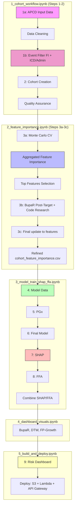

# Analysis Workflow

Feature importance, pattern mining, and final model development for the Prescription Drug Analysis pipeline.

## Overview

The analysis workflow implements a multi-stage approach to feature discovery, noise reduction, model development, and interpretation:

1. **Feature Screening** with three core models (CatBoost, XGBoost boosted trees, XGBoost RF mode) + Monte Carlo cross-validation  
2. **Feature Refinement (Feature Importance EDA)** using BupaR post-target analysis to filter and refine aggregated feature importances, producing `cohort_feature_importance` files
3. **Step 3c (final update to features)** – Strip any remaining BupaR-identified leakage from `cohort_feature_importance.csv` in `2_feature_importance.ipynb`; these CSVs are the only input to Step 4
4. **Model Data Extraction** into `4_model_data/` (target vs control event datasets) using refined features from Step 3c  
5. **Event Filtering (Step 1b)** – Aggregated FI + ICD/administrative code filtering in `1b_apcd_event_filter`; runs before cohort creation (Step 2).
6. **PGx Feature Engineering (Step 5)** via `5_pgx_analysis/` adding pharmacogenomics features
7. **Final Model Development** in `6_final_model/`
   - Feature encoding (cohort- and age-band-specific lookup tables, drug codebooks; saved under `feature_encoding_outputs/`).
   - Final feature assembly, Monte Carlo CV, model training/export, and FFA-friendly JSON export. Train/test datasets are uploaded to S3 (required for SHAP and FFA analysis).  
8. **SHAP-Based Distributional Analysis** via `7_shap_analysis` (global + local SHAP for both XGBoost and CatBoost, aligned with the final model feature set). Must run before Step 8 since FFA uses SHAP importance to filter and prioritize rules.
9. **Post‑Model Structural Analysis** via FFA (`8_ffa_analysis`):
   - **XGBoost FFA only**: FFA analysis is performed only for XGBoost models
   - **CatBoost FFA**: NOT performed due to CatBoost's complex hashing and CTR (Counter-based Target Statistics) for categorical variables
   - **CatBoost SHAP**: Used for feature importance filtering in XGBoost FFA (not for CatBoost FFA rule extraction)
   - **Rule Selection**: Uses SHAP importance from both XGBoost and CatBoost (from Step 7) to filter and prioritize rules for AXP computation. Rule selection uses a three-set union: (1) first 100 matched rules, (2) random sample of 100 matched rules, and (3) top 300 SHAP-filtered rules (or all rules above 10th percentile, whichever is larger). Causal analysis filters the final rule set based on causal importance scores.
10. **Risk Calculator + Dashboard Deployment** via `10_risk_dashboard` (Lambda-ready model packages and S3-hosted UI).

## Phase 1: Monte Carlo CV + Feature Importance

**Goal**: Robust, model-agnostic feature ranking on noisy, high-dimensional data, using
strict temporal validation and a small, focused model ensemble.

**Process (implemented in `3a_feature_importance/`, `3b_feature_importance_eda/`, and `4_model_data/`):**
1. **Monte Carlo Cross-Validation (MC‑CV)**  
   - Train on **2016–2018** and evaluate on a strict **2019 holdout** (no leakage).  
   - Default **10 splits** for feature-importance screening; many more (≈1000) for the final model.
2. **Model Training (per split)**  
   - Fit three core tree models:
     - **CatBoost** (categorical boosting)  
     - **XGBoost** (boosted trees)  
     - **XGBoost RF mode** (random-forest style XGBoost)
3. **Feature Importance (per model)**  
   - Compute **gain/Gini** importance for all tree-based features (XGBoost / XGBoost RF) and flag
     features with `gain_importance > 0`.  
   - Compute **permutation importance on the full feature set** for all models, optionally capping
     rows via `PGX_PERM_MAX_ROWS`.
4. **Aggregation Across Splits and Models**  
   - Aggregate permutation scores per feature across MC‑CV splits.  
   - Normalize within each model, scale by model performance (recall or inverse logloss), then
     aggregate across models (including a rare-variant XGBoost pass when available).
5. **Feature Refinement (Feature Importance EDA - `3b_feature_importance_eda/`)**  
   - **BupaR Post-Target Analysis**: Use process mining to identify post-target leakage; **Step 4** removes those events when building model data (linear flow: 3b → 4).
   - **Code Research and Validation**: Research and identify non-informative administrative/scheduling codes (event-level filtering in Step 1b: `1b_apcd_event_filter`).
   - **Filter and Refine**: Refine aggregated feature importance and generate `cohort_feature_importance` files.
   - **Note**: This is NOT a DTW filter - it uses BupaR process mining and code research to filter already-processed aggregated feature importances.
   - Output: `cohort_feature_importance.csv` files (intermediate).
6. **Step 3c (final update to features)** – In `2_feature_importance.ipynb`, strip any remaining BupaR-identified leakage from each `cohort_feature_importance.csv`. Step 4 uses only these updated CSVs (required; run after all Step 3b cells).
7. **Model Data Extraction (`4_model_data/`)**  
   - Use the refined `cohort_feature_importance` files from Step 3c to drive `4_model_data` extraction.
   - **Target leakage removal (Step 4)**: For case events, keep only events **strictly before** the target date (`event_date < first_opioid_ed_date` or `first_ed_non_opioid_date`); events on/after target date are dropped here (linear: 3b/3c identify → 4 removes).
   - If Step 3c output is missing, Step 4 will error (no fallback to aggregated importances).

**Cohort Focus Strategy (Phase 1):**

Because full MC‑CV + permutation importance is computationally intensive but critical for
health‑grade robustness, we focus the heaviest analysis on two cohort groups:

- **Cohort Group 1 – Opioid ED (`opioid_ed`)**  
  - Age bands: **\<65** (e.g., 0–12 through 55–64).  
  - Feature space for MC‑CV: **drugs + ICD codes + CPT codes + event type**.

- **Cohort Group 2 – Polypharmacy ED visits (`non_opioid_ed`)**  
  - Age bands: **≥65** (e.g., 65–74 through 95–114).  
  - Feature space for MC‑CV feature importance: **drugs only** (polypharmacy focus).

Other cohort/age-band combinations may be explored with lighter settings (fewer splits or
reduced model sets), but **interpretation for publication and downstream causal analysis
is anchored on these two cohort groups**.

### Current Modeling Plan (Cohort / Age-Band Grid)

For the current analysis run, we fit a **separate end‑to‑end model (Steps 3–9)** for each of the following
`(cohort, age_band)` combinations:

- **Cohort 1 – Opioid ED (`opioid_ed`)**
  - **0–12** – smoke test / pipeline verification cohort
  - **13–24**
  - **25–44**
  - **45–54**
  - **55–64**

- **Cohort 2 – Polypharmacy ED (`non_opioid_ed`)**
  - **65–74**
  - **75–84**
  - **85–94**

Each of these nine cells in the grid will have its own:
- `3a_feature_importance` run (MC‑CV + aggregation)
- `4_model_data` extraction (`model_events.parquet` for target and control)
- `5_*` feature‑engineering passes (PGx as applicable; FP‑Growth and BupaR are dashboard-only visualizations; DTW is used in Step 9 for dashboard visualizations only)
- `6_final_model` training + evaluation (one final model per `(cohort, age_band)`).

### Model Data Extraction (Target vs Control)

After feature importance is computed for each `(cohort, age_band)` pair, we create a compact
**model-ready event dataset** that downstream methods consume:

- **Target cohort (opioid_ed)**:
  - Read `*_cohort_feature_importance.csv` from Feature Importance EDA (REQUIRED - no fallback to aggregated importances)
  - Strip the `item_` prefix to recover raw drug / ICD / procedure codes.
  - For each age band and event year, filter GOLD cohort events to **only those rows where at least one important item appears** in:
    - `drug_name`
    - `primary_icd_diagnosis_code` through `nine_icd_diagnosis_code`
    - `procedure_code`
  - Write filtered events to:
    - `4_model_data/cohort_name=opioid_ed/age_band={band}/model_events.parquet`

- **Second cohort partition (e.g. non_opioid_ed)**:
  - Each cohort partition has its own `model_events.parquet` with **within-cohort** cases (target=1) and controls (target=0).
  - Control = non-target for that cohort (no F1120 for opioid_ed; no first ED [HCG] within 21 days of drug for non_opioid_ed). Do **not** use the opposite cohort as "control."
  - Load full, unfiltered events for the same age band and years; sample to maintain ~**5:1 control:target**; write to e.g. `4_model_data/cohort_name=non_opioid_ed/age_band={band}/model_events.parquet`.

**BupaR / dashboard**: Control is always **within-cohort** (target=0 from the same `model_events` file), not the other cohort partition. These `model_events.parquet` files provide the input for BupaR and downstream feature engineering.

## Phase 2: PGx Feature Engineering (Step 5)

**Goal**: Add pharmacogenomics (PGx) features to the model-ready dataset.

### Step 5: PGx Feature Engineering (`5_pgx_analysis/`)

- Pharmacogenomics (PGx) analysis on important drugs
- Drug–gene mapping and allele-frequency-based risk features
- Patient-level PGx feature tables joined by `mi_person_key`

**Output**: PGx features integrated into the model-ready dataset

**Note**: 
- **Feature Importance EDA**: Uses BupaR post-target analysis for feature refinement (not DTW)
- **Step 1b** (`1b_apcd_event_filter`): Event-level ICD/administrative code filtering (before cohort creation). **Step 4** (`4_model_data/`): Produces `model_events.parquet` per (cohort, age_band).
- **Step 9**: Risk dashboard visualizations (BupaR process mining, FP-Growth patterns, DTW trajectories - visualization only)

## Phase 3: Final Model Development (`6_final_model/`)

**Goal**: Integrate features from all analysis methods into final prediction model.

**Process**:
1. **Feature Integration**: Combine feature-importance–filtered `4_model_data` and PGx features into a single patient-level table (e.g. via `6_final_model/run_final_model.py` for a given `(cohort, age_band)`).
2. **Feature Schema**: Unified patient-level feature matrix (~185-750 features)
3. **Model Training**: CatBoost and Random Forest on integrated features
4. **Model Evaluation**: Performance metrics and feature importance analysis

**Output**: Trained models with interpretable feature sets

**Location**: `6_final_model/`

## Enhanced Analysis Workflow Architecture

### Core Components

**1. FP-Growth Pattern Mining Layer**
- Implements market basket analysis on medication sequences to identify initial feature importances
- Identifies co-occurring prescriptions using minimum support thresholds (default: 0.05 for initial pattern discovery)
- Discovers significant event patterns that feed into both:
  - BupaR process mining for temporal analysis
  - CatBoost models for predictive modeling
- Filters patterns based on:
  - Minimum support threshold
  - Pattern frequency in positive vs negative samples
  - Clinical relevance of co-occurring events

**2. BupaR Process Mining Engine**
- Uses FP-Growth identified patterns to construct event logs using `mi_person_key` as case identifier
- Performs temporal analysis through process maps and trace alignment
- Identifies hospitalization precursor patterns
- Calculates throughput times between drug administrations
- Validates patterns through:
  - Process conformance checking
  - Trace alignment analysis
  - Performance metrics evaluation

**3. CatBoost Predictive Modeling**
- Incorporates FP-Growth discovered patterns as network features
- Uses Formal Feature Attribution (FFA) for feature importance analysis
- Implements temporal cross-validation for cohort-based forecasting
- Validates feature importance through:
  - Cross-validation stability
  - Statistical significance testing
  - Clinical relevance assessment

**4. FFA-based Importance Ranking**
- Uses FFA to rank features by their importance in predicting hospitalization risk
- Identifies top K important features based on:
  - Support and coverage thresholds
  - Statistical significance testing
  - Class-specific importance rankings
  - Cross-validation stability

## DTW Usage: Protocol Filtering and Dashboard Visualizations

**DTW (Dynamic Time Warping)** is used in two distinct contexts:

### 1. Event-Level Filtering (Step 1b)

**Purpose**: Filter administrative/ICD codes from event data before cohort creation.

**Location**: `1b_apcd_event_filter/`

**Output**: Filtered events feed into cohort creation (Step 2) and model data (Step 4). Step 4 produces `model_events.parquet` per (cohort, age_band).

**Use Cases:**
1. **Administrative Code Filtering**: Remove non-predictive administrative/scheduling codes (via `administrative_codes_lookup.json`).
2. **Data Cleaning**: Event-level filtering in Step 1b ensures cohorts and feature importance (3a/3b) use the same filtered event set.

### 2. DTW Dashboard Visualizations (Step 9)

**Purpose**: Trajectory analysis and visualization for dashboard exploration

**Location**: `10_risk_dashboard/visualizations/dtw/`

**Use Cases:**
1. **Patient Clustering**: Group patients with similar drug exposure histories
2. **Trajectory Visualization**: Interactive dashboard visualization of patient trajectories
3. **Outlier Detection**: Identify patients with unusual drug sequences
4. **Exploratory Analysis**: Visual exploration of sequence patterns (visualization only, not used as model features)

**Note**: DTW trajectory analysis in Step 9 is for dashboard visualizations only - these are not used as model features.

### BupaR: Process Discovery and Pathway Analysis

**Purpose:** Discover common process flows and temporal patterns across patient populations.

**Use Cases:**
1. **Feature Importance EDA**: Post-target analysis to identify leakage features (Feature Importance EDA)
2. **Process Flow Discovery**: Identify common pathways from drug exposure to outcomes (Step 9 dashboard)
3. **Temporal Pattern Analysis**: Understand timing relationships between events
4. **Pathway Comparison**: Compare process flows between target and control groups
5. **Dashboard Visualizations**: Process mining visualizations for interactive exploration (Step 9)

## Analysis Pipeline Overview

Full pipeline: **Steps 1-2** (1_cohort_workflow.ipynb) → **Steps 3a-3c** (2_feature_importance.ipynb) → **Steps 4-8 + combine** (3_model_train_shap_ffa.ipynb) → **Dashboard visuals** (4_dashboard_visuals.ipynb) → **Step 9** (5_build_and_deploy.ipynb). Each notebook uses **S3 sync to NVMe** for inputs and **S3 checkpoints** for idempotency. Step 1b: aggregated FI + ICD/administrative filtering. Step 3c: final update to features passed into Step 4. Step 4: model data and target leakage removal (case events before target date only).



## Key Insights

| Question | Analysis Method | Insights |
|----------|----------------|-----------|
| What itemsets are most common? | FP-Growth (visualization) | Frequent co-occurrence patterns for exploratory analysis |
| How do itemsets play out temporally? | BupaR (visualization) | Process flows and sequences for clinical interpretation |
| Which itemsets drive model predictions? | XGBoost FFA + CatBoost SHAP | Risk-influential patterns (XGBoost FFA with CatBoost SHAP filtering) |
| Are process-dominant paths aligned with risk? | BupaR vs. FFA | Pattern alignment analysis (visualization complements causal analysis) |

## Lessons Learned

### Why FP-Growth, BupaR, and DTW Are Visualization-Only

**FP-Growth**:
- **Target Leakage Risk**: Patterns mined from combined target+control data can encode target-specific information
- **Direct Leakage**: Rules may include target codes (e.g., F1120) as consequents, creating perfect target leakage
- **Solution**: Use FP-Growth for visualization and exploratory analysis only, not as model features

**BupaR**:
- **Complexity vs. Benefit**: Process mining features add significant complexity without sufficient predictive benefit over aggregated feature importances
- **Value in Exploration**: BupaR visualizations provide valuable clinical insights into patient pathways
- **Solution**: Use BupaR in Feature Importance EDA for feature refinement (post-target analysis) and in Step 9 for dashboard visualizations, but not as model features

**DTW**:
- **Protocol Filtering**: DTW excels at identifying standard care protocols that both targets and controls follow
- **Non-Predictive**: These protocols are non-predictive by design (they're standard care)
- **Solution**: Event/ICD filtering runs in **Step 1b** (1b_apcd_event_filter); use DTW for trajectory visualization (Step 9), but not as model features

### Why Aggregated Features Are Used Directly (No Encoding)

**Initial Approach**: Feature encoding step to convert categorical features to numeric codes.

**Final Approach**: Use aggregated feature importances directly from Step 3.

**Key Insights**:
- **MC-CV Already Filters**: The Monte Carlo cross-validation process already identifies and ranks the most important features
- **Reduced Complexity**: Eliminating encoding reduces pipeline complexity and potential sources of error
- **Maintains Predictive Power**: Aggregated importances capture the essential signals without encoding overhead
- **PGx Adds Value**: PGx features provide additional pharmacogenomic information that complements aggregated features

**Result**: Simpler, more maintainable pipeline with equivalent or better predictive performance.

### Why SHAP Filters FFA Rules

**Approach**: Use SHAP importance from Step 7 to filter and prioritize rules for FFA (Step 8) AXP computation.

**Key Insights**:
- **Rule Explosion**: Without filtering, FFA can generate thousands of rules, many of which are noise
- **SHAP as Quality Filter**: SHAP importance identifies features that actually contribute to predictions
- **Three-Set Union**: Rule selection uses union of (1) first 100 matched rules, (2) random sample of 100 matched rules, and (3) top 300 SHAP-filtered rules
- **Causal Filtering**: Final rule set further filtered based on causal importance scores

**Result**: Focused, high-quality rule set for causal analysis that balances comprehensiveness with interpretability.

### Why CatBoost FFA Is Not Performed

**Technical Limitation**: CatBoost's complex hashing and CTR (Counter-based Target Statistics) transformations make symbolic rule extraction difficult.

**Design Philosophy**: This limitation functions as a deliberate quality control mechanism.

**Key Insights**:
- **Model Agreement**: Requiring features to be detected by CatBoost (SHAP) AND describable by XGBoost (symbolic rules) filters out model-specific artifacts
- **Robustness**: If CatBoost finds a signal that XGBoost cannot replicate, it may be an artifact of CatBoost's specific encoding
- **Clinical Actionability**: Features that can't be translated to symbolic rules are too opaque for clinical decision-making

**Result**: Higher-confidence features in causal analysis, with explicit logical verification possible.

## Output Paths Summary

### Step 5: PGx Feature Engineering Output Paths

#### Local File Paths

**Prerequisite Files (Cohort-Level, Shared Across Age Bands):**
- `5_pgx_analysis/outputs/{cohort}/{cohort}_drug_gene_mappings.csv` - Drug-to-gene mappings (cohort-level)
- `5_pgx_analysis/outputs/{cohort}/{cohort}_allele_frequencies.csv` - Allele frequencies (cohort-level)

**Global Cache Files (Shared Across All Cohorts):**
- `5_pgx_analysis/outputs/global/pgx_drug_gene_mappings_global.csv` - Global drug-gene mapping cache
- `5_pgx_analysis/outputs/global/pgx_allele_frequencies_global.csv` - Global allele frequency cache

**Feature Files (Age-Band Specific):**
- `5_pgx_analysis/outputs/feature_engineering/pgx_features_{cohort}_{age_band}.csv` - Intermediate patient-level PGx features
- `5_pgx_analysis/outputs/feature_engineering/pgx_added_features_{cohort}_{age_band}.csv` - Final PGx features ready for model training
- `5_feature_engineering/feature_engineering_outputs/7_pgx/{cohort}/{age_band}/pgx_features_{cohort}_{age_band}.csv` - Mirrored intermediate features
- `5_feature_engineering/feature_engineering_outputs/7_pgx/{cohort}/{age_band}/pgx_added_features_{cohort}_{age_band}.csv` - Mirrored final features

#### S3 Output Paths

**Primary S3 Location (`gold/pgx_features/`):**
- `s3://pgxdatalake/gold/pgx_features/{cohort}/{age_band}/pgx_added_features_{cohort}_{age_band}.csv` - Final PGx features
- `s3://pgxdatalake/gold/pgx_features/{cohort}/{age_band}/pgx_features_{cohort}_{age_band}.csv` - Intermediate PGx features
- `s3://pgxdatalake/gold/pgx_features/{cohort}/{age_band}/{cohort}_drug_gene_mappings.csv` - Drug-gene mappings (age-band specific copy)
- `s3://pgxdatalake/gold/pgx_features/{cohort}/{age_band}/{cohort}_allele_frequencies.csv` - Allele frequencies (age-band specific copy)

**Global Cache S3 Paths:**
- `s3://pgxdatalake/gold/pgx_features/global/pgx_drug_gene_mappings_global.csv` - Global drug-gene mapping cache
- `s3://pgxdatalake/gold/pgx_features/global/pgx_allele_frequencies_global.csv` - Global allele frequency cache

**Checkpoints:**
- `s3://pgx-repository/pipeline_checkpoints/5_pgx_analysis/{cohort}/{age_band}/checkpoint.json` - Step 5 completion checkpoint
- `s3://pgx-repository/7_pgx_log/{cohort}/{age_band}/pgx_{cohort}_{age_band}.log` - Step 5 execution logs

#### File Naming Conventions

- **Age band format**: `{age_band}` uses hyphens (e.g., `13-24`)
- **Filename format**: `{age_band_fname}` uses underscores (e.g., `13_24`)
- **Cohort-level files**: Shared across all age bands for a given cohort
- **Global cache files**: Shared across all cohorts and age bands

#### Idempotency Checks

The workflow checks for existing outputs in this order:
1. **Local files**: Checks cohort-level, then global cache
2. **S3 files**: Checks global cache → cohort-level paths
3. **Checkpoints**: Checks `pgx-repository` bucket for completion checkpoints

If outputs exist, the step is skipped. To force regeneration, use:
```bash
# Clear PGx outputs if needed: run from 5_pgx_analysis/ or use archived/utility_scripts/clear_pgx_step5_outputs.py if present
# Example: python archived/utility_scripts/clear_pgx_step5_outputs.py --cohort {cohort} --age-band {age_band} --clear-local --clear-prerequisites
```

## Model Artifacts and Storage Structure

The pipeline generates and stores various model artifacts for each cohort and age band:

### Model Artifacts Structure
All model artifacts are stored in S3 with the following partition structure:
```
s3://{S3_BUCKET}/{artifact_type}/cohort_name={cohort}/age_band={band}/event_year={year}/
```

### Artifact Types and Contents

1. **Model Metrics and Info**
   - `model_metrics.json`: Performance metrics (AUC, accuracy, F1, precision, recall, Brier score, log loss)
   - `model_info.json`: Model metadata, feature names, and native feature importances

2. **SHAP Analysis**
   - `shap_values.parquet`: Raw SHAP values for feature importance analysis
   - `shap_plots/`: Directory containing SHAP value visualization plots for each class

3. **Cattail Analysis**
   - `cattail_plots/`: Directory containing Cattail distribution plots showing feature value distributions

4. **Causal Analysis**
   - `causal_summary.json`: Causal analysis results including feature effects and summary statistics

5. **Calibration Analysis**
   - `calibration_plots/`: Directory containing model calibration curves for each class

6. **Mirror Plots**
   - `mirror_plots/`: Directory containing feature importance mirror plots comparing classes

## Related Documentation

- [`README_overview.md`](README_overview.md) - Project structure and components
- [`README_data_pipeline.md`](README_data_pipeline.md) - Data processing and cohort creation
- [`README_data_visualizations.md`](README_data_visualizations.md) - Visualization approaches
- [`docs/README_feature_importance.md`](docs/README_feature_importance.md) - Feature importance analysis
- [`docs/README_fpgrowth.md`](docs/README_fpgrowth.md) - FP-Growth pattern mining
- [`3b_feature_importance_eda/1_bupaR/README_bupaR.md`](../3b_feature_importance_eda/1_bupaR/README_bupaR.md) - Process mining with BupaR
- [`docs/README_dtw_feature_extraction.md`](docs/README_dtw_feature_extraction.md) - DTW trajectory analysis
- [`docs/README_final_model.md`](docs/README_final_model.md) - Final model development

