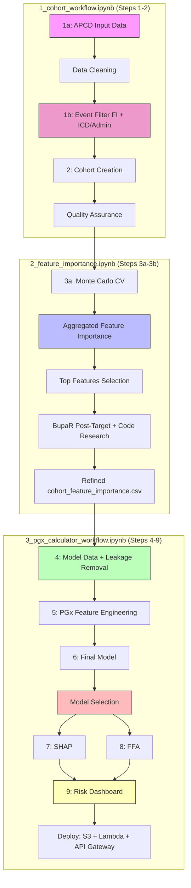

# Overview

Project structure, components, and high-level workflow for the Prescription Drug Analysis pipeline.

## Project Structure

```mermaid
graph TD
    A[pgx_analysis] --> B[1a_apcd_input_data]
    A --> B2[1b_apcd_event_filter]
    A --> C[2_create_cohort]
    A --> D[3a_feature_importance]
    A --> D2[3b_feature_importance_eda]
    A --> E[4_model_data]
    A --> H[5_pgx_analysis]
    A --> J[6_final_model]
    A --> K[7_shap_analysis]
    A --> L[8_ffa_analysis]
    A --> N[9_risk_dashboard]
    A --> O[py_helpers]
    
    B --> B1[medical]
    B --> B_ph[pharmacy]
    B --> B3[0_txt_to_parquet.py]
    B --> B4[3_apcd_clean.py]
    B --> B5[drug_mappings]
    B --> B6[claim_mappings]
    
    C --> C1[0_create_cohort.py]
    C --> C2[2_step2_data_quality_qa.py]
    C --> C3[phases]
    C --> C4[table_mappings]
    
    D --> D1[run_mc_feature_importance.py]
    D --> D2[aggregated_feature_importance.csv]
    
    E --> E1[create_model_data.py]
    E --> E3[model_events.parquet]
    
    B2 --> B2a[filter_protocol_events.py]
    B2 --> B2b[ICD/administrative code filtering]
    
    H --> H1[run_analysis.py]
    H --> H2[pgx_added_features.csv]
    
    J --> J1[run_final_model.py]
    J --> J2[final_model outputs]
    
    K --> K1[run_shap_analysis.py]
    
    L --> L1[ffa_analysis.py<br/>Uses SHAP to prioritize rules]
    
    N --> N1[frontend/<br/>Dashboard HTML]
    N --> N2[backend/<br/>Lambda Function]
    N --> N3[visualizations/<br/>DTW + FP-Growth + BupaR]
    N --> N4[data_preparation/<br/>Model + Metadata Prep]
    N --> N5[deployment/<br/>Docker + ECR]
    
    O --> O1[common_imports.py]
    O --> O2[duckdb_utils.py]
    O --> O3[s3_utils.py]
    O --> O4[constants.py]
    
    style A fill:#f9f,stroke:#333,stroke-width:2px
    style B fill:#bbf,stroke:#333,stroke-width:2px
    style C fill:#bbf,stroke:#333,stroke-width:2px
    style D fill:#bbf,stroke:#333,stroke-width:2px
    style E fill:#bbf,stroke:#333,stroke-width:2px
    style B2 fill:#bbf,stroke:#333,stroke-width:2px
    style H fill:#bfb,stroke:#333,stroke-width:2px
    style J fill:#fbb,stroke:#333,stroke-width:2px
    style K fill:#fbf,stroke:#333,stroke-width:2px
    style L fill:#fbf,stroke:#333,stroke-width:2px
    style N fill:#ffb,stroke:#333,stroke-width:2px
    style O fill:#bfb,stroke:#333,stroke-width:2px
    style P fill:#ddd,stroke:#333,stroke-width:1px
```



## High-Level Workflow

End-to-end workflow for feature discovery, noise reduction, and causal-oriented modeling using drug exposures, ICD/CPT codes, and classification outcomes.

### Overview

This project builds a classification model on a large, noisy healthcare dataset, then uses model-based feature importance plus pattern- and process-mining to derive a stable covariate set and interpretable tree ensembles for causal analyses.

**High-level phases:**

1. **Feature Screening** with a focused model ensemble (CatBoost, XGBoost boosted trees, XGBoost RF mode) + Monte Carlo cross-validation
2. **Structure Discovery** and noise reduction with FP-Growth, process mining (BupaR), and dynamic time warping (DTW)
3. **Final Model Development** combining features from all analysis methods for prediction and causal inference

### Cohorts and Age Bands in the Current Run

The pipeline is designed to support many cohort / age-band combinations, but the **current
modeling plan** focuses on a fixed grid where we train a **separate final model for each cell**:

- **Cohort 1 – Opioid ED (`opioid_ed`)**
  - Age bands modeled: **0–12** (smoke-test cohort), **13–24**, **25–44**, **45–54**, **55–64**

- **Cohort 2 – Polypharmacy ED (`non_opioid_ed`)**
  - Age bands modeled: **65–74**, **75–84**, **85–94**

**Workflow notebooks:** `1_cohort_workflow.ipynb` (Steps 1–2), `2_feature_importance.ipynb` (Steps 3a–3b), `3_pgx_calculator_workflow.ipynb` (Steps 4–9). Step 1b (event filter: aggregated FI + ICD/administrative codes) runs before cohort creation; Step 4 builds model data and removes target leakage for case events.

For every `(cohort, age_band)` above we run:
- MC‑CV feature importance (`3a_feature_importance/`) producing aggregated feature importances
- Feature refinement (`3b_feature_importance_eda/`) using BupaR post-target analysis to filter and refine features, producing `cohort_feature_importance` files
- model‑ready event extraction (`4_model_data/`) creating event-level cases + controls using refined features from Feature Importance EDA
- PGx feature engineering (`5_pgx_analysis/`) adding pharmacogenomics features
- final model training and export (`6_final_model/`), producing **one model per cohort/age‑band**
- post-model analysis: SHAP (`7_shap_analysis/`) followed by FFA (`8_ffa_analysis/`), which uses SHAP importance to filter rules. FFA rule selection: union of (1) first 100 matched rules, (2) random sample of 100 matched rules, and (3) all rules with SHAP > 0
- risk dashboard (`9_risk_dashboard/`) with BupaR/FP-Growth/DTW visuals (these analyses are now dashboard-only, not separate workflow steps)

### Workflow Pipeline

Workflows use **S3 sync to NVMe** for required inputs and **S3 checkpoints** for idempotency. Three notebooks: **1_cohort_workflow.ipynb** (Steps 1-2), **2_feature_importance.ipynb** (Steps 3a-3b), **3_pgx_calculator_workflow.ipynb** (Steps 4-9).



## Repository Structure

```
pgx-analysis/
├── 1a_apcd_input_data/         # APCD data preprocessing and cleaning (bronze → silver → gold)
├── 1b_apcd_event_filter/      # Event filtering (ICD/administrative codes; runs before cohorts)
├── 2_create_cohort/            # Cohort creation and QA (5:1 target:control)
├── 3a_feature_importance/      # MC-CV feature importance screening
├── 3b_feature_importance_eda/  # Feature refinement (BupaR post-target, code research)
├── 4_model_data/               # Model-ready event datasets (target vs control)
├── 5_pgx_analysis/            # Pharmacogenomics (PGx) feature engineering
├── 6_final_model/             # Final model development and evaluation
├── 7_shap_analysis/            # Step 7: SHAP-based post‑model analysis
├── 8_ffa_analysis/             # Step 8: Formal feature attribution (FFA) analysis
├── 9_risk_dashboard/           # Step 9: Risk calculator + dashboard, API, deployment (Lambda + S3)
├── 0_config_and_pipeline.ipynb # Config: clear NVMe/project dirs, Python/R deps, pipeline run instructions
├── 1_cohort_workflow.ipynb     # Workflow notebook: Steps 1–2 (cohorts)
├── 2_feature_importance.ipynb # Workflow notebook: Steps 3a–3b (feature importance)
├── 3_pgx_calculator_workflow.ipynb  # Workflow notebook: Steps 4–9 (dashboard deployment)
├── archived/                   # Code not called by the three notebooks (see archived/README.md)
├── py_helpers/                 # Shared Python helper utilities
├── r_helpers/                  # Shared R helper utilities
└── docs/                       # Documentation
```

## Project Components

### Core Analysis Modules

**📊 1a_apcd_input_data: APCD Data Processing**
- `0_txt_to_parquet.py` - Convert text files to Parquet format
- `3_apcd_clean.py` - Main data cleaning script
- `3a_clean_pharmacy.py` - Pharmacy data cleaning
- `3b_clean_medical.py` - Medical data cleaning
- `drug_mappings/` - Drug name standardization mappings (A-Z + medical supplies)
- `claim_mappings/` - ICD code mappings and classifications

**👥 2_create_cohort: Cohort Creation**
- `0_create_cohort.py` - Main cohort creation pipeline (orchestrator)
- `2_step2_data_quality_qa.py` - Cohort quality assurance and validation
- `phases/` - Individual pipeline phase implementations
- `table_mappings/` - Table mapping configurations

**📈 3a_feature_importance: Feature Screening**
- `feature_importance_mc_cv.ipynb` - Monte Carlo CV feature importance analysis
- `feature_importance_mc_cv.R` - R script for MC-CV analysis
- `create_visualizations.R` - Visualization utilities
- Uses three core models for robust feature ranking: **CatBoost**, **XGBoost (boosted trees)**, and **XGBoost RF mode**

**📊 1b_apcd_event_filter: Event Filtering (ICD / Administrative Codes)**
- Runs **before** cohort creation for efficient data processing and true feature importances
- `filter_protocol_events.py` - Filters administrative codes and post-event leakage
- Uses `administrative_codes_lookup.json` for code-based filtering

**🤖 6_final_model: Final Model Development**
- `run_final_model.py` - Model training, selection, and export (CatBoost / XGBoost)
- Model outputs include trained models, feature importance, and evaluation metrics
- `catboost_models/` - Trained model artifacts and metadata

**📊 7_shap_analysis: SHAP Post-Model Analysis**
- `run_shap_analysis.py` - Global and local SHAP values (CatBoost + XGBoost)
- Runs before FFA; FFA uses SHAP importance to filter and prioritize rules

**🎯 8_ffa_analysis: Feature Attribution**
- `catboost_axp_explainer.py` - CatBoost AXP (Approximate Explanations) analysis
- `ffa_analysis.py` - Feature Filtering and Analysis pipeline
- Tree export and causal inference

### Pipeline Architecture (Summary)

The cohort analysis pipeline uses a **modular orchestrator/executor design** on top of a **partition‑first DuckDB layer**:

- `2_create_cohort/create_cohort.py` orchestrates phases; individual step modules and SQL files implement the work.  
- All heavy work runs per `(age_band, event_year)` partition with S3‑backed checkpoints, so jobs are resumable and easy to parallelize.

For full operator‑level details (worker counts, DuckDB configuration, checkpoint layout, and performance tuning), see:

- `docs/CrossStep_Development/README_data_pipeline_architecture.md`  
- `docs/CrossStep_Development/README_data_pipeline.md`  

**🛠️ py_helpers: Utility Functions**
- `common_imports.py` - Common import statements and configurations
- `constants.py` - Global constants and configuration values
- `duckdb_utils.py` - DuckDB database utilities
- `s3_utils.py` - S3 storage utilities
- `logging_utils.py` - Logging configuration and utilities
- Additional utility modules for data processing, model training, and visualization

## Data and Variables

- **Unit of analysis**: Patient-episode or encounter
- **Outcome (Y)**: Binary classification target (e.g., opioid dependence, ED visit)
- **Treatments (A)**: Drug exposure indicators
- **Covariates (X)**:
  - ICD diagnosis codes (grouped/rolled up)
  - CPT procedure codes
  - Demographics and baseline attributes
- **Temporal info**: Timestamps for diagnoses, procedures, and drug administrations

**Separation:**
- Pre-treatment covariates (for confounding control)
- Treatment variables (drugs)
- Post-treatment variables (mediators/outcomes)

## Key Design Decisions

### Drug Event Explosion Strategy
- **Patient-Level → Drug-Level Transformation**: Each drug prescription becomes a separate row
- **Context Duplication**: Patient demographics and clinical data duplicated per drug event
- **Sequence Modeling Ready**: Enables FpGrowth, bupaR, DTW, and symbolic reasoning analysis
- **Temporal Tracking**: Maintains `days_to_ade` and `days_to_opioid_ed` relationships

### Cohort Exclusivity Enforcement
- **OPIOID_ED Priority**: Processes opioid_ed cohort first
- **Mutual Exclusivity**: Ensures no patient appears in both cohorts
- **Quality Assurance**: Validates cohort separation and logs metrics
- **Data Integrity**: Prevents data leakage between cohorts

### DTW and BupaR Integration

**DTW (Dynamic Time Warping)** and **BupaR (Process Mining)** serve different but complementary purposes in temporal sequence analysis:

| Aspect | DTW | BupaR |
|--------|-----|-------|
| **Scope** | Pairwise sequence comparison | Process discovery across many cases |
| **Output** | Distance metric | Process maps, flow diagrams |
| **Abstraction** | Low-level (raw sequences) | High-level (process patterns) |
| **Scalability** | O(n²) for each pair | Handles thousands of cases |
| **Interpretability** | "These sequences are X% similar" | "80% of patients follow path A→B→C" |

## Lessons Learned

### Feature Engineering Simplification

**Initial Approach**: Multiple feature engineering steps (BupaR, FP-Growth, DTW, PGx) with all features combined for final model.

**Final Approach**: Single feature engineering step (PGx only) with aggregated feature importances used directly.

**Key Insights**:
- **FP-Growth Features**: Removed due to target leakage concerns. Patterns mined from combined target+control data can encode target-specific information, creating artificial predictive power that doesn't generalize.
- **BupaR Features**: Moved to visualization-only. While valuable for exploratory analysis, process mining features add complexity without sufficient predictive benefit over aggregated importances.
- **DTW**: Used for dashboard visualizations only (Step 9). Event-level filtering is in Step 1b (`1b_apcd_event_filter`); DTW is not used as model features.
- **Aggregated Features**: Using feature importances directly (no encoding) simplifies the pipeline while maintaining predictive power. The MC-CV aggregation already captures the most important signals.

**Result**: Streamlined workflow focused on PGx analysis as the primary feature engineering step, with other methods used for visualization and exploratory analysis only.

### Model Selection Philosophy

**Approach**: Use ensemble of three models (CatBoost, XGBoost, XGBoost RF) with "Model Agreement" philosophy.

**Key Insights**:
- **Robustness over Sensitivity**: Features important in multiple models receive higher scores than those found by a single model.
- **CatBoost FFA Limitation**: CatBoost's complex hashing and CTR transformations make symbolic rule extraction difficult. This limitation functions as a quality control mechanism.
- **Consensus Filter**: Requiring features to be detected by CatBoost (SHAP) AND describable by XGBoost (symbolic rules) filters out model-specific artifacts.
- **Selection Criteria**: Primary metric is Recall (for clinical sensitivity), secondary is AUC-PR (for precision-recall balance).

**Result**: More robust feature selection and model interpretation, with higher confidence in final predictions.

### Visualization vs. Feature Engineering

**Key Insight**: Not all analysis methods need to produce model features. Some methods are more valuable for exploratory analysis and clinical interpretation.

**BupaR, FP-Growth, DTW**: 
- **As Features**: Added complexity, potential leakage (FP-Growth), or non-predictive patterns (DTW protocols)
- **As Visualizations**: Provide valuable clinical insights, pathway analysis, and pattern discovery without affecting model integrity

**Result**: Cleaner model pipeline with rich exploratory visualizations that complement but don't compromise the predictive model.

### Temporal Validation Strategy

**Approach**: Strict temporal validation with 2016-2018 training and 2019 holdout, excluding 2020 (COVID-19).

**Key Insights**:
- **Prevents Data Leakage**: Future data never seen during training ensures true temporal validation
- **COVID Impact**: 2020 excluded due to pandemic-related changes in healthcare patterns
- **Consistency**: Same train/test split across feature importance, model training, and evaluation ensures features generalize

**Result**: More reliable model performance estimates and better generalization to future data.

## Related Documentation

- [`README_data_pipeline.md`](README_data_pipeline.md) - Data processing and cohort creation
- [`README_analysis_workflow.md`](README_analysis_workflow.md) - Feature importance and analysis workflow
- [`README_data_visualizations.md`](README_data_visualizations.md) - Visualization approaches
- [`README_create_cohort_pipeline.md`](README_create_cohort_pipeline.md) - Comprehensive cohort creation guide

