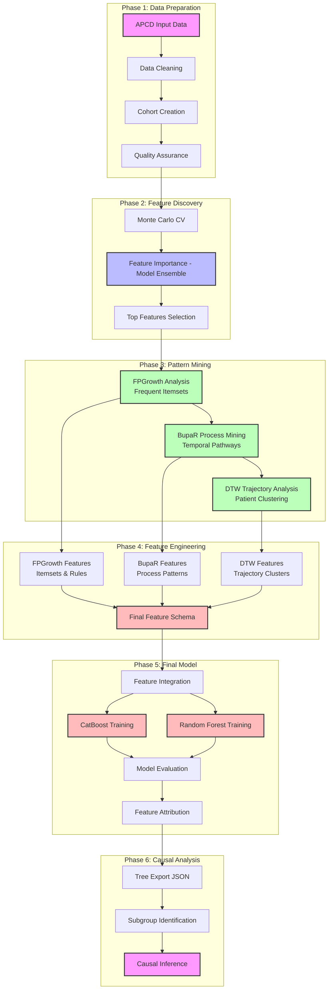

# Overview

Project structure, components, and high-level workflow for the Prescription Drug Analysis pipeline.

## Project Structure

```mermaid
graph TD
    A[pgx_analysis] --> B[1_apcd_input_data]
    A --> C[2_create_cohort]
    A --> D[3_feature_importance]
    A --> E[4a_model_data]
    A --> E2[4b_dtw_filter]
    A --> F[5b_fpgrowth_analysis]
    A --> G[5a_bupaR_analysis]
    A --> H[5c_pgx_analysis]
    A --> J[6_final_model]
    A --> K[7_ffa_analysis]
    A --> L[8_shap_analysis]
    A --> M[9_combined_shap_ffa]
    A --> N[10_risk_dashboard]
    A --> O[py_helpers]
    
    B --> B1[medical]
    B --> B2[pharmacy]
    B --> B3[0_txt_to_parquet.py]
    B --> B4[3_apcd_clean.py]
    B --> B5[drug_mappings]
    B --> B6[claim_mappings]
    
    C --> C1[0_create_cohort.py]
    C --> C2[2_step2_data_quality_qa.py]
    C --> C3[phases]
    C --> C4[table_mappings]
    
    D --> D1[feature_importance_mc_cv.ipynb]
    D --> D2[feature_importance_mc_cv.R]
    D --> D3[create_visualizations.R]
    
    F --> F1[global_fpgrowth.py]
    F --> F2[cohort_fpgrowth.py]
    F --> F3[global_fpgrowth_feature_importance.ipynb]
    F --> F4[cohort_fpgrowth_feature_importance.ipynb]
    
    G --> G1[bupaR_pipeline_opioid_ed.ipynb]
    G --> G2[bupaR_pipeline_non_opioid_ed.ipynb]
    
    H --> H1[dtw_cohort_analysis.py]
    H --> H2[dtw_trajectory_analysis.py]
    
    J --> J1[final_model.ipynb]
    J --> J2[final_feature_schema.json]
    
    K --> K1[ffa_analysis.py]
    
    O --> O1[common_imports.py]
    O --> O2[duckdb_utils.py]
    O --> O3[s3_utils.py]
    O --> O4[constants.py]
    
    style A fill:#f9f,stroke:#333,stroke-width:2px
    style B fill:#bbf,stroke:#333,stroke-width:2px
    style C fill:#bbf,stroke:#333,stroke-width:2px
    style D fill:#bbf,stroke:#333,stroke-width:2px
    style E fill:#bbf,stroke:#333,stroke-width:2px
    style F fill:#bbf,stroke:#333,stroke-width:2px
    style G fill:#bbf,stroke:#333,stroke-width:2px
    style H fill:#bbf,stroke:#333,stroke-width:2px
    style J fill:#bbf,stroke:#333,stroke-width:2px
    style K fill:#bbf,stroke:#333,stroke-width:2px
    style L fill:#bbf,stroke:#333,stroke-width:2px
    style M fill:#bbf,stroke:#333,stroke-width:2px
    style N fill:#bbf,stroke:#333,stroke-width:2px
    style O fill:#bfb,stroke:#333,stroke-width:2px
```



## High-Level Workflow

End-to-end workflow for feature discovery, noise reduction, and causal-oriented modeling using drug exposures, ICD/CPT codes, and classification outcomes.

### Overview

This project builds a classification model on a large, noisy healthcare dataset, then uses model-based feature importance plus pattern- and process-mining to derive a stable covariate set and interpretable tree ensembles for causal analyses.

**High-level phases:**

1. **Feature Screening** with a focused model ensemble (CatBoost, XGBoost boosted trees, XGBoost RF mode) + Monte Carlo cross-validation
2. **Structure Discovery** and noise reduction with FP-Growth, process mining (BupaR), and dynamic time warping (DTW)
3. **Final Model Development** combining features from all analysis methods for prediction and causal inference

### Cohorts and Age Bands in the Current Run

The pipeline is designed to support many cohort / age-band combinations, but the **current
modeling plan** focuses on a fixed grid where we train a **separate final model for each cell**:

- **Cohort 1 – Opioid ED (`opioid_ed`)**
  - Age bands modeled: **0–12** (smoke-test cohort), **13–24**, **25–44**, **45–54**, **55–64**

- **Cohort 2 – Polypharmacy ED (`non_opioid_ed`)**
  - Age bands modeled: **65–74**, **75–84**, **85–94**

For every `(cohort, age_band)` above we run:
- MC‑CV feature importance (`3_feature_importance/`)
- model‑ready event extraction (`4a_model_data/`)
- DTW-based protocol filtering (`4b_dtw_filter/`) to create `model_events_no_protocols.parquet`
- **Extreme‑density transaction handling (via `5b_fpgrowth_analysis/extract_extreme_density_cohort.py`)**, which splits out an `{cohort}_extreme_density` cohort and rewrites the base `model_events.parquet` without extreme‑density patients so that all main feature engineering and final models use the non‑extreme base cohort.
- feature engineering (`5b_fpgrowth_analysis/`, `5a_bupaR_analysis/`, DTW features in `5d_dtw_analysis/`, and `5c_pgx_analysis/` as applicable)
- final model training and export (`6_final_model/`), producing **one model per cohort/age‑band**.

### Workflow Pipeline



## Repository Structure

```
pgx-analysis/
├── 1_apcd_input_data/          # APCD data preprocessing and cleaning (bronze → silver → gold)
├── 2_create_cohort/            # Cohort creation and QA
├── 3_feature_importance/       # MC-CV feature importance screening
├── 4a_model_data/              # Model-ready event datasets (target vs control)
├── 4b_dtw_filter/              # DTW-based protocol filtering (creates model_events_no_protocols.parquet used by downstream feature engineering)
├── 5a_bupaR_analysis/          # Process mining feature engineering (BupaR)
├── 5b_fpgrowth_analysis/       # Frequent pattern mining feature engineering
├── 5c_pgx_analysis/            # Pharmacogenomics (PGx) feature engineering
├── 6_final_model/              # Final model development (6a encoding artifacts + 6b training/export)
├── 7_ffa_analysis/             # Formal feature attribution (FFA) analysis (tree JSON → DataFrame → rules)
├── 8_shap_analysis/            # SHAP-based post‑model analysis (distributional, per-feature and per-patient)
├── 9_combined_shap_ffa/        # Combined SHAP + FFA consensus analysis (agreement, ranking, coverage)
├── 10_risk_dashboard/          # Risk calculator + dashboard, API, and deployment artifacts (Lambda + S3)
├── py_helpers/                 # Shared Python helper utilities
├── r_helpers/                  # Shared R helper utilities
└── docs/                       # Documentation
```

## Project Components

### Core Analysis Modules

**📊 1_apcd_input_data: APCD Data Processing**
- `0_txt_to_parquet.py` - Convert text files to Parquet format
- `3_apcd_clean.py` - Main data cleaning script
- `3a_clean_pharmacy.py` - Pharmacy data cleaning
- `3b_clean_medical.py` - Medical data cleaning
- `drug_mappings/` - Drug name standardization mappings (A-Z + medical supplies)
- `claim_mappings/` - ICD code mappings and classifications

**👥 2_create_cohort: Cohort Creation**
- `0_create_cohort.py` - Main cohort creation pipeline (orchestrator)
- `2_step2_data_quality_qa.py` - Cohort quality assurance and validation
- `phases/` - Individual pipeline phase implementations
- `table_mappings/` - Table mapping configurations

**📈 3_feature_importance: Feature Screening**
- `feature_importance_mc_cv.ipynb` - Monte Carlo CV feature importance analysis
- `feature_importance_mc_cv.R` - R script for MC-CV analysis
- `create_visualizations.R` - Visualization utilities
- Uses three core models for robust feature ranking: **CatBoost**, **XGBoost (boosted trees)**, and **XGBoost RF mode**

**🔍 5b_fpgrowth_analysis: Frequent Pattern Mining**
- `global_fpgrowth.py` - Global pattern mining across all patients
- `cohort_fpgrowth.py` - Cohort-specific pattern mining
- `global_fpgrowth_feature_importance.ipynb` - Global analysis notebook
- `cohort_fpgrowth_feature_importance.ipynb` - Cohort analysis notebook
- Target-focused rule mining (TARGET_ICD, TARGET_ED, CONTROL)

**🔄 5a_bupaR_analysis: Process Mining**
- `bupaR_pipeline_opioid_ed.ipynb` - Process mining pipeline for opioid_ed using BupaR
- `bupaR_pipeline_non_opioid_ed.ipynb` - Process mining pipeline for non_opioid_ed using BupaR
- `sankey_plot.html` - Interactive Sankey diagram visualizations
- Event log creation and process flow discovery

**📊 4b_dtw_filter: DTW Protocol Filtering**
- `filter_protocol_events.py` - DTW-derived protocol filtering to create `model_events_no_protocols.parquet`
- `dtw_cohort_analysis.py` / `dtw_trajectory_analysis.py` - Optional sequence similarity and trajectory development
- Patient clustering, similarity scoring, and time-window audit artifacts

**🤖 6_final_model: Final Model Development**
- `final_model.ipynb` - Python MC-CV, Optuna tuning, temporal calibration, and final model export (CatBoost / XGBoost / XGBoost RF)
- `final_feature_schema.json` - Comprehensive feature schema
- `catboost_models/` - Trained model artifacts and metadata (legacy CatBoost models)

**🎯 7_ffa_analysis: Feature Attribution**
- `catboost_axp_explainer.py` - CatBoost AXP (Approximate Explanations) analysis
- `ffa_analysis.py` - Feature Filtering and Analysis pipeline
- Tree export and causal inference

### Pipeline Architecture (Summary)

The cohort analysis pipeline uses a **modular orchestrator/executor design** on top of a **partition‑first DuckDB layer**:

- `2_create_cohort/create_cohort.py` orchestrates phases; individual step modules and SQL files implement the work.  
- All heavy work runs per `(age_band, event_year)` partition with S3‑backed checkpoints, so jobs are resumable and easy to parallelize.

For full operator‑level details (worker counts, DuckDB configuration, checkpoint layout, and performance tuning), see:

- `docs/CrossStep_Development/README_data_pipeline_architecture.md`  
- `docs/CrossStep_Development/README_data_pipeline.md`  

**🛠️ py_helpers: Utility Functions**
- `common_imports.py` - Common import statements and configurations
- `constants.py` - Global constants and configuration values
- `duckdb_utils.py` - DuckDB database utilities
- `s3_utils.py` - S3 storage utilities
- `logging_utils.py` - Logging configuration and utilities
- Additional utility modules for data processing, model training, and visualization

## Data and Variables

- **Unit of analysis**: Patient-episode or encounter
- **Outcome (Y)**: Binary classification target (e.g., opioid dependence, ED visit)
- **Treatments (A)**: Drug exposure indicators
- **Covariates (X)**:
  - ICD diagnosis codes (grouped/rolled up)
  - CPT procedure codes
  - Demographics and baseline attributes
- **Temporal info**: Timestamps for diagnoses, procedures, and drug administrations

**Separation:**
- Pre-treatment covariates (for confounding control)
- Treatment variables (drugs)
- Post-treatment variables (mediators/outcomes)

## Recent Enhancements

### Drug Event Explosion Strategy
- **Patient-Level → Drug-Level Transformation**: Each drug prescription becomes a separate row
- **Context Duplication**: Patient demographics and clinical data duplicated per drug event
- **Sequence Modeling Ready**: Enables FpGrowth, bupaR, DTW, and symbolic reasoning analysis
- **Temporal Tracking**: Maintains `days_to_ade` and `days_to_opioid_ed` relationships

### Cohort Exclusivity Enforcement
- **OPIOID_ED Priority**: Processes opioid_ed cohort first
- **Mutual Exclusivity**: Ensures no patient appears in both cohorts
- **Quality Assurance**: Validates cohort separation and logs metrics
- **Data Integrity**: Prevents data leakage between cohorts

### DTW and BupaR Integration

**DTW (Dynamic Time Warping)** and **BupaR (Process Mining)** serve different but complementary purposes in temporal sequence analysis:

| Aspect | DTW | BupaR |
|--------|-----|-------|
| **Scope** | Pairwise sequence comparison | Process discovery across many cases |
| **Output** | Distance metric | Process maps, flow diagrams |
| **Abstraction** | Low-level (raw sequences) | High-level (process patterns) |
| **Scalability** | O(n²) for each pair | Handles thousands of cases |
| **Interpretability** | "These sequences are X% similar" | "80% of patients follow path A→B→C" |

### Extreme-Density Transaction Handling

- **Motivation**: A small fraction of patients have extremely dense medical histories (hundreds to thousands of ICD/CPT items over the TRAIN window). These cases are clinically important but can cause memory spikes in FP-Growth and can visually dominate process-mining plots.  
- **Approach**:
  - Use the same transaction-density logic as `5b_fpgrowth_analysis/cohort_fpgrowth.py` to compute per-patient `transaction_size` and bin patients into `low`, `medium`, `high`, and `extreme` buckets.  
  - Run `5b_fpgrowth_analysis/extract_extreme_density_cohort.py` to:
    - Create a dedicated extreme-density cohort at `4a_model_data/cohort_name={cohort}_extreme_density/age_band={band}/model_events.parquet`.  
    - Remove those patients from the main `4a_model_data` `model_events.parquet` (with a `model_events_with_extreme.parquet` backup), which then feeds `4b_dtw_filter` to create `model_events_no_protocols.parquet` for both base and extreme cohorts.  
  - Run `5b_fpgrowth_analysis/summarize_extreme_density_cohort.py` to generate drug / ICD / CPT frequency tables, a transaction-size histogram, and patient-level summaries plus an aggregate JSON report (preferring `model_events_no_protocols.parquet` when present).  
  - For `opioid_ed`, run `5a_bupaR_analysis/create_bupar_outputs_opioid_ed_extreme.R` to build a BupaR eventlog and Gantt-style plots just for the extreme-density subset, using the DTW-filtered `model_events_no_protocols.parquet` when present and mirroring plots under `feature_engineering_outputs/5_bupar/opioid_ed_extreme_density/{age_band}/plots`.  
- **Plan**: Treat this as a standard, repeatable sub-workflow for all `(cohort, age_band)` combinations, so each main model has a paired "extreme" cohort for exploratory visualization and process-mining, while the main modeling pipeline runs on a tractable subset.

## Related Documentation

- [`README_data_pipeline.md`](README_data_pipeline.md) - Data processing and cohort creation
- [`README_analysis_workflow.md`](README_analysis_workflow.md) - Feature importance, Step 4c extreme-density split, and pattern mining
- [`README_data_visualizations.md`](README_data_visualizations.md) - Visualization approaches
- [`README_create_cohort_pipeline.md`](README_create_cohort_pipeline.md) - Comprehensive cohort creation guide

