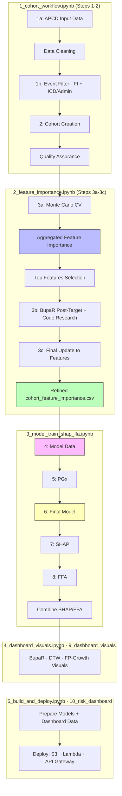

# Feature Engineering and Analysis Workflow

**Version:** 1.0  
**Last Updated:** February 15, 2026  
**Status:** ✅ Production Ready

## Overview

This document covers the complete feature engineering and analysis workflow for the PGx Analysis pipeline, from initial feature importance screening through final model deployment. The workflow implements a multi-stage approach to feature discovery, noise reduction, model development, and interpretation.

### Core Principles

1. **Single Source of Truth**: Step 3b refined feature list (`cohort_feature_importance.csv`) is the canonical feature set used for all downstream steps
2. **Temporal Validation**: Train on 2016-2018, test on 2019 (COVID year 2020 excluded)
3. **Model Consensus**: Union-based aggregation across CatBoost, XGBoost, and XGBoost RF
4. **Quality Weighting**: Feature importance scaled by model performance (Recall)
5. **Leakage Prevention**: Multi-stage filtering (BupaR post-target analysis, target-family codes, administrative codes)

## Quick Navigation

- [Pipeline Overview](#pipeline-overview)
- [Feature Creation Pipeline](#feature-creation-pipeline)
- [Feature Importance Analysis](#feature-importance-analysis)
- [Feature Refinement](#feature-refinement-step-3b)
- [Model Data Creation](#model-data-creation-step-4)
- [Final Model Features](#final-model-features-step-6)
- [Visualization](#visualization)
- [Best Practices](#best-practices)

---

## Pipeline Overview



### Workflow Stages

| Stage | Notebook | Steps | Purpose |
|-------|----------|-------|---------|
| Data Preparation | `1_cohort_workflow.ipynb` | 1a, 1b, 2 | Clean data, filter events, create cohorts |
| Feature Discovery | `2_feature_importance.ipynb` | 3a-3c | MC-CV feature screening + refinement |
| Model Development | `3_model_train_shap_ffa.ipynb` | 4-8 | Model data, PGx, training, interpretation |
| Visualization | `4_dashboard_visuals.ipynb` | 9 (visual prep) | BupaR, DTW, FP-Growth visualizations (`9_dashboard_visuals/`) |
| Deployment | `5_build_and_deploy.ipynb` | 9 (build/deploy) | Risk calculator + Lambda + API Gateway (`10_risk_dashboard/`) |

---

## Feature Creation Pipeline

### Single Source of Truth: Step 3b Refined Feature List

**The feature set used for the model is defined by Step 3b's refined `cohort_feature_importance.csv` (leakage-filtered).** All downstream steps use this same source:

| Step | What it uses | Purpose |
|------|--------------|---------|
| **Step 4** (create_model_data) | Step 3b `*_cohort_feature_importance.csv` | Filters event-level data so `model_events.parquet` contains only events whose codes are in the refined list |
| **Step 6** (run_final_model, build_final_cohort_model_features) | Step 3b `*_cohort_feature_importance.csv` | Builds binary (and count) item features from the **same** list so training features align with model_events |

**Important:** We do **not** use Step 3a `aggregated_feature_importance` for the final model feature set. Step 3a feeds into Step 3b; Step 3b applies leakage filtering and refinement and writes the canonical list.

### Pipeline Stages

#### 1. Step 3a – Aggregated Feature Importance

**Input:** Cohort data (Step 2 `cohort.parquet`)

**Process:**
- Monte Carlo Cross-Validation (25-50 splits, development; 50+ for publication)
- Train on **2016-2018**, test on **2019** (temporal validation)
- Three core models: CatBoost, XGBoost (boosted trees), XGBoost RF mode
- Permutation-based importance computation
- Model performance weighting (Recall-based scaling)
- Union-based aggregation across models

**Output:** `{cohort}_{age_band_fname}_aggregated_feature_importance.csv`
- Many ICD/CPT/drug features with importance scores
- Ranked by scaled importance
- Includes features from all three models

**Role:** Provides a broad, importance-ranked feature set. For new cohorts without a baseline in pgx-repository, baseline is built from cohort-derived ICD/CPT/drug codes (never n_events only).

**Location:**
- Local: `3a_feature_importance/outputs/{cohort}/`
- S3: `s3://pgxdatalake/gold/feature_importance/{cohort}/{age_band}/`

#### 2. Step 3b – Refine and Filter (Canonical Feature List)

**Input:** 
- Step 3a aggregated FI
- BupaR post-target analysis results
- Optional `safe_feature_filter.json`

**Process:**
- Removes post-target leakage (identified by BupaR process mining)
- Filters target-family codes (e.g., F11* for opioid_ed)
- Applies importance threshold
- Normalizes feature names (e.g., `item_icd_F1120`, `item_cpt_80307`, `item_drug_SUBOXONE`)
- Manual code research and validation (administrative/scheduling codes)

**Output:** `{cohort}_{age_band_fname}_cohort_feature_importance.csv` — **this is the list used for the model**

**Location:**
- Local: `3b_feature_importance_eda/outputs/{cohort}/{age_band_fname}/`
- S3: `s3://pgxdatalake/gold/feature_importance/{cohort}/{age_band}/`

**Note:** This is **NOT** a DTW filter - it uses BupaR process mining and code research to filter already-processed aggregated feature importances.

#### 3. Step 3c – Final Update to Features

**Input:** Step 3b `cohort_feature_importance.csv` files

**Process:**
- Implemented in `2_feature_importance.ipynb`
- Strips any remaining BupaR-identified leakage from each CSV
- Final validation before Step 4

**Output:** Updated `cohort_feature_importance.csv` files (Step 4 uses **only** these)

**Important:** If Step 3c output is missing, Step 4 will error (no fallback to aggregated importances).

---

## Feature Importance Analysis

### Methodology

#### Temporal Validation Strategy

**Critical:** This analysis uses strict temporal validation to avoid data leakage and COVID-19 impact:

- **Training Data:** Years 2016-2018 (combined)
- **Test Data:** Year 2019 (holdout set, never used for training)
- **Excluded:** Year 2020 (COVID-19 pandemic year)

**Rationale:**
1. **Prevents Data Leakage:** 2019 data never seen during training
2. **Maintains Temporal Order:** Train on past, test on future
3. **Avoids COVID Impact:** 2020 excluded due to pandemic-related healthcare changes
4. **Consistent with Final Model:** Feature importance generalizes to final model training

#### Monte Carlo Cross-Validation (MC-CV)

Each MC-CV split:
- Samples a different subset from 2016-2018 training data
- Evaluates on the **same 2019 test set** (consistent across all splits)
- Provides robust feature importance estimates while maintaining temporal integrity

**Configuration:**
- **Development/Screening:** 25 splits (current default)
- **Publication-Grade:** 50+ splits
- **Smoke Test:** 5 splits (DEBUG_MODE)

#### Model Ensemble

**CatBoost:**
- Handles categorical features natively
- Feature format: Each column is a factor with item name as level
- Importance: Permutation-based (PredictionValuesChange)

**XGBoost (boosted trees):**
- Gradient boosting with tree-based learners
- Feature format: Binary 0/1 encoding
- Importance: **Two components:**
  - **Gain screen:** XGBoost's built-in tree importance flags features with `gain_importance > 0`
  - **Permutation importance:** Run on full feature set (primary score)

**XGBoost RF mode:**
- Random-forest style XGBoost configuration
- Feature format: Binary 0/1 encoding
- Importance: Same gain + permutation scheme as boosted XGBoost

**Rare-Variant Second-Pass Scan:**
- XGBoost-only pass on 2019 holdout
- Identifies rare but potentially important variants
- Features appearing in 5-25 patients (configurable via `PGX_RARE_MIN_PATIENTS`, `PGX_RARE_MAX_PATIENTS`)
- Treated as fourth model (`xgboost_rare`) in aggregation

#### Aggregation Method

**Union-Based Aggregation** across models:

1. **Per-Model Processing:**
   - Compute `importance_mean` across MC-CV splits
   - Scale by model performance (`recall_mean`)
   - Normalize to [0, 1] within model

2. **Cross-Model Aggregation:**
   - Concatenate all per-model records
   - Group by feature
   - Compute `importance_scaled_by_model_sum` (sum across models)
   - Count `n_models` (number of models contributing)
   - Convert to mean: `importance_scaled_mean = sum / n_models`
   - Renormalize and scale by best model performance

**Result:** Features supported by more models have more stable scores; rare-variant signals included on equal footing.

### Runtime Considerations

#### Performance Characteristics

**Data Scale (per cohort/age_band):**
- ~10,000-15,000 patients in 2016-2018 training window
- ~3,000-5,000 patients in 2019 holdout
- ~10,000-15,000 binary/categorical features after engineering

**Current Configuration:**
- `N_SPLITS = 25` (feature screening)
- Full 2019 holdout evaluation (no subsampling)
- Permutation importance on full feature set

**Feature Matrix Pruning:**
- Keep only items appearing in ≥25 training patients
- Reduces feature count from 30k+ to 2k-5k
- Preserves clinically meaningful, sufficiently frequent codes

#### Runtime Examples

**Opioid_ed 25-44 (baseline, N_SPLITS=25):**
- **Wall-clock:** ~11-12 hours on x2iedn.8xlarge (32 cores, 1TB RAM)
- **Example progress:** 27/50 splits in ~385 minutes (~6.4 hours)
- **Three models:** CatBoost + XGBoost + XGBoost RF

**Relative Runtimes by Age Band (factor of opioid_ed 25-44):**
- **0-12:** ~0.001× (~minutes)
- **13-24:** ~0.08× (~1 hour)
- **25-44:** 1.00× (baseline, ~11-12 hours)
- **45-54:** ~0.54× (~5-7 hours)
- **55-64:** ~0.60× (~5-7 hours)
- **65-74:** ~0.50× (~5-7 hours)
- **75-84:** ~0.21× (~2-3 hours)
- **85-94:** ~0.05× (~< 1 hour)
- **95-114:** ~0.002× (~minutes)

**Non_opioid_ed (Polypharmacy) Relative Runtimes:**
- **65-74:** 1.00× (largest event workload for polypharmacy cohort)
- **55-64, 75-84:** ~0.54-0.65×
- **25-44, 45-54:** ~0.39-0.54×
- **Other bands:** < 0.26×

#### Resource Requirements

**Development/Screening (25 splits):**
- EC2: x2iedn.8xlarge (32 vCPUs, 1TB RAM)
- Workers: `max(1, cpu_count() - 12)` (e.g., 8 workers on 20-vCPU machine)
- Expected: 1-3 hours per heavy cohort/age band

**Publication-Grade (50+ splits):**
- Same instance class
- Consider reducing workers if memory pressure is high
- Tighten item-frequency threshold if needed

**Local Testing (5 splits, DEBUG_MODE):**
- Any machine (4+ cores)
- Few minutes per cohort/age band
- Good for functional tests

#### Optimization Levers

To reduce runtime while retaining robustness:

1. **Keep N_SPLITS fixed, but:**
   - Lower permutation `n_repeats` (default: 3)
   - Lower `PGX_XGB_PERM_TOP_K` (e.g., 2000 → 1000)
   - Lower `PGX_PERM_MAX_ROWS` (e.g., 50k → 5-10k)

2. **Use lighter MC-CV settings for initial runs:**
   - Fewer estimators during feature importance
   - Reserve larger estimators for final model training

**Not Recommended:** Dropping to single model or handful of splits for publication-grade health analyses.

### Cohort Focus Strategy

**Full MC-CV + Permutation Importance Focus:**

- **Cohort Group 1 – Opioid ED (`opioid_ed`)**
  - Age bands: Full set (0-12, 13-24, 25-44, 45-54, 55-64, 65-74, 75-84, 85-114)
  - Feature space: Drugs + ICD codes + CPT codes + event type
  - Treatment: Full 3-model MC-CV (CatBoost, XGBoost, XGBoost RF) with 25-50 splits

- **Cohort Group 2 – Polypharmacy ED (`non_opioid_ed`)**
  - Age bands: Full set (same as opioid_ed)
  - Feature space: **Drugs only** (polypharmacy focus)
  - Treatment: Full MC-CV + permutation importance

**Note:** Other cohort/age-band combinations can be run with lighter settings, but publication-grade analysis is concentrated in these two groups.

---

## Feature Refinement (Step 3b)

### Purpose

Refine aggregated feature importance (Step 3a output) to create the canonical feature list used by all downstream steps.

### Methods

#### 1. BupaR Post-Target Analysis

**Purpose:** Identify and remove features that only appear **after** the target event (temporal leakage)

**Location:** `3b_feature_importance_eda/1_bupaR/`

**Process:**
- Use process mining to analyze event timing
- Identify codes that consistently appear post-target
- Flag these features for removal

**Note:** This is **NOT** a DTW filter - uses BupaR process mining for temporal analysis.

#### 2. Code Research and Validation

**Purpose:** Identify non-informative administrative/scheduling codes

**Location:** `1b_apcd_event_filter/` (event-level filtering before cohort creation)

**Process:**
- Manual research of ICD/CPT codes
- Identify administrative, scheduling, and procedural codes
- Document in `administrative_codes_lookup.json`
- Filter these codes at event level (Step 1b)

**Examples of Administrative Codes:**
- Z codes (administrative contact)
- Scheduling/appointment codes
- Non-diagnostic procedural codes

#### 3. Target-Family Code Filtering

**Purpose:** Remove codes directly related to the target condition

**Examples:**
- opioid_ed: Filter F11* codes (opioid-related disorders)
- Prevents circular reasoning (target code → target outcome)

#### 4. Importance Threshold Application

**Purpose:** Remove low-importance features to reduce noise

**Typical Threshold:** Features with `importance_scaled < threshold` excluded

#### 5. Feature Name Normalization

**Purpose:** Standardize feature names for consistency across pipeline

**Format Examples:**
- `item_icd_F1120` (ICD code)
- `item_cpt_80307` (CPT code)
- `item_drug_SUBOXONE` (drug name)

### Output

**File:** `{cohort}_{age_band_fname}_cohort_feature_importance.csv`

**Columns:**
- `feature`: Normalized feature name
- `importance_normalized`: Normalized importance (0-1)
- `importance_scaled`: Scaled importance (normalized × best model performance)
- `n_models`: Number of models contributing (1-4)
- Additional metadata columns

**Location:**
- Local: `3b_feature_importance_eda/outputs/{cohort}/{age_band_fname}/`
- S3: `s3://pgxdatalake/gold/feature_importance/{cohort}/{age_band}/`

---

## Model Data Creation (Step 4)

### Purpose

Create compact, model-ready event datasets filtered to include only events with important items (from Step 3c refined feature list).

### Process

**Input:**
- Event-level data from cohort creation (Step 2)
- Step 3c `cohort_feature_importance.csv` files (**REQUIRED**, no fallback)

**Logic:**
1. Read refined CSV: `get_important_items(agg_csv)`
   - Prefers `raw_code` column, else derives from `feature` column
   - Strips `item_` prefix to recover raw drug/ICD/procedure codes
2. Filter events to only those rows where at least one important item appears in:
   - `drug_name`
   - `primary_icd_diagnosis_code` through `nine_icd_diagnosis_code`
   - `procedure_code`
3. **Target leakage removal:** For case events, keep only events **strictly before** target date
   - `event_date < first_opioid_ed_date` (opioid_ed cohort)
   - `event_date < first_ed_non_opioid_date` (non_opioid_ed cohort)

**Output:** `model_events.parquet` per (cohort, age_band)

**Location:**
- Local: `4_model_data/cohort_name={cohort}/age_band={band}/`
- S3: `s3://pgxdatalake/gold/model_data/{cohort}/{age_band}/`

### Target vs Control

**Important:** Control is always **within-cohort** (target=0 from the same `model_events` file), not the other cohort.

**Control Definition:**
- **opioid_ed:** No F1120 diagnosis
- **non_opioid_ed:** No first ED within 21 days of drug administration

**Sampling:** Maintain ~5:1 control:target ratio

---

## Final Model Features (Step 6)

### Purpose

Build patient-level feature tables from model events (Step 4) using the refined feature list (Step 3c) for final model training. Feature engineering for the final model **never generates** trajectory, sequence, or itemset features—only n_events, item_* (drug/ICD/CPT), PGx counts, and other schema features; FPGrowth/BupaR/DTW are for visualization and (DTW) protocol filtering only.

### Process

**Input:**
- `model_events.parquet` (or `model_data`) from Step 4
- Step 3c `cohort_feature_importance.csv`

**Logic:**
1. **Load refined feature list:**
   - `run_final_model.py`: `_load_aggregated_feature_importance_codes()`
   - `build_final_cohort_model_features.py`: `load_cohort_feature_importance()`
2. **Build item features:**
   - Binary features: `item_icd_F1120` (0/1 for presence)
   - Count features: `item_drug_AMOXICILLIN_count` (number of prescriptions)
3. **Aggregate to patient level:**
   - One row per `mi_person_key`
   - Columns: `target`, `item_*` (binary/count), PGx columns

**Output:** Patient-level feature table used for training

**Location:**
- `6_final_model/outputs/{cohort}/{age_band}/`

### Integration with PGx Features

**Step 5 (PGx Feature Engineering)** adds pharmacogenomics features:
- Drug-gene mappings
- Allele-frequency-based risk features
- Joined by `mi_person_key`

**Final Feature Matrix:**
- Item features from Step 3c refined list
- PGx features from Step 5
- ~185-750 features total per cohort/age_band

---

## Correctness Checks

### 1. Single Source of Truth

✅ **Verified:** Step 4 and Step 6 both use Step 3b cohort_feature_importance (via `get_important_items` / `load_cohort_feature_importance`)

❌ **Prevented:** No step uses Step 3a aggregated FI to define the model feature set

### 2. No n_events-only Features

✅ **Verified:** Step 3a never returns or writes a single-feature (n_events-only) aggregated FI

✅ **Verified:** Baseline for new cohorts uses cohort-derived ICD/CPT/drug list

### 3. Empty File Guards

✅ **Verified:** Loaders for both 3a and 3b refined FI reject empty files (ValueError/FileNotFoundError)

✅ **Prevented:** Never build model features from an empty list

### 4. Feature Name Consistency

✅ **Verified:** Step 3b outputs canonical feature names (e.g., `item_icd_F1120`, `item_cpt_80307`)

✅ **Verified:** Step 4 and Step 6 use the same list so event filtering and feature construction align

---

## File Locations and Resolution

### Refined Feature List (Model Input)

**File Pattern:** `{cohort}_{age_band_fname}_cohort_feature_importance.csv`

**Resolution Order:**
1. `3b_feature_importance_eda/outputs/{cohort}/{age_band_fname}/`
2. `3b_feature_importance_eda/outputs/{cohort}/{age_band}/`
3. `{DATA_ROOT}/gold/feature_importance/{cohort}/{age_band}/`
4. `{DATA_ROOT}/gold/feature_importance/{cohort}/{age_band_fname}/`
5. S3: `s3://pgxdatalake/gold/feature_importance/{cohort}/{age_band}/`

**Shared Resolution:** 
- `py_helpers.feature_importance_eda_utils.resolve_cohort_fi_path()`
- `py_helpers.feature_importance_eda_utils.load_cohort_feature_importance()`
- `py_helpers.file_resolver.FileResolver` (Step 3c and beyond)

**Example (opioid_ed 65-74):**
```
3b_feature_importance_eda/outputs/opioid_ed/65_74/opioid_ed_65_74_cohort_feature_importance.csv
→ 3b_feature_importance_eda/outputs/opioid_ed/65-74/...
→ {DATA_ROOT}/gold/feature_importance/opioid_ed/65-74/...
→ {DATA_ROOT}/gold/feature_importance/opioid_ed/65_74/...
→ S3 (then downloaded to 3b outputs)
```

### Aggregated Feature Importance (Step 3a Output)

**File Pattern:** `{cohort}_{age_band_fname}_aggregated_feature_importance.csv`

**Resolution Order:**
1. `{PGX_FEATURE_IMPORTANCE_OUTPUTS}/{cohort}/` (env variable override)
2. `3a_feature_importance/outputs/{cohort}/`
3. `3a_feature_importance/outputs/{cohort}/{age_band}/`
4. `{DATA_ROOT}/gold/feature_importance/{cohort}/{age_band}/`
5. S3: `s3://pgxdatalake/gold/feature_importance/{cohort}/{age_band}/`

**Shared Resolution:**
- `py_helpers.file_resolver.FileResolver` (file_type="aggregated_feature_importance")

---

## Visualization

### Generated Plots

For each cohort/age-band combination, four publication-ready plots are generated:

#### 1. Top 50 Features Bar Chart
- **Filename:** `{cohort}_{age_band}_{year}_top50_features.png`
- **Size:** 12" × 14"
- **Content:** Scaled importance, ranked

#### 2. Top 50 with Recall Confidence
- **Filename:** `{cohort}_{age_band}_{year}_top50_with_recall.png`
- **Size:** 12" × 14"
- **Color Coding:** Orange (lower Recall) → Dark Blue (higher Recall)
- **Content:** Importance + model quality

#### 3. Normalized vs Recall-Scaled Comparison
- **Filename:** `{cohort}_{age_band}_{year}_normalized_vs_scaled.png`
- **Size:** 12" × 14"
- **Content:** Impact of quality weighting (side-by-side)

#### 4. Feature Category Distribution
- **Filename:** `{cohort}_{age_band}_{year}_category_distribution.png`
- **Size:** 12" × 10"
- **Content:** Drug / ICD / CPT breakdown of top features

### Usage Methods

#### Method 1: Direct Script Execution

```bash
# Linux EC2
python py_helpers/create_feature_importance_visualizations.py \
    outputs/opioid_ed_0_12_aggregated_feature_importance.csv \
    --output-dir outputs \
    --cohort-name opioid_ed \
    --age-band 0-12 \
    --event-year 2019

# Windows
python py_helpers\create_feature_importance_visualizations.py ^
    outputs\opioid_ed_0_12_aggregated_feature_importance.csv ^
    --output-dir outputs ^
    --cohort-name opioid_ed ^
    --age-band 0-12 ^
    --event-year 2019
```

#### Method 2: Notebook Import (Recommended)

```python
from py_helpers.create_feature_importance_visualizations import create_feature_importance_plots

plots = create_feature_importance_plots(
    aggregated_file='outputs/opioid_ed_0_12_aggregated_feature_importance.csv',
    output_dir='outputs',
    cohort_name='opioid_ed',
    age_band='0-12',
    event_year=2019,
    s3_upload=False
)

# Display results
print(f"Generated {len(plots)} plots:")
for name, path in plots.items():
    print(f"  - {name}: {path}")

# Display plots inline
from IPython.display import Image, display
for name, path in plots.items():
    display(Image(path))
```

### Cross-Platform Compatibility

**Linux EC2 (Headless):**
- Automatically uses `Agg` backend when `DISPLAY` not set
- Uses kernel Python from Jupyter (`sys.executable`)
- Detects AWS CLI in common Linux paths

**Windows:**
- Uses default backend (typically `TkAgg`)
- Uses current Python interpreter
- Detects AWS CLI in PATH

**Path Handling:**
- Uses `pathlib.Path` (handles both `/` and `\`)
- Supports relative and absolute paths
- Automatic parameter extraction from filename

### Output Locations

**Local:**
- `{output_dir}/plots/`

**S3 (optional):**
- `s3://pgxdatalake/gold/feature_importance/cohort_name={cohort}/age_band={age_band}/event_year={year}/plots/`

---

## Best Practices

### Data Quality

✅ **Do:**
- Remove NA target values before MC-CV
- Verify target distribution (check for class imbalance)
- Check for patient-level target consistency

❌ **Don't:**
- Use event-level data (must aggregate to patient-level)
- Include features that leak target information
- Run without stratified sampling

### Computational Resources

**For DEBUG_MODE (5 splits):**
- Any machine (4+ cores)
- Few minutes per cohort/age band
- Good for functional tests

**For Development (25-50 splits):**
- EC2 x2iedn.8xlarge (32 vCPUs, 1TB RAM)
- Expect 1-3 hours per heavy cohort/age band
- Use conservative worker counts to reduce OOM risk

**For Publication (50+ splits):**
- Same instance class
- Consider reducing workers if memory pressure is high

### Feature Count Management

**Automatic Pre-Filtering (Implemented):**
- Requires ≥25 training patients per feature
- Reduces feature count from 20k+ to 2k-5k
- Preserves clinically meaningful codes

**Too Few Features (<100):**
- Results may be unstable
- Consider including more data or feature types

### Model Interpretation

✅ **Do:**
- Look at `n_models` column (2-4 = high confidence)
- Check if top features make clinical sense
- Review Recall values (should be reasonable, e.g., >0.6)
- Compare across age bands for consistency

❌ **Don't:**
- Use features ranked 100+ without inspection
- Ignore model-specific features (n_models = 1) without investigation
- Trust results without domain validation

### Feature Selection Strategies

#### Strategy 1: Top N Features
```python
features = pd.read_csv("opioid_ed_25-44_aggregated_feature_importance.csv")
top_features = features.head(20)['feature'].tolist()
```

#### Strategy 2: High Consensus Features
```python
consensus_features = features[features['n_models'] >= 3].head(20)['feature'].tolist()
```

#### Strategy 3: Importance Threshold
```python
important_features = features[features['importance_scaled'] > 0.5]['feature'].tolist()
```

---

## Troubleshooting

### Issue: "test_idx is empty after removing NAs"

**Cause:** `rsample::mc_cv()` bug with NA targets

**Fix:** Already implemented - NA targets removed before MC-CV

### Issue: "future.globals.maxSize exceeded"

**Cause:** Feature matrix too large for parallel processing

**Fix:**
```python
import os
os.environ['FUTURE_GLOBALS_MAXSIZE'] = str(97 * 1024**3)  # 97 GB
```

### Issue: Low Recall values (<0.5)

**Possible Causes:**
- Severe class imbalance
- Features don't predict target well
- Model hyperparameters need tuning

**Actions:**
- Check target distribution
- Review feature engineering
- Try different model parameters

### Issue: No model overlap (all n_models = 1)

**Possible Causes:**
- Models finding different patterns (may be valid)
- Different feature representations (CatBoost vs XGBoost)
- Very noisy data

**Actions:**
- Review per-model CSVs
- Check if features make sense
- Consider using only one model

### Issue: OOM Error During Execution

**Causes:**
- Too many features
- Too many workers
- Insufficient RAM

**Fixes:**
```python
# Reduce workers
N_WORKERS = 8  # instead of 30

# Reduce splits for testing
N_SPLITS = 25  # instead of 50

# Use larger instance
# x2iedn.16xlarge (64 cores, 2TB RAM)
```

### Visualization Issues

**Linux EC2: "No display name and no $DISPLAY environment variable"**
- Script automatically handles this (uses `Agg` backend)
- Verify logs show "Matplotlib backend: Agg"

**Windows: Matplotlib window opens unexpectedly**
- This is normal (uses `TkAgg` backend)
- Script still saves files correctly

**Path Issues:**
```python
# Use absolute paths if relative paths don't work
from pathlib import Path
csv_file = Path('outputs/file.csv').resolve()
create_feature_importance_plots(str(csv_file))
```

---

## Understanding Permutation Importance

### Critical Point: What It Actually Does

Permutation importance **does NOT preserve row-level associations**.

**Process:**
1. Save original column: `[drug_A, drug_B, drug_C, drug_A, ...]`
2. Randomly shuffle: `[drug_C, drug_A, drug_B, drug_A, ...]` (breaks row associations!)
3. Make predictions on shuffled data
4. Compare performance drop

**Key Insight:** Shuffling breaks the connection between specific drug combinations and specific patients. It measures **average effect**, not **which specific combinations matter for which patients**.

### What It Can and Cannot Tell You

❌ **Cannot tell you:**
- "Patient 12345 with drugs [AMOXICILLIN, AZITHROMYCIN] had outcome Y"
- "The combination of Drug A + Drug B in row X drives the outcome"
- "Which specific drug combinations matter for which specific patients"

✅ **Can tell you:**
- "On average, does shuffling AMOXICILLIN affect model performance?"
- "Is AMOXICILLIN important overall?"
- "Which features matter most on average across all patients"

### When to Use Each Method

| Method | Use Case | Question Answered | Dataset Size |
|--------|----------|-------------------|--------------|
| **Permutation Importance** | Feature ranking, screening | "Which features matter on average?" | Can use sampling (`PGX_PERM_MAX_ROWS`) |
| **SHAP** | Patient-specific explanations | "How much did feature X contribute for patient Y?" | Full dataset recommended |
| **FPGrowth** | Pattern discovery | "Which drug combinations are frequent?" | Full dataset recommended |
| **FFA** | Rule-based explanations | "Which rules/conditions led to this prediction?" | Full dataset recommended |

### Recommended Workflow

1. **Use permutation importance with sampling for fast feature screening**
2. **Use row-level methods (SHAP/FFA/FPGrowth) on full dataset for patient-specific insights**
3. **Combine both approaches for comprehensive understanding**

---

## Key Insights by Analysis Method

| Question | Analysis Method | Insights |
|----------|----------------|-----------|
| What itemsets are most common? | FP-Growth (visualization) | Frequent co-occurrence patterns for exploratory analysis |
| How do itemsets play out temporally? | BupaR (visualization) | Process flows and sequences for clinical interpretation |
| Which itemsets drive model predictions? | XGBoost FFA + CatBoost SHAP | Risk-influential patterns (XGBoost FFA with CatBoost SHAP filtering) |
| Are process-dominant paths aligned with risk? | BupaR vs. FFA | Pattern alignment analysis (visualization complements causal analysis) |

---

## Lessons Learned

### Why FP-Growth, BupaR, and DTW Are Visualization-Only

**FP-Growth:**
- **Target Leakage Risk:** Patterns mined from combined target+control data can encode target-specific information
- **Direct Leakage:** Rules may include target codes (e.g., F1120) as consequents
- **Solution:** Use for visualization and exploratory analysis only, not as model features

**BupaR:**
- **Complexity vs. Benefit:** Process mining features add complexity without sufficient predictive benefit
- **Value in Exploration:** Provides valuable clinical insights into patient pathways
- **Solution:** Use in Feature Importance EDA (post-target analysis) and Step 9 (dashboard), not as model features

**DTW:**
- **Protocol Filtering:** Excels at identifying standard care protocols (both targets and controls follow)
- **Non-Predictive:** These protocols are non-predictive by design
- **Solution:** Event/ICD filtering in Step 1b; trajectory visualization in Step 9, not as model features

**Feature set for final model:** Feature engineering for the final model **never generates** trajectory, sequence, or itemset features. We only build **n_events**, **item_*** (drug/ICD/CPT from feature importance), **PGx counts** (e.g. pgx_num_drugs, pgx_num_cpic_drugs; n_drugs from PGx step), and other schema features. FPGrowth, BupaR, and DTW are used for dashboard visualizations (and DTW for protocol filtering) only.

### Why Aggregated Features Are Used Directly

**Initial Approach:** Feature encoding step to convert categorical features to numeric codes

**Final Approach:** Use aggregated feature importances directly from Step 3

**Key Insights:**
- **MC-CV Already Filters:** Monte Carlo CV already identifies and ranks most important features
- **Reduced Complexity:** Eliminating encoding reduces pipeline complexity
- **Maintains Predictive Power:** Aggregated importances capture essential signals
- **PGx Adds Value:** Pharmacogenomic features complement aggregated features

**Result:** Simpler, more maintainable pipeline with equivalent or better performance

### Why SHAP Filters FFA Rules

**Approach:** Use SHAP importance from Step 7 to filter and prioritize rules for FFA (Step 8) AXP computation

**Key Insights:**
- **Rule Explosion:** Without filtering, FFA can generate thousands of rules (many are noise)
- **SHAP as Quality Filter:** SHAP importance identifies features that actually contribute to predictions
- **Three-Set Union:** Rule selection uses union of:
  1. First 100 matched rules
  2. Random sample of 100 matched rules
  3. Top 300 SHAP-filtered rules (or all rules above 10th percentile, whichever larger)
- **Causal Filtering:** Final rule set further filtered based on causal importance scores

**Result:** Focused, high-quality rule set that balances comprehensiveness with interpretability

### Why CatBoost FFA Is Not Performed

**Technical Limitation:** CatBoost's complex hashing and CTR (Counter-based Target Statistics) make symbolic rule extraction difficult

**Design Philosophy:** This limitation functions as deliberate quality control

**Key Insights:**
- **Model Agreement:** Requiring features detected by CatBoost (SHAP) AND describable by XGBoost (symbolic rules) filters model-specific artifacts
- **Robustness:** If CatBoost finds signal XGBoost cannot replicate, may be CatBoost encoding artifact
- **Clinical Actionability:** Features that can't be translated to symbolic rules are too opaque for clinical decision-making

**Result:** Higher-confidence features in causal analysis, with explicit logical verification possible

---

## Related Documentation

### Core Documentation
- [README_file_resolver.md](README_file_resolver.md) - File resolution system
- [README_overview.md](README_overview.md) - Project overview
- [README_ec2_runtime.md](README_ec2_runtime.md) - EC2 execution guide

### Workflow Documentation
- [CLEAR_WORKFLOW_FOR_FULL_RUN.md](CLEAR_WORKFLOW_FOR_FULL_RUN.md) - Complete workflow execution
- [TIME_ESTIMATES.md](TIME_ESTIMATES.md) - Runtime estimates by step
- [WORKFLOW_EXECUTION_TODO.md](../WORKFLOW_EXECUTION_TODO.md) - Execution checklist

### Step-Specific Documentation
- [Step3_FeatureImportance/](Step3_FeatureImportance/) - Feature importance details
- [Step4_ModelData/](Step4_ModelData/) - Model data creation
- [Step5_PGxAnalysis/](Step5_PGxAnalysis/) - PGx feature engineering
- [Step6_FinalModel/](Step6_FinalModel/) - Final model development
- [Step8_FFA/](Step8_FFA/) - FFA analysis
- [Step9_RiskDashboard/](Step9_RiskDashboard/) - Dashboard deployment

### Technical Documentation
- [README_checkpoints_and_workflow_resets.md](README_checkpoints_and_workflow_resets.md) - Checkpoints, refresh mechanisms, and workflow resets
- [NOTEBOOK_FEATURE_IMPORTANCE_PATTERN.md](NOTEBOOK_FEATURE_IMPORTANCE_PATTERN.md) - Notebook patterns

---

## Version History

### Version 1.0 (February 15, 2026)
- Initial consolidated documentation
- Combined feature creation pipeline (FEATURE_CREATION_FOR_MODEL.md)
- Combined analysis workflow (README_analysis_workflow.md)
- Combined feature importance methodology (Step3_FeatureImportance/README_feature_importance.md)
- Combined visualization guide (Step3_FeatureImportance/README_feature_importance_visualization.md)
- Added comprehensive troubleshooting
- Added lessons learned section

---

## Support

For issues or questions:
1. Check this documentation first
2. Review error messages - they contain actionable guidance
3. Verify prerequisite steps have completed
4. Check files exist in expected locations
5. Test with DEBUG_MODE for faster iteration
