# PRISMA 2020 Literature Review Workflow

## Overview

This document describes the end-to-end workflow for systematic literature review
in support of the PGx/OUD dissertation. The pipeline is **idempotent** — it can
be re-run at any stage without corrupting prior decisions.

---

## Flowchart

```
┌─────────────────────────────────────────────────────────┐
│  IDENTIFICATION                                         │
│  PubMed API queries (9 RQ-aligned search strings)       │
│  → data/pubmed_json/                                    │
│  + organize_by_ontology.R → data/ontology/              │
│                                                         │
│  Records identified        : 9,571                      │
│  Duplicates removed        :   151                      │
│  After deduplication       : 9,420                      │
└────────────────────┬────────────────────────────────────┘
                     │ 9,454 unique articles in screened CSV
                     │ (9,420 deduplicated + 34 added via
                     │  VCU/OA sources post-dedup)
┌────────────────────▼────────────────────────────────────┐
│  SCREENING (automated)                                  │
│  screen_articles.py + _phase7_review.py                 │
│  • composite_score (RQ keyword match)                   │
│  • pytextrank phrase scoring (threshold 0.20)           │
│  • human_decision filled for blank entries ONLY         │
│    (existing decisions are NEVER overwritten)           │
│  → data/ontology/articles_screened.csv                  │
│                                                         │
│  Screened total            : 9,454                      │
│  Excluded at screening     : 3,615                      │
│  Eligible (include)        : 5,839                      │
└────────────────────┬────────────────────────────────────┘
                     │ 5,839 articles eligible for full-text
┌────────────────────▼────────────────────────────────────┐
│  FULL-TEXT RETRIEVAL (automated, pipeline steps 3–3f)   │
│                                                         │
│  3.  PMC Open-Access API  → data/scholar_json/          │
│  3c. DOI lookup (NCBI ESummary + CrossRef)              │
│  3d. Free OA scan:                                      │
│        EuropePMC / CORE.ac.uk / Semantic Scholar        │
│  3e. VCU EZProxy (Puppeteer, Duo 2FA)                   │
│        191 / 643 PDFs retrieved (29.7% hit rate)        │
│  3f. PDF text extraction → data/scholar_json/           │
│                                                         │
│  scholar_json/ files       : 5,975  (real + stubs)      │
│  PDFs on disk              :   348                      │
│  Articles with full text   : 9,056 / 9,454  (95.8%)    │
│  Full-text retrieved       : 5,699  (of 5,839 eligible) │
│  Full-text NOT retrieved   :   140  (paywalled/no OA)   │
└────────────────────┬────────────────────────────────────┘
                     │ 140 articles still missing full text
┌────────────────────▼────────────────────────────────────┐
│  MANUAL REVIEW — ZOTERO (human layer)                   │
│                                                         │
│  Trigger: articles still missing PDFs after step 3f,    │
│  or paywalled articles requiring manual retrieval.      │
│                                                         │
│  Collections imported:                                  │
│    • "PGx - Needs PDF"        (paywalled queue)         │
│    • "PGx Adoption"                                     │
│    • "Pharmacogenomic Testing"                          │
│    • "PgX Implementation SD Model"                      │
│    • "Literature Review"                                │
│  Zotero storage: C:\Users\jerom\Zotero\storage\         │
│    Total PDFs in Zotero    : 1,479                      │
│                                                         │
│  Workflow:                                              │
│  1. Open Zotero → find article in target collection     │
│  2. Open VCU EZProxy link → download PDF                │
│  3. Drag PDF onto Zotero item (copied to storage/)      │
│  4. Close Zotero                                        │
│  5. python scripts/_import_zotero_pdfs.py               │
│     → DOI match first, title match fallback (≥0.82)    │
│     → copies to data/scholar_pdfs/{article_id}.pdf      │
│     → skips existing files (idempotent)                 │
└────────────────────┬────────────────────────────────────┘
                     │
┌────────────────────▼────────────────────────────────────┐
│  ELIGIBILITY / CHECKLIST REBUILD (pipeline steps 4–5)   │
│                                                         │
│  Step 4: _phase7_review.py --write                      │
│  • Adds pytextrank_score column                         │
│  • Fills human_decision ONLY for blank rows             │
│                                                         │
│  Step 5: _build_review_checklist.py                     │
│  Selection logic (priority order):                      │
│    ① Prior selected/notes carried forward (idempotent)  │
│    ② has_pdf = Y  →  selected = Y  (always)             │
│    ③ Top 85% by combined_score  →  selected = Y         │
│    ④ Bottom 15%  →  selected = ''  (needs review)       │
│                                                         │
│  Checklist rows            : 5,839                      │
│  Auto selected=Y           : 5,839  (85% + PDFs)        │
│  Needs manual review       :     0  (0 blank rows)      │
│                                                         │
│  Step 5b: _enrich_scholar_json.py                       │
│  • Embeds OODA/CRISP-DM/NIH-AI/OpPerf classification   │
│  • Skips unchanged classification blocks (no rework)    │
│                                                         │
│  Step 5c: _generate_prisma.py                           │
│  • PRISMA 2020 flowchart → figures/fig_prisma_flowchart │
│  • prisma_counts_current.csv (counts frozen at run time)│
│                                                         │
│  Step 5d: generate_wordclouds.py                        │
│  • Overall, OODA, RQ, methods wordclouds (11 PNGs/PDFs) │
│  • data/wordclouds/  — always regenerated (fast)        │
└────────────────────┬────────────────────────────────────┘
                     │
┌────────────────────▼────────────────────────────────────┐
│  INCLUDED                                               │
│  Upload checklist → Google Sheets                       │
│  Review 1,031 blank rows → set selected = Y or N        │
│  Export CSV → _apply_checklist_decisions.py             │
│     writes decisions back to articles_screened.csv      │
│                                                         │
│  Included in synthesis     : 5,699  (current)           │
└────────────────────┬────────────────────────────────────┘
                     │
┌────────────────────▼────────────────────────────────────┐
│  ZOTERO FINAL SYNC (Phase 8)                            │
│  python scripts/zotero_import.py --screened             │
│  Requires: Zotero API key (zotero.org/settings/security)│
└─────────────────────────────────────────────────────────┘
```

## Mermaid Flowchart

```mermaid
flowchart TD
    A["🔍 IDENTIFICATION\nPubMed API — 9 RQ search strings\nRaw: 9,571 · Dupes removed: 151\nAfter dedup: 9,420\nScreened: 9,454"] --> D1

    D1{"hard_exclude\npattern match?"}
    D1 -->|yes| EX0["❌ Hard excluded\npattern-matched titles"]
    D1 -->|no| D2

    D2{"composite_score\n≥ 0.12\nOR global_hit?"}
    D2 -->|no| EX1["❌ Excluded\noff-topic / low score\n3,615 articles"]
    D2 -->|yes| B

    B["📋 SCREENING PASSED\nscreen_articles.py seeds human_decision\n_phase7_review.py adds pytextrank_score\nExisting human_decision NEVER overwritten\n─────────────\nEligible: 5,839"] --> D3

    D3{"Full text\navailable?\nPMC / OA / VCU"}
    D3 -->|yes — scholar_json| C
    D3 -->|no — paywalled\nor missing| ZOT

    ZOT["📚 ZOTERO MANUAL REVIEW\nOpen article in target collection\nDownload via VCU EZProxy\nDrag PDF onto Zotero item\n─────────────\nrun: _import_zotero_pdfs.py\nMatch: DOI exact → title ≥ 0.82\n1,479 PDFs in Zotero storage"] -->|PDF copied to\ndata/scholar_pdfs/| C

    C["📄 FULL-TEXT RETRIEVED\nscholar_json: 5,975 files (real + stubs)\nPDFs on disk: 348\nCoverage: 9,056 / 9,454 (95.8%)\nStub JSONs mark not_found permanently"] --> D4

    D4{"has_pdf = Y?\nZotero or auto-download"}
    D4 -->|yes — PDF exists| SEL_Y["selected = Y ✅\nalways — overrides any prior N"]

    D4 -->|no PDF| D5

    D5{"pytextrank\ncombined_score\nin top 85%?"}
    D5 -->|yes| SEL_Y
    D5 -->|no| D6

    D6{"Prior decision\nalready recorded?"}
    D6 -->|yes — carry forward| SEL_PRIOR["selected = prior value\n✅ Y or ❌ N preserved"]
    D6 -->|no — new article| SEL_N["selected = N ❌\nauto-excluded\n0 articles (all decided)"]

    SEL_N -->|later: add PDF\nto Zotero| ZOT

    SEL_Y --> E
    SEL_PRIOR --> E

    E["📊 INCLUDED IN SYNTHESIS\n5,839 eligible · 5,699 with full text\n_generate_prisma.py → figures/\n_enrich_scholar_json.py → tags\ngenerate_wordclouds.py → data/wordclouds/"] --> F

    F["📤 GOOGLE SHEETS\nSpot-check N rows\n_apply_checklist_decisions.py\n→ articles_screened.csv"] --> G

    G["🗂️ ZOTERO FINAL SYNC\nPhase 8 — zotero_import.py --screened"]

    style A fill:#dbeafe,stroke:#3b82f6
    style D1 fill:#fef3c7,stroke:#d97706
    style D2 fill:#fef3c7,stroke:#d97706
    style D3 fill:#fef3c7,stroke:#d97706
    style D4 fill:#fef3c7,stroke:#d97706
    style D5 fill:#fef3c7,stroke:#d97706
    style D6 fill:#fef3c7,stroke:#d97706
    style EX0 fill:#fee2e2,stroke:#dc2626
    style EX1 fill:#fee2e2,stroke:#dc2626
    style B fill:#dcfce7,stroke:#16a34a
    style ZOT fill:#f3e8ff,stroke:#9333ea
    style C fill:#dcfce7,stroke:#16a34a
    style SEL_Y fill:#dcfce7,stroke:#16a34a
    style SEL_PRIOR fill:#dcfce7,stroke:#16a34a
    style SEL_N fill:#fff7ed,stroke:#ea580c
    style E fill:#dcfce7,stroke:#16a34a
    style F fill:#fef9c3,stroke:#ca8a04
    style G fill:#dbeafe,stroke:#3b82f6
```



## PRISMA Counts (last pipeline run)

| Stage | n |
|-------|---|
| Identified (raw PubMed) | 9,571 |
| Duplicates removed | 151 |
| After deduplication | 9,420 |
| Screened | 9,454 |
| Excluded at screening | 3,615 |
| Eligible (include decision) | 5,839 |
| Full-text retrieved | 5,699 |
| Full-text NOT retrieved | 140 |
| Included in synthesis | 5,699 |

*Source: `scripts/prisma_counts_current.csv` — regenerated by step 5c on each pipeline run.*

---

## Key Scripts

| Script | Step | Purpose | Idempotency |
|--------|------|---------|-------------|
| `screen_articles.py` | 1 | Initial scoring + `human_decision` seed (run once) | Skip if JSON exists |
| `_fetch_missing_fulltext.py` | 3 | PMC OA API full-text fetch | `json_index` (real + stub) |
| `_build_vcu_doi_map.py` | 3c | DOI lookup for VCU queue | `json_index` |
| `scholar_lookup.py` | 3d | Free OA scan (EuropePMC/CORE/SS) | `json_index`; writes stub on not_found |
| `vcu_download.js` | 3e | VCU EZProxy PDF download (Puppeteer) | Skip if PDF exists |
| `_build_full_json.py` | 3f | PDF text extraction → `scholar_json/` | Skip if JSON exists |
| `_import_zotero_pdfs.py` | manual | Copy Zotero PDFs → `data/scholar_pdfs/` | Skip if PDF exists |
| `_phase7_review.py` | 4 | pytextrank re-score | Never overwrites non-blank `human_decision` |
| `_build_review_checklist.py` | 5 | Checklist rebuild | Carries forward `selected` + `notes` |
| `_enrich_scholar_json.py` | 5b | Embed classification tags in JSON | Skip if `classifications` block unchanged |
| `_generate_prisma.py` | 5c | PRISMA 2020 flowchart | Always regenerates (fast, deterministic) |
| `generate_wordclouds.py` | 5d | Wordcloud PNGs/PDFs → `data/wordclouds/` | Always regenerates (fast, deterministic) |
| `_apply_checklist_decisions.py` | post-review | Write Google Sheets decisions → CSV | Merges; never drops existing decisions |
| `zotero_import.py` | 8 | Final Zotero sync (screened articles) | Skip if PDF already in `scholar_pdfs/` |

## Running the Pipeline

```bash
# From: manuscript/CH_1/Literature_Review/

# Full run (skipping VCU proxy — run manually when Duo available)
python scripts/_run_fulltext_pipeline.py --skip-vcu

# After Zotero manual review session — import new PDFs then re-score
python scripts/_import_zotero_pdfs.py
python scripts/_run_fulltext_pipeline.py --step 4 --step 5 --step 5b --step 5c

# Apply Google Sheets review decisions back to articles_screened.csv
python scripts/_apply_checklist_decisions.py
```

## Selection Philosophy

> **See everything. Don't waste time on obvious non-fits.**

All 9,454 screened articles appear in the checklist — nothing is hidden or silently dropped.
The `selected` column reflects effort already spent, not a gate that requires re-work:

| selected | Meaning | How to override |
|----------|---------|-----------------|
| `Y` | Top 85% pytextrank score **or** PDF in Zotero | Nothing needed — already included |
| `N` | Bottom 15%, no PDF, not reviewed in Zotero | Add PDF to Zotero → run `_import_zotero_pdfs.py` → next rebuild promotes to `Y` automatically |

**The Zotero workflow is the natural override mechanism.**
If an article in the `N` pile looks relevant on closer inspection, adding its PDF to one of
the five target Zotero collections is the signal that promotes it — no manual checklist
editing, no pipeline flags, no special steps. The pipeline picks it up on the next run.

This means:
- Reviewed articles that belong in the synthesis are already `Y` (they have a PDF).
- Articles without PDFs that scored below the pytextrank threshold start as `N` but remain
  recoverable at any time — just add to Zotero.
- Re-running the pipeline never demotes a `Y` to `N` (idempotency guarantee).

## Idempotency Guarantees

> **Lean Six Sigma — No Rework.** Every step checks its final output before processing. The first
> run is the only slow run; subsequent runs skip all previously-completed work automatically.

### Stub JSON Strategy

Every article that passes through steps 3/3d receives a JSON file in `scholar_json/` regardless
of outcome:

- **Full text found** → real JSON with `"processed": true` + full content
- **Not found / download failed** → stub JSON: `{"processed": true, "status": "not_found", "word_count": 0}`

Both count in `json_index`. Queue loaders check `json_index` only — no log file parsing needed.
Result: 465 articles in step 3d queue (was 743) after stubs were written in step 3.

### Per-Step Guarantees

| Component | Skip condition | Re-run cost |
|-----------|---------------|-------------|
| Steps 1/3f | `scholar_json/{id}.json` exists | Seconds |
| Step 3 (PMC API) | `json_index` — real or stub | Seconds |
| Step 3d (OA scan) | `json_index` — real or stub | Seconds |
| Step 4 (pytextrank) | Non-blank `human_decision` preserved | ~3 min (9,454 articles) |
| Step 5 (checklist) | Prior `selected`/`notes` carried forward | Seconds |
| Step 5b (enrich) | `classifications` block hash unchanged | Seconds |
| Step 5c/5d | Always regenerates (fast/deterministic) | <30 sec |

### Backfilling Existing Files

To add `"processed": true` to all pre-existing JSONs:

```python
import json
from pathlib import Path
for p in Path('data/scholar_json').glob('*.json'):
    doc = json.loads(p.read_text(encoding='utf-8'))
    if not doc.get('processed'):
        doc['processed'] = True
        p.write_text(json.dumps(doc, ensure_ascii=False, indent=2), encoding='utf-8')
```

*5,301 files backfilled on 2026-03-27.*

## Data Locations

| Data | Path | Git-tracked |
|------|------|-------------|
| Raw PubMed JSON | `data/pubmed_json/` | No (gitignored) |
| Full-text JSON | `data/scholar_json/` | No (gitignored) |
| Downloaded PDFs | `data/scholar_pdfs/` | No (gitignored) |
| VCU proxy PDFs | `data/vcu_downloads/` | No (gitignored) |
| Screened articles | `data/ontology/articles_screened.csv` | Yes |
| Review checklist | `infrastructure_setup/manual_review/` | No (gitignored) |
| Zotero storage | `C:\Users\jerom\Zotero\storage\` | Zotero-managed |
| PRISMA figures | `figures/` | Yes |
