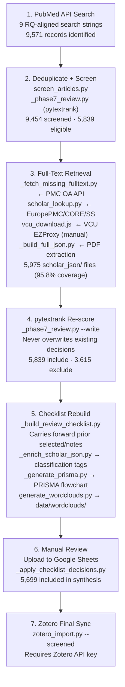

# CH_1 Literature Review — SQLR Workflow

**Systematic Quantitative Literature Review (SQLR)** for:
> *Pharmacogenomics Implementation: A Systematic Review*

**Target journal:** MDPI Journal of Personalized Medicine  
**PRISMA registration:** `[CRD-XXXXXX]` (register at prospero.ac.uk)  
**Pipeline:** Pure Python — no R, no AWS, no S3 required  
**Full workflow:** see [`PRISMA_WORKFLOW.md`](PRISMA_WORKFLOW.md)

---

## Quick Start

```bash
# From: manuscript/CH_1/Literature_Review/

# Full pipeline run (all steps, skip VCU proxy)
python scripts/_run_fulltext_pipeline.py --skip-vcu

# Resume from a specific step
python scripts/_run_fulltext_pipeline.py --step 4

# After Zotero manual review — import PDFs and re-score
python scripts/_import_zotero_pdfs.py
python scripts/_run_fulltext_pipeline.py --step 4 --step 5 --step 5b --step 5c --step 5d
```

---

## Pipeline Overview



---

## Research Questions

> Source of truth: `docs/CrossStep_Workflow/README_research_questions_mapping.md`

### Primary Research Questions (map to dashboard cohorts)

| ID | Cohort | Question | Dashboard Tab |
|----|--------|----------|---------------|
| **RQ1** | `non_opioid_ed` | Does drug window influence target outcome and which drugs are involved? Is there a temporal/ordering aspect? | BupaR · DTW · FP-Growth · Causal |
| **RQ2** | `opioid_ed` | What CPT/ICD codes and drugs can be used to predict OPIOID_ED events? | BupaR · DTW · FP-Growth · Causal |

### Additional Dashboard Questions

| ID | Question | Analysis Method | Dashboard Tab |
|----|----------|-----------------|---------------|
| **N1** | Is there a difference in outcomes for patients with routine vs. no routine appointments? | DTW Trajectories | DTW |
| **N2** | What sequences lead to target outcomes? | BupaR Pattern Mining | BupaR |
| **N3** | What are the times between sequences leading to target outcomes? | BupaR Pattern Mining | BupaR |
| **N4** | What connections between ICD, CPT, and drugs lead to target outcome? | FP-Growth | FP-Growth |
| **N5** | What features drive the outcome and how do they relate? | FFA + SHAP | Causal Analysis |
| **N6** | What drug combinations drive polypharmacy ED visits? | FFA/SHAP + BupaR | Causal + BupaR |

### Alignment: Dissertation Aims → Operational RQs

The operational RQs are focused sub-questions the pipeline answers directly. They collectively support the higher-level dissertation aims:

| Dissertation Aim | Operational RQs | How |
|-----------------|-----------------|-----|
| **Aim 1** — Predict opioid-influenced ER visits (>70% accuracy) | RQ2, N5 | RQ2 identifies the ICD/CPT/drug predictors; N5 (FFA+SHAP) validates causal attribution for the prediction model |
| **Aim 2** — Predict general (non-opioid) ER visits | RQ1, N2, N3 | RQ1 defines the 30-day drug window outcome; N2/N3 surface the event sequences preceding the visit |
| **Aim 3** — Identify drugs causing ADEs + ER visits | RQ1, N4, N6 | RQ1 measures drug window association; N4 maps ICD/CPT/Drug co-occurrences; N6 isolates polypharmacy drug combinations |
| **Aim 4** — Cloud-based technical architecture for precision medicine | N1–N6 (all tabs) | Each N-question maps to a deployed dashboard tab (DTW, BupaR, FP-Growth, Causal) — the tabs *are* the architecture deliverable |

### Full Traceability: Aim → RQ → Search Keyword

| Aim | RQ | Search # | Topic | Search Term | Articles | Gap? |
|-----|----|----------|-------|-------------|----------|------|
| **Aim 1** | RQ2 | 11 | Opioid Use Disorder | `opioid use disorder risk factors` | 2,261 | ⚠️ Missing "emergency department" |
| **Aim 1** | RQ2 | 2 | APCD Analysis | `all payers claim database` | 595 | ✅ |
| **Aim 1** | RQ2 | 7 | CatBoost / XGBoost | `CatBoost XGBoost gradient boosting healthcare claims data` | 15 | ✅ |
| **Aim 1** | N5 | 4 | Interpretability / SHAP | `SHAP Shapley additive explanations feature importance interpretability healthcare machine learning` | 83 | ✅ |
| **Aim 1** | N5 | 1 | Black-Box ML + CDS | `black box machine learning clinical decision support interpretability explainable AI` | 24 | ✅ |
| **Aim 1** | RQ2 | — | CPT codes + opioid | ❌ **Not searched** | 0 | ⛔ Add: `CPT procedure codes opioid risk prediction claims` |
| **Aim 2** | RQ1 | 12 | Polypharmacy | `polypharmacy elderly drug interactions adverse events` | 93 | ✅ |
| **Aim 2** | RQ1 | 13 | Drug-Drug Interactions | `drug-drug interactions DDI synergistic adverse drug events` | 3 | ⚠️ Only 3 results — term too narrow |
| **Aim 2** | RQ1 | 9 | Temporal Causality | `temporal causality healthcare claims data temporal windows` | 1 | ⚠️ Only 1 result — very sparse |
| **Aim 2** | N2/N3 | 6 | Process Mining (BupaR) | `process mining healthcare` | 2,790 | ✅ |
| **Aim 2** | RQ1 | — | Non-opioid ED drug window | ❌ **Not searched** | 0 | ⛔ Add: `opioid use disorder emergency department visit prediction machine learning` |
| **Aim 3** | RQ1 | 12 | Polypharmacy | `polypharmacy elderly drug interactions adverse events` | 93 | ✅ |
| **Aim 3** | N6 | 13 | Drug-Drug Interactions | `drug-drug interactions DDI synergistic adverse drug events` | 3 | ⚠️ Only 3 results |
| **Aim 3** | N4 | 5 | FP-Growth / Association Rules | `association rules healthcare` | 922 | ✅ |
| **Aim 3** | N6 | — | Drug combinations → polypharmacy ED | ❌ **Not searched** | 0 | ⛔ Add: `drug combination polypharmacy adverse drug event elderly emergency` |
| **Aim 4** | N1 | 8 | DTW | `dynamic time warping healthcare` | 220 | ✅ |
| **Aim 4** | N2/N3 | 6 | Process Mining (BupaR) | `process mining healthcare` | 2,790 | ✅ |
| **Aim 4** | N4 | 5 | FP-Growth / Association Rules | `association rules healthcare` | 922 | ✅ |
| **Aim 4** | N5 | 4 | Interpretability / SHAP | `SHAP Shapley additive explanations...` | 83 | ✅ |
| **Aim 4** | N1 | — | Routine vs. non-routine utilization | ❌ **Not searched** | 0 | ⛔ Add: `healthcare utilization patterns routine care administrative claims` |
| All | RQ1/RQ2 | 10 | Target Leakage | `target leakage data leakage machine learning healthcare prevention` | 2 | ⚠️ 2 results — expected (sparse field) |
| All | RQ1/RQ2 | 14 | DuckDB / OLAP | `analytical database healthcare` | 1,935 | ⚠️ Too broad — refine to `DuckDB columnar database analytics` |
| All | RQ1/RQ2 | 3 | Pharmacovigilance | `pharmacovigilance pharmacogenomics` | 114 | ⚠️ Two topics conflated — split into separate searches |

**Legend:** ✅ Good coverage · ⚠️ Weak/broad term · ⛔ Missing search needed

---

## Directory Structure

```
Literature_Review/
├── lit_review.qmd              ← Main SQLR notebook (run chunks in order)
├── CITATION_STATUS.md          ← Citation completeness tracker
├── scripts/
│   ├── prisma_tracker.R        ← PRISMA stage counts from CSVs
│   └── generate_citations.R   ← Fetch full metadata (DOI, journal, PMID)
├── data/
│   ├── chapter1/
│   │   ├── 1.1_introduction/
│   │   │   ├── blackbox_cds/         blackbox_cds_articles.csv
│   │   │   └── interpretability/     interpretability_articles.csv
│   │   ├── 1.2_clinical_background/
│   │   │   ├── opioid_disorder/      opioid_disorder_articles.csv
│   │   │   ├── polypharmacy/         polypharmacy_articles.csv
│   │   │   ├── drug_interactions/    drug_interactions_articles.csv
│   │   │   └── pharmacovigilance/    pharmacovigilance_articles.csv
│   │   ├── 1.3_methodological/
│   │   │   ├── apcd_analysis/        apcd_analysis_articles.csv
│   │   │   ├── pattern_mining/
│   │   │   │   ├── fpgrowth/         fpgrowth_articles.csv
│   │   │   │   ├── process_mining/   process_mining_articles.csv
│   │   │   │   └── dtw/              dtw_articles.csv
│   │   │   ├── temporal_causality/   temporal_causality_articles.csv
│   │   │   └── target_leakage/       target_leakage_articles.csv
│   │   └── 1.4_technical/
│   │       ├── catboost_xgboost/     catboost_xgboost_articles.csv
│   │       └── duckdb_olap/          duckdb_articles.csv
│   └── other_chapters/
│       ├── pgx_models/               pgx_risk_classification_articles.csv
│       ├── ehr_models/               risk_model_ehr_articles.csv
│       └── fhir_models/              fhir_ehr_articles.csv
└── background/                 ← Data dictionaries and reference materials
```

---

## Step-by-Step Workflow

### Step 1 — Run PubMed Searches (R)

Open `lit_review.qmd`. **Run the helper function chunks first** (scroll to `search-function` label, ~line 541), then run the 14 search topic chunks from the top.

```r
# Standalone — run all 14 searches at once:
source("scripts/run_all_searches.R")
```

**Search counts (last run) — mapped to repo research questions:**

| # | Topic | Search Term | RQ | Articles |
|---|-------|-------------|-----|----------|
| 1 | Black-Box ML + CDS | `black box machine learning clinical decision support interpretability explainable AI` | N5 (feature interpretability framing) | 24 |
| 2 | APCD Analysis | `all payers claim database` | RQ1, RQ2 (data source) | 595 |
| 3 | Pharmacovigilance | `pharmacovigilance pharmacogenomics` | RQ1, RQ2 (adverse drug event context) | 114 |
| 4 | Interpretability / SHAP | `SHAP Shapley additive explanations feature importance interpretability healthcare machine learning` | N5 (feature drivers + relations) | 83 |
| 5 | FP-Growth / Association Rules | `association rules healthcare` | N4 (ICD/CPT/Drug connections) | 922 |
| 6 | Process Mining (BupaR) | `process mining healthcare` | N2, N3 (sequences + timing to target) | 2,790 |
| 7 | CatBoost / XGBoost | `CatBoost XGBoost gradient boosting healthcare claims data` | RQ1, RQ2 (prediction method) | 15 |
| 8 | Dynamic Time Warping (DTW) | `dynamic time warping healthcare` | N1 (routine vs. no routine trajectories) | 220 |
| 9 | Temporal Causality | `temporal causality healthcare claims data temporal windows` | RQ1 (30-day drug window) | 1 |
| 10 | Target Leakage Prevention | `target leakage data leakage machine learning healthcare prevention` | RQ1, RQ2 (methodological validity) | 2 |
| 11 | Opioid Use Disorder | `opioid use disorder risk factors` | RQ2 (OPIOID_ED prediction) | 2,261 |
| 12 | Polypharmacy | `polypharmacy elderly drug interactions adverse events` | RQ1 (non-opioid ED drug window) | 93 |
| 13 | Drug-Drug Interactions | `drug-drug interactions DDI synergistic adverse drug events` | RQ1, N6 (drug combinations → ED) | 3 |
| 14 | DuckDB / OLAP Analytics | `analytical database healthcare` | RQ1, RQ2 (pipeline scalability) | 1,935 |
| 15 | CPT Codes + Opioid Risk | `CPT procedure codes opioid risk prediction claims` | RQ2 (CPT codes predict OPIOID_ED) | TBD |
| 16 | Opioid ED Visit Prediction | `opioid use disorder emergency department visit prediction machine learning` | RQ2, Aim 1+2 | TBD |
| 17 | Drug Combinations → Polypharmacy ED | `drug combination polypharmacy adverse drug event elderly emergency` | N6, Aim 3 | TBD |
| 18 | Routine vs. Non-Routine Utilization | `healthcare utilization patterns routine care administrative claims` | N1, Aim 4 | TBD |
| | **Chapter 1 total** | | | **8,059 + TBD** |
| | PGx Classification Models | | RQ1, RQ2 (PGx feature context) | ~4,000 |
| | Risk Models with EHR/CDS | | RQ1, RQ2 (CDS context) | ~6,000 |
| | Risk Models with FHIR | | RQ1, RQ2 (data interoperability) | ~5,000 |
| | **Grand total** | | | **~23,542 + TBD** |

---

### Step 2 — Download Open-Access Full Text (Python)

Articles with PMC IDs are downloaded via NCBI BioC JSON API to `pubmed_json_files/` inside each topic directory. Run the Python download chunks in `lit_review.qmd` after each search.

Articles without PMC IDs get an `HSH` hash stub — these need manual download (Step 3).

---

### Step 3 — Manual Download for Non-OA Articles

```r
source("scripts/prisma_tracker.R")   # generates missing_articles_combined.csv
```

1. Open `missing_articles_combined.csv`
2. Search each title in Zotero / PubMed / Google Scholar
3. Download PDF → save locally
4. Upload to S3: `pgx-repository/projects/Lit_Review/pdf_files/`
5. Run AWS Textract chunk in `lit_review.qmd` → JSON saved to `json_files/`

---

### Step 4 — Generate PRISMA Counts

```r
source("scripts/prisma_tracker.R")
# Writes: scripts/prisma_counts.csv  (stage tallies)
#         scripts/prisma_counts.rds  (R object for inline use in .qmd)
```

PRISMA stages tracked:

| Stage | Description |
|-------|-------------|
| Identified | Total rows across all 14 CSV files |
| Duplicates removed | Cross-topic duplicate titles |
| Screened | Identified − duplicates |
| Excluded (screen) | HSH records not subsequently downloaded |
| Full-text assessed | JSON files successfully downloaded |
| Excluded (full-text) | `Selected == FALSE` after manual review |
| Included | `Selected == TRUE` — final synthesis set |

---

### Step 5 — PRISMA Mermaid Chart

The chart is rendered inside `lit_review.qmd` using counts from `prisma_counts.rds`. It is exported as:

- HTML preview: render `lit_review.qmd --to html`
- PDF figure: `figures/ch01/fig_prisma.pdf` (copy manually after approval)

The PRISMA mermaid template is at the top of `lit_review.qmd` in the `prisma-chart` chunk.

---

### Step 6 — Screen Articles for Inclusion

Add `Selected` (TRUE/FALSE) and `ExclusionReason` columns to each CSV after full-text review:

**Inclusion criteria (5-year window, 2020–2025):**
- English language, peer-reviewed
- Human subjects or computational methods applicable to human health data
- Addresses at least one of the 8 research questions (RQ1, RQ2, N1–N6)

**RQ relevance check per article:**

| RQ | Include if article covers... |
|----|-----------------------------|
| RQ1 | Drug exposure window, non-opioid ED, polypharmacy, 30-day temporal window, drug–outcome association |
| RQ2 | ICD/CPT/drug prediction of opioid ED, OUD risk factors, opioid claims modeling |
| N1 | Routine vs. unplanned care patterns, healthcare utilization trajectories, admin ICD patterns |
| N2/N3 | Clinical event sequences, process mining in healthcare, time-to-event analysis |
| N4 | ICD/CPT/drug co-occurrence, association rule mining, clinical pattern networks |
| N5 | SHAP, FFA, explainable AI, feature attribution in clinical ML |
| N6 | Polypharmacy drug combinations, multi-drug adverse events, elderly ED visits |

**Exclusion reasons (tracked for PRISMA):**
- Off-topic on full-text review
- Conference abstract only (no full paper)
- Duplicate of already-included article
- No full text obtainable

---

### Step 7 — Export to Zotero → bib

1. Import selected articles into Zotero collection `PGx Dissertation / CH1 JPM`
2. Better BibTeX auto-exports → `refs/bmic-jpm.bib`
3. For complete citation metadata (DOI, journal, volume): `source("scripts/generate_citations.R")`

See `CITATION_STATUS.md` for current citation completeness status.

---

## Known Issues in lit_review.qmd

| Issue | Location | Fix |
|-------|----------|-----|
| Helper functions called before defined | Lines 226–530 call `search_pubmed_all()` defined at line 541 | Run `search-function` chunk first manually |
| `%<>%` used but `magrittr` not loaded | Line 581 | Add `library(magrittr)` to library block |
| Hard-coded `D:/Projects/` paths | Python download chunks | Updated to use `here()` relative paths |
| No PRISMA tracking | Entire notebook | `scripts/prisma_tracker.R` addresses this |
