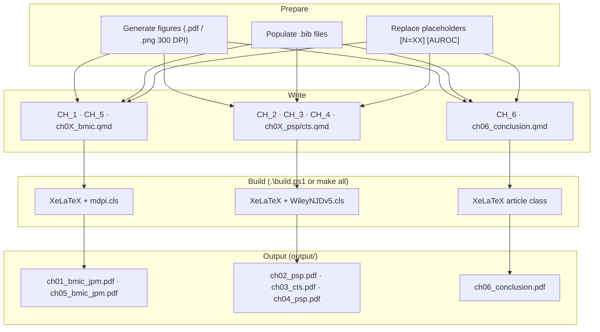
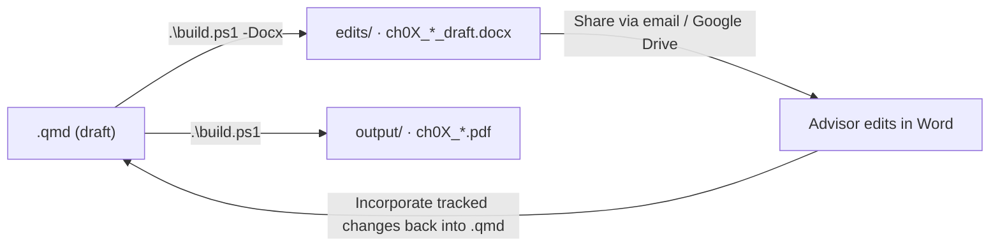

# Writing & Content — Manuscript Reference

**R. Jerome Dixon** · dixonrj@vcu.edu · [ORCID 0000-0001-8622-0597](https://orcid.org/0000-0001-8622-0597)
Virginia Commonwealth University · PhD Health Related Sciences (Translational Health Research)
**Defense:** 1 June 2026 (planned) · **Dept:** Pharmacotherapy & Outcomes Science, School of Pharmacy

> **Three reference files** — keep these as the single source of truth:
> - **README.md** (this file) — writing status, build, checklists, lessons learned
> - **[FIGURES.md](FIGURES.md)** — figure inventory, generation scripts, post-retrain figure checklist
> - **[METRICS.md](METRICS.md)** — cohort counts, model performance, placeholder tracker, S3 sources

---

## Committee

| Role | Name | Email |
|:-----|:-----|:------|
| Chair | Elvin T. Price, Pharm.D., Ph.D., FAHA | etprice@vcu.edu |
| Member | Tamas Gal, Ph.D. | tsgal@vcu.edu |
| Member | Lukasz Kurgan, Ph.D. | lkurgan@vcu.edu |
| Member | Dayanjan Wijesinghe, Ph.D. | wijesingheds@vcu.edu |
| Member | Jonathan DeShazo, Ph.D. | jonathandeshazo@gmail.com |

---

## Chapter → Journal Map

| # | File | Journal | Template | Output PDF |
|:--|:-----|:--------|:---------|:-----------|
| 1 | `CH_1/ch01_bmic.qmd` | *Journal of Personalized Medicine* (MDPI) | `bmic_jpm_template.tex` | `ch01_bmic_jpm.pdf` |
| 2 | `CH_2/ch02_psp.qmd` | *CPT: Pharmacometrics & Systems Pharmacology* (Wiley) | `wiley-njd-pdf` | `ch02_psp.pdf` |
| 3 | `CH_3/ch03_cts.qmd` | *Clinical and Translational Science* (Wiley) | `wiley-njd-pdf` | `ch03_cts.pdf` |
| 4 | `CH_4/ch04_psp.qmd` | *CPT: Pharmacometrics & Systems Pharmacology* (Wiley) | `wiley-njd-pdf` | `ch04_psp.pdf` |
| 5 | `CH_5/ch05_bmic.qmd` | *Journal of Personalized Medicine* (MDPI) | `bmic_jpm_template.tex` | `ch05_bmic_jpm.pdf` |
| 6 | `CH_6/ch06_conclusion.qmd` | *(dissertation only)* | plain article | `ch06_conclusion.pdf` |

**IRB:** HM20022300 (non-human-subjects waiver) applied to CH_3, CH_4.
**PROSPERO:** CRD420261354089 (awaiting publication) — CH_1.

---

## Build Commands

```powershell
# Windows
.\build.ps1                    # all chapters → output/
.\build.ps1 -Chapter 1         # single chapter PDF
.\build.ps1 -Docx              # all chapters → edits/ (.docx for advisor)
.\build.ps1 -Docx -Chapter 2   # single chapter .docx
.\build.ps1 -Draft             # plain article (no journal template)
.\build.ps1 -Clean             # remove output/ and edits/

# Post-retrain: regenerate figures then rebuild
python manuscript/generate_figures.py
.\build.ps1
```

```bash
# Linux / macOS
make all | make ch01 | make docx | make docx-ch01 | make clean
```

> Always use `.\build.ps1` — never `quarto render --to pdf` directly (TEXINPUTS/BSTINPUTS not set).

---

## Build Pipeline



---

## Advisor Review Workflow



---

## Writing Status — ALL CHAPTERS COMPLETE ✅

All train-trip sessions (HAR→WAS Mar 24; RGH→CLE Mar 26–27; CLE→WAS Mar 29, 2026) complete.

| Ch | Writing | Sections still needing expansion | Retrain dep. |
|:---|:-------:|:---------------------------------|:------------:|
| 1 SQLR | ✅ | Methods detail (+~2,100 words) | No |
| 2 Architecture | ✅ | Results & Discussion (+~2,300 words) | No |
| 3 Opioid ED | ✅ | Results (+~2,500 words) | Partial |
| 4 Polypharmacy | ✅ | Results (+~2,600 words) | Partial |
| 5 Dashboard | ✅ | Architecture & Discussion (+~3,300 words) | Partial |
| 6 Conclusion | ✅ | Chapter summaries & Integration (+~2,500 words) | No |

---

## Word Count / Section Expansion Tracker

### Expand now — no retrain needed

| Ch | Section | Words | Target | Priority |
|:---|:--------|------:|-------:|:---------|
| 1 | Protocol/Registration, Eligibility, Study Selection | 29–130 | 100–300 | High |
| 1 | Data Extraction, Quality Assessment, Evidence Synthesis | 40–130 | 100–300 | High |
| 1 | Operational Performance Metrics, Limitations | 40–147 | 200–300 | High |
| 2 | Study Objectives, Data Source, Cohort Construction | 34–131 | 200–500 | High |
| 2 | Ensemble Modeling, Discussion | 54–139 | 200–500 | High |
| 3 | Study Design, Cohort Construction, Ensemble section | 45–119 | 200–350 | High |
| 3 | Methods (features, trajectory), Discussion | 61–113 | 200–350 | High |
| 4 | Study Design, Cohort, FFA methods, Statistics section | 31–143 | 200–400 | High |
| 4 | Discussion (FFA calculator, Z-code interpretation) | 47–98 | 200–400 | High |
| 5 | Design Philosophy, Hybrid Deployment, CI/CD Pipeline | 46–176 | 250–450 | High |
| 5 | Partition-First Routing, Discussion | 78–157 | 250–450 | High |
| 6 | Overview, Chapter summaries (x5), Propositions | 70–109 | 200–400 | High |
| 6 | XAI–PGx Integration, Common Methodology | 83–105 | 200–400 | High |

### Expand after retrain

| Ch | Section | Dependency |
|:---|:--------|:-----------|
| 3 | Cohort Characteristics, Consensus-Causal Features (SHAP), Trajectory cluster N | `shap_top_features.json`, `dtw_manuscript_summary.json` |
| 4 | DDI pair/triplet counts, IE/IR score tables | `ffa_ie_ci.json` (EC2 local) |
| 5 | Performance Benchmarks | CloudWatch post-deploy |
| 6 | Performance Summary table | post-retrain metrics |

---

## Pre-Submission Checklist

### CH_1 & CH_5 — MDPI Journal of Personalized Medicine

- [ ] Abstract: structured Background/Methods/Results/Conclusions, ≤ 200 words (labels count)
- [ ] Keywords: 5–8 terms, semicolon-separated
- [ ] Word limit: 8,000 (CH_1 review) / 7,000 (CH_5 article), excl. references/supplementary
- [ ] Figures: ≤ 8 (CH_1) / ≤ 7 (CH_5); PDF/EPS ≥ 300 DPI
- [ ] CRediT author contributions statement (`R.J.D.` and co-author initials) present
- [ ] Data availability statement present (VHI DUA language)
- [ ] Ethics / IRB: "Not applicable" (CH_1); HM20022300 (CH_5 if needed)
- [ ] ORCID 0000-0001-8622-0597 verified in submission system
- [ ] `\bibliography{../refs/discipline,../refs/bmic-jpm}` present in template
- [ ] Cover letter drafted for precision medicine + CDS readership

### CH_2 & CH_4 — CPT:PSP (Wiley)

- [ ] Abstract: unstructured, ≤ 250 words
- [ ] Keywords: 5 terms, semicolon-separated
- [ ] Word limit: 5,000 (excl. abstract, references, legends)
- [ ] Figures: ≤ 5; TIFF/EPS 300 DPI
- [ ] Reference style: AMA numbered superscript; `wileyNJD-AMA.bst` active
- [ ] Article type: "Research Article"
- [ ] Data availability + code availability statements
- [ ] Conflict of interest + funding statement
- [ ] CRediT author contributions

### CH_3 — CTS (Wiley)

- [ ] Abstract: structured, ≤ 250 words
- [ ] Keywords: 3–6 terms
- [ ] Word limit: 4,000 (excl. abstract, references)
- [ ] Figures: ≤ 5 — CH_3 currently has 7; consolidate or move 2 to supplementary (see FIGURES.md)
- [ ] TRIPOD reporting checklist in supplement
- [ ] Ethics statement / VCHI DUA statement present; IRB waiver HM20022300 cited
- [ ] Lay summary (1–2 sentences) recommended

### All Chapters

- [ ] All `[PLACEHOLDER]` tokens replaced — verify: `Select-String -Path CH_*/ch*.qmd -Pattern '\['`
- [ ] All `../figures/chXX/fig_*.pdf` are real generated files (not stubs)
- [ ] Abbreviations section complete
- [ ] No `[?]` citations in compiled PDF (check `.blg` for bibtex warnings)
- [ ] `keep-tex: false` or `.tex` intermediate not included in submission package

---

## Data Availability Statement

> The data supporting the findings of this dissertation are derived from Virginia's All-Payer Claims Database
> (APCD) under a data use agreement with the Virginia Center for Health Innovation (VCHI) and Virginia Health
> Information (VHI). These data are not publicly available. Data access requests: **https://www.vhi.org**
> Analysis code: **https://github.com/Jerome3590/pgx-analysis**

- **Applied to:** CH_2, CH_3, CH_4, CH_6 (identical statement in each Data Availability section)
- **CH_1:** Extracted SQLR dataset available as Supplementary File S5; no APCD data used.
- **CH_5:** Synthetic inputs only — source code at https://github.com/Jerome3590/pgx-analysis

---

## Literature Search & Zotero Workflow

CH_1 systematic review pipeline:

1. **PubMed automated search** — `CH_1/Literature_Review/lit_review.qmd` (rentrez) → per-topic CSVs in `data/`
2. **Gap-fill** — `find_missing_articles()` → `missing_pgx_articles.csv` → manual Zotero import
3. **Bulk import** — `CH_1/Literature_Review/scripts/import_to_zotero.py` → Zotero Web API

Full instructions: `CH_1/Literature_Review/scripts/README_ZOTERO_IMPORT.md`
Credentials: User ID `6037399`, collection `LS75EWXU`, API key in local env — do **not** commit.

---

## PROSPERO Registration

| Field | Value |
|:------|:------|
| **ID** | CRD420261354089 |
| **Status** | New record awaiting publication (2026-03-28) |
| **URL** | https://www.crd.york.ac.uk/prospero/display_record.php?ID=CRD420261354089 |
| **Title** | Bridging Explainable AI and Pharmacogenomics for Opioid Risk Prediction: A Systematic Quantitative Literature Review |

---

## Repository Structure

```
pgx-analysis/
├── 1a_apcd_input_data/      APCD text → Parquet
├── 1b_apcd_event_filter/    ICD/admin event filtering
├── 2_create_cohort/         cohort construction
├── 3a_feature_importance/   MC-CV feature screening
├── 4_model_data/            model-ready features
├── 5_pgx_analysis/          PGx CPIC enrichment
├── 6_final_model/           CatBoost/XGBoost per-bin training
├── 7_shap_analysis/         SHAP global/local
├── 8_ffa_analysis/          FFA Boolean rules
├── 9_dashboard_visuals/     BupaR, DTW, FP-Growth
├── 10_risk_dashboard/       Lambda, Docker, S3 deploy
├── py_helpers/              event_density_utils.py, etc.
└── manuscript/              ← THIS DIRECTORY
    ├── CH_1/ … CH_6/        QMD source files
    ├── templates/           bmic_jpm_template.tex, cpt_psp_template.tex, cts_template.tex
    ├── _extensions/ramiromagno/wiley-njd/
    ├── refs/                discipline.bib, bmic-jpm.bib, cpt-psp.bib, cts.bib
    ├── figures/ch01/ … ch06/
    ├── output/              compiled PDFs
    ├── scripts/             extract_visual_manuscript.py, compute_brier_ici.py, etc.
    ├── _quarto.yml
    ├── build.ps1            Windows build
    └── Makefile             Linux/macOS build
```

---

## Key Design Decisions

| Decision | Rationale |
|:---------|:----------|
| Partition-First Architecture | Linear scalability across age-band × year strata for parallel DuckDB workers |
| S3 checkpoints per partition | Fault-tolerant; enables mid-run resume without reprocessing |
| Per-density-bin models (`n_event_bin`) | Prevents high-utilization patients from biasing average-risk predictions |
| Consensus Filter (SHAP ∩ FFA) | Dual-confirmation reduces false-positive causal features vs. single-method |
| Visualization-only BupaR/FP-Growth | Prevents target leakage from trajectory/association mining into predictive features |
| Temporal validation (train 2016–2018 / hold 2019) | Mirrors real-world deployment; prevents optimistic CV-only estimates |
| Exclude 2020 entirely | COVID-19 caused non-representative utilization patterns |
| 5:1 case-control matching | Sufficient statistical power; avoids class-weight hyperparameter sensitivity |
| Stateless Lambda + ephemeral PGx card | HIPAA-compliant CDS without dedicated PHI infrastructure |

---

## Template Patches

Re-apply after Quarto / TinyTeX upgrades.

### MDPI `bmic_jpm_template.tex` (CH_1, CH_5)

| # | Fix | Symptom without fix |
|:--|:----|:--------------------|
| 1 | Escape `$$TEXINPUTS` / `$$env:` (double-dollar) | Pandoc treats shell vars as template vars → render error |
| 2 | Replace `$^{n}$` with `\textsuperscript{n}` | LaTeX math-mode error |
| 3 | `\let\listoflistings\relax` before `$header-includes$` | Undefined control sequence |
| 4 | `\makeatletter\def\@datepublished{}\makeatother` | `mdpi.cls` line 649 undefined |
| 5 | `\providecommand{\history}[1]{}` | Undefined `\history` |
| 6 | `\abbreviations{}{content}` — 2 args, placed in body | cls expects 2-arg form; preamble fails |
| 7 | `\pubvolume{1}` / `\issuenum{1}` / `\articlenumber{1}` as integers | String values cause arithmetic error |
| 8 | Remove `$if(natbib)$\bibliographystyle...$endif$` block | Duplicate `\bibstyle` |
| 9 | Escape `$$body$$` in `%%` comment | Body rendered twice → "Too many }'s" |
| 10 | Add `\bibliography{../refs/discipline,../refs/bmic-jpm}` before `\end{document}` | No `\bibdata` → all citations `[?]` |

YAML renames: `journal:` → `target-journal:` · `abbreviations:` → `manuscript-abbreviations:` · `articletype:` → `target-articletype:`

### MDPI `templates/Definitions/mdpi.cls`

| # | Fix | Symptom |
|:--|:----|:--------|
| 1 | Remove `Definitions/` prefix from `\bibliographystyle{}` (lines 396/399/402) | bibtex cannot find `mdpi.bst` from `CH_X/` |

### Wiley `WileyNJDv5.cls` (CH_2, CH_3, CH_4)

| # | Fix | Symptom |
|:--|:----|:--------|
| 1 | `\ifdefined\reserveinserts\reserveinserts{28}\fi` | Float register overflow |
| 2 | Comment out `\usepackage[english]{babel}` | Conflicts with XeLaTeX font loading |
| 3 | Uncomment `\RequirePackage{longtable}` | Longtable undefined |
| 4 | Add `\tightlist` to `partials/pandoc.tex` | Undefined in Pandoc list output |

### Bibliography

- Filenames must use **hyphens** not underscores — LaTeX escapes `_` in `.aux` files breaking bibtex lookup.
- Canonical files: `discipline.bib`, `bmic-jpm.bib`, `cpt-psp.bib`, `cts.bib`
- Missing entries added 2026-03-28: `Kapoor2023`, `NIH2022` → `refs/bmic-jpm.bib`

---

## Lessons Learned

### 2026-03-28

**TikZ OODA Diagram**
- `engine: knitr` is mandatory for `{tikz}` chunks — Jupyter default fails with yaml import error
- Use `%|` not `#|` for chunk options inside `{tikz}` blocks
- `out-width: 50%` for portrait figures; `width=100%` for landscape
- Tee-split: draw stem/splitter without arrowheads; arrowheads on branch lines only; requires `calc` library
- Phase label `xshift` must be tuned per-phase to avoid landing on tee-split arrows

**Build system**
- Always use `.\build.ps1` — direct `quarto render --to pdf` fails (TEXINPUTS not set)
- `pdfcrop.exe` MiKTeX update nag is non-fatal (stderr only)
- TinyTeX upgraded 2025→2026; `mathastext` installed

**Abstract / Title**
- MDPI JPM word limit ≤ 200 — structured section labels count toward total
- "Opioid and Polypharmacy Risk Prediction" is the correct umbrella for both RQs

### 2026-03-29

**n_events feature removal**
- `n_events` (continuous claim count) dropped; replaced by `n_event_bin_ordinal`
- Manuscript references to "median n_events" → reframe as descriptive statistic, not model feature
- Lambda: `n_event_bin` computed from submitted code count BEFORE `build_feature_vector()`

**FFA outputs**
- `ffa_causal_factors.csv` on EC2 local disk only — must manually copy before `extract_ffa_manuscript.py`

**DTW failure**
- `9_dtw_log/` failed 2026-03-29: `ERROR: Model data has no target date column (first_opioid_ed_date not found)`
- Cluster sizes in CH_3/CH_6 remain as `[XX,XXX]` / `[XX%]` until fix + rerun

**AI slop removed (CH_6)**
- Removed duplicate "completing the translational arc", "closing the loop" cliché, "is exactly the gap" construction
