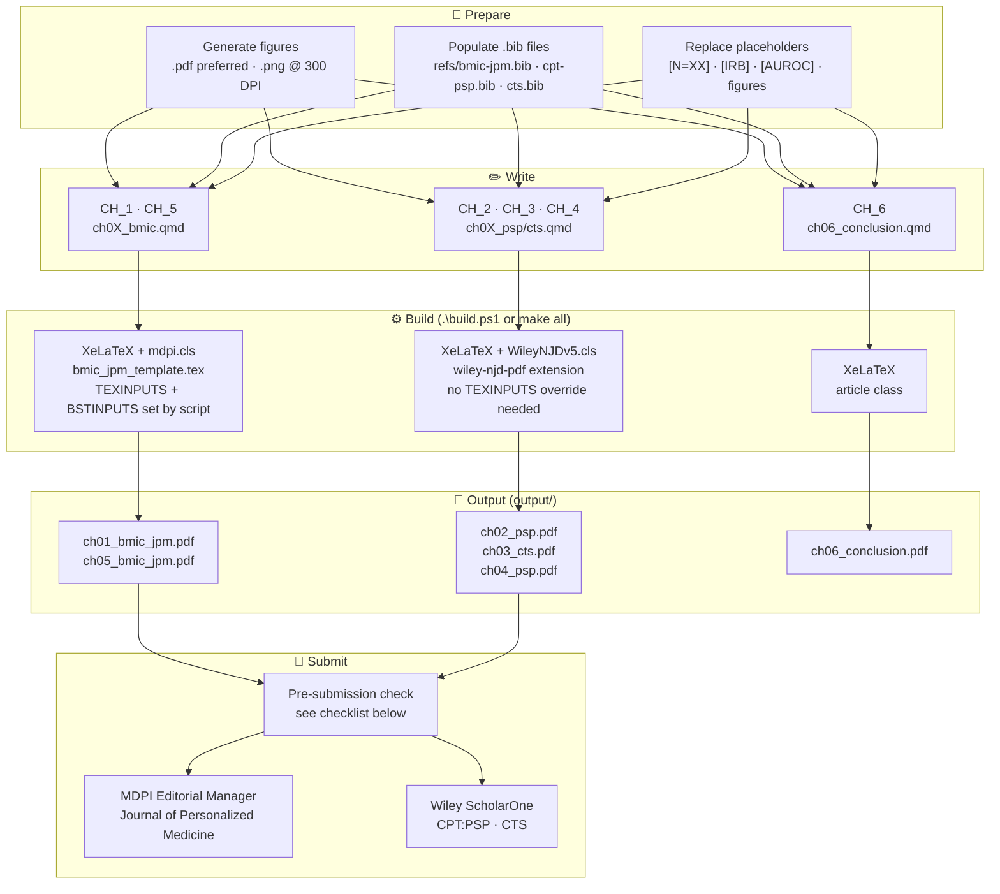
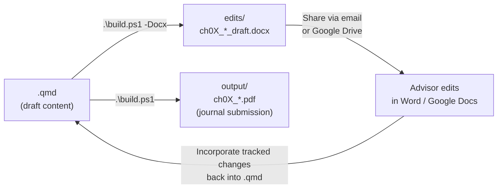

# Dissertation Manuscript Build System

**R. Jerome Dixon** · dixonrj@vcu.edu · [ORCID 0000-0001-8622-0597](https://orcid.org/0000-0001-8622-0597)  
Virginia Commonwealth University · PhD Health Related Sciences (Translational Health Research)

> For full dissertation outline, journal rationale, figure/data checklists, and submission guidelines  
> see **[DISSERTATION.md](DISSERTATION.md)**  
> For train-trip writing schedule → **[WRITING_PLAN.md](WRITING_PLAN.md)**

---

## Build Pipeline



---

## Quick Build (Windows)

```powershell
.\build.ps1                    # all chapters → output/ (journal PDFs)
.\build.ps1 -Chapter 1         # single chapter PDF
.\build.ps1 -Docx              # all chapters → edits/ (Word .docx for advisor)
.\build.ps1 -Docx -Chapter 2   # single chapter .docx
.\build.ps1 -Draft             # plain article, no journal template
.\build.ps1 -Clean             # remove output/ PDFs and edits/ .docx files
```

## Quick Build (Linux / macOS)

```bash
make all          # all chapters → output/
make ch01         # single chapter PDF
make docx         # all chapters → edits/ (Word .docx for advisor)
make docx-ch01    # single chapter .docx
make clean
```

> `build.ps1` and `Makefile` automatically set both `TEXINPUTS` (xelatex finds
> `templates/Definitions/mdpi.cls`) and `BSTINPUTS` (bibtex finds `mdpi.bst`).

## Advisor Review Workflow



`.docx` files in `edits/` are Google Docs-compatible — upload directly to Drive
for advisor comments. Tracked changes get incorporated manually back into the
`.qmd` source.

---

## Prerequisites

| Tool | Install |
|:---|:---|
| Quarto CLI | https://quarto.org/docs/get-started/ |
| TinyTeX | `quarto install tinytex` |
| MDPI cls | ✅ bundled — `templates/Definitions/mdpi.cls` |
| Wiley NJD cls | ✅ bundled — `_extensions/ramiromagno/wiley-njd/` |

---

## Chapter → Output Map

| Ch | QMD | Journal | Template | Output PDF |
|:--|:---|:--------|:---------|:-----------|
| 1 | `CH_1/ch01_bmic.qmd` | MDPI JPM | `bmic_jpm_template.tex` | `ch01_bmic_jpm.pdf` |
| 2 | `CH_2/ch02_psp.qmd` | CPT:PSP (Wiley) | `wiley-njd-pdf` | `ch02_psp.pdf` |
| 3 | `CH_3/ch03_cts.qmd` | CTS (Wiley) | `wiley-njd-pdf` | `ch03_cts.pdf` |
| 4 | `CH_4/ch04_psp.qmd` | CPT:PSP (Wiley) | `wiley-njd-pdf` | `ch04_psp.pdf` |
| 5 | `CH_5/ch05_bmic.qmd` | MDPI JPM | `bmic_jpm_template.tex` | `ch05_bmic_jpm.pdf` |
| 6 | `CH_6/ch06_conclusion.qmd` | dissertation only | plain article | `ch06_conclusion.pdf` |

---

## Figures

| Type | Format | How |
|:-----|:-------|:----|
| Plots, diagrams, flowcharts | **PDF** | `plt.savefig('fig.pdf')` / `ggsave(device='pdf')` |
| Dashboard screenshots, UI | **PNG ≥ 300 DPI** | `plt.savefig('fig.png', dpi=300)` |
| Never use | JPEG | Lossy — fails journal QC |

Place figures in `figures/chXX/fig_name.pdf`. Reference as `../figures/chXX/fig_name.pdf`.

---

## OODA Loop Diagram (`fig-ontology`) — Replication & Design Rules

**Source:** `CH_1/ch01_bmic.qmd` — single `{tikz}` chunk labelled `fig-ontology`  
**Renders to:** PNG (HTML, via `magick` + `pdftools`) · native vector PDF (LaTeX/XeLaTeX)

---

### R / LaTeX Prerequisites

| Requirement | Install |
|:---|:---|
| `engine: knitr` in YAML frontmatter | Required — prevents Quarto from defaulting to Jupyter for `{tikz}` chunks |
| TinyTeX package `standalone` | Auto-installed on first render by `tlmgr` |
| R package `magick` | `install.packages('magick', lib='C:/r_library')` |
| R package `pdftools` | `install.packages('pdftools', lib='C:/r_library')` |
| TikZ libraries | Loaded inside chunk: `shapes.geometric, arrows.meta, positioning, calc, backgrounds, fit` |

### Render Commands

```powershell
# HTML preview (PNG output via magick)
quarto render CH_1/ch01_bmic.qmd --to html

# PDF (native vector — no extra packages needed beyond TinyTeX)
quarto render CH_1/ch01_bmic.qmd --to pdf
```

---

### Chunk Header Rules

```
{tikz}
%| label: fig-ontology       ← uses % not # (LaTeX comment char)
%| fig-cap: "..."
%| fig-align: center
%| out-width: 50%             ← portrait figure; 50% prevents HTML scroll
%| echo: false
```

- **Never use `#|`** in a `{tikz}` chunk — LaTeX uses `%` as its comment character.
- `out-width: 50%` is calibrated for the current portrait aspect ratio (~8 cm wide × 16 cm tall). If the diagram is made wider, increase toward `65–70%` to avoid a shrunken image. If taller, decrease to keep scroll-free.

---

### Diagram Structure

The diagram has **4 stacked phases** (top → bottom) with a shared horizontal center at **x = 3.5 cm**.

| Phase | Color | Nodes | y range (approx) |
|:------|:------|:------|:-----------------|
| **(1) OBSERVE** — Training 2016–2018 | blue `#dbeafe` | APCD · FAERS · RQ · Aggregated Observations (ellipse) | 19–22 |
| **(2) ORIENT** | green `#dcfce7` | Target Definition · Feature Importance · BupaR · DTW · FP-Growth | 14–19 |
| **(3) DECIDE** | yellow `#fef9c3` | Final GBT · SHAP · FFA · Combined SHAP/FFA (diamond) | 9–13 |
| **(4) ACT** — Test 2019 | pink `#fce7f3` | RQ1\|RQ2 Risk Dashboard · Feedback to APCD (ellipse) | 5–8 |

#### Phase Background Boxes

Drawn with `\begin{scope}[on background layer]` using the TikZ `fit` library. Each box auto-sizes around its contained nodes via `fit=(NODE1)(NODE2)...`. The phase label is positioned `[yshift=3pt]above` the bounding box.

**Minimum inter-phase gap rule:** Keep at least **2.5 units** between the center y-coordinate of the lowest node in one phase and the highest node in the next. This ensures the phase label has ~0.7 cm clearance above the next phase's content.

---

### Node Style Rules

```latex
% All three styles share minimum width=2.4cm, minimum height=0.72cm
block     = rectangle, rounded corners=2pt          ← standard pipeline step
synthnode = ellipse                                  ← synthesis / feedback terminal
combnode  = diamond, aspect=2.8                      ← convergence point (COMB only)
```

- **Font:** `\footnotesize` globally via `every node/.style`.
- **Phase label font:** `\small\bfseries` via `phlbl` style.
- All nodes share `minimum width=2.4cm` — **do not give individual nodes a different width** unless intentional; mismatched widths break the uniform column alignment.

---

### ORIENT Layout — Two-Column with Tee-Split

```
OBS (x=3.5, y=20.0)
 │  |-   down then left
 └──────────────► TGT.east   ← enters TGT from RIGHT side (not top)

Left spine (x=1.5):
  TGT  (y=17.5)
   ↓  straight down
  FI   (y=16.0)
   │── stem ──► fi_branch (x=3.9, y=16.0)
                     │  vertical splitter
              fi_top (3.9, 17.5) ──────────► BPAR.west
              fi_mid (3.9, 16.0) ──────────► DTW.west
              fi_bot (3.9, 14.5) ──────────► FPG.west
```

**Tee-split implementation** (requires `calc` library — already loaded):

```latex
\coordinate (fi_branch) at ($(FI.east)+(1.2,0)$);
\coordinate (fi_top)    at (fi_branch |- BPAR.west);
\coordinate (fi_mid)    at (fi_branch |- DTW.west);
\coordinate (fi_bot)    at (fi_branch |- FPG.west);
\draw    (FI.east)  -- (fi_branch);   % stem — no arrowhead
\draw    (fi_top)   -- (fi_bot);      % vertical splitter — no arrowhead
\draw[->] (fi_top)  -- (BPAR.west);  % branch arrows only
\draw[->] (fi_mid)  -- (DTW.west);
\draw[->] (fi_bot)  -- (FPG.west);
```

**Key rules:**
- `(A |- B)` = coordinate with x from A, y from B (calc library intersection syntax)
- Arrowheads go **only on the three branch lines** — not on the stem or splitter
- Adjust `+(1.2,0)` offset to move the split point closer/further from FI
- `OBS → TGT` uses **`|- (TGT.east)`** (enters right side) — do NOT use `TGT.north` (top)

**Phase label shifts — ORIENT and DECIDE:**

| Phase | `xshift` | Reason |
|:------|:---------|:-------|
| **(2) ORIENT** | `-1.8cm` | Fit box center x≈3.75 lands on the tee-split splitter at x=3.9 |
| **(3) DECIDE** | `+1.5cm` | Centers label over the FFA side, away from the GBT tee-split at x=3.5 |
| **(4) ACT** | `-1.2cm` | Mirrors ORIENT; keeps label over left side of the narrow ACT box |

```latex
% ORIENT
label={[phlbl, green!55!black,  xshift=-1.8cm, yshift=3pt]above:\textbf{(2) ORIENT}}
% DECIDE
label={[phlbl, orange!80!black, xshift=+1.5cm, yshift=3pt]above:\textbf{(3) DECIDE} \textendash\ Test 2019}
% ACT
label={[phlbl, red!65!black,    xshift=-1.2cm, yshift=3pt]above:\textbf{(4) ACT}}
```

---

### DECIDE Layout — Vertical Tee + Elbow Convergence

```
FI.south
 │  |-  down then right
 └────────────────────► GBT.west   ← enters GBT from LEFT side (not top)

GBT (x=3.5, y=12.0)
 │  stem (no arrowhead)
 └──► gbt_branch (x=3.5, y=11.15)
      ├──────────────────────────────┤  horizontal splitter
      ↓                              ↓
   SHAP.north (x=1.5, y=10.66)   FFA.north (x=5.5, y=10.66)
   SHAP (y=10.3)                 FFA (y=10.3)
      │                              │
      │  |-  down then right         │  |-  down then left
      └──────────► COMB.west         └◄─────── COMB.east
                  COMB (x=3.5, y=9.0)  ← diamond
                      │
                      │  straight down
                      ▼
                   DASH (x=3.5, y=6.5)
```

**Vertical tee-split for GBT → SHAP/FFA:**

```latex
\coordinate (gbt_branch) at ($(GBT.south)+(0,-0.49)$);
\coordinate (gbt_left)   at (gbt_branch -| SHAP.north);
\coordinate (gbt_right)  at (gbt_branch -| FFA.north);
\draw    (GBT.south)   -- (gbt_branch);  % stem — no arrowhead
\draw    (gbt_left)    -- (gbt_right);   % horizontal splitter — no arrowhead
\draw[->] (gbt_left)  -- (SHAP.north);  % branch arrows only
\draw[->] (gbt_right) -- (FFA.north);
```

**Key rules:**
- `(A -| B)` = coordinate with x from B, y from A (calc library)
- FI enters GBT from **`.west`** via `(FI.south) |- (GBT.west)` — not `.north`
- SHAP/FFA enter COMB from sides: `(SHAP.south) |- (COMB.west)` and `(FFA.south) |- (COMB.east)`
- COMB → DASH is **`--`** straight vertical (both share x=3.5)

**Phase label content:**
- **(3) DECIDE** carries `\textendash\ Test 2019` — SHAP/FFA computed on test cohort
- **(4) ACT** has no year suffix

**ACT padding rule:** The ACT box uses `inner sep=20pt` (vs 8pt default for all other phases). DASH/FB node positions are y=6.1 / y=4.8 — calibrated so the DECIDE→ACT box-to-box gap matches the ~1.22-unit gap used between all other adjacent phase boxes (OBSERVE→ORIENT, ORIENT→DECIDE). Do not change `inner sep` or node y without recomputing this gap.

**Gap calculation reference:**
- OBSERVE→ORIENT gap: OBS.south(19.64) − TGT.north(17.86) − 2×8pt(0.56) = **1.22 units**
- ORIENT→DECIDE gap: FPG.south(14.14) − GBT.north(12.36) − 2×8pt(0.56) = **1.22 units**
- DECIDE→ACT gap: COMB.south(8.64) − 8pt(0.28) − [DASH.north(6.46) + 20pt(0.71)] = **1.19 units** ≈ matched

---

### Adding or Removing Nodes

1. **Add a node** — place it with `\node[block, fill=<phase-color>] at (x, y) (ID) {Label};`
2. **Add an edge** — `\draw[->] (FROM) -- (TO);` or use `-|` / `|-` for right-angle routing
3. **Update the `fit=` list** for the phase box — include the new node ID so the bounding box expands
4. **Check inter-phase gap** — ensure the new node doesn't reduce clearance below 2.5 units from the adjacent phase
5. **Re-render** — `quarto render CH_1/ch01_bmic.qmd --to html` to preview

### Removing Nodes

1. Delete the `\node[...]` line
2. Delete all `\draw[->]` lines referencing that node ID (both `from` and `to`)
3. Remove the node ID from its phase `fit=(...)` list
4. Re-render and verify the phase box still fits correctly

---

### Diagram Accuracy Rules

The diagram reflects the **actual pipeline execution order** verified against:

| Code file | Rule enforced |
|:----------|:-------------|
| `4_model_data/create_model_data.py` | Step 3b (Feature Importance) must run **before** Step 4a; FP-Growth/BupaR/DTW use Step 3b filtered features |
| `py_helpers/shap_ffa_fpgrowth_utils.py` | Allowed codes for BupaR/DTW/FP-Growth come **exclusively** from Step 3b `cohort_feature_importance` — no fallbacks |
| `7_shap_analysis/run_shap_analysis.py` | SHAP loads Step 6 final model outputs — SHAP is **downstream** of Final GBT, not parallel |

**Forbidden edges** (structurally incorrect — do not re-add):
- `BPAR → Final GBT` — BupaR is a downstream visualization, not a model input
- `DTW → Final GBT` — same
- `FP-Growth → Final GBT` — same

**Required edge:**
- `Feature Importance (Step 3b) → Final GBT (Step 6)` — FI-filtered features are the input to Step 6 training

---

## Pre-Submission Checklist

Before sending any chapter PDF to a journal:

- [ ] All `[PLACEHOLDER]` values replaced (cohort N, IRB, PROSPERO, metrics, funding)
- [ ] All `../figures/chXX/fig_*.pdf` are real generated figures (not placeholders)
- [ ] Abstract word count within journal limit (MDPI JPM ≤ 200; CPT:PSP ≤ 250; CTS ≤ 250)
- [ ] Keywords 5–8 terms, semicolon-separated
- [ ] Abbreviations section complete
- [ ] References formatted and `.bib` entries verified
- [ ] `keep-tex: false` set (or confirm `.tex` intermediate is not submitted)
- [ ] Author ORCID `0000-0001-8622-0597` present
- [ ] IRB waiver statement in Methods
- [ ] Data availability statement added
- [ ] Cover letter drafted (see [DISSERTATION.md](DISSERTATION.md))

---

## Template Patches

Applied fixes to journal templates and supporting files. Record every patch here
so future Quarto/TinyTeX upgrades can be verified and re-applied as needed.

---

### MDPI — Journal of Personalized Medicine (`templates/bmic_jpm_template.tex`)

**Affects:** `CH_1/ch01_bmic.qmd`, `CH_5/ch05_bmic.qmd`

| # | File | Location | Fix | Symptom without fix |
|:--|:-----|:---------|:----|:--------------------|
| 1 | `bmic_jpm_template.tex` | comment lines | Escape bare `$TEXINPUTS` / `$env:` with `$$` | Pandoc treats shell variable syntax as template variables → render error |
| 2 | `bmic_jpm_template.tex` | superscripts | Replace `$^{n}$` with `\textsuperscript{n}` | LaTeX math-mode error in non-math context |
| 3 | `bmic_jpm_template.tex` | before `$header-includes$` | Add `\let\listoflistings\relax` | Undefined control sequence on render |
| 4 | `bmic_jpm_template.tex` | preamble | Add `\makeatletter\def\@datepublished{}\makeatother` | `mdpi.cls` line 649 omits initializer → undefined command |
| 5 | `bmic_jpm_template.tex` | preamble | Add `\providecommand{\history}[1]{}` | Undefined `\history` command |
| 6 | `bmic_jpm_template.tex` | body (not preamble) | `\abbreviations{Abbreviations}{content}` — 2 args, placed in body | cls expects 2-arg form; placement in preamble fails |
| 7 | `bmic_jpm_template.tex` | metadata variables | Set `\pubvolume{1}` / `\issuenum{1}` / `\articlenumber{1}` as integers | String values `"x"/"xx"` cause cls arithmetic error |
| 8 | `bmic_jpm_template.tex` | — | Removed `$if(natbib)$\bibliographystyle...\bibliography...$endif$` block | Duplicate `\bibstyle` error when mdpi.cls also calls `\bibliographystyle` |
| 9 | `bmic_jpm_template.tex` | line 133 (comment) | Escaped `$body$` → `$$body$$` in `%%` comment **(2026-03-27)** | Pandoc substitutes `$body$` everywhere including in comments → full body rendered twice → "Too many }'s" LaTeX error + body duplication in `.tex` |
| 10 | `bmic_jpm_template.tex` | before `\end{document}` | Added `\bibliography{../refs/discipline,../refs/bmic-jpm}` **(2026-03-28)** | Bibtex had no `\bibdata` directive → "I found no \\bibdata command" → **all** citations rendered as `[?]` |

**YAML reserved field renames** (required to avoid cls conflicts):

| Standard Pandoc field | Renamed to in CH_1 / CH_5 |
|:----------------------|:--------------------------|
| `journal:` | `target-journal:` |
| `abbreviations:` | `manuscript-abbreviations:` |
| `articletype:` | `target-articletype:` |
| `biblio-style:` | **removed** — `mdpi.cls` calls `\bibliographystyle{mdpi}` internally |

---

### MDPI — `templates/Definitions/mdpi.cls`

| # | Location | Fix | Symptom without fix |
|:--|:---------|:----|:--------------------|
| 1 | Lines 396 / 399 / 402 | Removed `Definitions/` path prefix from `\bibliographystyle{}` calls | bibtex cannot find `mdpi.bst` when run from `CH_X/` directory |

---

### Wiley CPT:PSP · CTS (`templates/cpt_psp_template.tex`, `templates/cts_template.tex`)

**Affects:** `CH_2`, `CH_4` (CPT:PSP), `CH_3` (CTS)

| # | Fix | Symptom without fix |
|:--|:----|:--------------------|
| 1 | Use `WileyNJDv5` class (not `WileyNJD-v2`) | Class not found |
| 2 | Quarto native `$by-author$` / `$by-affiliation$` author format | Author block empty |
| 3 | `\usepackage{calc}` | `\real{}` undefined in Pandoc longtable column widths |
| 4 | `\usepackage{longtable,booktabs,array}` | Pandoc-generated tables fail to compile |
| 5 | longtable 2-column patch in `cpt_psp_template.tex` only | Longtable overflows 2-column `STIX2COL` layout |
| 6 | `\tightlist` shim before `$header-includes$` | Undefined `\tightlist` |
| 7 | `\let\listoflistings\relax` before `$header-includes$` | Undefined control sequence |
| 8 | No `$if(natbib)$\bibliographystyle...\bibliography...$endif$` block | Duplicate `\bibstyle` |
| 9 | `abbreviations-note` variable (Wiley footnote style) | Abbreviations section missing |
| 10 | Format variables: `article-type`, `journal`, `volume`, `issue`, `pages`, `year` | Blank journal header fields |

---

### Wiley — `_extensions/ramiromagno/wiley-njd/wiley-njd-v5/WileyNJDv5.cls`

| # | Fix | Symptom without fix |
|:--|:----|:--------------------|
| 1 | `\ifdefined\reserveinserts\reserveinserts{28}\fi` | Float register overflow |
| 2 | Comment out `\usepackage[english]{babel}` | Babel conflicts with XeLaTeX font loading |
| 3 | Uncomment `\RequirePackage{longtable}` | Longtable undefined |
| 4 | Add `\tightlist` to `partials/pandoc.tex` | Undefined `\tightlist` in Pandoc list output |

---

### Bibliography Files (`refs/`)

- Filenames must use **hyphens, not underscores** — LaTeX escapes `_` in `.aux` files breaking bibtex lookup.
- Canonical files: `discipline.bib`, `bmic-jpm.bib`, `cpt-psp.bib`, `cts.bib`
- Missing entries added **(2026-03-28):** `Kapoor2023` (Kapoor & Narayanan, *Patterns* 2023), `NIH2022` (NIH AI Strategic Plan) → `refs/bmic-jpm.bib`

---

## Lessons Learned

Chronological log of non-obvious decisions and fixes. Update this section after each working session.

---

### 2026-03-28

#### TikZ OODA Diagram

- **`engine: knitr` is mandatory** in the Quarto frontmatter for `{tikz}` chunks. Without it, Quarto defaults to Jupyter and fails with a `yaml` module import error.
- **Use `%|` not `#|`** for chunk options inside `{tikz}` blocks — LaTeX uses `%` as its comment character; `#|` is silently ignored, causing chunk options (label, out-width, echo) to have no effect.
- **`out-width: 50%`** is the correct setting for a portrait TikZ figure to avoid an HTML horizontal scrollbar. For landscape figures, `width=100%` fills the column cleanly.
- **Phase label `xshift`** must be tuned per-phase to avoid landing on tee-split arrows. Final values: ORIENT `−1.8cm`, DECIDE `+0.8cm`, ACT `−1.2cm`. Adjust whenever the fit-box center shifts.
- **Tee-split pattern** (horizontal or vertical): draw stem and splitter without arrowheads; arrowheads go on branch lines only. Requires `calc` library. Use `(A |- B)` for x-from-A/y-from-B, `(A -| B)` for x-from-B/y-from-A.
- **Arrow entry anchor matters:** `OBS → TGT` must enter `TGT.east` (right side), not `.north` (top), to avoid crossing the left-spine arrow. `FI → GBT` must enter `GBT.west` (left side) via `(FI.south) |- (GBT.west)`.
- **`inner sep=20pt`** on the ACT phase box is the primary mechanism creating visual separation from DECIDE. Do not reduce it without recomputing the DECIDE→ACT gap (target: ~1.22 units, matching all other inter-phase gaps).
- **Source node padding:** APCD/FAERS/RQ moved from y=21.0 to y=21.5 to give the incoming L-elbow arrows breathing room into the OBS ellipse (edge gap: 0.28 → 0.78 units).
- **DECIDE label text:** carries `\textendash\ Test 2019` because SHAP/FFA are computed on the 2019 test cohort. ACT label has no year suffix.

#### Abstract

- **MDPI JPM word limit is ≤ 200 words** — structured section labels (Background, Methods, Results, Conclusions) count toward the total. Trim primarily from the Methods sentence (API source lists are detail-level content better placed in the body).
- **Body intro opening sentence** need not be unique from the abstract opening — some overlap is standard journal practice. The body must add substantial new context (OODA framing, CRISP-DM, RQ definitions) that isn't in the abstract.
- **Remove duplicate `> Note:` blockquotes** if the same content already appears in a nearby paragraph — they add visual weight without informational value.

#### Title

- **"Opioid and Polypharmacy Risk Prediction"** is the correct umbrella for both RQs. Retains the high-value "opioid" keyword for PubMed indexing while explicitly naming the polypharmacy scope (RQ2). "Drug Risk Prediction" alone is too broad and loses indexing specificity.
- **PROSPERO title** was registered as the old title — update the PROSPERO record if/when the registration is published and the new title is confirmed.

#### Build System

- **Always use `.\build.ps1 -Chapter X`** for PDF output — never `quarto render --to pdf` directly. The build script sets `TEXINPUTS` and `BSTINPUTS` so xelatex can find `Definitions/mdpi.cls` and `mdpi.bst`. Direct `quarto render --to pdf` fails with `File 'Definitions/mdpi.cls' not found`.
- **`pdfcrop.exe` MiKTeX update nag** is non-fatal — it appears in stderr but does not block PDF generation. Run MiKTeX update console to silence it.

#### Figures

- **Portrait TikZ diagrams:** set `out-width: 50%` in chunk options — prevents HTML horizontal scrollbar.
- **Landscape PDF figures** (`{width=100%}` syntax): use `width=100%` for full column fill with no scroll container.

---

## PROSPERO Registration

| Field | Value |
|:------|:------|
| **Registration ID** | CRD420261354089 |
| **Status** | New record awaiting publication *(2026-03-28)* |
| **URL** | https://www.crd.york.ac.uk/prospero/display_record.php?ID=CRD420261354089 |
| **Title** | Bridging Explainable Artificial Intelligence and Pharmacogenomics for Opioid Risk Prediction: A Systematic Quantitative Literature Review |
| **Registered** | 28 March 2026 |

---

## Data Availability

The data supporting the findings of this dissertation are derived from
Virginia's All-Payer Claims Database (APCD). Restrictions apply to the
availability of these data, which were used under a data use agreement
with the Virginia Center for Health Innovation (VCHI) and Virginia Health
Information (VHI).

- **Data access requests:** https://www.vhi.org
- **Analysis code:** https://github.com/Jerome3590/pgx-analysis
- **DUA holder:** Virginia Center for Health Innovation (VCHI)

**Applied to:** CH_2, CH_3, CH_4, CH_6 — identical statement in each Data
Availability section **(2026-03-28)**

**CH_1** (systematic review): extracted dataset available as Supplementary
File S5; no APCD data used.

**CH_5** (dashboard/system evaluation): synthetic inputs only; no primary
patient data — source code at https://github.com/Jerome3590/pgx-analysis.

---

## Remaining Placeholders

Audited **(2026-03-28)**. All `[PLACEHOLDER]` tokens remaining in QMD source files.

---

### Requires Author Input

| Chapter | File | Placeholder | Value needed |
|:--------|:-----|:-----------|:-------------|
| CH_1 | `ch01_bmic.qmd` | `[CRD-XXXXXX]` | ~~Resolved — see below~~ |
| All | all QMDs | `[Funding statement]` | Grant / funding acknowledgment text |
| CH_5 | `ch05_bmic.qmd` | `[https://github.com/[repo]]` | Public GitHub repository URL |
| CH_5 | `ch05_bmic.qmd` | `[version/date]` | CPIC guidelines snapshot release date used in dashboard |
| CH_6 | `ch06_conclusion.qmd` | `[Chair]`, `[Member 1–3]` | ~~Resolved — see below~~ |
| CH_6 | `ch06_conclusion.qmd` | `[Month Year]` | Dissertation defense date |

**Resolved:**
- `[IRB-XXXX]` → **HM20022300** applied to CH_3, CH_4 **(2026-03-28)**
- `[Funding statement]` → **"This research received no external funding."** applied to all chapters **(2026-03-28)**
- `[https://github.com/[repo]]` → **https://github.com/Jerome3590/pgx-analysis** applied to CH_2, CH_5 **(2026-03-28)**
- `[version/date]` → **March 2026** (CPIC guidelines snapshot, access date) applied to CH_5 **(2026-03-28)**
- `[Month Year]` → **1 June 2026 (planned)** applied to CH_6 **(2026-03-28)**
- Data Availability → **https://www.vhi.org** canonical statement added to CH_2, CH_3, CH_4, CH_6 **(2026-03-28)**
- `[CRD-XXXXXX]` → **CRD420261354089** applied to CH_1 **(2026-03-28)** *(awaiting PROSPERO publication — update if ID format changes)*
- `[Chair]`, `[Member 1–3]` → **Committee applied to CH_6 (2026-03-28)**:
  - Elvin T. Price, Pharm.D., Ph.D., FAHA (Chair) · etprice@vcu.edu
  - Tamas Gal, Ph.D. · tsgal@vcu.edu
  - Lukasz Kurgan, Ph.D. · lkurgan@vcu.edu
  - Dayanjan Wijesinghe, Ph.D. · wijesingheds@vcu.edu
  - Jonathan DeShazo, Ph.D. · jonathandeshazo@gmail.com

---

### Requires Pipeline / Model Results

#### Cohort Counts — CH_2, CH_3, CH_4, CH_6

| Cohort | Age Bands | Chapters | Placeholder |
|:-------|:----------|:---------|:-----------|
| Opioid ED cases + controls | 13–24, 25–44, 45–54, 55–64 | CH_2, CH_3, CH_6 | `[N = XX,XXX]` |
| Polypharmacy (non-opioid) ED cases + controls | 65–74, 75–84, 85–94 | CH_2, CH_4, CH_6 | `[N = XX,XXX]` |
| Trajectory cluster sizes (Rapid-Onset / Chronic-Escalation) | — | CH_3, CH_6 | `[XX,XXX]` / `[XX%]` |

#### Model Performance Metrics — CH_2, CH_3, CH_4, CH_6

All `[0.XX]` cells in performance tables (AUROC, PR-AUC, Brier score, ICI, LogLoss) for every age-band × cohort combination on the 2019 temporal holdout.

| Cohort | Age Bands | Chapters |
|:-------|:----------|:---------|
| Opioid ED | 13–24, 25–44, 45–54, 55–64 | CH_2, CH_3, CH_6 |
| Polypharmacy ED | 65–74, 75–84, 85–94 | CH_2, CH_4, CH_6 |

#### Feature Attribution Results — CH_2, CH_3, CH_4

| Placeholder | Description | Chapter |
|:-----------|:------------|:--------|
| `[XX]` Consensus-Causal features | Count of features passing SHAP ≥ 75th pct AND FFA support ≥ 0.05 | CH_2, CH_3, CH_4 |
| `[Drug A]`, `[Drug B]`, `[ICD code group]`, `[key PGx score]` | Top-ranked Consensus-Causal feature names from SHAP/FFA | CH_3 |
| `[XX]` synergistic pairs / `[XX]` high-risk triplets | FFA multi-drug interaction counts exceeding additive threshold | CH_4 |
| `[Drug A + Drug B]` / `[Drug C + Drug D]` with IR scores | Top synergistic polypharmacy combinations | CH_4 |
| OR = `[0.XX]` (95% CI `[0.XX–0.XX]`) | Z-code managed-polypharmacy odds ratio | CH_4 |

#### Lambda Performance Benchmarks — CH_5, CH_6

| Metric | Placeholder | Target |
|:-------|:-----------|:-------|
| Cold-start latency | `[XXX]` ms (SD `[XX]` ms) | < 500 ms |
| Warm inference latency | `[XX]` ms (SD `[X]` ms) | < 100 ms |
| PGx card generation | `[XXX]` ms (SD `[XX]` ms) | < 2,000 ms |
| Frontend page load | `[XXX]` ms (SD `[XX]` ms) | < 2,000 ms |
| Container image pull | `[XX]` s (SD `[X]` s) | < 30 s |
| CPIC concordance | `[XX.X]`% across `[XX]` test cases | — |
| Sensitivity Δp̂ (sparse input) | < `[0.XX]` at ≤ 70% missingness | — |
