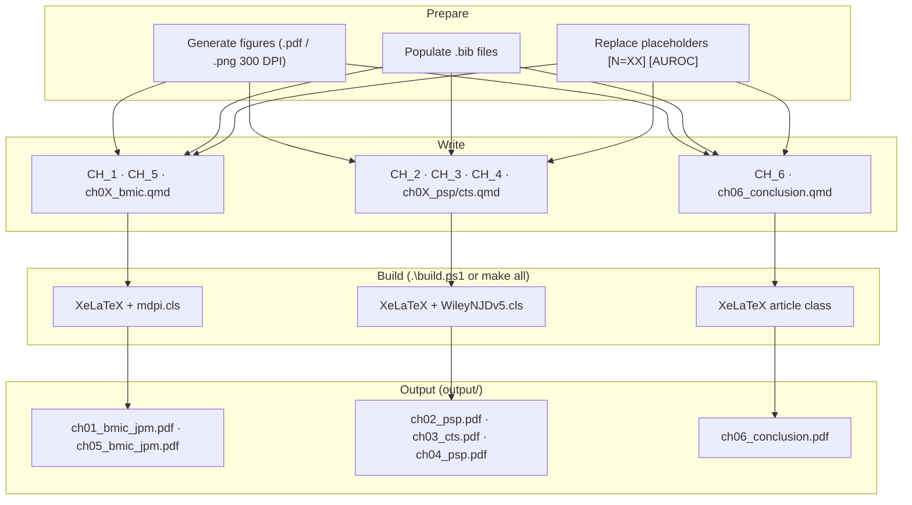
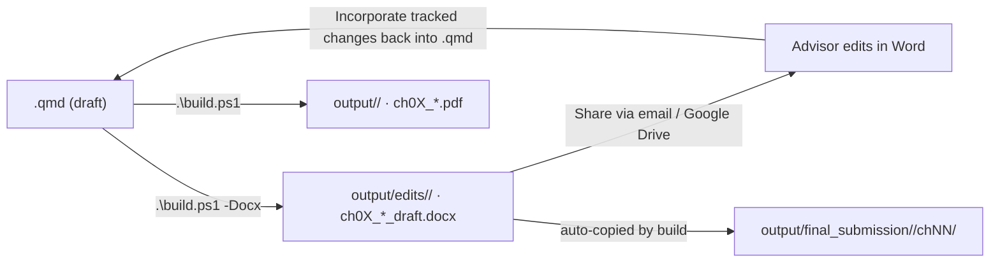

# Writing & Content — Manuscript Reference

**R. Jerome Dixon** · dixonrj@vcu.edu · [ORCID 0000-0001-8622-0597](https://orcid.org/0000-0001-8622-0597)
Virginia Commonwealth University · PhD Health Related Sciences (Translational Health Research)
**Defense:** 1 June 2026 (planned) · **Dept:** Pharmacotherapy & Outcomes Science, School of Pharmacy

> **Reference files** — keep these as the single source of truth:
> - **README.md** (this file) — writing status, build, checklists, lessons learned
> - **[FIGURES.md](FIGURES.md)** — figure inventory, generation scripts, post-retrain figure checklist
> - **[METRICS.md](METRICS.md)** — cohort counts, model performance, placeholder tracker, S3 sources
>
> **Per-journal submission guides** (`docs/`):
> - **[docs/README_CTS.md](docs/README_CTS.md)** — CTS (CH_1, CH_3): title page spec, format limits, document order
> - **[docs/README_PSP.md](docs/README_PSP.md)** — CPT:PSP (CH_2, CH_4): title page spec, format limits, article types
> - **[docs/README_CPT.md](docs/README_CPT.md)** — CPT (CH_5): title page spec, format limits, article types

---

## Committee

| Role | Name | Email |
|:-----|:-----|:------|
| Chair | Elvin T. Price, Pharm.D., Ph.D., FAHA | etprice@vcu.edu |
| Member | Tamas Gal, Ph.D. | tsgal@vcu.edu |
| Member | Lukasz Kurgan, Ph.D. | lkurgan@vcu.edu |
| Member | Dayanjan Wijesinghe, Ph.D. | wijesingheds@vcu.edu |
| Member | Jonathan DeShazo, Ph.D. | jonathandeshazo@gmail.com |

---

## Chapter → Journal Map

| # | File | Journal | SubDir | Status |
|:--|:-----|:--------|:-------|:-------|
| 1 | `CH_1/ch01_cts.qmd` | *Clinical and Translational Science* (CTS, Wiley) | `cts` | Under revision (CTS-2026-0197) |
| 2 | `CH_2/ch02_psp.qmd` | *CPT: Pharmacometrics & Systems Pharmacology* (Wiley) | `cpt_psp` | Submitted (PSP-2026-0108) |
| 3 | `CH_3/ch03_cts.qmd` | *Clinical and Translational Science* (CTS, Wiley) | `cts` | Draft |
| 4 | `CH_4/ch04_psp.qmd` | *CPT: Pharmacometrics & Systems Pharmacology* (Wiley) | `cpt_psp` | Draft |
| 5 | `CH_5/ch05_cpt.qmd` | *Clinical Pharmacology & Therapeutics* (CPT, Wiley) | `cpt` | Draft |
| 6 | `CH_6/ch06_conclusion.qmd` | *(dissertation only)* | — | Draft |

**IRB:** HM20022300 (non-human-subjects waiver) applied to CH_3, CH_4.
**PROSPERO:** CRD420261354089 (awaiting publication) — CH_1.

---

## Build Commands

```powershell
# Windows
.\build.ps1                      # all chapters → output/<journal>/ (journal PDFs)
.\build.ps1 -Chapter 1           # single chapter PDF
.\build.ps1 -Submit -Chapter 2   # full submission package: DOCX + TIFFs → output/final_submission/
.\build.ps1 -Submit              # all chapters, full submission packages
.\build.ps1 -Docx -Chapter 2     # advisor review draft only → output/edits/
.\build.ps1 -Draft               # plain article (no journal template)
.\build.ps1 -Clean               # remove all output/ artifacts
.\build.ps1 -Full                # full dissertation PDF (timestamped, in output/)
.\build.ps1 -Full -Docx          # full dissertation Word (timestamped, in output/edits/)

# Post-retrain: regenerate figures then rebuild
python manuscript/generate_figures.py
.\build.ps1
```

```bash
# Linux / macOS
make all | make ch01 | make docx | make docx-ch01 | make clean
```

> Always use `.\build.ps1` — never `quarto render --to pdf` directly (TEXINPUTS/BSTINPUTS not set).

### Output folder structure

```
output/
├── edits/<journal>/              ← DOCX drafts for advisor review  (.\build.ps1 -Docx)
├── final_submission/<journal>/chNN/
│   ├── ch0N_*_draft.docx         ← submission-ready DOCX + TIFF package
│   └── supp/                     ← supplementary files (S1–S5 DOCX/CSV)
├── submission/<journal>/         ← LaTeX+TIFF ZIP packages          (.\build_submission.ps1)
└── <journal>/                    ← compiled journal PDFs             (.\build.ps1)
```

> `output/edits/`, `output/final_submission/`, and `output/submission/` are `.gitignore`d — never committed.

**Full dissertation (`-Full`):** Each chapter QMD uses **chapter-scoped section IDs** (`{#ch01-…}`, `{#ch02-…}`, …) so included chapters do not produce duplicate Pandoc identifiers. Use `[link text](#ch02-cohort)` for in-text links to sections—avoid `@ch02-…` (Quarto treats `@…` as citations). For a single Word file of the compiled dissertation, use `.\build.ps1 -Full -Docx` (timestamped `output/edits/dissertation_dixon_<yyyyMMdd_HHmmss>.docx`); on Linux/macOS, `make docx-full`.

---

## Build Pipeline



---

## Advisor Review Workflow



---

## Writing Status — ALL CHAPTERS COMPLETE 

All train-trip sessions (HAR→WAS Mar 24; RGH→CLE Mar 26–27; CLE→WAS Mar 29, 2026) complete.

| Ch | Writing | Sections still needing expansion | Retrain dep. |
|:---|:-------:|:---------------------------------|:------------:|
| 1 SQLR | ✅ | Methods detail (+~2,100 words) | No |
| 2 Architecture | ✅ | Results & Discussion (+~2,300 words) | No |
| 3 Opioid ED | ✅ | Results (+~2,500 words) | Partial |
| 4 Polypharmacy | ✅ | Results (+~2,600 words) | Partial |
| 5 Dashboard | ✅ | Architecture & Discussion (+~3,300 words) | Partial |
| 6 Conclusion | ✅ | Chapter summaries & Integration (+~2,500 words) | No |

---

## Word Count / Section Expansion Tracker

### Expand now — no retrain needed

| Ch | Section | Words | Target | Priority |
|:---|:--------|------:|-------:|:---------|
| 1 | Protocol/Registration, Eligibility, Study Selection | 29–130 | 100–300 | High |
| 1 | Data Extraction, Quality Assessment, Evidence Synthesis | 40–130 | 100–300 | High |
| 1 | Operational Performance Metrics, Limitations | 40–147 | 200–300 | High |
| 2 | Study Objectives, Data Source, Cohort Construction | 34–131 | 200–500 | High |
| 2 | Ensemble Modeling, Discussion | 54–139 | 200–500 | High |
| 3 | Study Design, Cohort Construction, Ensemble section | 45–119 | 200–350 | High |
| 3 | Methods (features, trajectory), Discussion | 61–113 | 200–350 | High |
| 4 | Study Design, Cohort, FFA methods, Statistics section | 31–143 | 200–400 | High |
| 4 | Discussion (FFA calculator, Z-code interpretation) | 47–98 | 200–400 | High |
| 5 | Design Philosophy, Hybrid Deployment, CI/CD Pipeline | 46–176 | 250–450 | High |
| 5 | Partition-First Routing, Discussion | 78–157 | 250–450 | High |
| 6 | Overview, Chapter summaries (x5), Propositions | 70–109 | 200–400 | High |
| 6 | XAI–PGx Integration, Common Methodology | 83–105 | 200–400 | High |

### Expand after retrain

| Ch | Section | Dependency |
|:---|:--------|:-----------|
| 3 | Cohort Characteristics, Consensus-Causal Features (SHAP), Trajectory cluster N | `data/shap_top_features.json`, `dtw_manuscript_summary.json` |
| 4 | DDI pair/triplet counts, IE/IR score tables | `ffa_ie_ci.json` (EC2 local) |
| 5 | Performance Benchmarks | CloudWatch post-deploy |
| 6 | Performance Summary table | post-retrain metrics |

---

## Pre-Submission Checklist

### CH_1 & CH_5 — MDPI Journal of Personalized Medicine

- [ ] Abstract: structured Background/Methods/Results/Conclusions, ≤ 200 words (labels count)
- [ ] Keywords: 5–8 terms, semicolon-separated
- [ ] Word limit: 8,000 (CH_1 review) / 7,000 (CH_5 article), excl. references/supplementary
- [ ] Figures: ≤ 8 (CH_1) / ≤ 7 (CH_5); PDF/EPS ≥ 300 DPI
- [ ] CRediT author contributions statement (`R.J.D.` and co-author initials) present
- [ ] Data availability statement present (VHI DUA language)
- [ ] Ethics / IRB: "Not applicable" (CH_1); HM20022300 (CH_5 if needed)
- [ ] ORCID 0000-0001-8622-0597 verified in submission system
- [ ] `\bibliography{../refs/discipline,../refs/bmic-jpm}` present in template
- [ ] Cover letter drafted for precision medicine + CDS readership

### CH_2 & CH_4 — CPT:PSP (Wiley)

- [ ] Abstract: unstructured, ≤ 250 words
- [ ] Keywords: 5 terms, semicolon-separated
- [ ] Word limit: 5,000 (excl. abstract, references, legends)
- [ ] Figures: ≤ 5; TIFF/EPS 300 DPI
- [ ] Reference style: AMA numbered superscript; `wileyNJD-AMA.bst` active
- [ ] Article type: "Research Article"
- [ ] Data availability + code availability statements
- [ ] Conflict of interest + funding statement
- [ ] CRediT author contributions

### CH_1 & CH_3 — CTS (Wiley) — Title Page Requirements

CTS requires a **dedicated Title Page (page 1)** containing exactly these elements, in order:

1. Complete manuscript title
2. All authors' names with superscript affiliation numbers (e.g., `R. Jerome Dixon,¹·² Elvin T. Price¹·³`)
3. All affiliations numbered to match superscripts
4. **Corresponding author** — full name, department, institution, mailing address (with Box), city/state/zip, **phone**, email, ORCID
5. **Running title** (short title ≤ 50 characters)
6. **Figures:** N · **Tables:** N  (exact counts)
7. **Keywords** (3–7 terms, semicolon-separated)

**What does NOT go on the title page:** Abstract (page 2), Study Highlights, Introduction, Author Contributions, Funding, Conflicts of Interest (all go at end of manuscript body).

**No TOC page.** CTS does not request a table-of-contents page in the manuscript file.
Suppress it in the YAML `format:` block:
```yaml
format:
  docx:
    toc: false
```
(Required because `_quarto.yml` globally sets `toc: true` for docx — the per-chapter override wins.)

**Document order for CTS submission:**
`Title Page → Abstract → Study Highlights → Introduction → Methods → Results → Discussion → Limitations → Conclusions → Acknowledgements → Author Contributions → Funding → Conflicts of Interest → Data Availability → References → Supplementary Materials note`

### CH_3 — CTS (Wiley)

- [ ] Abstract: structured, ≤ 250 words
- [ ] Keywords: 3–6 terms
- [ ] Word limit: 4,000 (excl. abstract, references)
- [ ] Figures: ≤ 5 — CH_3 currently has 7; consolidate or move 2 to supplementary (see FIGURES.md)
- [ ] TRIPOD reporting checklist in supplement
- [ ] Ethics statement / VCHI DUA statement present; IRB waiver HM20022300 cited
- [ ] Lay summary (1–2 sentences) recommended
- [ ] Title page contains: running title (≤ 50 chars), figure/table counts, keywords, full corresponding author contact with phone
- [ ] `docx: toc: false` set in chapter YAML (overrides global `_quarto.yml` toc: true)

### All Chapters

- [ ] All `[PLACEHOLDER]` tokens replaced — verify: `Select-String -Path CH_*/ch*.qmd -Pattern '\['`
- [ ] All `../figures/chXX/fig_*.pdf` are real generated files (not stubs)
- [ ] Abbreviations section complete
- [ ] No `[?]` citations in compiled PDF (check `.blg` for bibtex warnings)
- [ ] `keep-tex: false` or `.tex` intermediate not included in submission package
- [ ] **No forward chapter references** — `Select-String -Path CH_*/ch*.qmd -Pattern 'Chapter [1-6]|Chapters [1-6]'` returns zero hits (see Standalone Chapter Policy)
- [ ] Companion series cited as `(Dixon and Price, manuscripts under review)` — not as chapter numbers; no unpublished performance metrics quoted
- [ ] `\quad` not used as table-cell indent in DOCX-targeted markdown tables (use plain spaces)
- [ ] Pipeline-derived statistics verified by script before submission (source cited in table caption)

---

## Data Availability Statement

> The data supporting the findings of this dissertation are derived from Virginia's All-Payer Claims Database
> (APCD) under a data use agreement with the Virginia Center for Health Innovation (VCHI) and Virginia Health
> Information (VHI). These data are not publicly available. Data access requests: **https://www.vhi.org**
> Analysis code: **https://github.com/Jerome3590/pgx-analysis**

- **Applied to:** CH_2, CH_3, CH_4, CH_6 (identical statement in each Data Availability section)
- **CH_1:** Extracted SQLR dataset available as Supplementary File S5; no APCD data used.
- **CH_5:** Synthetic inputs only — source code at https://github.com/Jerome3590/pgx-analysis

---

## Literature Search & Zotero Workflow

CH_1 systematic review pipeline:

1. **PubMed automated search** — `CH_1/Literature_Review/lit_review.qmd` (rentrez) → per-topic CSVs in `data/`
2. **Gap-fill** — `find_missing_articles()` → `missing_pgx_articles.csv` → manual Zotero import
3. **Bulk import** — `CH_1/Literature_Review/scripts/import_to_zotero.py` → Zotero Web API

Full instructions: `CH_1/Literature_Review/scripts/README_ZOTERO_IMPORT.md`

**`.bib` layout, Zotero → repo export, and CTS/BibTeX template notes:** [`refs/README.md`](refs/README.md).

Credentials: User ID `6037399`, collection `LS75EWXU`, API key in local env — do **not** commit.

---

## PROSPERO Registration

| Field | Value |
|:------|:------|
| **ID** | CRD420261354089 |
| **Status** | New record awaiting publication (2026-03-28) |
| **URL** | https://www.crd.york.ac.uk/prospero/display_record.php?ID=CRD420261354089 |
| **Title** | Bridging Explainable AI and Pharmacogenomics for Opioid Risk Prediction: A Systematic Quantitative Literature Review |

---

## Repository Structure

```
pgx-analysis/
├── 1a_apcd_input_data/      APCD text → Parquet
├── 1b_apcd_event_filter/    ICD/admin event filtering
├── 2_create_cohort/         cohort construction
├── 3a_feature_importance/   MC-CV feature screening
├── 4_model_data/            model-ready features
├── 5_pgx_analysis/          PGx CPIC enrichment
├── 6_final_model/           CatBoost/XGBoost per-bin training
├── 7_shap_analysis/         SHAP global/local
├── 8_ffa_analysis/          FFA Boolean rules
├── 9_dashboard_visuals/     BupaR, DTW, FP-Growth
├── 10_risk_dashboard/       Lambda, Docker, S3 deploy
├── py_helpers/              event_density_utils.py, etc.
└── manuscript/              ← THIS DIRECTORY
    ├── CH_1/ … CH_6/        QMD source files
    ├── templates/           bmic_jpm_template.tex, cpt_psp_template.tex, cts_template.tex
    ├── _extensions/ramiromagno/wiley-njd/
    ├── refs/                discipline.bib, bmic-jpm.bib, cpt-psp.bib, cts.bib
    ├── figures/ch01/ … ch06/ + `shared/` (cross-chapter assets)
    ├── output/              compiled PDFs
    ├── infrastructure_setup/scripts/   extract_visual_manuscript.py, compute_brier_ici.py, etc.
    ├── _quarto.yml
    ├── build.ps1            Windows build
    └── Makefile             Linux/macOS build
```

---

## Standalone Chapter Policy

Each chapter is submitted to a **different journal** and must be fully self-contained.
Reviewers cannot access unpublished companion papers; forward references will be flagged.

### Rules

1. **No `Chapter N` forward references.** Replace every instance of
   *"as described in Chapter 3"* or *"implemented in Chapters 2–5"* with a
   description of the **architectural requirement the gap calls for** — what any
   future system *must do*, not what an unpublished paper *did*.

2. **Cite the companion series once, generically.** When results from companion
   papers are essential context, use:
   > *(Dixon and Price, manuscripts under review)*
   Do **not** include specific performance metrics from those papers in this paper.

3. **Results belong in the paper that ran them.** A statistic computed in CH_3
   must not appear as a claim in CH_1.

4. **Audit command** — run before every submission:
   ```powershell
   Select-String -Path CH_*/ch*.qmd -Pattern 'Chapter [1-6]|Chapters [1-6]'
   ```
   Zero results = ready. Any hit must be resolved using rules 1–2.

5. **Pipeline stats must be reproducible.** Any number derivable from the pipeline
   (year distributions, N counts, tag rates) must come from a script, not manual
   entry. Document the source in the table caption.
   Pattern: `CH_1/Literature_Review/scripts/gen_study_chars.py`

6. **`\quad` does not render in DOCX.** Use plain spaces for table cell indentation
   in markdown tables. `| \quad 2013–2018 |` renders as `| –2018 |` in Word.

### Audit Status (2026-04-07)

| Chapter | Forward refs | Notes |
|:--------|:------------:|:------|
| CH_1 | 0 | Cleaned 2026-04-07; companion series cited as *manuscripts under review* |
| CH_2 | 0 | Clean |
| CH_3 | 0 | Clean |
| CH_4 | 0 | Clean |
| CH_5 | 0 | Two figure-caption "Chapter" matches are labels, not forward citations |

---

## Key Design Decisions

| Decision | Rationale |
|:---------|:----------|
| Partition-First Architecture | Linear scalability across age-band × year strata for parallel DuckDB workers |
| S3 checkpoints per partition | Fault-tolerant; enables mid-run resume without reprocessing |
| Per-density-bin models (`n_event_bin`) | Prevents high-utilization patients from biasing average-risk predictions |
| Consensus Filter (SHAP ∩ FFA) | Dual-confirmation reduces false-positive causal features vs. single-method |
| Visualization-only BupaR/FP-Growth | Prevents target leakage from trajectory/association mining into predictive features |
| Temporal validation (train 2016–2018 / hold 2019) | Mirrors real-world deployment; prevents optimistic CV-only estimates |
| Exclude 2020 entirely | COVID-19 caused non-representative utilization patterns |
| 5:1 case-control matching | Sufficient statistical power; avoids class-weight hyperparameter sensitivity |
| Stateless Lambda + ephemeral PGx card | HIPAA-compliant CDS without dedicated PHI infrastructure |

---

## Template Patches

Re-apply after Quarto / TinyTeX upgrades.

### MDPI `bmic_jpm_template.tex` (CH_1, CH_5)

| # | Fix | Symptom without fix |
|:--|:----|:--------------------|
| 1 | Escape `$$TEXINPUTS` / `$$env:` (double-dollar) | Pandoc treats shell vars as template vars → render error |
| 2 | Replace `$^{n}$` with `\textsuperscript{n}` | LaTeX math-mode error |
| 3 | `\let\listoflistings\relax` before `$header-includes$` | Undefined control sequence |
| 4 | `\makeatletter\def\@datepublished{}\makeatother` | `mdpi.cls` line 649 undefined |
| 5 | `\providecommand{\history}[1]{}` | Undefined `\history` |
| 6 | `\abbreviations{}{content}` — 2 args, placed in body | cls expects 2-arg form; preamble fails |
| 7 | `\pubvolume{1}` / `\issuenum{1}` / `\articlenumber{1}` as integers | String values cause arithmetic error |
| 8 | Remove `$if(natbib)$\bibliographystyle...$endif$` block | Duplicate `\bibstyle` |
| 9 | Escape `$$body$$` in `%%` comment | Body rendered twice → "Too many }'s" |
| 10 | Add `\bibliography{../refs/discipline,../refs/bmic-jpm}` before `\end{document}` | No `\bibdata` → all citations `[?]` |

YAML renames: `journal:` → `target-journal:` · `abbreviations:` → `manuscript-abbreviations:` · `articletype:` → `target-articletype:`

### MDPI `templates/Definitions/mdpi.cls`

| # | Fix | Symptom |
|:--|:----|:--------|
| 1 | Remove `Definitions/` prefix from `\bibliographystyle{}` (lines 396/399/402) | bibtex cannot find `mdpi.bst` from `CH_X/` |

### Wiley `WileyNJDv5.cls` (CH_2, CH_3, CH_4)

| # | Fix | Symptom |
|:--|:----|:--------|
| 1 | `\ifdefined\reserveinserts\reserveinserts{28}\fi` | Float register overflow |
| 2 | Comment out `\usepackage[english]{babel}` | Conflicts with XeLaTeX font loading |
| 3 | Uncomment `\RequirePackage{longtable}` | Longtable undefined |
| 4 | Add `\tightlist` to `partials/pandoc.tex` | Undefined in Pandoc list output |

### Bibliography

- Filenames must use **hyphens** not underscores — LaTeX escapes `_` in `.aux` files breaking bibtex lookup.
- Canonical files: `discipline.bib`, `bmic-jpm.bib`, `cpt-psp.bib`, `cts.bib`
- Missing entries added 2026-03-28: `Kapoor2023`, `NIH2022` → `refs/bmic-jpm.bib`

---

## Lessons Learned

### 2026-03-28

**TikZ OODA Diagram**
- `engine: knitr` is mandatory for `{tikz}` chunks — Jupyter default fails with yaml import error
- Use `%|` not `#|` for chunk options inside `{tikz}` blocks
- `out-width: 50%` for portrait figures; `width=100%` for landscape
- Tee-split: draw stem/splitter without arrowheads; arrowheads on branch lines only; requires `calc` library
- Phase label `xshift` must be tuned per-phase to avoid landing on tee-split arrows

**Build system**
- Always use `.\build.ps1` — direct `quarto render --to pdf` fails (TEXINPUTS not set)
- `pdfcrop.exe` MiKTeX update nag is non-fatal (stderr only)
- TinyTeX upgraded 2025→2026; `mathastext` installed

**Abstract / Title**
- MDPI JPM word limit ≤ 200 — structured section labels count toward total
- "Opioid and Polypharmacy Risk Prediction" is the correct umbrella for both RQs

### 2026-03-29

**n_events feature removal**
- `n_events` (continuous claim count) dropped; replaced by `n_event_bin_ordinal`
- Manuscript references to "median n_events" → reframe as descriptive statistic, not model feature
- Lambda: `n_event_bin` computed from submitted code count BEFORE `build_feature_vector()`

**FFA outputs**
- `ffa_causal_factors.csv` on EC2 local disk only — must manually copy before `extract_ffa_manuscript.py`

**DTW failure**
- `9_dtw_log/` failed 2026-03-29: `ERROR: Model data has no target date column (first_opioid_ed_date not found)`
- Cluster sizes in CH_3/CH_6 remain as `[XX,XXX]` / `[XX%]` until fix + rerun

### 2026-04-01

**TinyTeX 2026 — `\hypersetup` undefined**
- Symptom: `Undefined control sequence. l.111 \hypersetup{hidelinks}` on any chapter build
- Root cause: `_quarto.yml` had `include-in-header: text: \hypersetup{hidelinks}` — in TinyTeX 2026 this fires before hyperref loads in the default Pandoc template
- Fix applied to `_quarto.yml`: replace `\hypersetup{hidelinks}` with `\PassOptionsToPackage{hidelinks}{hyperref}` (safe to call before hyperref loads)
- Affects all chapters — fix lives in `_quarto.yml` global PDF block, no per-chapter changes needed

**Full dissertation build — `\(\hat{p}\)` inline math**
- Symptom: `Missing $ inserted` at `(\hat{p})` in `full_dissertation` xelatex pass
- Root cause: `\(\hat{p}\)` (LaTeX `\(...\)` delimiter) in `CH_5/ch05_bmic.qmd` does not survive the `include_chapter` R pipeline — pandoc emits it as literal text rather than math
- Fix: replace `\(\hat{p}\)` with `$\hat{p}$` (standard markdown math) — applies to any chapter QMD included via `include_chapter()`
- Rule: never use `\(...\)` or `\[...\]` delimiters in chapter QMDs; always use `$...$` / `$$...$$`

**AI slop removed (CH_6)**
- Removed duplicate "completing the translational arc", "closing the loop" cliché, "is exactly the gap" construction

### 2026-04-07

**Standalone chapter policy established**
- Each chapter submits to a different journal — reviewers cannot see companion papers
- All `Chapter N` / `Chapters 2–5` forward references in CH_1 replaced with architectural *requirements* (what a system must do) rather than implementation claims
- Companion series cited once as `(Dixon and Price, manuscripts under review)` — no unpublished performance metrics quoted in CH_1
- CH_2, CH_3, CH_4 were already clean; CH_5 has two figure-caption hits that are labels, not forward citations
- Audit command: `Select-String -Path CH_*/ch*.qmd -Pattern 'Chapter [1-6]|Chapters [1-6]'`

**`\quad` silently truncates DOCX table cell content**
- `\quad` is a LaTeX spacing command — pandoc strips it in DOCX mode, consuming the text that immediately follows
- `| \quad 2013–2018 |` renders as `| –2018 |` in Word (start year disappears)
- Fix: use plain spaces for indentation in all markdown tables targeting DOCX output

**Pipeline-derived statistics — reproducibility (CH_1 Table 1)**
- Publication year bins were stale manually-entered values (2013–2024); pipeline shows actual range 2019–2026
- Created `CH_1/Literature_Review/scripts/gen_study_chars.py`: auto-derives year bins from pipeline, writes `study_chars_snapshot.csv` for diff tracking
- Rule: any count derivable from pipeline must come from a script; source cited in table caption; manually coded fields noted separately

**Gap analysis — CH_1 SQLR expanded from 3 → 5 gaps**
- Gap 4 added: explainability is model-centric not user-centric (only 15% user-tested)
- Gap 5 added: model transparency (14.5%) and calibration (8.0%) rarely reported
- OODA structural imbalance added to Key Findings: 54% Act-phase vs 3% Decide-phase
- Opioid-specific prediction gap quantified: 1.2% of Decide-phase studies target opioid ED risk; 2.4% use APCD/claims
- Abstract denominators clarified: `19% of ML prediction studies (n=18/94)`
- S3 (151 studies), S4 (56 studies), S5 (5,839 studies) supplementary files populated from pipeline

**CTS reviewer response — CH_1**
- Reviewer flagged: author names/affiliations must appear below title on title page → fixed in YAML + docx content-visible block
- Reviewer flagged: supplemental files S1–S5 missing → generated via `make_supp_tables.py --chapter 1`; files in `output/cts/ch01/supp/`
