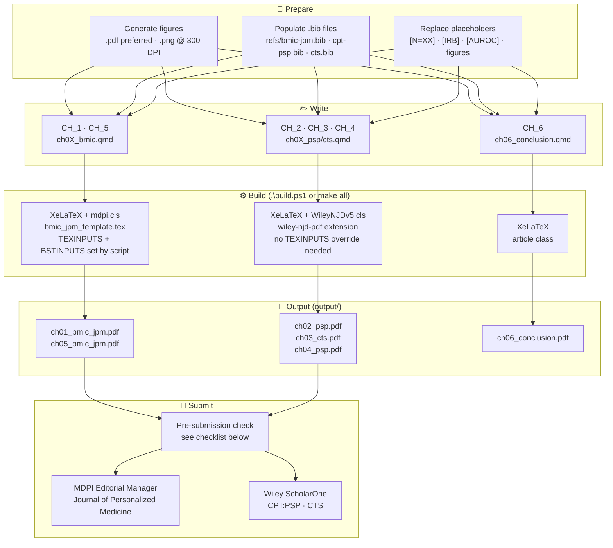
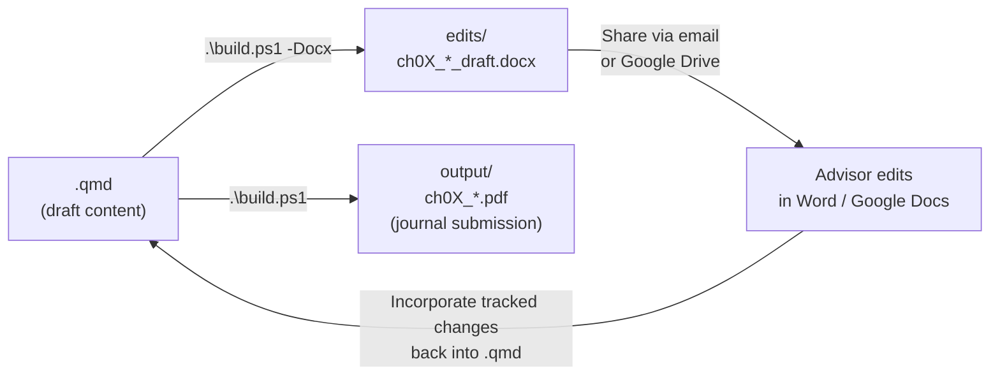

# Dissertation Manuscript Build System

**R. Jerome Dixon** · dixonrj@vcu.edu · ORCID 0000-0001-8622-0597  
Virginia Commonwealth University · PhD Health Related Sciences (Translational Health Research)

> For full dissertation outline, journal rationale, figure/data checklists, and submission guidelines  
> see **[DISSERTATION.md](DISSERTATION.md)**  
> For train-trip writing schedule → **[WRITING_PLAN.md](WRITING_PLAN.md)**

---

## Build Pipeline



---

## Quick Build (Windows)

```powershell
.\build.ps1                    # all chapters → output/ (journal PDFs)
.\build.ps1 -Chapter 1         # single chapter PDF
.\build.ps1 -Docx              # all chapters → edits/ (Word .docx for advisor)
.\build.ps1 -Docx -Chapter 2   # single chapter .docx
.\build.ps1 -Draft             # plain article, no journal template
.\build.ps1 -Clean             # remove output/ PDFs and edits/ .docx files
```

## Quick Build (Linux / macOS)

```bash
make all          # all chapters → output/
make ch01         # single chapter PDF
make docx         # all chapters → edits/ (Word .docx for advisor)
make docx-ch01    # single chapter .docx
make clean
```

> `build.ps1` and `Makefile` automatically set both `TEXINPUTS` (xelatex finds
> `templates/Definitions/mdpi.cls`) and `BSTINPUTS` (bibtex finds `mdpi.bst`).

## Advisor Review Workflow



`.docx` files in `edits/` are Google Docs-compatible — upload directly to Drive
for advisor comments. Tracked changes get incorporated manually back into the
`.qmd` source.

---

## Prerequisites

| Tool | Install |
|:---|:---|
| Quarto CLI | https://quarto.org/docs/get-started/ |
| TinyTeX | `quarto install tinytex` |
| MDPI cls | ✅ bundled — `templates/Definitions/mdpi.cls` |
| Wiley NJD cls | ✅ bundled — `_extensions/ramiromagno/wiley-njd/` |

---

## Chapter → Output Map

| Ch | QMD | Journal | Template | Output PDF |
|:--|:---|:--------|:---------|:-----------|
| 1 | `CH_1/ch01_bmic.qmd` | MDPI JPM | `bmic_jpm_template.tex` | `ch01_bmic_jpm.pdf` |
| 2 | `CH_2/ch02_psp.qmd` | CPT:PSP (Wiley) | `wiley-njd-pdf` | `ch02_psp.pdf` |
| 3 | `CH_3/ch03_cts.qmd` | CTS (Wiley) | `wiley-njd-pdf` | `ch03_cts.pdf` |
| 4 | `CH_4/ch04_psp.qmd` | CPT:PSP (Wiley) | `wiley-njd-pdf` | `ch04_psp.pdf` |
| 5 | `CH_5/ch05_bmic.qmd` | MDPI JPM | `bmic_jpm_template.tex` | `ch05_bmic_jpm.pdf` |
| 6 | `CH_6/ch06_conclusion.qmd` | dissertation only | plain article | `ch06_conclusion.pdf` |

---

## Figures

| Type | Format | How |
|:-----|:-------|:----|
| Plots, diagrams, flowcharts | **PDF** | `plt.savefig('fig.pdf')` / `ggsave(device='pdf')` |
| Dashboard screenshots, UI | **PNG ≥ 300 DPI** | `plt.savefig('fig.png', dpi=300)` |
| Never use | JPEG | Lossy — fails journal QC |

Place figures in `figures/chXX/fig_name.pdf`. Reference as `../figures/chXX/fig_name.pdf`.

---

## Pre-Submission Checklist

Before sending any chapter PDF to a journal:

- [ ] All `[PLACEHOLDER]` values replaced (cohort N, IRB, PROSPERO, metrics, funding)
- [ ] All `../figures/chXX/fig_*.pdf` are real generated figures (not placeholders)
- [ ] Abstract word count within journal limit (MDPI JPM ≤ 200; CPT:PSP ≤ 250; CTS ≤ 250)
- [ ] Keywords 5–8 terms, semicolon-separated
- [ ] Abbreviations section complete
- [ ] References formatted and `.bib` entries verified
- [ ] `keep-tex: false` set (or confirm `.tex` intermediate is not submitted)
- [ ] Author ORCID `0000-0001-8622-0597` present
- [ ] IRB waiver statement in Methods
- [ ] Data availability statement added
- [ ] Cover letter drafted (see [DISSERTATION.md](DISSERTATION.md))
