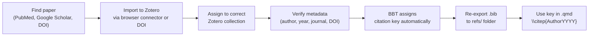

# Bibliography Management — Zotero Workflow

All `.bib` files in this folder are exported from Zotero and consumed by the
Quarto build system. Do **not** hand-edit them — always re-export from Zotero
to avoid merge conflicts.

---

## Bib File → Chapter Map

| File | Used by | Scope |
|:-----|:--------|:------|
| `discipline.bib` | CH_1–CH_6 (all) | Core cross-chapter refs: opioid epidemic, PGx, XAI/SHAP, ML for healthcare, APCD, CDS |
| `bmic-jpm.bib` | CH_1, CH_5 | MDPI JPM-specific: SQLR methods, explainability reviews, PGx dashboards |
| `cpt-psp.bib` | CH_2, CH_4 | CPT:PSP-specific: pharmacoepi architectures, MCCV, ensemble methods, polypharmacy DDI |
| `cts.bib` | CH_3 | CTS-specific: opioid ED prediction, trajectory analysis, DTW, FP-Growth |

> **Naming rule:** Use hyphens, not underscores (e.g., `bmic-jpm.bib` not
> `bmic_jpm.bib`). LaTeX escapes `_` in `.aux` files, causing bibtex to
> fail to locate the file.

---

## Zotero Setup

### Required Plugin
Install **Better BibTeX for Zotero** (BBT):
```
https://retorque.re/zotero-better-bibtex/installation/
```
BBT enables automatic citation key generation and auto-export on library change.

### Citation Key Format
In Zotero → Preferences → Better BibTeX → Citation keys, set the formula to:
```
[auth:lower][year][veryshorttitle:lower]
```
Examples: `lundberg2017unified`, `mattson2021trends`, `crews2021cpic`

For disambiguation it appends `a`, `b`: `hamburg2010a`

---

## Workflow: Adding a New Reference



### Step-by-step

1. **Import** the reference into Zotero using the browser connector, DOI lookup
   (`File → Add Item by Identifier`), or PubMed import.

2. **Move** it to the correct Zotero collection:

   | Zotero Collection | → Export to |
   |:------------------|:------------|
   | `PGx Dissertation / Core` | `discipline.bib` |
   | `PGx Dissertation / CH1 JPM` | `bmic-jpm.bib` |
   | `PGx Dissertation / CH2-CH4 CPT-PSP` | `cpt-psp.bib` |
   | `PGx Dissertation / CH3 CTS` | `cts.bib` |

3. **Check the metadata** — especially author names, year, journal abbreviation,
   and DOI. Fix anything incorrect before exporting.

4. **Export** the collection:
   - Right-click the collection → `Export Collection…`
   - Format: **Better BibTeX**
   - Check `Keep updated` for auto-export (recommended)
   - Save to: `c:\Projects\pgx-analysis\manuscript\refs\<filename>.bib`

5. **Cite** in the `.qmd` file:
   ```markdown
   [@Lundberg2017unified] or \citep{Lundberg2017unified}
   ```
   (MDPI/Wiley chapters use `cite-method: natbib`, so `\citep{}` / `\citet{}`
   are the correct forms in body text.)

---

## Auto-Export Setup (Recommended)

BBT can watch a Zotero collection and re-export whenever it changes:

1. Right-click the collection → `Export Collection…`
2. Format: **Better BibTeX**
3. ✅ Check **Keep updated**
4. Set the file path to `refs/<filename>.bib`

After this, every time you add or edit a reference in that collection, the
`.bib` file updates automatically. No manual re-export needed.

---

## Citation Key Conventions

| Pattern | Example | Use case |
|:--------|:--------|:---------|
| `AuthorYYYY` | `Mattson2021` | Single author, unambiguous |
| `AuthorYYYYa` / `b` | `Hamburg2010a` | Two papers, same first author + year |
| `AuthorAuthorYYYY` | `LundbergLee2017` | Two-author paper |
| `CPICYYYY` | `CPIC2021` | Consortium / organization author |

Override BBT's auto-key if needed: right-click the item → `Better BibTeX →
Pin BibTeX key`.

---

## Checking for Missing References

When building, bibtex warns about undefined citations:
```
Warning--I didn't find a database entry for "KeyName"
```

To find all citation keys used across all chapters:
```powershell
Select-String -Path "CH_*\*.qmd" -Pattern "\\citep\{|\\citet\{|@[A-Za-z]" |
  ForEach-Object { $_.Matches.Value } | Sort-Object -Unique
```

Cross-reference against the `.bib` files to find gaps.

---

## Batch Import from PubMed (SQLR workflow)

For the systematic review (CH_1), bulk-import search results:

1. Run PubMed search → `Send to → Citation Manager → PubMed format (.nbib)`
2. In Zotero: `File → Import → .nbib file`
3. Review imported items, delete duplicates
4. Move keepers to the `CH1 JPM` collection
5. Re-export `bmic-jpm.bib`

For Embase / Web of Science: export as **RIS** format, import via
`File → Import → RIS`.
