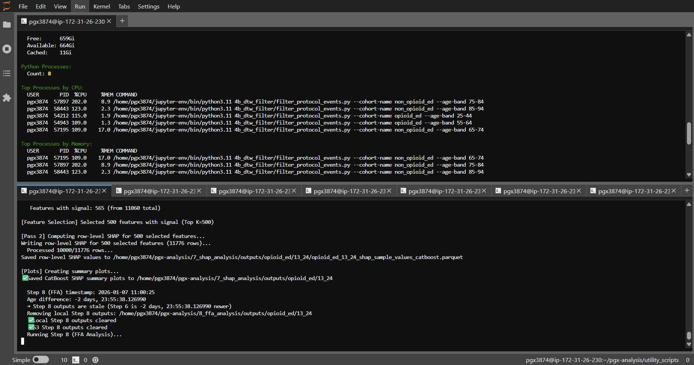

# EC2 Runtime Estimates (32 cores, 1TB RAM, Final Production Workflow)

**System:** EC2 with 32 cores, 1TB RAM  
**Strategy:** Maximum parallelization (all cohorts + optimized DuckDB threading)

**Last Updated:** 2026-01-07
**Workflow:** 3 → 4a → 4b → 5c → 6 → 7 → 8 → 9

---

## Key Assumptions

1. **DuckDB Configuration:**
   - 4 threads per DuckDB connection (optimized for 32-core EC2)
   - 512GB memory limit per connection (50% of 1TB RAM)
   - NVMe temp directory for fast I/O

2. **Workflow Steps:**
   - **Step 3:** Feature Importance (Monte Carlo CV) - Complete, reused
   - **Step 4a:** Model Data Extraction
   - **Step 4b:** DTW Protocol Filtering
   - **Step 5c:** PGx Feature Engineering (only feature engineering step)
   - **Step 6:** Final Model Training (aggregated features + PGx)
   - **Step 7:** SHAP Analysis (XGBoost + CatBoost, required before Step 8)
   - **Step 8:** FFA Analysis (XGBoost only, uses SHAP from Step 7)
   - **Step 9:** Risk Dashboard (visualizations)

3. **Parallelization Strategy:**
   - **Multiple cohorts in parallel:** Run all 7 cohorts simultaneously
   - **Step 7 before Step 8:** SHAP must complete before FFA (FFA uses SHAP importance)
   - **CPU utilization:** ~28 cores (87.5%) when running all 7 cohorts in parallel

4. **EC2 Performance:**
   - 2-3x faster for CPU-bound tasks (better CPU, faster I/O)
   - S3 access is much faster (same region)
   - NVMe storage for DuckDB temp files

---

## Per-Cohort Sequential Time (Steps 4a-9) on EC2

Based on final production workflow with DuckDB optimizations (4 threads per connection):

| Cohort | Events (train) | Step 4a | Step 4b | Step 5c | Step 6 | Step 7 | Step 8 | Step 9 | **Total Sequential** |
|--------|----------------|---------|---------|---------|--------|--------|--------|--------|---------------------|
| **opioid_ed 13-24** | ~500K | 5 min | 5 min | 5 min | 15 min | 30 min | 45 min | 10 min | **~1.75 hours** |
| **opioid_ed 25-44** | ~1.5M | 8 min | 8 min | 8 min | 20 min | 45 min | 1 hr | 15 min | **~2.5 hours** |
| **opioid_ed 45-54** | ~1.2M | 8 min | 8 min | 8 min | 20 min | 45 min | 1 hr | 15 min | **~2.5 hours** |
| **opioid_ed 55-64** | ~3.2M | 15 min | 15 min | 10 min | 30 min | 1-1.5 hrs | 1-1.5 hrs | 20 min | **~4.5-6 hours** |
| **non_opioid_ed 65-74** | ~2.9M | 15 min | 15 min | 10 min | 30 min | 1-1.5 hrs | 1-1.5 hrs | 20 min | **~4.5-6 hours** |
| **non_opioid_ed 75-84** | ~1.2M | 10 min | 10 min | 8 min | 20 min | 45 min | 1 hr | 15 min | **~2.5 hours** |
| **non_opioid_ed 85-94** | ~274K | 5 min | 5 min | 5 min | 15 min | 20 min | 30 min | 10 min | **~1.5 hours** |

**Note:**
- Step 3 (Feature Importance) is complete and reused
- Steps 4a-9 are sequential per cohort (Step 7 must complete before Step 8)
- DuckDB uses 4 threads per connection (optimized for 32-core EC2)
- Times include DuckDB optimizations (pure SQL, LAG() instead of joins, etc.)

---

## Parallel Execution Strategy

### Strategy 1: All Cohorts in Parallel (Maximum Throughput)

**Run all 7 cohorts simultaneously using workflow scripts:**

```bash
# All cohorts in parallel (recommended)
bash utility_scripts/run_all_cohorts_workflow.sh
```



**Or run individually in separate terminals:**
```bash
# Terminal 1-4: Opioid ED cohorts
bash utility_scripts/run_cohort_workflow.sh opioid_ed 13-24 &
bash utility_scripts/run_cohort_workflow.sh opioid_ed 25-44 &
bash utility_scripts/run_cohort_workflow.sh opioid_ed 45-54 &
bash utility_scripts/run_cohort_workflow.sh opioid_ed 55-64 &

# Terminal 5-7: Non-Opioid ED cohorts
bash utility_scripts/run_cohort_workflow.sh non_opioid_ed 65-74 &
bash utility_scripts/run_cohort_workflow.sh non_opioid_ed 75-84 &
bash utility_scripts/run_cohort_workflow.sh non_opioid_ed 85-94 &
```

**Total Wall Time:** ~6 hours (bottleneck is the longest cohort: 55-64 or 65-74)

**Resource Usage:**
- CPU: ~28 cores (7 cohorts × 4 DuckDB threads = 28 cores) - **OPTIMAL (87.5% utilization)**
- RAM: ~3.5TB theoretical max (7 × 512GB), but actual usage ~500-700GB - **WITHIN LIMIT**

**Note:** DuckDB connections are efficient; actual CPU usage per cohort is lower than theoretical max.

---

### Strategy 2: Batched Parallelization (Recommended for Resource Management)

**Phase 1: Data Preparation (All cohorts in parallel)**
- Run Steps 4a and 4b for all 7 cohorts in parallel
- **Time:** ~20 minutes (bottleneck: 15 min for large cohorts)

**Phase 2: Feature Engineering (All cohorts in parallel)**
- Run Step 5c (PGx) for all cohorts in parallel
- **Time:** ~10 minutes (bottleneck: large cohorts)

**Phase 3: Model Training (All cohorts in parallel)**
- Run Step 6 (Final Model) for all cohorts in parallel
- **Time:** ~30 minutes (bottleneck: large cohorts)

**Phase 4: SHAP Analysis (All cohorts in parallel)**
- Run Step 7 (SHAP) for all cohorts in parallel
- **Time:** ~1.5 hours (bottleneck: large cohorts, two-pass streamed approach)

**Phase 5: FFA Analysis (All cohorts in parallel)**
- Run Step 8 (FFA) for all cohorts in parallel (depends on Step 7)
- **Time:** ~1.5 hours (bottleneck: large cohorts, XGBoost only)

**Phase 6: Dashboard (All cohorts in parallel)**
- Run Step 9 (Risk Dashboard) for all cohorts in parallel
- **Time:** ~20 minutes

**Total Wall Time:** ~4.5-5 hours (all phases sequential, but all cohorts parallel within each phase)

---

### Strategy 3: Grouped Parallelization (By Cohort Group)

**Run cohort groups sequentially, cohorts within group in parallel:**

**Batch 1: Opioid ED cohorts (4 cohorts in parallel)**
```bash
bash utility_scripts/run_opioid_ed_workflow.sh
```
- Cohorts: 13-24, 25-44, 45-54, 55-64
- **Time:** ~6 hours (bottleneck: 55-64)

**Batch 2: Non-Opioid ED cohorts (3 cohorts in parallel)**
```bash
bash utility_scripts/run_non_opioid_ed_workflow.sh
```
- Cohorts: 65-74, 75-84, 85-94
- **Time:** ~6 hours (bottleneck: 65-74)

**Total Wall Time:** ~12 hours (sequential batches)

**Resource Usage:**
- CPU: ~16 cores per batch (4 cohorts × 4 DuckDB threads) - **OPTIMAL**
- RAM: ~2TB theoretical max per batch, actual ~300-400GB - **WELL WITHIN LIMIT**

---

## Recommended Execution Plan

### Option A: All Cohorts in Parallel (Fastest, Recommended)

**Run all 7 cohorts simultaneously:**

```bash
# Single command runs all cohorts
bash utility_scripts/run_all_cohorts_workflow.sh
```

**Expected:** All complete in ~6 hours (bottleneck: 55-64 or 65-74)

**Resource Usage:**
- CPU: ~28 cores (87.5% utilization) - **OPTIMAL**
- RAM: ~500-700GB actual usage - **WELL WITHIN LIMIT**

### Option B: Grouped Execution (If Resource Concerns)

**Run cohort groups sequentially:**

```bash
# Day 1: Opioid ED cohorts (4 cohorts in parallel)
bash utility_scripts/run_opioid_ed_workflow.sh
# Expected: ~6 hours

# Day 2: Non-Opioid ED cohorts (3 cohorts in parallel)
bash utility_scripts/run_non_opioid_ed_workflow.sh
# Expected: ~6 hours
```

**Total Wall Time:** ~12 hours

### Option C: Individual Cohorts (Maximum Control)

**Run cohorts one at a time or in small batches:**

```bash
# Run individual cohorts
bash utility_scripts/run_cohort_workflow.sh opioid_ed 13-24
bash utility_scripts/run_cohort_workflow.sh opioid_ed 25-44
# ... etc
```

**Total Wall Time:** ~18-20 hours (if sequential)

---

## Total Wall Time Summary

| Strategy | Total Time | Resource Usage | Notes |
|----------|------------|----------------|-------|
| **Sequential (one at a time)** | ~18-20 hours | Low (~4 cores) | Safest, slowest |
| **Grouped (opioid_ed then non_opioid_ed)** | ~12 hours | Moderate (~16 cores per batch) | Good balance |
| **All 7 cohorts in parallel** | **~6 hours** | **Optimal (~28 cores, 87.5%)** | **RECOMMENDED** |

---

## Step Dependencies and Parallelization

### Workflow Dependencies

1. **Step 3 → Step 4a:** Feature importance required for model data extraction
2. **Step 4a → Step 4b:** Model data required for protocol filtering
3. **Step 4b → Step 5c:** Protocol-filtered data used for PGx features
4. **Step 5c → Step 6:** PGx features + aggregated features → final model
5. **Step 6 → Step 7:** Final model required for SHAP analysis
6. **Step 7 → Step 8:** SHAP importance required for FFA rule filtering (Step 8 uses SHAP from Step 7)
7. **Step 8 → Step 9:** FFA analysis outputs used for dashboard

### Parallelization Opportunities

1. **Multiple cohorts:** All cohorts can run Steps 4a-9 in parallel (independent workflows)
2. **Within cohort:** Steps must run sequentially (dependencies above)
3. **Step 7 before Step 8:** Critical dependency - FFA requires SHAP importance values

---

## Memory Considerations

**Per-Cohort Memory Usage (estimated):**
- Step 4a (Model Data): ~10-20GB
- Step 4b (DTW Filter): ~10-20GB (DuckDB optimized)
- Step 5c (PGx): ~10-20GB
- Step 6 (Final Model): ~50-100GB (CatBoost + XGBoost training)
- Step 7 (SHAP): ~50-100GB (two-pass streamed approach, memory efficient)
- Step 8 (FFA): ~50-100GB (XGBoost only, uses SHAP importance)
- Step 9 (Dashboard): ~10-20GB (visualizations)

**Peak Memory (single cohort):** ~100-150GB

**With all 7 cohorts in parallel:** ~500-700GB actual usage (well within 1TB limit)

**DuckDB Configuration:**
- 512GB memory limit per connection (50% of 1TB RAM)
- NVMe temp directory for efficient spillover
- 4 threads per connection (optimized for 32-core EC2)

---

## Final Recommendation

**Best Strategy: Run all 7 cohorts in parallel**

```bash
bash utility_scripts/run_all_cohorts_workflow.sh
```

**Why:**
1. **Optimal CPU utilization:** ~28 cores (87.5%) - no oversubscription
2. **Memory efficient:** ~500-700GB actual usage - well within 1TB limit
3. **Fastest completion:** ~6 hours total wall time
4. **Idempotent:** Scripts automatically skip completed steps
5. **DuckDB optimized:** 4 threads per connection, NVMe temp directory

**Total Wall Time: ~6 hours** (bottleneck: 55-64 or 65-74 cohorts)

**Alternative (if resource-constrained):**
- Run cohort groups sequentially: opioid_ed first, then non_opioid_ed
- **Total Wall Time: ~12 hours**

---

## Quick Start Commands

### Run All Cohorts in Parallel (Recommended)

```bash
# Single command runs all 7 cohorts (Steps 4a-9)
bash utility_scripts/run_all_cohorts_workflow.sh
```

**Expected:** All cohorts complete in ~6 hours

### Run Cohort Groups Separately

```bash
# Opioid ED cohorts (4 cohorts in parallel)
bash utility_scripts/run_opioid_ed_workflow.sh

# Non-Opioid ED cohorts (3 cohorts in parallel)
bash utility_scripts/run_non_opioid_ed_workflow.sh
```

### Run Individual Cohorts

```bash
# Single cohort/age band
bash utility_scripts/run_cohort_workflow.sh opioid_ed 13-24
bash utility_scripts/run_cohort_workflow.sh non_opioid_ed 65-74
```

**Available Cohorts:**
- **opioid_ed**: 13-24, 25-44, 45-54, 55-64
- **non_opioid_ed**: 65-74, 75-84, 85-94

**Note:** All workflow scripts are idempotent and will automatically skip completed steps.

---

**Last Updated:** 2026-01-07
**System:** EC2 32-core, 1TB RAM
**Workflow:** 3 → 4a → 4b → 5c → 6 → 7 → 8 → 9
**DuckDB:** 4 threads per connection, 512GB memory limit, NVMe temp directory
